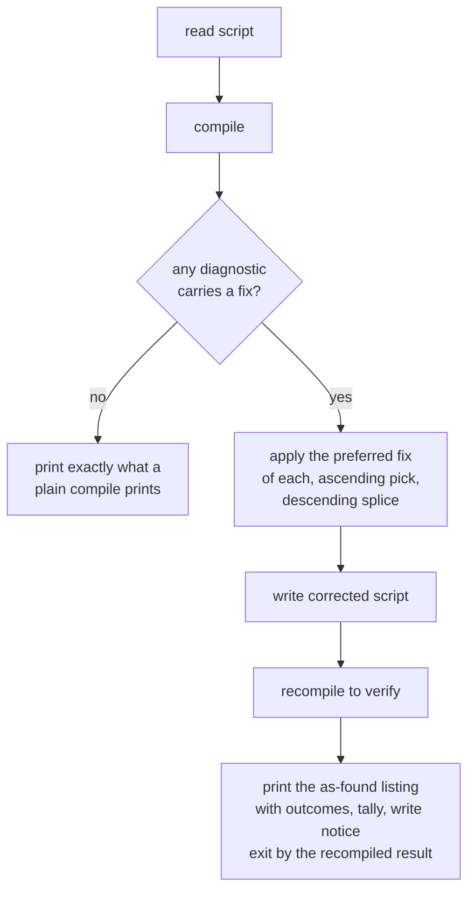

# Compile CLI — fix mode

> [!NOTE]
> Status: **proposed**. `ddown compile --fix` applies the preferred fix a
> diagnostic already carries, corrects the script in place, and recompiles it.
> The fix model, its first producer, and the editor affordance shipped with
> [Diagnostic quick fixes](../visualization/editor/Diagnostic%20Quick%20Fixes.md);
> this note adds the CLI half. Tracked in
> [#505](https://github.com/pengzhengyi/dialoguedown/issues/505).

## Table of contents

- [Goal and scope](#goal-and-scope)
- [Prior art](#prior-art)
- [Functionality checklist](#functionality-checklist)
- [CLI surface](#cli-surface)
- [Behavior](#behavior)
- [Applying fixes](#applying-fixes)
- [Report and exit codes](#report-and-exit-codes)
- [Demonstrable runs](#demonstrable-runs)
- [Key design decisions](#key-design-decisions)
- [Error and boundary cases](#error-and-boundary-cases)
- [Integration](#integration)
- [Testability](#testability)
- [Deferred work](#deferred-work)
- [Alternatives not chosen](#alternatives-not-chosen)

## Goal and scope

The report can repair a fixable diagnostic in one click; the CLI can only
describe it. A writer compiling in a terminal reads *"escape the arrow:
`\=>`"* and retypes the remedy by hand. Fix mode closes that gap with the same
data the editor uses, so no new compiler surface is needed.

In scope:

- `--fix` on `compile`: apply the preferred fix of every diagnostic that
  carries one, and correct the script in place.
- The applier: preferred-fix selection, ascending candidate order, descending
  application, whole-fix atomicity, overlap skip.
- The report: the diagnostics as found, each fixed one annotated; a tally of
  fixed versus remaining; a write notice naming the corrected file.
- The fixability hint on plain compiles: `N fixable with --fix` (the feature's
  discovery path, and the precondition for silence).
- Exit codes, BOM and line-ending preservation, and a help example.

Out of scope (see [Deferred work](#deferred-work)):

- Selecting fixes by diagnostic code.
- A CI check or dry-run mode, and a patch-output mode.
- Writing the corrected script anywhere but the script itself.
- Fix-safety tiers and multi-pass fixing.
- The editor and report surfaces, already shipped.

## Prior art

How established fixers behave, including what each one prints — the column
this design follows most closely:

| Tool | `--fix` applies | Selection | Safety | Reports |
| --- | --- | --- | --- | --- |
| ESLint | every fixable problem | `--fix-type` by fix kind | none | remaining only; `potentially fixable with --fix` hint; silent when clean |
| Ruff | safe fixes | `select` / `fixable` per rule | `--unsafe-fixes` opts in | remaining only; `Found N (M fixed, K remaining)`; `--show-fixes` lists detail |
| cargo fix | machine-applicable rustc suggestions | by package or target, not code | suggestions only | as found; per-file `Fixed <file> (N fix)` |
| dotnet format | every formatting diagnostic | `--diagnostics <IDs>`, `--severity` | none | changed-file summary; `--verify-no-changes` for CI |
| clang-tidy | fixes of enabled checks | by check (`-checks=`) | `--fix-errors` extends | as found, `note: FIX-IT applied suggested code changes`; `applied N of M suggested fixes.` |

Adopted: the as-found diagnostic listing with an in-place fix note
(clang-tidy), the file-level `Fixed <file> (N fix)` notice (cargo fix), the
tally suffix naming fixed versus remaining (Ruff), silence when there is
nothing to do (ESLint and this CLI already), and the fixability hint on
non-fix runs (ESLint and Ruff). Skipped for now: per-code selection (always a
separate filter option, never a `--fix` value), safety tiers (the only fix is
mechanically derived), a dry-run or patch mode, and the CI postures.

## Functionality checklist

- [ ] `ddown compile <script> --fix` applies the preferred fix of every
      diagnostic that carries one and rewrites the script in place.
- [ ] `--fix` with nothing applicable is byte-identical to a plain compile on
      both streams, writes nothing, and leaves the file's modification time
      unchanged.
- [ ] The listing shows the diagnostics as found; a fixed diagnostic gains an
      indented `fix applied: <title>` continuation, a skipped one an indented
      `fix skipped: <title> (overlaps an applied fix)`.
- [ ] The fix-mode tally suffixes the existing summary, e.g.
      `2 warnings (1 fixed, 1 remaining)`.
- [ ] A write prints `Fixed <script> (<N> fix)` after the tally, and only
      after the write returns.
- [ ] A plain compile prints `N fixable with --fix` when any diagnostic
      carries a fix.
- [ ] Candidates are selected in ascending position with a deterministic
      tie-break and applied descending, so the earliest fix in a conflict
      wins.
- [ ] The recompiled script sets the exit code; a diagnostic that appears only
      after fixing prints under an `after fixing:` lead-in.
- [ ] Running `--fix` twice leaves the second run silent and the file
      untouched.
- [ ] A leading UTF-8 BOM survives the rewrite.
- [ ] `--fix` with `--emit` or `-o` is a usage error (64).
- [ ] `--help` carries a `--fix` example and describes the flag.

## CLI surface

```bash
# Correct the script in place; the report goes to stderr
ddown compile scene.dialogue.md --fix
```

| Invocation | Writes | Exit |
| --- | --- | --- |
| `--fix` | the script, corrected in place | 0, or 65 when errors remain |
| `--fix` with `--emit` or `-o` | nothing | 64 |

Fix mode's only output is the corrected script. `--emit` and `-o` both
describe an *emission*, and fix mode emits nothing, so either alongside
`--fix` is a usage error naming the offending option. `--config` and the
script argument behave exactly as in a plain compile; `--mode` still selects
how far the pipeline runs, which bounds which fixes can be discovered (see
[Key design decisions](#key-design-decisions)).

## Behavior



## Applying fixes

`LocatedDiagnostic.Fixes` — absolute offsets into the source text — is the
whole input; the applier is a pure text-to-text function that lives in the
CLI, next to the command that uses it.

1. **`Fixes` is a list of alternatives, not a to-do list.** The editor already
   renders one action per element, and the fix model records it as an ordered
   list; the first element is therefore the preferred, auto-applicable repair.
   `--fix` applies exactly one fix per diagnostic — the first — and leaves any
   siblings for the writer. The contract belongs on `Diagnostic.Fixes`'s
   documentation as part of this change, mirroring ESLint's split between one
   automatic `fix` and a list of `suggestions`, and LSP's `isPreferred` flag.
2. **Build the candidate set, then order it deterministically.** Sort
   candidates ascending by start offset with a stable secondary key (code,
   then fix title); the compiler's emission order is not a contract.
3. **Keep the first fix of each overlapping cluster.** Walk the ascending
   order, keeping a fix only when none of its edits intersects a kept range.
   The earliest fix in the file wins, as in ESLint and clang-tidy; a skipped
   fix is reported, never half applied.
4. **Apply the kept set descending.** Every edit is a splice into the original
   text, so descending application keeps every pending offset valid without
   rebasing.
5. **Skip an edit that falls outside the text.** Defensive: a stale offset is
   dropped with its fix and reported, and the remaining fixes still apply.

Today every diagnostic carries at most one fix — `DLG1113` inserts `\` before
the arrow — so overlap cannot occur and step 3 is a no-op. The policy is fixed
now so that a producer offering alternatives, or a multi-edit fix, cannot
interleave silently. The CLI's ordering policy is normative for batch repair;
the editor applies one chosen fix at a time, so no ordering exists there yet.

## Report and exit codes

The report is the errata stream: same console, same style, same destination
(stderr). It lists the diagnostics **as found**, so every line and column
refers to the file the writer has open, and annotates what happened to each
fix:

```text
scene.dialogue.md(3,27): warning DLG1113: `=>` makes a jump only when a link follows it. …
  fix applied: Escape as literal text
  for more information, see https://…/error-codes.html#dlg1113
scene.dialogue.md(5,1): warning DLG1107: This line looks like a speaker prefix …
  for more information, see https://…/error-codes.html#dlg1107
2 warnings (1 fixed, 1 remaining)
Fixed scene.dialogue.md (1 fix)
```

- An indented `fix applied: <title>` continuation comes next, above the existing
  `for more information, see …` line; a skipped fix is an indented
  `fix skipped: <title> (overlaps an applied fix)`. The wording mirrors
  clang-tidy's `note: FIX-IT applied suggested code changes` and its
  `note: this fix will not be applied because it overlaps with another fix`.
- The tally is the existing severity summary with a fix-mode suffix:
  `2 warnings (1 fixed, 1 remaining)`, `1 error, 1 warning (1 fixed, 1 remaining)`.
  The suffix is load-bearing: the listing above is the pre-fix set, so without
  it the tally would contradict what a re-run prints.
- `Fixed <script> (<N> fix)` is the write notice, printed only when a write
  happened and only after it returns, so the report can never claim a repair
  the run did not make. An all-fixed run shows `(1 fixed, 0 remaining)` and
  the same notice.
- Nothing applicable: the run prints exactly what a plain compile prints, on
  both streams and in exit code — no extra line, no write. A clean script
  stays silent, as it already is; a script whose diagnostics carry no fix
  keeps its ordinary errata. Silence is for the no-write case only.
- A plain compile appends `N fixable with --fix` after the tally whenever any
  diagnostic carries a fix — ESLint's `potentially fixable with the --fix
  option` and Ruff's `[*] 1 fixable with the --fix option`, without Ruff's
  inline `[*]` marker, which would break the greppable `file(line,col):` line.
  This is the discovery path that makes fix mode's silence safe.
- On an interactive terminal the same content renders as rich blocks: the
  outcome joins the diagnostic's note as its first line, above the reference
  line. Errata's note is a single string, so the implementation verifies the
  two-line rendering and falls back to a continuation line after the block if
  the note cannot carry both.

| Outcome | Exit |
| --- | --- |
| Corrected script has no errors | 0 |
| Errors remain in the corrected script | 65 |
| Nothing applicable, and the plain compile errored | 65 |
| `--fix` combined with `--emit` or `-o` | 64 |
| Script argument or option validation fails | 64 |
| Unexpected I/O or internal failure | 1 |

A failed first compile does not block fixing: how far the pipeline reaches
still follows `--mode`, and the diagnostics it did produce keep their fixes
(`DLG1113` is discovered during desugaring, before the semantic error
`DLG2001` stops the run by default). Fix mode applies what it has, recompiles,
and lets the surviving error set the exit code — and still writes the
corrected script, because the concrete defect the writer can see is repaired
even when the compile ends in an error.

## Demonstrable runs

> [!NOTE]
> The diagnostic lines, exit codes, and file changes below were captured from
> real runs against `main`. The annotations (`fix applied:`, the tally suffix,
> `Fixed … (1 fix)`, the `fixable` hint, and the conflict messages) are the
> intended output of this design, because `--fix` is not implemented yet.
> Messages are shown unwrapped; a terminal wraps them to its width.

### A — fix in place: one warning fixed, one remains

```console
$ ddown compile workshop.dialogue.md --fix
workshop.dialogue.md(3,27): warning DLG1113: `=>` makes a jump only when a link follows it. With no link here it is read literally, staying as the characters "=>". If you meant to jump, add a target: `=> [The market](#the-market)`. If you meant the characters, escape the arrow: `\=>`.
  fix applied: Escape as literal text
  for more information, see https://pengzhengyi.github.io/dialoguedown/guide/error-codes.html#dlg1113
workshop.dialogue.md(5,1): warning DLG1107: This line looks like a speaker prefix ("Bob:") but the name is styled, so it is not recognized and the line has no speaker. Remove the styling to declare the speaker.
  for more information, see https://pengzhengyi.github.io/dialoguedown/guide/error-codes.html#dlg1107
2 warnings (1 fixed, 1 remaining)
Fixed workshop.dialogue.md (1 fix)
$ echo $?
0
```

The script changed by exactly one character:

```diff
-Alice: The rule is simple => the lever opens the door.
+Alice: The rule is simple \=> the lever opens the door.
```

### B — discovery: the hint on a plain compile

```console
$ ddown compile workshop.dialogue.md
workshop.dialogue.md(3,27): warning DLG1113: `=>` makes a jump only when a link follows it. …
  for more information, see https://pengzhengyi.github.io/dialoguedown/guide/error-codes.html#dlg1113
workshop.dialogue.md(5,1): warning DLG1107: This line looks like a speaker prefix …
  for more information, see https://pengzhengyi.github.io/dialoguedown/guide/error-codes.html#dlg1107
2 warnings
1 fixable with --fix
```

### C — nothing applicable: byte-identical to a plain compile

```console
$ ddown compile styled.dialogue.md --fix
styled.dialogue.md(5,1): warning DLG1107: This line looks like a speaker prefix ("Bob:") but the name is styled, so it is not recognized and the line has no speaker. Remove the styling to declare the speaker.
  for more information, see https://pengzhengyi.github.io/dialoguedown/guide/error-codes.html#dlg1107
1 warning
$ ddown compile clean.dialogue.md --fix
$ echo $?
0
```

The first run prints exactly what `ddown compile styled.dialogue.md` prints;
the second prints nothing, because a clean plain compile already prints
nothing. Neither run writes a file or changes a modification time.

### D — an error survives; the correction still lands

```console
$ ddown compile broken.dialogue.md --fix
broken.dialogue.md(3,27): warning DLG1113: `=>` makes a jump only when a link follows it. …
  fix applied: Escape as literal text
  for more information, see https://pengzhengyi.github.io/dialoguedown/guide/error-codes.html#dlg1113
broken.dialogue.md(5,1): error DLG2001: Two scenes resolve to the same anchor '#the-workshop'. Rename one heading so each jump target is unambiguous.
  for more information, see https://pengzhengyi.github.io/dialoguedown/guide/error-codes.html#dlg2001
1 error, 1 warning (1 fixed, 1 remaining)
Fixed broken.dialogue.md (1 fix)
$ echo $?
65
```

Before the fix the same compile reported `1 error, 1 warning`; afterwards the
warning is gone from the script and the tally says so, while the duplicated
scene still fails the compile.

### E — idempotence: the second run is silent

```console
$ ddown compile workshop.dialogue.md --fix
$ echo $?
0
```

Run after run A, the escape is already in place, so the only diagnostic left
is unfixable: no output, no write, exit 0 — the same bytes the plain compile
in run B prints (minus the hint, which the script no longer earns).

### F — `--fix` with an emission option

```console
$ ddown compile workshop.dialogue.md --fix --emit dot
--fix corrects the script in place and writes no emission. Remove --emit, or drop --fix to emit instead.
$ ddown compile workshop.dialogue.md --fix -o workshop.fixed.dialogue.md
--fix corrects the script in place and writes no emission. Remove -o, or drop --fix to emit instead.
$ echo $?
64
```

## Key design decisions

### D1 — Fix mode lives on `compile`

Fixing is compiling with a repair step, so it rides `compile`'s option
resolution (`--config`, `--mode`), its errata rendering, and its exit codes
instead of becoming a second command that would duplicate all three.

### D2 — One preferred fix per diagnostic; the list is alternatives

`Fixes` is a menu the writer chooses from in the editor, not a plan to execute
in full. The first element is the preferred, auto-applicable repair, and
`--fix` applies only it; the contract is documented on the model as part of
this change. Applying every element would execute conflicting remedies the
moment a producer offers two — the message for `DLG1113` itself advertises a
jump target and an escape — and ESLint's `fix`-versus-`suggestions` split is
the mature shape of that rule.

### D3 — Select ascending with a deterministic tie-break, apply descending

Emission order is not a contract, so candidates are ordered explicitly and the
earliest fix in the file wins a conflict, as in ESLint and clang-tidy.
Descending application then keeps each pending offset valid against the
original text, and overlap is skipped whole rather than merged: a
half-applied fix is worse than a fix not applied.

### D4 — Splice the raw text, and preserve its encoding frame

Untouched regions round-trip byte for byte, including line endings and
whitespace the compiler does not model. A leading UTF-8 BOM is detected with
a `StreamReader` (`detectEncodingFromByteOrderMarks`) and written back with
`new UTF8Encoding(encoderShouldEmitUTF8Identifier: bomWasPresent)`, because
both `File.ReadAllText` and `File.WriteAllText` would silently drop it.
Diagnostic offsets are offsets into the BOM-stripped string, so a future
switch to raw-byte reading would shift every one of them.

### D5 — In place only; no emission and no second destination

Every surveyed fixer edits in place. A corrected-copy option would be novel
twice over — the capability has no analogue, and it would overload `-o`,
producing a report that names two files. `--emit` and `-o` therefore conflict
with `--fix`. When a non-destructive mode is wanted, the mature analogue is a
dry run or a patch, not a second destination.

### D6 — The listing is as found, annotated; tallies and write notice last

Positions stay valid against the file the writer has open, and the diagnostic
message — the thing worth teaching — stays attached to its code, which the
editor's one-click affordance does not need but a terminal reader does. Each
tally goes last, as ESLint, Ruff, cargo fix, and clang-tidy all do. The
`Fixed <script> (N fix)` notice is the signal that something on disk changed.

### D7 — The recompile verifies; the exit code follows the corrected script

The second compile is not reporting, it is verification: it sets the exit code
from the corrected state, and it catches the one case a single pass cannot
otherwise see — a fix that fails to clear its own diagnostic, or introduces a
new one. Diagnostics present after but not before print under an
`after fixing:` lead-in, so a future producer cannot hide a regression. Today
the set is always empty, and the testable invariant is that every applied fix
is absent from the recompiled diagnostics.

### D8 — Silence is paired with discovery

`--fix` with nothing to fix is byte-identical to the plain compile it claims
to match — the existing renderer already prints nothing when the script is
clean, and a no-fix run adds nothing. Silence is safe only because the plain
compile advertises the feature with `N fixable with --fix`, in the spirit of
ESLint's and Ruff's fixability hints. Silence never crosses the write: a run
that changed a file says so.

### D9 — `--mode` still bounds which fixes are discovered

`--mode stage-boundary` (the default) stops the pipeline at an error, so a
script whose error precedes desugaring yields no fixes, while
`--mode best-effort --fix` surfaces and repairs more. That is the same posture
as clang-tidy, which refuses to apply fixes when compilation errors were found
unless `--fix-errors` is given; `--fix` alone never overrides the mode.

### D10 — No selection and no CI mode in this change

With one fix producer there is no user choice to express; both features are
additive later. Recording their shapes now keeps the surface from ossifying
around a value-taking `--fix`.

## Error and boundary cases

| Case | Behavior |
| --- | --- |
| Script missing, or not `*.dialogue.md` | existing script-argument validation, exit 64 |
| `--fix` with `--emit` or `-o` | usage error naming the option, exit 64, nothing written |
| No diagnostic carries a fix | byte-identical to a plain compile, no write, exit as that compile |
| A fix's edit falls outside the text (defensive) | that fix is skipped and reported; the rest apply |
| Overlapping fixes | the later candidate is skipped whole and reported |
| Two insertions at the same offset | fixed by the ascending tie-break: code, then title |
| Script read-only, or the write fails | I/O error surfaces, exit 1, and no `fix applied:` line was printed |
| Leading UTF-8 BOM | detected on read, written back per D4 |
| CRLF line endings | preserved by splicing; a replacement containing a lone `\n` is a producer bug, not an applier behavior |
| Non-UTF-8 script without a BOM | the compile already assumes UTF-8; fix mode inherits that assumption |
| Second `--fix` run | silent, no write, mtime unchanged |

## Integration

- `CompileSettings` gains `--fix` and rejects `--emit` or `-o` with it in
  validation.
- `CompileCommand` branches to fix mode before emission: read, compile,
  select, apply, write, recompile, report.
- A new `FixApplier` in the CLI owns the pure text-to-text splice and returns
  applied and skipped outcomes; it has no dependency on Spectre or the report.
- `IErrataRenderer` carries a per-diagnostic outcome instead of a second
  report method, so the plain and rich paths stay one code path:
  `Render(string file, string source, IReadOnlyList<(LocatedDiagnostic Diagnostic, FixOutcome? Fix)> entries)`.
  The `N fixable with --fix` hint is computed from the same list.
- `CliConfigurator` gains
  `.WithExample("compile", "scene.dialogue.md", "--fix")`, after the plain
  compile example and before the export examples.
- The fix model's documentation records that `Fixes[0]` is the preferred,
  auto-applicable repair.
- `docs/guide/cli.md` documents `--fix` at implementation time, including that
  a fix run exits 0 after rewriting the file until a CI check mode exists.

## Testability

The applier is a pure function, so its cases are fast unit tests: preferred-fix
selection when a diagnostic offers alternatives, ascending selection with the
tie-break, descending application, overlap skip, an atomic multi-edit fix,
insertion, out-of-range spans, BOM and CRLF preservation, and the no-op when
nothing is fixable. Command-level tests cover in-place fixing and exit 0; the
byte-for-byte identity of a no-fix run with a plain compile on both streams;
idempotence (a second run writes nothing and leaves the mtime); a surviving
error exiting 65 while still writing; the `--emit` and `-o` conflicts exiting
64; and the recompile invariant that every applied fix is absent from the
recompiled diagnostics. Because the report rides the existing renderer, the
greppable one-liner path is asserted without a terminal.

## Deferred work

- **Per-code selection** (`--fix-code <ID>`, repeatable). Additive later:
  `--fix` keeps meaning "all". The flag shape, unknown-code handling (a usage
  error), and whether the filter also filters the displayed errata wait until a
  second fix producer makes selection a real choice.
- **A CI check mode** — `--fix-dry-run` (ESLint) or a fail-when-fixable flag in
  the spirit of `--verify-no-changes` and `--exit-non-zero-on-fix`. Until it
  exists, the guide warns that `--fix` exits 0 after mutating the file.
- **A patch mode** — a unified diff on stdout, the mature analogue of
  `clang-tidy --export-fixes` and the non-destructive alternative to a
  corrected copy.
- **Fix-safety tiers.** The only fix is mechanically derived from a named
  producer. A future fix that guesses must carry an applicability label (Ruff's
  safe/unsafe) rather than riding `--fix` silently.
- **Multi-pass fixing.** One pass suffices while every fix removes the
  diagnostic that carries it; the recompile check is what would notice if that
  stops being true. If it does, revisit with a bounded loop rather than an
  unbounded one.
- **A dirty-VCS guard.** `cargo fix` refuses to rewrite a working tree with
  uncommitted changes; the CLI has no Git dependency, so this would be a
  deliberate addition, not an inheritance.
- **An editor fix-all.** The editor applies one chosen fix at a time; if it
  ever batches, it should reuse the CLI's ordering policy, pinned by a shared
  conformance case.

## Alternatives not chosen

- **`--fix all` and `--fix <code>` as flag values.** Prior art selects by code
  through a separate filter option (`dotnet format --diagnostics`, Ruff's
  `select`), never through `--fix`'s own value. A magic `all` word lengthens
  the common case, and `--fix DLG1113` reads like a script path. A repeatable
  `--fix-code` remains available as an additive later flag.
- **`fixed` and `skipped` as severity words** (`scene.dialogue.md(3,27): fixed DLG1113 …`).
  That slot belongs to a severity in the `file(line,col): severity CODE:
  message` grammar that problem matchers parse; no surveyed tool invents a
  fix severity, and the message would be lost with it. The fix rides as a
  continuation line instead.
- **A corrected copy via `-o`.** No surveyed fixer offers one; it overloads the
  emission destination and makes one report name two files. A dry run or a
  patch is the mature way to be non-destructive.
- **Writing a playbook or DOT alongside the corrected script.** Two artifacts
  from one command invite reading the output of the wrong revision, and a fix
  run is a maintenance step, not an export.
- **Re-reading the written file before recompiling.** The corrected text is
  already in memory; re-reading adds I/O, a failure window, and a second place
  where the encoding could differ.
- **Forcing best-effort discovery in fix mode.** It would silently ignore an
  explicit `--mode stage-boundary`; honoring the mode keeps the flag
  compositional and matches clang-tidy's bail-out default.
- **A separate `ddown fix` command.** It would duplicate option resolution,
  errata rendering, and exit-code policy for one boolean's worth of behavior.
