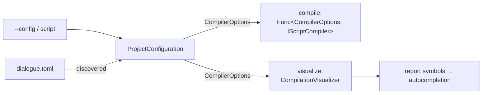

# CLI Configuration

> [!NOTE]
> Status: **implemented**. `ddown compile` and `ddown visualize` resolve a project's
> [`CompilerOptions`](./Configuration.md) — from `--config`, or a `dialogue.toml`
> found by walking up from the script — and build their compiler and report from it,
> so configured speakers also reach the report editor's autocompletion.

## Where it sits

`ProjectConfiguration` is the only CLI type that references
`DialogueDown.ConfigurationLoader`. Everything downstream receives a plain
`CompilerOptions`, so the visualization assemblies never see TOML.

## Resolution

Precedence: **`--config` › nearest `dialogue.toml` walking up › `CompilerOptions.Default`.**

| Case | Behavior |
| --- | --- |
| No `--config`, none found | `CompilerOptions.Default`. |
| `--config` path missing | Usage error naming the file; nothing compiles. |
| Malformed file (explicit or discovered) | The loader's located `DialogueConfigurationException`, exit `65`. |
| A `dialogue.toml` beside the script and a different `--config` | `--config` wins. |
| `visualize` with no script | Walk up from the browse root. |
| Nearest file above `visualize --root` | Not found — the walk stops at `--root`; use `--config`. |
| Empty file | `CompilerOptions.Default`. |

The launcher resolves one `CompilerOptions` from its browse root and applies it to
every report it opens; per-file discovery inside a subtree with its own
`dialogue.toml` is not built.

## Key design decisions

### D1 — Resolve in the CLI; pass the core options down

Only the CLI knows the command line and working directory, so discovery and loading
live there, and the TOML dependency stays at the outermost layer.

### D2 — Discover by walking up from the script

Zero configuration is the common case. Like `tsc`, Prettier, Ruff, and EditorConfig,
the CLI searches upward and the nearest file wins, so one file at a project root
serves nested scripts. A `dialogue.toml` is itself the project marker, so there is no
`root = true` stop. For `visualize`, the served root is a security boundary, so the
walk never reads above `--root`.

### D3 — `compile` takes a compiler factory

The compiler must be built after the options are resolved, so `CompileCommand` takes
`Func<CompilerOptions, IScriptCompiler>` (default `ScriptCompilerFactory.CreateDefault`)
instead of a startup-built compiler. A test substitutes the factory and asserts the
resolved options reached it.

### D4 — One options value reaches every visualize path

`CompilationVisualizer(CompilerOptions)` builds a configured visualizer. The static
export and the served session receive an `AppliedConfiguration` (the options plus the
file they came from, which the Config tab shows); `--emit` receives the
`CompilerOptions` alone.

### D5 — Configured speakers complete even when unused

Completions come from `SymbolProjection` over the semantic model. `SpeakerTable.Symbols`
exposes every bound speaker — from the script or configuration — and the projection
unions them after the script's speakers, so a cast declared up front completes before
anyone speaks.

## Testability

- `ProjectConfiguration`: explicit, discovered, and default resolution; the missing
  path; the malformed file — with a temporary directory and raw-string TOML.
- `compile`: the substituted factory receives the resolved options.
- `visualize`: each route receives the resolved options.
- `SpeakerTable.Symbols` lists configured and script speakers once each, and an unused
  configured speaker appears in the report's `SymbolSet`.
