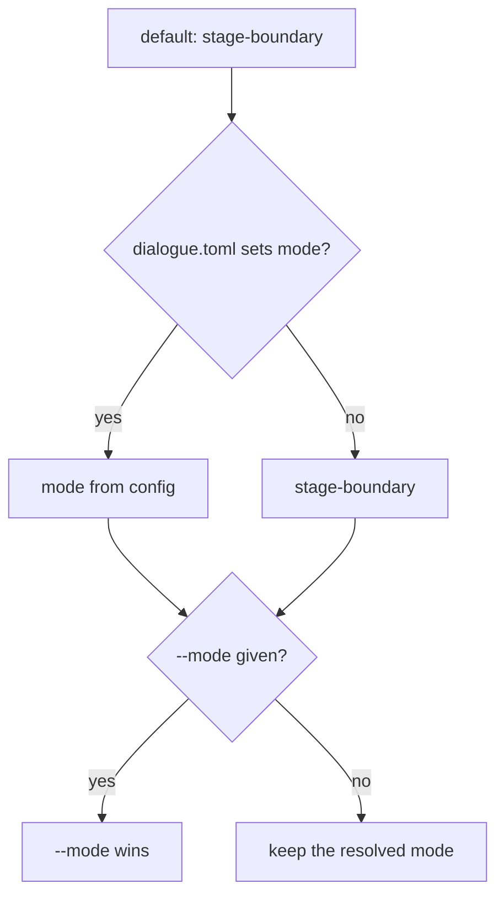

# Compilation Mode Configuration

> [!NOTE]
> Status: **implemented**. How an author chooses the compilation mode: a top-level
> `mode` in `dialogue.toml`, the `ddown compile --mode` option, and the Config tab,
> which displays, edits, creates, and autocompletes it. What each mode does is
> [Compilation modes](../diagnostics/Diagnostics%20and%20Validation.md#compilation-modes).

## Table of contents

- [Ubiquitous language](#ubiquitous-language)
- [Precedence](#precedence)
- [The `dialogue.toml` key](#the-dialoguetoml-key)
- [The Config tab](#the-config-tab)
- [Key design decisions](#key-design-decisions)
- [Error and boundary cases](#error-and-boundary-cases)
- [Testability](#testability)

## Ubiquitous language

The word *mode* names two unrelated things; this note keeps them apart.

| Term | Type | Meaning |
| --- | --- | --- |
| **Compilation mode** | `CompilationMode` — `stage-boundary`, `best-effort`, `fail-fast` | How far a compile proceeds after an error. Configured here. |
| **Visualization mode** | `VisualizationMode` — `static`, `view`, `edit` | How a report is shown; the payload's top-level `report.mode`. Unrelated. |

The setting is named `mode` in TOML, on the CLI, and in the tab; in the report
payload it is `report.configuration.mode`, so it never collides with `report.mode`.

## Precedence

**`--mode` › `mode` in `dialogue.toml` › the default `stage-boundary`** — the order
rustc, tsc, ESLint, and MSBuild use. `CompileCommand` resolves the configured options,
then overrides `Mode` only when `--mode` was given.



## The `dialogue.toml` key

```toml
mode = "best-effort"      # or "stage-boundary"; omitted means stage-boundary
```

`ConfiguredModeReader` reads the root-level key and maps it through
`CompilationModes`, the same names `--mode` accepts, so the two channels cannot
drift. `TomlConfigurationLoader.Parse` composes it onto `CompilerOptions.Default`
with `with`, so an empty file still returns the shared `Default`.

## The Config tab

The tab pairs a TOML editor with a projected panel; saving rewrites `dialogue.toml`
and recompiles (see [Configuration Tab](../visualization/report/Configuration%20Tab.md)).

- `ConfigurationReport.Mode` projects the configured mode, shown as a row above the
  speakers table (for example, **Mode: best-effort**), labeled as the default when
  unset.
- Its tooltip, and the commented `# mode = "stage-boundary"` line in the
  created-config starter, say that `mode` governs the project's compilation — the CLI
  and embedded builds — while the report always renders in `stage-boundary`.
- `config-completions.ts` suggests the `mode` key at a root key position and its two
  values after `mode =`.

## Key design decisions

### D1 — Two settable values; fail-fast is an embedding contract

Two axes hide inside "mode": **recovery depth** (first error, stage boundary,
everything) and **delivery** (return a result, or throw). `stage-boundary` and
`best-effort` differ only in depth and both return a result a surface renders.
`fail-fast` throws at the first error, the right primitive for an embedder that wants
"compiled, or abort the import" and the wrong one for a surface: it drops collected
warnings and returns nothing to display. So TOML, the CLI, and the tab accept only
the two collecting values.

### D2 — The report always renders in `stage-boundary`

`CompilationVisualizer` compiles with `Mode = StageBoundary` whatever the project
says. Under `best-effort`, a script with an erroring transpile would still produce
desugared and semantic stages built from the transpiler's recovered output — graphs
that look authoritative but rest on a known-broken parse. In `stage-boundary` the
report shows only stages built on reliable input and marks the rest unavailable (see
[Unavailable Stage Tabs](../visualization/report/Compilation%20Visualization.md#unavailable-stages)). How
much the report shows is a presentation concern; exploring a broken script's later
stages would be a viewer-local toggle, not a coupling to the project setting.

## Error and boundary cases

| Case | Behavior |
| --- | --- |
| `mode` absent | `stage-boundary`. |
| `mode = "best-effort"` | `CompilerOptions.Mode = BestEffort`. |
| `mode = "fail-fast"` | Located error: not an author-facing mode. |
| `mode = "turbo"` | Located error naming the two valid values. |
| `mode = 42` | Located error: must be a string. |
| Duplicate `mode` keys | Tomlyn syntax error, located. |
| `mode.x`, `modes` | Ignored — unrelated root keys stay lenient. |
| `mode` with `[[speakers]]` | Both apply. |

## Testability

- `ConfiguredModeReaderTests` covers each row above; `TomlConfigurationLoaderTests`
  covers coexistence and the default return.
- `ConfigurationProjectionTests`: the report carries the configured mode while the
  render stays `stage-boundary`.
- `config-view.test.ts` and `config-completions.test.ts`: the row, its tooltip, and
  completions only in the right positions.
