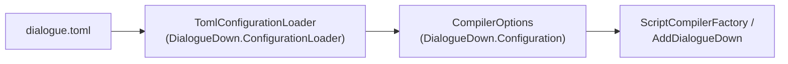

# Configuration Loader

> [!NOTE]
> Status: **implemented**. `TomlConfigurationLoader` reads a project's
> `dialogue.toml` into a [`CompilerOptions`](./Configuration.md), validating it
> first. It is a separate assembly, `DialogueDown.ConfigurationLoader`, so the core
> never takes a TOML dependency.

## Table of contents

- [Where it sits](#where-it-sits)
- [Ubiquitous language](#ubiquitous-language)
- [The `dialogue.toml` schema](#the-dialoguetoml-schema)
- [Interfaces and abstractions](#interfaces-and-abstractions)
- [Key design decisions](#key-design-decisions)
- [Error and boundary cases](#error-and-boundary-cases)
- [Testability](#testability)

## Where it sits



The loader depends on the core and Tomlyn only; the core never depends on the
loader. An architecture test guards both directions. A consumer that builds
`CompilerOptions` in code does not reference the loader at all.

## Ubiquitous language

| Term | Meaning |
| --- | --- |
| **Schema reader** | An internal reader that owns one concern: mode, speakers, or unmodeled Markdown. |
| **Structural key** | A speaker key the schema defines: `name`, `id`, `tags`. |
| **Reserved key** | Any other speaker key — a reserved tag, validated against `ReservedTagNames.Known`. |
| **Tag shorthand** | A custom tag written as in the DSL: `"name"` or `"name=value"`. |
| **Edge validation** | Rejecting a malformed config here, before it reaches the compiler. |

## The `dialogue.toml` schema

```toml
mode = "best-effort"                  # stage-boundary (default) or best-effort

[[speakers]]
name    = "Narrator"                  # required, non-empty
id      = "narrator"                  # optional, non-empty
default = true                        # a reserved key → ReservedTag("default")
tags    = ["main", "mood=happy", { name = "a=b", value = "c" }]   # custom tags

[markdown.unmodeled]
table      = "keep"                   # keep or ignore, per kind
code-block = "ignore"
```

| Key | Maps to |
| --- | --- |
| `mode` | `CompilerOptions.Mode`; only the two settable modes (see [Compilation Mode Configuration](./Compilation%20Mode%20Configuration.md)). |
| `name`, `id` | `ConfiguredSpeaker.Name`, `Id`. |
| `tags` | `CustomTags`: a shorthand string split at the first `=`, or an inline table `{ name, value? }` for a name that itself contains `=`. |
| any other speaker key | `ReservedTags`: `true` → a name-only tag, a string → a valued tag, `false` → nothing. |
| `[markdown.unmodeled]` | `CompilerOptions.UnmodeledMarkdown`; omitted kinds stay absent so their defaults apply (see [Unmodeled Markdown Handling](../core/Unmodeled%20Markdown%20Handling.md)). |

## Interfaces and abstractions

| Type | Visibility | Responsibility |
| --- | --- | --- |
| `TomlConfigurationLoader` | public | `Load(path)` and `Parse(toml, sourceName)` → `CompilerOptions`; composes the readers. |
| `TomlDocumentParser` | internal | Text → Tomlyn `DocumentSyntax`, failing on a syntax error. |
| `ConfiguredModeReader`, `ConfiguredSpeakerReader`, `ConfiguredUnmodeledReader` | internal | One schema concern each. |
| `TomlTables`, `TomlKeys`, `TomlErrors`, `TomlLocation` | internal | Shared syntax mechanics: table selection, key names, located errors. |
| `DialogueConfigurationException` | public | A config error with its `ConfigurationSourceLocation`. |
| `ConfigurationSourceLocation` | public | The source, line, and column of a config error. |

## Key design decisions

### D1 — TOML

Weighed against INI, JSON, and YAML for sectioning, readability to writers and
developers, editor support, and standardization:

| Format | Verdict |
| --- | --- |
| **TOML** (chosen) | Explicit `[section]` headers, comments, real types, a published standard (used by Cargo and `pyproject.toml`), and schema-aware editor support (Even Better TOML / Taplo). |
| YAML | Readable, but whitespace-sensitive — a hazard for non-technical writers. |
| JSON | No comments, noisy to hand-edit. |
| INI | No standard, no validation, no nested sections. |

### D2 — A satellite assembly on Tomlyn

Tomlyn is the de facto .NET TOML library — by the author of Markdig, used by the .NET
SDK — and its parser gives precise line/column locations, which edge validation
needs. The project name does not name the format; `TomlConfigurationLoader` does.

### D3 — Read Tomlyn's syntax tree, not a fixed POCO

A speaker's reserved keys are open-ended and the unmodeled table has its own closed
vocabulary, so a fixed POCO would lose unknown-key validation or mix schemas. Each
section goes to a focused reader over the syntax tree, and every node carries a span
for error locations.

### D4 — Reserved tags as typed keys, custom tags as DSL shorthand

`default = true` is caught at the edge against the shared reserved set, and a
multi-word reserved name comes free with TOML key quoting. Custom tags reuse the
script syntax, with the inline-table form for the one case shorthand cannot express.
Both become `ConfiguredTag`.

### D5 — Validate at the edge, fail with a location

The loader rejects anything the compiler would mishandle as a
`DialogueConfigurationException` carrying the path, line, and column, so the compiler
trusts its `CompilerOptions`. It stops at the first problem.

## Error and boundary cases

| Case | Behavior |
| --- | --- |
| Malformed TOML, or a duplicate key | `DialogueConfigurationException` from Tomlyn's diagnostic. |
| Missing or empty `name`, or an empty `id` | `DialogueConfigurationException`. |
| Wrong-typed key, unknown speaker key, dotted key | `DialogueConfigurationException`. |
| Inline-table tag without `name`, or with an unknown field | `DialogueConfigurationException`. |
| A second `default = true` | `DialogueConfigurationException`. |
| Unknown, non-string, or `fail-fast` `mode` | `DialogueConfigurationException`. |
| Unknown unmodeled kind or handling | `DialogueConfigurationException`. |
| Unrelated root keys | Ignored, for forward compatibility. |
| Empty file | `CompilerOptions.Default`. |
| `Load` on a missing file | The underlying I/O exception. |

Duplicate speaker names are left to the binder, which already reports conflicts.

## Testability

- Parsing: raw-string TOML → the expected `CompilerOptions`.
- Validation: each error case asserts the exception and its location.
- Core tests prove both composition roots apply loaded speakers and handling.
- The assembly-boundary architecture test guards the dependency direction.
