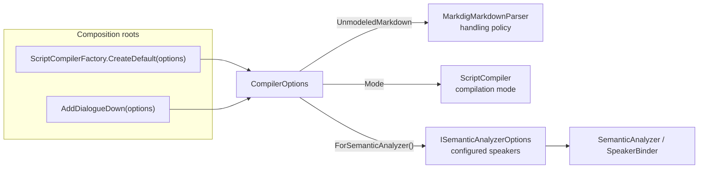

# Configuration

> [!NOTE]
> Status: **implemented**. `CompilerOptions` is the one immutable value through which
> a consumer tunes a compile without editing the script: the compilation mode, a
> registry of configured speakers, and unmodeled-Markdown handling overrides. The core
> takes it directly; the [Configuration Loader](./Configuration%20Loader.md) builds one
> from `dialogue.toml`.

## Table of contents

- [Where it sits](#where-it-sits)
- [Ubiquitous language](#ubiquitous-language)
- [Interfaces and abstractions](#interfaces-and-abstractions)
- [Key design decisions](#key-design-decisions)
- [Error and boundary cases](#error-and-boundary-cases)
- [Testability](#testability)
- [Knobs not built](#knobs-not-built)

## Where it sits

Configuration is not a stage; it is a value the composition roots unpack into the
narrow input each stage reads.



```csharp
var options = CompilerOptions.Default with
{
    Mode = CompilationMode.BestEffort,
    Speakers = [new ConfiguredSpeaker("Narrator", "narrator", [], [new ConfiguredTag("default")])],
};
IScriptCompiler compiler = ScriptCompilerFactory.CreateDefault(options);
```

## Ubiquitous language

| Term | Meaning |
| --- | --- |
| **Compiler options** | The immutable `CompilerOptions` value for one compile. |
| **Stage projection** | The value or collaborator a composition root derives from the options for one stage. |
| **Configured speaker** | A `ConfiguredSpeaker` the binder seeds alongside the script's own speakers. |
| **Configured default** | The one configured speaker carrying the reserved `default` tag. |
| **In-file default** | A speaker the script marks with `##default`. |
| **Anonymous default** | The nameless fallback the binder mints when nothing names a default. |
| **Handling override** | A `keep` or `ignore` for one `UnmodeledNodeKind`; omitted kinds keep their defaults. |

## Interfaces and abstractions

| Type | Visibility | Responsibility |
| --- | --- | --- |
| `CompilerOptions` | public | `Mode`, `Speakers`, `UnmodeledMarkdown`; `Default`; structural equality; the internal `ForSemanticAnalyzer()` view. |
| `CompilationMode`, `CompilationModes` | public | The mode enum and its kebab-case names, including which are settable. |
| `UnmodeledNodeKind`, `UnmodeledNodeHandling`, `UnmodeledMarkdownNames` | public | The unmodeled-Markdown vocabulary and its names. |
| `ConfiguredSpeaker`, `ConfiguredTag` | public | A speaker: name, optional id, custom and reserved tags. |
| `ReservedTagNames` | public | The closed set of reserved tag names (`default`). |
| `ISemanticAnalyzerOptions`, `SemanticAnalyzerOptions` | internal | The analyzer's view: the configured speakers. |
| `ConfiguredSpeakerBuilder` | internal | Turns a `ConfiguredSpeaker` into the `SpeakerDeclaration` the binder consumes. |

All public types live in `DialogueDown.Configuration`.

## Key design decisions

### D1 — A plain immutable record, not `IOptions<T>`

A library consumer — a game engine, a test, a console tool — builds a value with no
container and no `Microsoft.Extensions.Options` dependency. The core exposes only its
own contract.

### D2 — A foundation namespace

Both the semantic analyzer and the compilation orchestrator read options. Putting
them in `Compilation` would make `Semantics` depend backward on it, so
`DialogueDown.Configuration` is a dependency leaf, and an architecture test keeps it
one.

### D3 — Project options into each stage at the composition roots

No stage receives the whole value:

- `Mode` goes straight to `ScriptCompiler`;
- the front end receives an `IUnmodeledNodeHandlingPolicy` built by
  `UnmodeledNodeHandlingPolicies.For(UnmodeledMarkdown)` — in the Markdown layer,
  since configuration must not depend on a stage;
- the analyzer receives `ISemanticAnalyzerOptions`, an interface because its tests
  substitute it.

Passing the whole value, or an ambient context, would let stages read unrelated knobs
and hide their dependencies.

### D4 — A speaker registry with layered default precedence

The binder binds configured speakers first, then the script's, into one name/`@id`
map, so a configured name used in the script is the same speaker. The default is the
in-file `##default`, else the configured default, else the anonymous default. The
configured default is marked with the reserved `default` tag, reusing the DSL's
vocabulary, rather than a separate default-name field.

### D5 — Configured speakers are edge data, validated at the edge

A `ConfiguredSpeaker` is plain data with tags already split into `CustomTags` and
`ReservedTags`, so the reserved vocabulary can grow without the record changing.
The loader validates it; `ConfiguredSpeakerBuilder` turns it into a declaration, and
the binder then treats it exactly like a declared speaker.

### D6 — Deeply immutable values with structural equality

Options may be shared across compilers, compared to skip a redundant recompile, or
used as cache keys, so the whole graph is immutable and equal by content:

- `Speakers` and a speaker's tag lists are `ImmutableArray<T>`, compared in order;
- `UnmodeledMarkdown` is an `ImmutableDictionary`, compared ignoring insertion order;
- constructors accept any sequence and snapshot it.

Immutable collections do not compare by content on their own, so `ConfiguredSpeaker`
and `CompilerOptions` use [Generator.Equals](https://github.com/diegofrata/Generator.Equals)
(`[OrderedEquality]`, `[UnorderedEquality]`, `[IgnoreEquality]` on backing fields) to
generate equality and matching hash codes. The generator is a private build
dependency; its small MIT runtime assembly is the only package consumers receive.
Hash codes are stable within a process, not across processes.

## Error and boundary cases

| Case | Behavior |
| --- | --- |
| No configured speakers | The anonymous default, when the script names none. |
| A configured speaker not marked default | Seeded; usable when referenced. |
| Configured default, name not in the script | The default for speakerless lines. |
| Configured default, name in the script | One unified speaker, and the default. |
| Configured default and an in-file `##default` | The in-file default wins. |
| Two configured defaults | Rejected by the loader; the binder also reports `DLG2006`. |
| Empty override map | The shared default policy instance is reused. |
| `null` options to a composition root | `CompilerOptions.Default`. |
| A source collection mutated after construction | The value and its hash are unchanged. |

## Testability

- `CompilerOptions`: defaults, projections, equality, and hashing, including
  mutation of source collections after construction.
- `SpeakerBinder`: one test per precedence case.
- `SemanticAnalyzer`: configured speakers reach the model through a substituted
  `ISemanticAnalyzerOptions`.
- Composition roots: both honor speakers and unmodeled handling on a real compile.
- The architecture test keeps `Configuration` a foundation leaf.

## Knobs not built

| Knob | Where it would live |
| --- | --- |
| A configurable `##default` tag name | `ReservedTagNames`, binder, validator |
| Missing-default strict mode (error instead of anonymous) | binder |
| DSL syntax tokens (`@`, `:`, `=>`, `#`) | parser, tokenizer |
| Further Markdig extensions | Markdown front end |
| Slug normalization | `Slug` |
| Live-server port, host, debounce | `DialogueDown.Visualization.Live` |
| CLI output defaults | `DialogueDown.Cli` |
| Rule severities and warnings as errors | diagnostics |

The `dialogue.toml` schema is the [Configuration Loader](./Configuration%20Loader.md)
note and, for writers, the [configuration guide](../../../guide/configuration.md).
