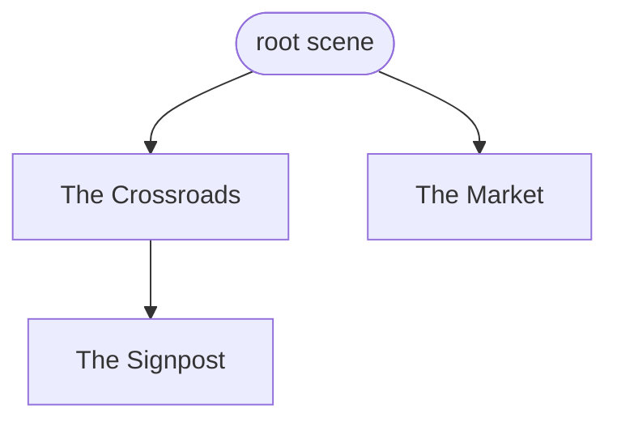
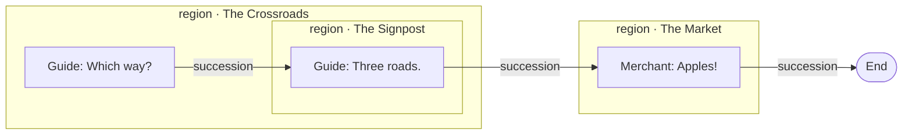
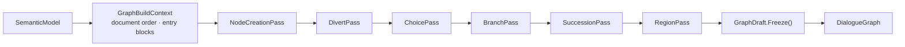
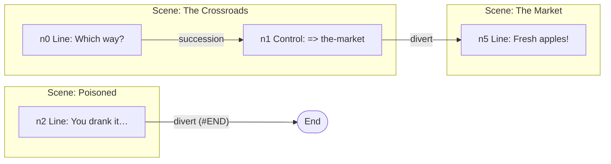

# Dialogue Graph

> [!NOTE]
> Status: **implemented**. The last
> [pipeline stage](../README.md#core-the-compiler-pipeline): it lowers the
> [semantic model](./Semantic%20Analyzer.md) into an immutable, directed graph of
> nodes and typed edges with a scene-region overlay, carried on a
> [`CompilationSuccess`](./Script%20Compiler%20Facade.md#the-compilation-result).
> Walking the graph is the runtime's job; reachability and cycle diagnostics, a
> `#START` entry, and cross-file node ids are not built.

## Table of contents

- [Goal and scope](#goal-and-scope)
- [Ubiquitous language](#ubiquitous-language)
- [The intermediate representation](#the-intermediate-representation)
- [Lowering](#lowering)
- [Key design decisions](#key-design-decisions)
- [Error and boundary cases](#error-and-boundary-cases)
- [Testability](#testability)

## Goal and scope

The semantic model keeps the shape of a **document**: a tree of scenes owning
blocks. A runtime needs a **flow**: from here, where can control go? The same script
takes both shapes:

*Scene tree* (from analysis — naming and scope):



*Dialogue graph* (this stage — flow, with a scene-region overlay):



The regions still nest, but the flow reads straight through them in document order.
Jumps add cross-region and cyclic edges, so the result is a graph, not a tree. How
each construct flows is fixed by [Progression Order](../language/Progression%20Order.md).

## Ubiquitous language

| Term | Meaning |
| --- | --- |
| **Node** | One playable block — a line, a control line, a choice, a random choice, a branch — or the single End node. |
| **Edge** | A directed connection to a target node id, of a specific kind. |
| **Succession** | Fall-through to the next block in document order. |
| **Divert** | The edge a jump lowers to. It does not return. |
| **Option** | One arm of a choice; a random option also carries a weight. |
| **Branch edge** | One ordered arm of a block control; the first whose condition holds is taken. |
| **Condition** | The AST `Condition`, opaque to the core. On an edge it withholds a **route**; on a node it withholds the node's **content**. |
| **Effect** | A game call (`GameCall`) a node runs when it plays. |
| **Region** | A named grouping overlaid on the flat graph — a scene. Its **own nodes** are held directly; **subregions** nest. |
| **Entry block** | The block a scene is entered at: its first block, or the next block in reading order when it owns none. |
| **Draft** | The mutable graph under construction; `Freeze` validates it into the immutable graph. |

## The intermediate representation

```csharp
readonly record struct NodeId(int Value);    // an opaque handle, not a list index
readonly record struct RegionId(int Value);

sealed class DialogueGraph                    // Node(NodeId) looks up through an id-keyed dictionary
{
    IReadOnlyList<DialogueNode> Nodes; NodeId Entry; NodeId End; RegionTree Regions;
}

// ── Nodes: one per block. Payload reuses the semantic model and the AST.
abstract record DialogueNode(NodeId Id, SourceSpan Span, IReadOnlyList<Edge> Out);
sealed record LineNode(Id, Span, SpeakerSymbol Speaker, IReadOnlyList<InlineFragment> Speech,
                       Out, Condition? Condition);           // Effects: the GameCalls in Speech
sealed record ControlNode(Id, Span, IReadOnlyList<GameCall> Effects, Out, Condition? Condition);
sealed record ChoiceNode(Id, Span, bool IsOrdered, Out);      // Out: OptionEdges
sealed record RandomChoiceNode(Id, Span, Out);                // Out: RandomOptionEdges
sealed record BranchNode(Id, Span, Out);                      // Out: BranchEdges
sealed record EndNode(Id, Span);

// ── Edges: each names its target by id.
abstract record Edge(NodeId Target);
sealed record SuccessionEdge(Target);
sealed record DivertEdge(Target, IReadOnlyList<InlineFragment> Label, Condition? Condition);
sealed record OptionEdge(Target, IReadOnlyList<InlineFragment> Label, Condition? Condition);
sealed record RandomOptionEdge(Target, ChoiceWeight Weight, Condition? Condition);
sealed record BranchEdge(Target, int Order, Condition? Condition);

// ── Overlay: metadata over the flat graph, not part of its topology.
sealed record RegionTree(IReadOnlyList<Region> Roots);
abstract record Region(RegionId Id, NodeId Entry, NodeId Exit,
                       IReadOnlySet<NodeId> OwnNodes, IReadOnlyList<Region> Subregions);
sealed record SceneRegion(…, IReadOnlyList<InlineFragment> Label, string Anchor) : Region;
```

`LineNode` and `ControlNode` implement `IConditionalNode`; the conditional edges
implement `IConditionalEdge`. All types are internal and live in `DialogueDown.Graph`.

## Lowering

`DialogueGraphBuilder` runs a list of passes over one `GraphDraft`, then freezes it.
`DialogueGraphBuilderFactory` composes the default list:



- `NodeCreationPass` adds a node per block, then the End node. A `SceneHeading` names
  a scene and plays nothing, so it gets no node.
- `DivertPass` turns each jump resolution into a divert: a `SceneJump` to the target
  scene's entry node, a `TerminalJump` to End.
- `ChoicePass` and `BranchPass` fan out option and branch edges; each arm's body
  rejoins the block's continuation.
- `SuccessionPass` adds fall-through to every node that does not already leave
  unconditionally; the last block falls through to End.
- `RegionPass` projects the scene tree into `SceneRegion`s.

`INodeIdBuilder` assigns ids as nodes are added; `IndexNodeIdBuilder` numbers them by
arrival, and a source-derived strategy can replace it per build through
`INodeIdBuilderFactory`.



## Key design decisions

### D1 — A hand-rolled IR, not a graph library

The graph sits with compiler control-flow graphs (Roslyn's `ControlFlowGraph`, LLVM):
a flat list of blocks, typed successor edges, and a separate region hierarchy. Story
engines such as Ink walk a container tree instead, which does not fit DialogueDown's
arbitrary cross-scene jumps. QuikGraph, the maintained .NET option, has no
hierarchical grouping and is mutable by default; the algorithms a dialogue graph
needs are small. If deeper analysis is wanted, QuikGraph can be an optional adapter
over this IR, never a core dependency.

### D2 — Grouping is an overlay, not topology

Nodes and edges form one flat graph, and a `RegionTree` says which nodes belong to
which scene — matching the language's rule that scene nesting is scope, not flow. A
jump into the middle of another scene stays a plain edge instead of piercing a
container. A grouping's kind is its type, so a future file grouping is a new
subclass, not a nullable column.

### D3 — Only an addressable grouping earns a region

A region exists when something outside can name it and enter it — a scene by its
anchor. A block control's branch has no name and is entered only from its own block;
its extent is recoverable from the branch edges and the continuation, so grouping it
is a query over the graph, and there is no branch region.

### D4 — A pass pipeline over a mutable draft

Each pass owns one concern, so a new construct adds a pass, as desugar adds a rule.
Every pass that gives a node its own route — diverts, choices, branches — runs before
succession, so fall-through is withheld from a node that already leaves rather than
added and removed.

### D5 — A condition binds at the level it is written

A condition on a **jump** rides its divert, and the node keeps its fall-through as the
path taken when the condition fails. A condition on a **block** withholds the block's
content, so it sits on the node (`IConditionalNode`). Either way the host decides the
condition at play time, and "force this path" in a debugger is one action over a
node's `Out` list at a real, source-mapped node.

### D6 — The node payload reuses the AST and the semantic model

A line's fragments split three ways, each kept as the type that already models it:

| Fragment | Becomes | Kept as |
| --- | --- | --- |
| `Text`, `StyledText`, `Image`, `Link`, `LineBreak` | the node's speech | AST fragments |
| `GameCall` | an effect | the AST `GameCall` |
| `Jump`, `Condition` | a divert edge and its condition | lifted out of the payload |

The speaker is the resolved `SpeakerSymbol`; a weight is the AST `ChoiceWeight`.

### D7 — Opaque node ids

Edges hold ids, never object references, so cycles are ordinary edges and the graph
is built without back-references. Callers resolve a node through
`DialogueGraph.Node(id)`, so an id can become a source-derived, stable value for
incremental compilation without touching callers. Random UUIDs would add uniqueness
without that stability and make structural tests nondeterministic.

### D8 — Scene entry is a semantic-layer rule

Which block a scene is entered at is the same fall-through idea as document order, so
it lives beside it as `Scene.EntryBlocks` and is tested without building a graph.

## Error and boundary cases

| Case | Behavior |
| --- | --- |
| Empty document | A graph whose `Entry` is the End node. |
| Heading-only scene | No region (it owns no nodes); a divert to it lands on the next block, or End. |
| Content before the first heading | Nodes in no region; the root scene has no heading. |
| Content after an unconditional divert | Not wired; analysis already reported `DLG1003`. |
| `UnresolvedJump` / `FileScopedJump` | No divert; the line reads on. Already reported by analysis. |
| `SceneHeading` inside a branch or option | Passed over; already reported (`DLG2015`). |
| A block kind with no lowering | `NotSupportedException`, so a new construct cannot yield a silently wrong graph. |
| Any error in the compile | No graph; the result is a `CompilationFailure`. |
| A jump back to an earlier scene | An edge to an earlier id. |

## Testability

- `Build` is a pure function of the semantic model: a test compiles a small script
  through the pipeline and asserts nodes, edges, and regions.
- Each pass is tested alone through a helper that runs a chosen pass chain over a
  fresh draft; the builder is tested for pass order and per-build isolation.
- `Scene.DocumentOrder` and `Scene.EntryBlocks` are tested directly.
