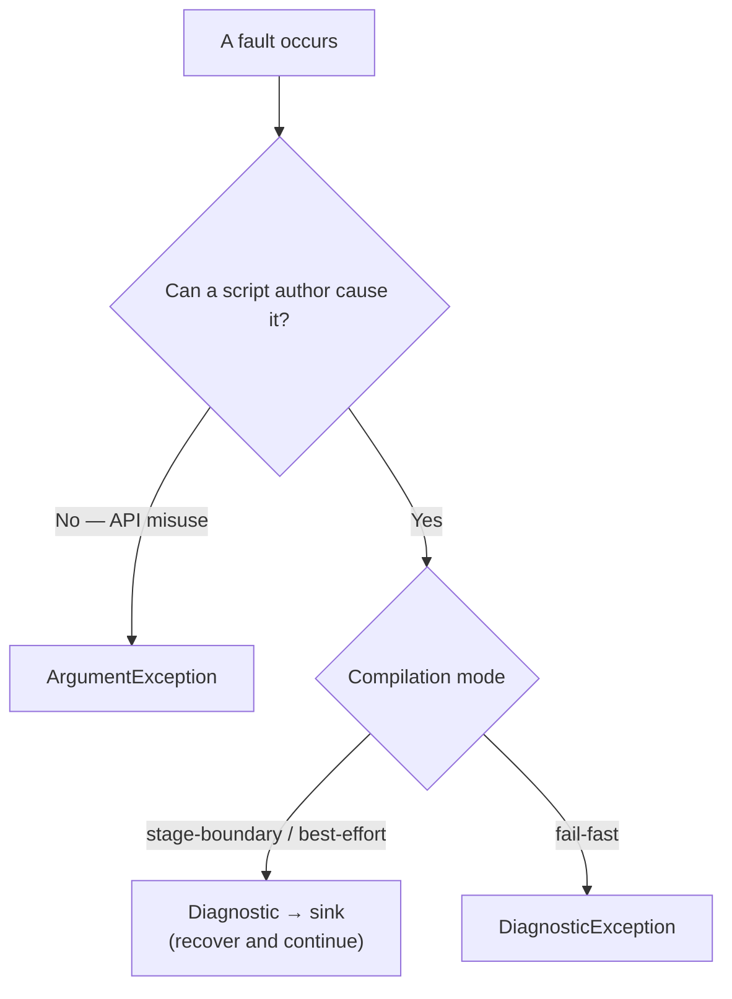

# Error Model

> [!NOTE]
> Status: **implemented**. The convention every component follows when something
> goes wrong: which channel a fault takes, how a diagnostic code is numbered, and
> how a message reads. The machinery that carries diagnostics is the
> [Diagnostics and Validation](../diagnostics/Diagnostics%20and%20Validation.md) note.

## Three channels

A fault is routed by whether the compiler can **keep going**, not by which stage
raised it.

| Channel | For | Carrier |
| --- | --- | --- |
| **Collect** | A problem a script author can cause and fix — a dangling `=>`, a duplicate anchor, a jump to a missing scene. The stage recovers and continues, so the author sees every problem at once. | a `Diagnostic` reported into the compilation's sink |
| **Throw** | The same problem under the fail-fast compilation mode, which stops at the first error. | `DiagnosticException`, wrapping the whole `Diagnostic` |
| **Standard .NET** | A developer misusing the API: a `null` argument, a broken AST invariant (a heading level outside 1–6, a non-positive span length). | `ArgumentException` and friends |

Rule of thumb: if writing a bad `.dialogue.md` can trigger it, it is a diagnostic.
If only calling code can trigger it, it is an argument exception.

`DiagnosticException` wraps the diagnostic rather than flattening it to a string,
so a fail-fast host and a collecting tool see the same code, span, and arguments.
`DiagnosticException` and its bases (`ScriptCompilationException`,
`DialogueDownException`) are internal, so a host outside the core sees a fail-fast
stop as a plain `Exception`; a public fail-fast type is not built.
Faults outside the compiler keep their own public exception types:
`DialogueConfigurationException` for a malformed `dialogue.toml` (see
[Configuration Loader](../configuration/Configuration%20Loader.md)) and
`InvalidPlaybookException` for a playbook a reader rejects.

## Codes and categories

Every diagnostic kind is a `DiagnosticDescriptor` in `DiagnosticCatalog`, with a
stable `DLG####` code. The leading digit names the **category**, and the
descriptor rejects a code whose digit disagrees with its category:

| Range | Category | Meaning | Example |
| --- | --- | --- | --- |
| `DLG1xxx` | `Syntax` | The script's surface does not parse as intended, or Markdown never becomes dialogue. | `DLG1113` dangling jump arrow |
| `DLG2xxx` | `Semantic` | The script parses but means something invalid. | `DLG2009` jump to a missing scene |
| `DLG3xxx` | `Style` | Valid, but hard to read or maintain. | `DLG3002` deeply nested choice branch |

Category and **severity** (`Info`, `Warning`, `Error`) are independent: `DLG1003`
is a syntax warning, `DLG1114` a syntax info, `DLG2016` a semantic warning. Only an
`Error` makes a compile fail.

Codes are a public contract. The user-facing
[error-code reference](../../../guide/error-codes.md) documents each one, so a
released code is never renumbered or repurposed. Configuration errors carry no
`DLG` code; they are located exceptions.

## Every fault carries a location

A diagnostic locates its problem with a `SourceSpan` — a start offset and a length
into the source, the same type every AST node carries. Producers report with spans
they already hold; line and column are computed once, at the surface that renders
the diagnostic. See [CLI Diagnostic Rendering](../diagnostics/CLI%20Diagnostic%20Rendering.md)
for the terminal and [Diagnostics Overlay](../visualization/editor/Diagnostics%20Overlay.md)
for the editor.

## Message conventions

A message answers **what** is wrong, **where**, and **how** to fix it, in words an
author understands.

- Lead with the problem, not the mechanics.
- Name the offending token.
- Offer the fix, conditionally when the author's intent is unknown.
- Keep internal type names out.

| Weak | Strong (the shipped `DLG2009` and `DLG1113` messages) |
| --- | --- |
| `Bad jump.` | `Jump target '#play-tennis' does not match any scene. Check the anchor, or add a heading it can point to.` |
| `Invalid arrow.` | `` `=>` makes a jump only when a link follows it. … If you meant to jump, add a target: `=> [The market](#the-market)`. If you meant the characters, escape the arrow: `\=>`. `` |
