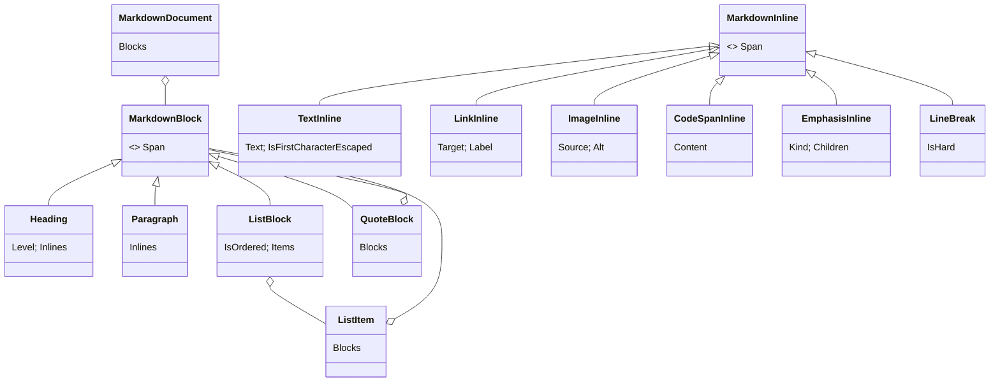

# Markdown Front-End

> [!NOTE]
> Status: **implemented**. The first
> [pipeline stage](../README.md#core-the-compiler-pipeline): it parses a script's
> text with Markdig into DialogueDown's own small, DSL-agnostic Markdown AST, and
> handles every construct it does not model by an explicit keep-or-ignore policy.

## Table of contents

- [Goal and scope](#goal-and-scope)
- [Interfaces and abstractions](#interfaces-and-abstractions)
- [The Markdown AST](#the-markdown-ast)
- [Markdig to AST mapping](#markdig-to-ast-mapping)
- [Key design decisions](#key-design-decisions)
- [Error and boundary cases](#error-and-boundary-cases)
- [Testability](#testability)

## Goal and scope

The front end owns **syntax only**: headings, paragraphs, lists, blockquotes,
links, images, code spans, emphasis, and line breaks. It knows nothing about
speakers, tags, `:`, `=>`, queries, or choices — the
[transpiler](./Markdown%20to%20Dialogue%20AST%20Transpiler.md) reads those out of
this tree.

```text
## Arrival                      →  Heading(2, [ Text "Arrival" ])
- Go **left**                   →  ListBlock [ ListItem [ Paragraph [ Text "Go ", Emphasis(Bold, [Text "left"]) ] ] ]
```

## Interfaces and abstractions

| Type | Responsibility |
| --- | --- |
| `IMarkdownParser` | The port: `MarkdownDocument Parse(string source, DiagnosticsContext context)`. |
| `MarkdigMarkdownParser` | The adapter: a narrowed Markdig pipeline plus a required `IUnmodeledNodeHandlingPolicy`; builds a handler and converter per parse. |
| `MarkdigToMarkdownAstConverter` | Translates modeled Markdig nodes; hands every unmodeled node to the handler. |
| `MarkdigUnmodeledNodeHandler` | Keeps or ignores an unmodeled construct, reporting `DLG1114` for each ignored one. |
| `MarkdownDocument` and node records | The immutable Markdown AST. |

All types are internal to the core.

## The Markdown AST



- Blocks are a flat list under the document: a heading does not contain the blocks
  after it. Grouping them into scenes is the semantic analyzer's job.
- A `ListItem` holds blocks, so a nested list is a `ListBlock` inside an item — the
  shape choice nesting relies on. A `QuoteBlock` likewise holds blocks, the shape
  [block controls](../language/Block%20Controls.md) rely on.
- A link's label and an image's alt are inline nodes, so they can carry styling and
  tags. `EmphasisInline`, `LinkInline`, and `ImageInline` are the inlines with
  children.

## Markdig to AST mapping

| Markdig node | Our node | Notes |
| --- | --- | --- |
| `HeadingBlock` | `Heading` | level and inlines |
| `ParagraphBlock` | `Paragraph` | |
| `ListBlock` / `ListItemBlock` | `ListBlock` / `ListItem` | `IsOrdered` kept, never reinterpreted |
| `QuoteBlock` | `QuoteBlock` | |
| `LiteralInline` | `TextInline` | escapes resolved; the first-character escape kept (D6) |
| `EmphasisInline` | `EmphasisInline` | `Italic` / `Bold` / `Strikethrough` from delimiter and count; children recursed |
| `LinkInline` / image | `LinkInline` / `ImageInline` | label or alt recursed |
| `CodeInline` | `CodeSpanInline` | raw inner content |
| `LineBreakInline` | `LineBreak` | hard or soft (D4) |
| HTML comment | *(discarded)* | never reaches the policy |
| `YamlFrontMatterBlock` | *(discarded)* | only at the very start of the script |
| anything else | per policy | `Keep` → text sliced from the source span; `Ignore` → omitted with `DLG1114` |

The policy's kinds and defaults are the
[Unmodeled Markdown Handling](./Unmodeled%20Markdown%20Handling.md) note.

## Key design decisions

### D1 — Our own AST as an anti-corruption layer

Markdig types never leave the adapter. Swapping parsers touches only the adapter
and converter, and a construct not in the model cannot leak downstream.

### D2 — Emphasis is styling with parsed children

`*x*`, `**x**`, and `~~x~~` become `EmphasisInline` whose children are parsed, so
``**Hello `"Name"`!**`` is bold *and* still holds a query. A literal `*` or `~` is
escaped, intraword `_` stays literal, and bold-italic falls out of nesting. How
styling renders is decided downstream. Adjacent text runs are not coalesced: an
escape or an emphasis boundary may split text into several `TextInline`s.

### D3 — A narrowed pipeline

Only three extensions are enabled: pipe tables (so a table can be recognized, then
handled by the policy), strikethrough, and YAML front matter (so it can be dropped).
Other GFM syntax — task lists, GFM autolinks, sub/superscript — stays the literal
text the writer typed.

### D4 — Line breaks keep their kind, not their meaning

Each in-paragraph break becomes a `LineBreak` with `IsHard` (two trailing spaces or
a backslash). The transpiler assigns the speech meaning.

### D5 — Comments and front matter are discarded, not modeled

Both carry no dialogue meaning, so they are dropped before the policy sees them:
`Alice: Hello! <!-- warm -->` speaks `Alice: Hello!`. A `---` after content is an
ordinary thematic break, handled by the policy.

### D6 — Escape provenance on text

Markdig resolves a backslash escape before the converter sees the text, so the
converter copies `LiteralInline.IsFirstCharacterEscaped` onto
`TextInline.IsFirstCharacterEscaped`. Without it an escaped `#` or `=` would be
indistinguishable from a typed one (see [Symbol Escape](../language/Symbol%20Escape.md)).
Markdig starts a new literal at every escape, so one flag per run is exact.

### D7 — Immutable records with source spans

Every node except the document root carries a `SourceSpan`, which needs Markdig's
precise source locations enabled.

## Error and boundary cases

| Input | Behavior |
| --- | --- |
| Empty or whitespace-only | A document with no blocks. |
| `null` source | `ArgumentNullException`. |
| Mixed `\n` / `\r\n` | Normalized by Markdig; spans stay valid. |
| `#` not at line start | Literal text (tags are the transpiler's). |
| Unterminated `` `foo `` | Literal text, per CommonMark. |
| `~x~`, `~~x~` | Literal; only balanced `~~…~~` is strikethrough. |
| `~~~` at line start | A fenced code block, handled by the policy. |
| Deeply nested lists | Represented faithfully, with no depth limit. |
| A policy that answers neither keep nor ignore | `NotSupportedException` naming the construct. |

The only diagnostic this stage reports is `DLG1114`, for an ignored construct (see
[Ignored Markdown Diagnostic](../diagnostics/Ignored%20Markdown%20Diagnostic.md)).

## Testability

- Feed strings to the parser and assert the AST with `MarkdownAstAssert` helpers; no
  mocks are needed.
- Boundary tests cover `#` inline, every list marker (`-`, `+`, `*`, `1.`, `1)`),
  each emphasis form including a query and link inside emphasis, escapes, nested
  lists, and hard versus soft breaks.
- Downstream stages substitute `IMarkdownParser` with NSubstitute.
