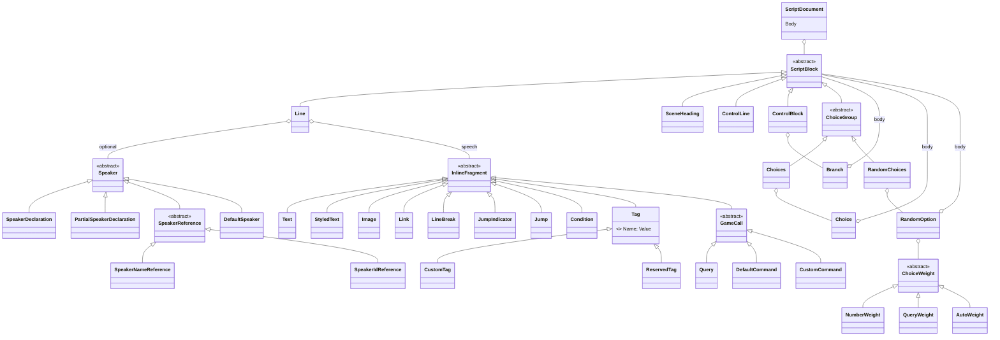

# Markdown to Dialogue AST Transpiler

> [!NOTE]
> Status: **implemented**. The second
> [pipeline stage](../README.md#core-the-compiler-pipeline): it re-tokenizes the
> [Markdown AST](./Markdown%20Front-End.md) into the Dialogue AST — lines, speakers,
> speech fragments, game calls, tags, conditions, choices, and control blocks —
> using only local, syntax-directed recognition.

## Table of contents

- [Goal and scope](#goal-and-scope)
- [Ubiquitous language](#ubiquitous-language)
- [Two layers](#two-layers)
- [The Dialogue AST](#the-dialogue-ast)
- [Markdown AST to Dialogue AST mapping](#markdown-ast-to-dialogue-ast-mapping)
- [Key design decisions](#key-design-decisions)
- [Error and boundary cases](#error-and-boundary-cases)
- [Testability](#testability)

## Goal and scope

```markdown
Alice @A #happy: Hi, `"Player.Name"`! => [Leave](#exit)
```

becomes one `Line` with a `SpeakerDeclaration("Alice", "A", [#happy])` and the
speech `Text "Hi, "`, `Query "Player.Name"`, `Text "! "`, `JumpIndicator`,
`Text " "`, `Link([Text "Leave"], "#exit")`.

The transpiler decides everything a single node (and the text in it) can decide.
Anything that needs neighbors or the whole document is later:

| Deferred work | Stage |
| --- | --- |
| Fold `JumpIndicator` + `Link` into a `Jump`; recognize effect-only lines as `ControlLine`; fill the default speaker | [Desugar](./Desugar.md) |
| Nest headings into scenes, bind speakers, resolve jump targets, validate reserved tags | [Semantic Analyzer](./Semantic%20Analyzer.md) |

## Ubiquitous language

The whole tree is the **Dialogue AST**; its root type is `ScriptDocument` (not
`Script`, which would clash with the namespace).

| Term | Meaning |
| --- | --- |
| **ScriptBlock** | One item of a script or branch body: `Line`, `SceneHeading`, `ControlLine`, `ControlBlock`, or a choice group. |
| **SceneHeading** | A heading as a flat token; scenes are built from it later. |
| **Line** | One utterance: an optional `Speaker`, its `Speech`, and an optional `Condition`. |
| **Speaker** | Who speaks, unresolved: a declaration, a name or id reference, or a partial declaration. |
| **Speech** | A line's ordered `InlineFragment`s. |
| **GameCall** | A game-state hook inside speech: `Query`, `DefaultCommand`, or `CustomCommand`. |
| **Condition** | A `` `"key"?` `` check attached to a line, jump, option, or branch (see [Conditions](../language/Conditions.md)). |
| **Choice group** | `Choices` (player picks) or `RandomChoices` (weighted pick, see [Random Choice](../language/Random%20Choice.md)). |
| **ControlBlock** | An `if` / `elseif` / `else` blockquote of `Branch`es (see [Block Controls](../language/Block%20Controls.md)). |
| **Tag** | `CustomTag` (`#name`) or `ReservedTag` (`##name`), optionally valued (`=value`). |

## Two layers

1. **Block layer** — `BlockBuilder` walks the Markdown blocks. One recursive
   `Build(blocks)` serves the document body, every choice body, and every branch
   body. `LineBuilder` turns one group of inlines into a `Line`;
   `ControlBlockBuilder` turns a blockquote into a `ControlBlock`.
2. **Inline layer** — small parsers produce **data**, and builders turn data into
   nodes:

| Parser (text → data) | Builder (data → node) | Recognizes |
| --- | --- | --- |
| `SpeakerPrefixParser` | `SpeakerBuilder` | `Name @id #tags:` |
| `GameCallParser` | `GameCallBuilder` | a code span's game call |
| `TagParser` | `TagBuilder` (via `InlineLeafBuilder`) | `#tag`, `##tag`, `#k=v` |
| `InlineLeafTokenizer` | `InlineLeafBuilder` | text runs into `Text` / `Tag` / `JumpIndicator` |

`InlineBuilder` walks inline content (speech, emphasis children, labels, alt text)
and calls the leaf builders. Condition, weight, and control-marker recognition live
in their own small readers (`ConditionReader`, `ChoiceWeightReader`,
`MarkerRecognition`, `RandomChoiceRecognition`). The grammar each accepts is the
[script-language guide](../../../guide/script-language.md).

## The Dialogue AST



`ControlLine`, `Jump`, and `DefaultSpeaker` appear only after desugar. Every node
is an immutable record with a `SourceSpan`, except the `ScriptDocument` root.
`StyledText` holds a Dialogue-side `SpeechStyle` (not the Markdown `EmphasisKind`)
and at least one child. `Image` and `Link` hold their alt or label as fragments;
their source and target stay unresolved strings.

## Markdown AST to Dialogue AST mapping

| Markdown AST | Dialogue AST | Notes |
| --- | --- | --- |
| `Heading` | `SceneHeading` | flat token with level and title fragments (D4) |
| `Paragraph` | one or more `Line`s | split at hard breaks (D3) |
| leading text of a line | a `Speaker` | try-parse the whole prefix (D6) |
| `TextInline` | `Text`, `Tag`, `JumpIndicator` | tokenized (D7) |
| `EmphasisInline` | `StyledText` | children recursed |
| `ImageInline` / `LinkInline` | `Image` / `Link` | alt and label under the label policy (D7) |
| `CodeSpanInline` | a `GameCall`, `Condition`, or weight | by position and shape |
| `LineBreak` soft / hard | `LineBreak` / — | a hard break ends the line (D3) |
| `ListBlock` / `ListItem` | `Choices` / `Choice`, or `RandomChoices` / `RandomOption` | weighted items make a random choice |
| `QuoteBlock` with `if` markers | `ControlBlock` / `Branch` | |

## Key design decisions

### D1 — Our own Dialogue AST

Downstream stages depend on dialogue concepts, never on Markdown or Markdig. The
AST carries **unresolved** references: a `Link` keeps its raw target, a `Speaker` its
raw name, id, and tags.

### D2 — A lexer for the dialogue dialect, not a composer

Recognition is local: decidable from one node and its text. The transpiler emits
`JumpIndicator` and `Link` separately rather than a `Jump`, so a bare link stays an
ordinary inline link and composition lives in one place (desugar).

### D3 — Hard breaks split lines; soft breaks stay

A hard break separates speeches, so it is consumed as a line boundary. A soft break
inside one speech is kept as a `LineBreak`, a display-wrap hint. An empty group
between two hard breaks is dropped rather than emitting an empty line.

### D4 — Headings are flat tokens

A `SceneHeading` sits in the body beside the blocks after it. Nesting by level is a
document-wide computation and belongs to the semantic analyzer, which also handles
irregular outlines (an `H1` after an `H2`, a skipped level).

### D5 — Choices keep their order and their speakers

A choice body runs the same `Build`, so `- Alice: Hi` is an attributed option. The
list's `IsOrdered` is kept: an ordered list fixes display order.

### D6 — Speaker prefix: declaration versus reference, by shape

| Prefix | Node | Meaning |
| --- | --- | --- |
| name + id and/or tags (`Alice @A #x:`) | `SpeakerDeclaration` | binds metadata |
| bare name (`Alice:`) | `SpeakerNameReference` | points at a speaker by name |
| bare id (`@A:`) | `SpeakerIdReference` | points at a speaker by id |
| id + tags (`@A #x:`) | `PartialSpeakerDeclaration` | adds tags to the speaker with that id |

The prefix is recognized only if the leading text parses **fully** as a prefix
ending in `:`, so `Alice: The time is 3:00` has a speaker and `The time is 3:00`
does not. Tags with neither a name nor an id (`#tag:`) report `DLG1101`. A styled
name (`*Alice*:`) is not a prefix and reports
[`DLG1107`](../diagnostics/Styled%20Speaker%20Prefix%20Diagnostic.md).

### D7 — One inline walk, a policy per context

Speech, emphasis children, labels, and alt text are all `MarkdownInline`
sequences, so one `InlineBuilder` walks them under an `IInlinePolicy` that decides
what the context admits (`Supports`) and whether `=>` is a jump (`SupportsJumps`):

| Policy | Used for | Admits | Unsupported element |
| --- | --- | --- | --- |
| `AllowAllInlinePolicy` | speech | everything; `=>` is a jump | — |
| `TitleInlinePolicy` | heading titles | everything; `=>` is text | — |
| `LabelInlinePolicy` | link labels, alt text | text, styling, and code spans | restored to its plain-text form |

`InlineLeafTokenizer` builds `Repeated(Or(text, tag, jump)).ConsumeAll()` from the
allowed leaves, dropping `jump` where jumps are off. It honors the
`TextInline` escape flag, so `\#word` and `\=>` never become a `Tag` or a
`JumpIndicator` (see [Symbol Escape](../language/Symbol%20Escape.md)).

### D8 — Parsers produce data; builders produce nodes and diagnostics

Every parser is one non-throwing contract that consumes a prefix:

```csharp
interface IParser<T> { ParseResult<T> Consume(ParseInput input); }
```

- `ParseInput(Text, Position)` anchors positions to the source, so matches report
  absolute ranges.
- `ParseResult<T>` is a `ParseMatch<T>(Value, TextRange)` or a `ParseError(Detail)`.
- `TextRange` may be empty (an absent optional part); it becomes a `SourceSpan` only
  when a node is built.
- `Spanned<T>` carries a sub-part's span, so each tag in a prefix gets its own.

Superpower does the character-level leaves, wrapped once by `SuperpowerParser`;
structure composes with LINQ `Select` / `SelectMany`, `Optional`, and `Repeated`.
Parsers return span-free records (`TagData`, `SpeakerPrefixData`, `QueryData`,
`DefaultCommandData`, `CustomCommandData`). The builders classify the data, stamp
the span only they know (a code span's span includes backticks the parser never
sees), and report any diagnostic. Whether the whole input must be consumed is the
builder's policy, not a property of the parser.

### D9 — Report and recover

A malformed surface reports a diagnostic and recovers, so the stage always returns
a `ScriptDocument`. The transpiler reports `DLG1101`, `DLG1102`, `DLG1104`,
`DLG1105`, and `DLG1107`–`DLG1112`; each code's recovery is listed in
[Diagnostics and Validation](../diagnostics/Diagnostics%20and%20Validation.md#recovery-at-each-reporting-site).

## Error and boundary cases

| Case | Behavior |
| --- | --- |
| Text with no valid prefix, or a colon inside speech | No speaker; desugar fills the default. |
| Code span that is not a game call | `DLG1102`; the text is kept literally. |
| Tags with no name or id to attach to (`#tag: Hi`) | `DLG1101`; the tags are dropped. |
| `=>` not followed by a link | Emitted as `JumpIndicator`; desugar degrades it and reports `DLG1113`. |
| Whitespace between `=>` and its link | Kept as `Text`; folded into the `Jump` by desugar. |
| Literal `#word` | A `Tag`, unless escaped (`\#word`). |
| Empty emphasis (`****`) | Markdig leaves it as text, so `StyledText` is never empty. |
| Content before the first heading | Part of the document body. |
| Deeply nested choices | Represented faithfully; `DLG3002` advises past level 3. |
| A game call inside a label | Built as in speech; validation then reports a command with `DLG1103` and a condition with `DLG1106` (see [Game Calls in Labels](../language/Game%20Calls%20in%20Labels.md)). |
| A link or image inside a label | Restored to text by the label policy. |
| A node the front end ignored | Never reaches the transpiler. |

## Testability

- **Parsers** are pure `text → data` functions, tested directly, including the
  failing inputs.
- **Builders** are tested on data and assert nodes, spans, and diagnostics.
- **`BlockBuilder` and `LineBuilder`** are tested on small Markdown ASTs built
  through the front end, asserting with `DialogueAstAssert`.
- Inputs are multi-line raw string literals, and tests run in parallel.
