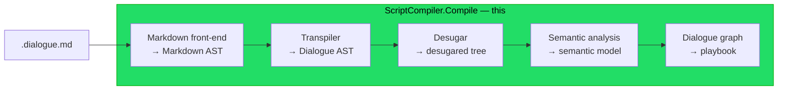
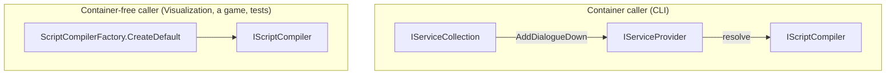

# Implementation note: Script compiler facade

> [!NOTE]
> Status: **implemented**. A cross-cutting component that gives the compiler a
> single public entry point (`IScriptCompiler`) and a dependency injection story
> (`AddDialogueDown` and `ScriptCompilerFactory.CreateDefault`), so other projects
> and the CLI invoke compilation through one seam instead of hand-wiring stages.
> Every stage runs through that one call — parse → transpile → desugar → analyze
> → build the graph.

## Table of contents

- [Implementation note: Script compiler facade](#implementation-note-script-compiler-facade)
  - [Table of contents](#table-of-contents)
  - [Goal and scope](#goal-and-scope)
  - [Where it sits](#where-it-sits)
  - [Ubiquitous language](#ubiquitous-language)
  - [Functionality checklist](#functionality-checklist)
  - [Interfaces and abstractions](#interfaces-and-abstractions)
  - [Composition roots](#composition-roots)
  - [Key design decisions](#key-design-decisions)
    - [DD1 — One facade orchestrates the stages](#dd1--one-facade-orchestrates-the-stages)
    - [DD2 — Public front door, internal internals](#dd2--public-front-door-internal-internals)
    - [DD3 — DI via Microsoft.Extensions.DependencyInjection](#dd3--di-via-microsoftextensionsdependencyinjection)
    - [DD4 — Stateless stages are singletons](#dd4--stateless-stages-are-singletons)
    - [DD5 — Diagnose when a stage can continue, throw when it cannot](#dd5--diagnose-when-a-stage-can-continue-throw-when-it-cannot)
    - [DD6 — The CLI adopts the facade](#dd6--the-cli-adopts-the-facade)
    - [DD7 — Visualization consumes the same facade](#dd7--visualization-consumes-the-same-facade)
  - [Error and boundary cases](#error-and-boundary-cases)
  - [Integration](#integration)
  - [Testability](#testability)

## Goal and scope

The compiler runs in stages, from raw source to the runtime dialogue graph (see
[Where it sits](#where-it-sits)). Today each caller wires those stages by hand:
the visualizer news up a parser and a transpiler; the CLI holds a placeholder
compiler. This component introduces one **facade** — `IScriptCompiler` — that runs
the stages in order and returns their artifacts, plus a **dependency injection**
story so the facade and its stages are swappable and configurable.

In scope: the facade, its result, a container-free factory, an `AddDialogueDown`
registration extension (in the core project), and wiring the **CLI** onto it.
Every stage now runs through the facade, so the seam is what other projects — the
CLI and the visualization — call instead of hand-wiring stages.

## Where it sits



The facade wraps every stage — front-end, transpiler, desugar, semantic analysis,
and the graph — behind one call, and grows `CompilationResult` as each stage
contributes its artifact.

## Ubiquitous language

| Term                 | Meaning                                                                                                 |
| -------------------- | ------------------------------------------------------------------------------------------------------- |
| **Compiler**         | the whole source-to-runtime process; here realized (partially) by the facade.                           |
| **Compilation**      | one run of the compiler over a source string.                                                           |
| **Stage**            | one phase of the compiler (parse, transpile, desugar, …).                                               |
| **Facade**           | `IScriptCompiler`, the single entry point that runs the stages.                                         |
| **Composition root** | where the object graph is assembled: `AddDialogueDown` (container) or `CreateDefault` (container-free). |

## Functionality checklist

- [x] **Orchestrate** parse → transpile → desugar and return a `CompilationResult`.
- [x] **Expose each stage artifact** on the result (internal) for tooling to project.
- [x] **`CreateDefault()`** builds a fully wired facade with no container.
- [x] **`AddDialogueDown()`** registers the stages and the facade; resolving
      `IScriptCompiler` from the provider works.
- [x] **Errors propagate** from a stage (no diagnostics component yet).
- [x] **CLI `compile`** runs real compilation through the facade.
- [x] **Deliberately incomplete**: a `TODO` seam marks semantic analysis and the
      later stages.

## Interfaces and abstractions

| Type                          | Visibility                          | Responsibility                                                                                             | Collaborators                                                   |
| ----------------------------- | ----------------------------------- | ---------------------------------------------------------------------------------------------------------- | --------------------------------------------------------------- |
| `IScriptCompiler`             | **public**                          | facade: `CompilationResult Compile(string source)`                                                         | the stages                                                      |
| `ScriptCompiler`              | internal                            | runs parse → transpile → desugar and assembles the result                                                  | `IMarkdownParser`, `IScriptTranspiler`, `IScriptDesugarer`      |
| `CompilationResult`           | **public** (internal stage members) | carries each stage's artifact and the original `Source`; a future home for diagnostics and compiled output | `MarkdownDocument`, `ScriptDocument`, `DesugaredScriptDocument` |
| `ScriptCompilerFactory`       | **public**                          | `CreateDefault()` — a container-free, fully wired facade                                                   | `ScriptCompiler` + default stages                               |
| `AddDialogueDown` (extension) | **public**                          | registers the stages and the facade into an `IServiceCollection`                                           | `IServiceCollection`                                            |

## Composition roots

Two composition roots build the same graph, for two kinds of caller:



## Key design decisions

### DD1 — One facade orchestrates the stages

`ScriptCompiler.Compile(source)` runs the stages in order, collecting what each
produces, and returns either a success or a failure carrying how far it got:

```text
Compile(source):
    markdown  = parser.Parse(source, context)
    script    = transpiler.Transpile(markdown, context)
    desugared = desugarer.Desugar(script, context)
    validator.Validate(desugared, context.Diagnostics)
    model     = analyzer.Analyze(desugared, context)
    graph     = graphBuilder.Build(model)     # only when nothing reported an error
    return CompilationSuccess(...) | CompilationFailure(...)
```

Each stage takes the compilation's context, so every stage reports into one
`DiagnosticBag` and carries `source` for its spans. A stage that reports an error
ends the compile at its checkpoint — in stage-boundary mode the transpiler is the
first checkpoint — and the failure carries every artifact reached so far, because
a tool still describes a broken script. Adding a stage changes no caller.

### DD2 — Public front door, internal internals

The facade is the library's **public entry point**: a game or Godot integration
must be able to compile a script. So `IScriptCompiler` and `CompilationResult` are
**public**. The stage artifacts (`MarkdownDocument`, `ScriptDocument`,
`DesugaredScriptDocument`) are still under active design, so they stay **internal**
and must not leak into public API.

This is reconciled with precise visibility, needing **no new `InternalsVisibleTo`**:

- `IScriptCompiler` is public; its only method returns the public
  `CompilationResult` — no internal type appears in a public signature.
- `ScriptCompiler` is an **internal class implementing a public interface**; its
  constructor takes the internal stage interfaces. Callers only ever see
  `IScriptCompiler`.
- `CompilationResult` is a public record whose **stage members are `internal`**
  (`Markdown`, `Script`, `Desugared`) and whose constructor is internal (only core
  builds it). Its one **public** member is `Source` (the original text); the CLI
  and external embedders see that shell, while Visualization — already a friend via
  `InternalsVisibleTo` — reads the stage artifacts. Diagnostics and compiled output
  are planned public additions.

The facade and its result live in a new `DialogueDown.Compilation` namespace.

### DD3 — DI via Microsoft.Extensions.DependencyInjection

The stages are **constructor-injected** (the pattern), which makes them swappable
and testable with or without a container. On top of that, core offers **both**
composition roots so no caller is forced to adopt a container it does not want:

- **`AddDialogueDown(this IServiceCollection)`** registers the stage interfaces and
  the facade, for callers that already run a container (the CLI). It lives in the
  `Microsoft.Extensions.DependencyInjection` namespace so it is discoverable
  wherever that `using` already exists. Each registration uses **`TryAdd`**, so a
  caller that registers its own implementation of a stage before calling
  `AddDialogueDown` swaps just that stage while the rest keep their defaults.
- **`ScriptCompilerFactory.CreateDefault()`** returns a fully wired facade in one
  call, for container-free callers (Visualization, a game, tests).

Core references only `Microsoft.Extensions.DependencyInjection.Abstractions`,
pinned to the `10.0.x` line to match the CLI's transitive version and avoid a
downgrade. It is a featherweight, first-party package — no container. Core **never
hosts its own container**: a library that news up a `ServiceProvider` internally is
the service-locator anti-pattern. Core provides the recipe and the factory; each
app owns its composition root. This is the seam that later carries configuration
(`IOptions<>`) and alternate stage implementations.

### DD4 — Stateless stages are singletons

The parser, transpiler, desugarer, and facade hold no per-compilation state, so
`AddDialogueDown` registers them as **singletons**. `CreateDefault` likewise
returns one wired instance. Both roots share the same per-stage defaults
(`MarkdigMarkdownParser`, `ScriptTranspilerFactory.CreateDefault()`,
`ScriptDesugarer`) so they cannot drift.

### DD5 — Diagnose when a stage can continue, throw when it cannot

A stage reports a diagnostic and carries on where it safely can; it throws only
when it cannot continue at all. `CompilationResult` is a closed union:
`CompilationSuccess` carrying every artifact, or `CompilationFailure` carrying how
far the compile got and the diagnostics it collected. The CLI renders those
diagnostics and maps a propagated exception to a non-zero exit code.

### DD6 — The CLI adopts the facade

The CLI's own placeholder compiler was built to be replaced, and is gone:
`CliServices` registers the compilation factory, the playbook writer, and the
errata renderer, and `CompileCommand` injects the core `IScriptCompiler`. It
compiles the source, renders the diagnostics, and writes the playbook or a stage
projection when asked.

### DD7 — Visualization consumes the same facade

`CompilationVisualizer` used to drive the parser and transpiler by hand; it now
takes an `IScriptCompiler` (defaulting to `ScriptCompilerFactory.CreateDefault`)
and projects `CompilationResult`'s stage artifacts into its tabs, so a new stage
reaches the report without the visualizer knowing the pipeline. A core test reads
the internal stage members to prove the seam can serve it.

## Error and boundary cases

| Case                   | Behavior                                                                              |
|------------------------|---------------------------------------------------------------------------------------|
| `source` is null       | `ArgumentNullException` from the facade (stages also guard).                          |
| Empty `source`         | flows through as empty artifacts; a success with nothing to report.                   |
| An error is reported   | the compile stops at its checkpoint and returns the failure carrying what it reached. |
| A stage swapped via DI | the facade runs the substitute; behavior is the caller's.                             |

## Integration

- **Core**: the facade, result, factory, and `AddDialogueDown`; core takes the
  `Microsoft.Extensions.DependencyInjection.Abstractions` dependency.
- **CLI**: `CliServices` registers the compilation factory; `CompileCommand`
  injects `IScriptCompiler` and renders the result's diagnostics.
- **Visualization**: `CompilationVisualizer` takes an `IScriptCompiler` and
  projects the result's stage artifacts.

## Testability

- **`ScriptCompiler`** — unit test with NSubstitute stage doubles: assert it calls
  parse → transpile → desugar → validate → analyze → build in order, threads the
  compilation context, and assembles the result from each stage's output. Core
  exposes internals to `DynamicProxyGenAssembly2` so the mock generator can
  substitute the internal stage interfaces.
- **`CompilationResult`** — a friend test (in `DialogueDown.Tests`) asserting the
  internal stage artifacts are exposed.
- **`ScriptCompilerFactory.CreateDefault()`** — end-to-end on a real script: the
  result's desugared tree upholds the post-desugar invariants (no `JumpIndicator`
  survives, no line lacks a speaker).
- **`AddDialogueDown()`** — build a provider, resolve `IScriptCompiler`, compile a
  script, confirm it is a working singleton graph, and confirm a stage
  pre-registered before `AddDialogueDown` is kept (the `TryAdd` swap point).
- **CLI** — a `compile` smoke test: a real script compiles and returns the success
  exit code; the retired placeholder's "not implemented" test is removed.
