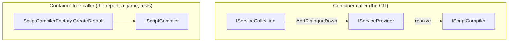

# Script Compiler Facade

> [!NOTE]
> Status: **implemented**. The compiler's single public entry point,
> `IScriptCompiler.Compile`, which runs every
> [pipeline stage](../README.md#core-the-compiler-pipeline) in order and returns a
> `CompilationResult` — a success carrying the dialogue graph, or a failure carrying
> how far the compile got. Two composition roots build it: `AddDialogueDown` and
> `ScriptCompilerFactory.CreateDefault`.

## Table of contents

- [Ubiquitous language](#ubiquitous-language)
- [The seam](#the-seam)
- [One compile](#one-compile)
- [The compilation result](#the-compilation-result)
- [Composition roots](#composition-roots)
- [Key design decisions](#key-design-decisions)
- [Error and boundary cases](#error-and-boundary-cases)
- [Testability](#testability)

## Ubiquitous language

| Term | Meaning |
| --- | --- |
| **Compilation** | One run of the compiler over a source string. |
| **Stage** | One step of the pipeline: parse, transpile, desugar, validate, analyze, build the graph. |
| **Facade** | `IScriptCompiler`, the single entry point that runs the stages. |
| **Compilation success** | A compile that produced a dialogue graph; every stage artifact is present. |
| **Compilation failure** | A compile that produced no graph, carrying the artifacts it reached. |
| **Reached** | A stage ran and produced its artifact — independent of whether the compile succeeded. |
| **Composition root** | Where the object graph is assembled: `AddDialogueDown` (container) or `CreateDefault` (container-free). |

## The seam

| Type | Visibility | Responsibility |
| --- | --- | --- |
| `IScriptCompiler` | public | `CompilationResult Compile(string source)` |
| `ScriptCompiler` | internal | Runs the six stages under one `CompilationSession`. |
| `CompilationResult` / `CompilationSuccess` / `CompilationFailure` | public (artifacts internal) | The outcome; see [below](#the-compilation-result). |
| `ScriptCompilerFactory` | public | `CreateDefault(CompilerOptions? options = null)` |
| `AddDialogueDown` | public | `AddDialogueDown(this IServiceCollection, CompilerOptions? options = null)` |

All live in `DialogueDown.Compilation`, except `AddDialogueDown`, which sits in
`Microsoft.Extensions.DependencyInjection` so it is found wherever that `using`
already exists.

## One compile

```text
Compile(source):
    session   = CompilationSession.Start(source, mode)     # one sink for every stage
    markdown  = parser.Parse(source, session.Context)
    script    = transpiler.Transpile(markdown, session.Context)
    if session.ShouldHalt:                                  # stage-boundary + an error
        return CompilationFailure.AtTranspile(...)
    desugared = desugarer.Desugar(script, session.Context)
    validator.Validate(desugared, session.Context.Diagnostics)
    semantics = analyzer.Analyze(desugared, session.Context)
    if session.HasErrors:
        return CompilationFailure.AtAnalysis(...)
    graph     = graphBuilder.Build(semantics, session.Context)
    return CompilationSuccess(...)
```

Every stage reports into one sink through its `DiagnosticsContext`; what the mode
does with an error is in
[Compilation modes](../diagnostics/Diagnostics%20and%20Validation.md#compilation-modes).
Writing a playbook is not part of `Compile`: the CLI hands a success's graph to
`IPlaybookWriter`, which `AddDialogueDown` also registers.

## The compilation result

A closed pair under an abstract base:

```csharp
public abstract record CompilationResult
{
    public string Source { get; }
    public bool HasErrors { get; }                                 // any diagnostic is an error
    public IReadOnlyList<LocatedDiagnostic> LocatedDiagnostics { get; }  // projected once, cached
    internal IReadOnlyList<Diagnostic> Diagnostics { get; }
    internal MarkdownDocument Markdown { get; }                    // always reached
    internal ScriptDocument Script { get; }                        // always reached
}

public sealed record CompilationSuccess : CompilationResult
{
    internal DesugaredScriptDocument Desugared { get; }            // never null
    internal SemanticModel Semantics { get; }
    internal DialogueGraph Graph { get; }
}

public sealed record CompilationFailure : CompilationResult
{
    internal DesugaredScriptDocument? Desugared { get; }           // null only AtTranspile
    internal SemanticModel? Semantics { get; }

    internal static CompilationFailure AtTranspile(...);            // halted at the checkpoint
    internal static CompilationFailure AtAnalysis(...);             // ran every stage, has errors
}
```

A caller writes what it means:

```csharp
if (compiler.Compile(source) is CompilationSuccess success)
{
    Run(success.Graph);
}
```

Reaching a stage and succeeding are separate questions, because the report exists to
show what a **broken** script still produced:

| Compile | Outcome | Desugared and semantics |
| --- | --- | --- |
| Erroring transpile, `stage-boundary` | failure (`AtTranspile`) | not reached |
| Ran every stage, has errors | failure (`AtAnalysis`) | reached — and shown by the report |
| Ran every stage, warnings or clean | success | reached |

## Composition roots


```mermaid
flowchart TB
    subgraph container["Container caller (the CLI)"]
        SC[IServiceCollection] -->|AddDialogueDown| SP[IServiceProvider]
        SP -->|resolve| C1[IScriptCompiler]
    end
    subgraph plain["Container-free caller (the report, a game, tests)"]
        F[ScriptCompilerFactory.CreateDefault] --> C2[IScriptCompiler]
    end
```

Both roots project the same `CompilerOptions` into the same default stages (see
[Configuration](../configuration/Configuration.md)), and both register every stage
as a singleton, since no stage holds per-compilation state.

## Key design decisions

### D1 — One facade orchestrates the stages

Callers never wire stages by hand. Adding a stage changes `ScriptCompiler` and the
two roots, and no caller.

### D2 — Public front door, internal artifacts

A game must be able to compile a script, so `IScriptCompiler` and the result are
public. The stage artifacts are still under active design, so they stay internal:
`ScriptCompiler` is an internal class behind a public interface, and the result's
artifact members are internal. The visualization reads them as a friend assembly;
every other consumer sees `Source`, `HasErrors`, and `LocatedDiagnostics`.

### D3 — Dependency injection through `Microsoft.Extensions.DependencyInjection.Abstractions`

Stages are constructor-injected. `AddDialogueDown` registers each with `TryAdd`, so
a caller that registers its own stage first swaps only that stage. The core
references only the abstractions package and never builds its own container — that
would be a service locator. Each app owns its composition root.

### D4 — A closed pair, not a flag

The two outcomes differ in *what they hold*, so they differ in type: nullable
artifacts are honest on a failure and dishonest on a success. Named factories keep
the reachable combinations the only constructible ones — `AtTranspile` cannot carry
a semantic model.

### D5 — A warning never fails a compile

Failure means an error, since only an error means the recovered model no longer
describes what the writer wrote. A script that compiles with advice still produces
a playable graph.

## Error and boundary cases

| Case | Behavior |
| --- | --- |
| `source` is null | `ArgumentNullException`. |
| Empty source | Success; the graph is the `EndNode` alone. |
| Warnings only | Success. |
| Errors, `best-effort` | Failure from `AtAnalysis`; every earlier artifact reached. |
| Erroring transpile, `stage-boundary` | Failure from `AtTranspile`; no desugared tree, no semantics. |
| `fail-fast` and an error | No result; the sink throws a `DiagnosticException`. |
| A stage swapped via DI | The facade runs the substitute. |

## Testability

- **`ScriptCompiler`:** NSubstitute stage doubles assert the stage order, the shared
  context, and which outcome each halt returns. The core exposes internals to
  `DynamicProxyGenAssembly2` so the internal stage interfaces can be substituted.
- **Result:** each outcome is constructed on its own, so a test states the outcome it
  means.
- **`CreateDefault`:** end to end on a real script; the desugared tree upholds the
  post-desugar invariants.
- **`AddDialogueDown`:** resolve `IScriptCompiler`, compile, and confirm a stage
  registered first is kept.
