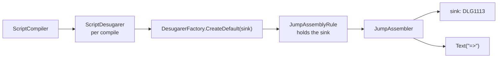

# Dangling Arrow Diagnostic

> [!NOTE]
> Status: **implemented**. `DLG1113` warns when a `=>` has no link after it, so
> the jump the writer intended does not silently become the characters `=>`. The
> diagnostic carries an "escape the arrow" fix.

## Ubiquitous language

| Term | Meaning |
| --- | --- |
| **Jump indicator** | The `=>` token, a `JumpIndicator` before desugar. |
| **Dangling arrow** | A `JumpIndicator` with no `Link` after it, so no `Jump` can be assembled. |
| **Degrade** | Replace the indicator with the literal `Text("=>")` it came from. |

## Writer-facing behavior

```markdown
# The Crossroads

=> The market
```

```text
scene.dialogue.md(3,1): warning DLG1113: `=>` makes a jump only when a link
follows it. With no link here it is read literally, staying as the characters
"=>". If you meant to jump, add a target: `=> [The market](#the-market)`. If you
meant the characters, escape the arrow: `\=>`.
```

The line still renders as `=> The market`. The message states the rule before the
remedy and offers each fix conditionally, because the arrow may be a mistake or
deliberate prose. The attached fix, *Escape as literal text*, inserts `\` before the
arrow; `ddown compile --fix` applies it (see
[Compile CLI — Fix Mode](../cli/Compile%20CLI%20-%20Fix%20Mode.md)).

## Where it is reported

`JumpAssembler` is the one place that still knows the arrow was an arrow, so it
reports and degrades together:

```csharp
private InlineFragment ReportAndDegrade(JumpIndicator indicator)
{
    _diagnostics.Report(new Diagnostic(
        DiagnosticCatalog.DanglingJumpArrow, indicator.Span, [], fixes: [EscapeFix(indicator)]));
    return new Text("=>", indicator.Span);
}
```



## Key design decisions

### D1 — Report at the drop site, not from a later rule

After desugar, a degraded arrow and a writer's literal `=>` are the same
`Text("=>")`, so a validation rule could only guess. Reporting where the arrow is
degraded needs no extra model state.

### D2 — Build the reporting rule per compilation

`ScriptDesugarer` is a DI singleton, so a rule kept in a field would carry one
compile's sink into the next. Threading a sink through every rewriter hook would
change the whole rewriter hierarchy for one rule. Instead `ScriptDesugarer` builds
the rule list per compile with the sink injected into `JumpAssemblyRule`; the rules
are cheap and stateless.

### D3 — Warning, not error

The script still compiles and renders; only the jump is missing. This matches the
other silent-degradation warnings, `DLG1003` and `DLG1107`.

### D4 — Point at the arrow, not the condition

In `` `Ready?` => `` with no link, the condition is valid; the arrow is what failed,
so that is where the writer acts.

## Error and boundary cases

| Case | Behavior |
| --- | --- |
| `=> [Label](#target)` | A jump; no diagnostic. |
| `=> The market`, or a literal `=>` in prose | One warning at the `=>`. |
| `` `Ready?` => `` with no link | One warning at the `=>`. |
| Two dangling arrows | Two warnings. |
| `` `=>` `` in a code span | A game call, so `DLG1102` instead. |
| `\=>` | No warning; no `JumpIndicator` is built (see [Symbol Escape](../language/Symbol%20Escape.md)). |
| `=>` in a heading | Heading text; never reaches desugar. |
| Inside a choice option or branch | Reported; the rewriter reaches nested fragment lists. |
| `=>` with the link on the next line | Dangling; a jump is single-line. |

## Testability

- Assembler: a dangling arrow reports once and still degrades; a well-formed jump
  reports nothing; the conditional case reports at the arrow.
- Pipeline: a script with a dangling arrow yields one located `DLG1113` and still
  succeeds.
- The error-code reference's examples are compiled: the broken one reports
  `DLG1113`, the fixed one does not.
