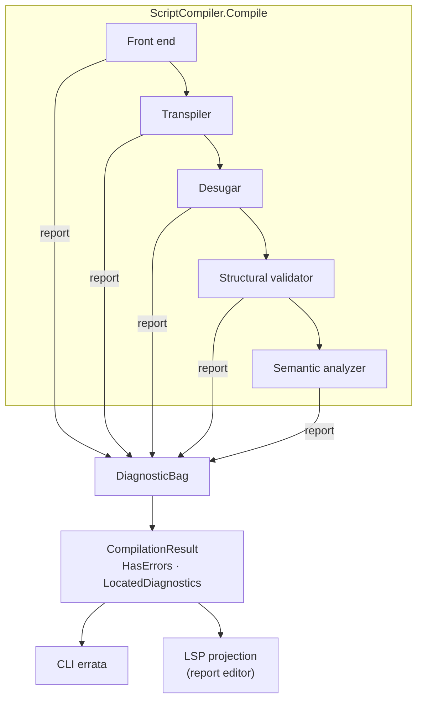

# Diagnostics and Validation

> [!NOTE]
> Status: **implemented**. The machinery that lets one compile report every
> problem in a script: a located diagnostic model, a per-compilation sink the
> stages report into, a rule-based structural validator, recovery at each reporting
> site, and compilation modes that decide how far a compile proceeds. Warnings as
> errors and per-rule configuration are not built. The convention it carries — which
> channel a fault takes and how codes are numbered — is the
> [Error Model](../core/Error%20Model.md).

## Table of contents

- [Where it sits](#where-it-sits)
- [Ubiquitous language](#ubiquitous-language)
- [The diagnostic model](#the-diagnostic-model)
- [The sink and the diagnostics context](#the-sink-and-the-diagnostics-context)
- [The structural validator](#the-structural-validator)
- [Recovery at each reporting site](#recovery-at-each-reporting-site)
- [Compilation modes](#compilation-modes)
- [Key design decisions](#key-design-decisions)
- [Error and boundary cases](#error-and-boundary-cases)
- [Testability](#testability)

## Where it sits

Every stage and the validator report into one sink; the facade reads the collected
diagnostics onto the [compilation result](../core/Script%20Compiler%20Facade.md#the-compilation-result),
and each surface projects the same diagnostics.



| Stage | Reports |
| --- | --- |
| Markdown front end | `DLG1114` |
| Transpiler | `DLG1101`–`DLG1105`, `DLG1107`–`DLG1112` |
| Desugar | `DLG1113` |
| Structural validator | `DLG1003`, `DLG1106`, `DLG2010`, `DLG2015`, `DLG3002`–`DLG3004` |
| Semantic analyzer | `DLG2001`–`DLG2009`, `DLG2016`, `DLG2017` |

## Ubiquitous language

| Term | Meaning |
| --- | --- |
| **Diagnostic** | One located report: a descriptor, a `SourceSpan`, message arguments, a severity, and any fixes. |
| **Descriptor** | The stable definition of one diagnostic kind: `Code`, `Title`, `MessageFormat`, `Category`, `DefaultSeverity`. |
| **Severity** | `Info`, `Warning`, or `Error`, ordered so `Error` is the worst. Only an `Error` fails a compile. |
| **Diagnostic sink** | `IDiagnosticSink`, the write-only seam a producer reports into. |
| **Diagnostic bag** | The collecting sink for one compilation; hands back an immutable snapshot in report order. |
| **Diagnostics context** | The per-compilation bundle each stage receives: the `Source` and the `Diagnostics` sink. |
| **Validation rule** | One `IDiagnosticRule` over the desugared tree, owning its descriptor. |
| **Recovery value** | What a reporting site returns so its stage keeps producing a coherent artifact. |
| **Compilation mode** | How far a compile proceeds after an error: `stage-boundary`, `best-effort`, or `fail-fast`. |
| **Located diagnostic** | The public projection with line/column and a rendered message (see [CLI Diagnostic Rendering](CLI%20Diagnostic%20Rendering.md)). |

## The diagnostic model

All in the dependency-free `DialogueDown.Diagnostics` namespace. The internal types
embed the internal `SourceSpan`; the public surface is the located projection.

| Type | Visibility | Responsibility |
| --- | --- | --- |
| `DiagnosticDescriptor` | internal | The kind; rejects a code not matching `^DLG[0-9]{4}$` or whose leading digit disagrees with its category. |
| `DiagnosticCatalog` | internal | Every descriptor in one place; a test enforces unique codes. |
| `Diagnostic` | internal | Descriptor + span + arguments + severity (defaulting from the descriptor) + `Fixes`; value equality compares arguments element-wise. |
| `DiagnosticFix` / `DiagnosticEdit` | internal | A titled set of span edits; the first fix is the preferred one (see [Diagnostic Quick Fixes](../visualization/editor/Diagnostic%20Quick%20Fixes.md)). |
| `IDiagnosticSink`, `DiagnosticBag`, `FailFastDiagnosticSink` | internal | Report seam, collector, and the throwing sink for fail-fast. |
| `DiagnosticsContext` | internal | `Source` + `Diagnostics` for one compile. |
| `LineMap` | internal | Offset → one-based line/column. |
| `DiagnosticSeverity`, `DiagnosticCategory` | public | Enums the located projection exposes. |
| `LocatedDiagnostic`, `LocatedFix`, `LocatedEdit`, `LinePosition` | public | The projection every surface consumes. |

A message is a format plus arguments; composing the text happens once, in the
located projection, under the invariant culture.

## The sink and the diagnostics context

The facade starts one `CompilationSession` per compile. It owns one `DiagnosticBag`,
wraps it in the mode's sink, and hands every stage a `DiagnosticsContext`:

```csharp
MarkdownDocument Parse(string source, DiagnosticsContext context);
ScriptDocument Transpile(MarkdownDocument document, DiagnosticsContext context);
DesugaredScriptDocument Desugar(ScriptDocument document, DiagnosticsContext context);
SemanticModel Analyze(DesugaredScriptDocument document, DiagnosticsContext context);
```

A stage passes only `context.Diagnostics` (the sink) down to the builders and
sub-passes that report, since they need to report and nothing else. Stages never
read the bag.

## The structural validator

`StructuralValidator` runs between desugar and analysis. It builds one
`DialogueTreeIndex` over the desugared tree (nodes by type, plus parent links) and
runs each rule over it. `StructuralValidatorFactory` composes the default rule set
for both composition roots.

| Rule | Code | Severity |
| --- | --- | --- |
| `UnreachableAfterJumpRule` — content after a jump on the same line | `DLG1003` | Warning |
| `OrphanConditionRule` — a condition that guards nothing | `DLG1106` | Error |
| `WeightTotalRule` — random-choice weights sum to zero / not to 100% | `DLG2010` / `DLG3003` | Error / Warning |
| `SceneHeadingPlacementRule` — a heading inside a branch or option | `DLG2015` | Error |
| `ChoiceNestingDepthRule` — [choice nesting past level 3](Choice%20Nesting%20Diagnostic.md) | `DLG3002` | Warning |
| `SingleOptionRandomChoiceRule` — a random choice with one option | `DLG3004` | Warning |

A rule needs only the desugared tree. A check that needs the resolved model (an
unknown jump target, a speaker conflict) is the semantic analyzer's own output,
reported as it resolves. A check whose evidence disappears before the tree exists is
reported where the evidence lives: the [dangling arrow](Dangling%20Arrow%20Diagnostic.md)
in desugar, the [styled speaker prefix](Styled%20Speaker%20Prefix%20Diagnostic.md) and
tags without a speaker in the transpiler, and
[ignored Markdown](Ignored%20Markdown%20Diagnostic.md) in the front end.

Architecture tests keep validation from depending on the semantic layer, which is
why `DialogueTreeIndex` lives in `Script.Desugar`, beneath both.

## Recovery at each reporting site

A site reports, then returns a value that keeps the artifact coherent, so later
passes still report their own problems. A site never decides whether to stop; the
mode does.

| Site | Code | Recovery value |
| --- | --- | --- |
| speaker builder | `DLG1101` | drop the tags; the line falls back to the default speaker |
| game-call builder | `DLG1102` | keep the code span's text as a literal fragment |
| rejecting label policy (not in the default composition) | `DLG1103` | drop the disallowed element; keep text and styling |
| anchor table | `DLG2001` | keep the first scene for the anchor |
| scene builder | `DLG2002` | build the scene with no anchor |
| speaker binder | `DLG2003`–`DLG2006` | keep the first binding or default; ignore the conflicting one |
| speaker binder | `DLG2007` | keep the id's speaker as an unnamed placeholder |
| tag validator | `DLG2008` | leave the tag inert |
| jump resolver | `DLG2009` | resolve to `UnresolvedJump` |

Anchors are never auto-disambiguated with a GitHub-style `-1` suffix, so two
same-titled headings are the everyday form of `DLG2001`.

## Compilation modes

This section owns the modes; other notes link here.

| Mode | Sink | Behavior | For |
| --- | --- | --- | --- |
| `stage-boundary` (default) | `DiagnosticBag` | Recover within a stage; after the transpiler, halt if any error was reported, since its output no longer reliably feeds the next stage. | everyday compiles |
| `best-effort` | `DiagnosticBag` | Recover through every stage and collect everything. | tools that want the fullest picture |
| `fail-fast` | `FailFastDiagnosticSink` | Throw a `DiagnosticException` at the first error. | an embedder that wants "compiled, or abort" |

The transpiler is the only checkpoint because it is the only stage that reports
errors before analysis. Either collecting mode ends with no graph when any error was
reported; the result is a `CompilationFailure` carrying what it reached. Warnings
never fail a compile in any mode.

Only `stage-boundary` and `best-effort` are author-facing settings — through
`--mode`, `dialogue.toml`, and the Config tab (see
[Compilation Mode Configuration](../configuration/Compilation%20Mode%20Configuration.md)).
`fail-fast` returns nothing a surface could render, so it stays a code-level
option. The report always compiles in `stage-boundary`.

## Key design decisions

### D1 — An offset-based core, located at the surface

A diagnostic carries a `SourceSpan`, exactly like the AST, so producers report with
spans they already hold and nothing computes line/column while compiling. `LineMap`
projects offsets once, for the public `LocatedDiagnostic`. A line/column core would
have forced a line index into every producer.

### D2 — Report and recover, not throw

A stage reports and continues wherever it safely can, so a script with five
mistakes reports five diagnostics. Each diagnostic carries its own severity,
defaulting from its descriptor, so a later configuration pass can change one
without reshaping the model.

### D3 — A catalog of descriptors with category-ranged codes

One `DiagnosticCatalog` holds every descriptor, so codes stay greppable,
documentable, and unique. The descriptor owns a message format and the diagnostic
carries arguments, leaving composition to the projection. The generated
[error-code reference](../../../guide/error-codes.md) reads the catalog.

### D4 — The validator is a set of pluggable rules

Like Roslyn analyzers or ESLint rules, each rule owns one concern and is tested
alone; adding a rule touches only the factory's list. All rules share one
traversal through `DialogueTreeIndex`.

### D5 — The sink reaches stages through a context at the stage boundary

The stages are stateless singletons, so constructor injection would force a scoped
lifetime for a per-compilation bag, and a sink parameter on every method would be
invasive. One context argument per stage entry method carries both the source and
the sink.

### D6 — The mode lives in the sink and the facade

Because sites always report and return, one throwing sink implements `fail-fast`
and one facade check implements `stage-boundary`. No reporting site knows the mode.

### D7 — Rendering stays at each surface

The core owns the model and the located projection; it takes no rendering or wire
dependency. The CLI renders through Errata
([CLI Diagnostic Rendering](CLI%20Diagnostic%20Rendering.md)); the report maps the
same projection to LSP diagnostics
([Diagnostics Overlay](../visualization/editor/Diagnostics%20Overlay.md)). Stage
tracing, if ever wanted, is operational logging behind `ILogger`, not a diagnostic.

## Error and boundary cases

| Case | Behavior |
| --- | --- |
| Malformed code, or range ≠ category | `DiagnosticDescriptor` throws `ArgumentException` (a developer error). |
| `null` diagnostic, source, or sink | `ArgumentNullException`. |
| Info or warnings only | `HasErrors` is false; the compile succeeds. |
| Snapshot taken, then more reported | The earlier snapshot is unchanged. |
| Message format and argument count disagree | Not checked by the model; surfaces when the message is composed. |

## Testability

- **Model:** descriptor validation, severity order, defaulting severity,
  element-wise equality, the bag's order and detached snapshot. An architecture test
  keeps the namespace a foundation leaf.
- **Reporting sites:** feed the triggering input; assert the descriptor, span, and
  that the recovery value yields a coherent artifact.
- **Rules and validator:** each rule alone on a small desugared tree; the validator
  for one shared index; an architecture test keeps validation off the semantic layer.
- **Modes:** fail-fast throws at the first error, stage-boundary halts after an
  erroring transpile, best-effort collects across stages — each through
  `ScriptCompilerFactory`.
