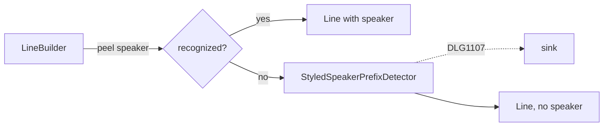

# Styled Speaker Prefix Diagnostic

> [!NOTE]
> Status: **implemented**. `DLG1107` warns when a line looks like a speaker prefix
> but its name is Markdown-styled (`*Alice*: Hello`), so the line would otherwise be
> silently attributed to the default speaker. Styled prefixes stay unrecognized.

## Ubiquitous language

| Term | Meaning |
| --- | --- |
| **Speaker prefix** | The `Name @id #tag:` that starts a line, parsed by `SpeakerPrefixParser`. |
| **Styled speaker prefix** | A would-be prefix whose name is wrapped in emphasis, so the transpiler does not recognize it. |
| **Unattributed line** | A `Line` with no recognized speaker; desugar fills the default speaker. |
| **Would-be prefix** | The line's leading inlines flattened to plain text, up to and including the first `:` outside styling. |

## Writer-facing behavior

| Line | Result |
| --- | --- |
| `*Alice*: Hi`, `**Alice**: Hi`, `_Alice_: Hi`, `~~Ghost~~: …` | `DLG1107` |
| `**Bob** #gruff: What now?` | `DLG1107` — flattens to `Bob #gruff:`, which parses |
| `A*l*ice: Hi` | `DLG1107` — any styling before the colon counts |
| `` `"key"?` *Alice*: Hi `` | `DLG1107` — the condition is read first |
| `*Alice*: Hi` inside a choice option | `DLG1107` — the same line builder |
| `Alice: Hi` | No warning — a recognized speaker |
| `*Alice: hi*` | No warning — the colon is inside the styling |
| `*It was cold.*`, `*the great*: hi` | No warning — the flattened text is not a prefix |

> **DLG1107** — This line looks like a speaker prefix ("Alice:") but the name is
> styled, so it is not recognized and the line has no speaker. Remove the styling to
> declare the speaker.

The line still compiles unchanged.

## Why it happens

`LineBuilder` peels a speaker only when the paragraph's first inline is plain text.
`*Alice*: Hello` parses as `EmphasisInline("Alice")` + `TextInline(": Hello")`, so
the peel stops and `SpeakerPrefixParser` never runs.

## Detection

When the peel finds no speaker, `LineBuilder` calls `StyledSpeakerPrefixDetector`:

1. The leading run up to the first `:` must contain an `EmphasisInline`.
2. Flatten the leading inlines to plain text up to and including the first `:` that
   sits outside any styling.
3. Run `SpeakerPrefixProbe` (over `SpeakerPrefixParser.Prefix`) on it. If it parses,
   styling is the only reason recognition failed: report `DLG1107` over the
   would-be prefix, with the flattened text as the argument.

## Key design decisions

### D1 — Reported in the transpiler, beside the other recognition diagnostics

Recognition diagnostics (`DLG1101`–`DLG1112`) come from transpiler builders;
validation rules work on the desugared tree, where the styling is already gone. The
architecture also forbids validation from depending on the transpiler's speaker
grammar.

### D2 — `Syntax` / `Warning`

The line is valid Markdown that compiles, so not an error; it is a malformed
speaker-prefix surface, so `Syntax` beside `DLG1101` rather than `Style`.

### D3 — Probe through the real grammar

Asking "would this have parsed as a prefix?" of the actual parser keeps the warning
from ever disagreeing with recognition, where a look-alike heuristic would drift.

### D4 — Warn, never rewrite

Promoting a styled prefix to a speaker would drop or move the writer's styling.
The warning keeps Markdown meaning and leaves the choice to the writer.

## Testability

- `StyledSpeakerPrefixDetectorTests` build inlines directly: each styled form warns;
  plain prefixes, fully styled lines, styled non-names, and runs with no colon do not.
- Compiles assert the code and location for a top-level line and a choice option;
  the error-code reference's fixed example stays clean.
