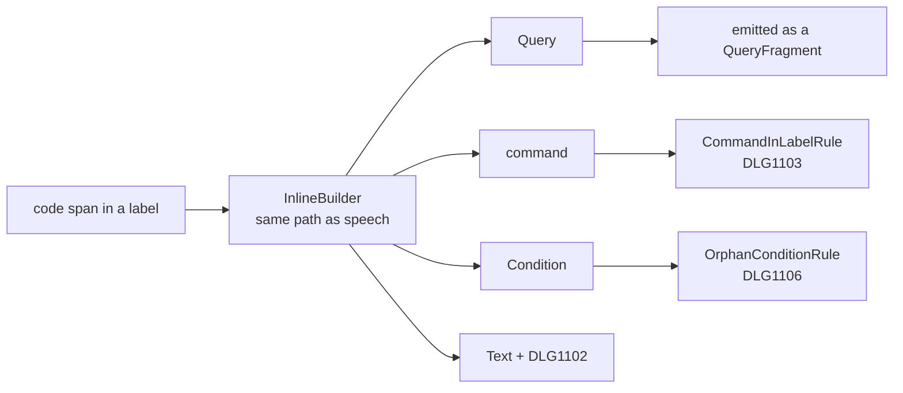

# Game Calls in Labels

> [!NOTE]
> Status: **approved**, not yet implemented. A query may stand in a label and is
> filled like one in speech; a command in a label reports `DLG1103` and a condition
> reports `DLG1106`. Today every game call in a label is silently restored to its
> literal text.

A label is the text of a link, the alt text of an image, or the text a menu shows
for an option. Each is shown as one piece, so nothing inside it gets a moment of
its own in the conversation. This note settles which game calls a label may hold,
and how the compiler says so when a writer puts the wrong one there.

## Table of contents

- [Ubiquitous language](#ubiquitous-language)
- [Goal and scope](#goal-and-scope)
- [Writer-facing behavior](#writer-facing-behavior)
- [Functionality checklist](#functionality-checklist)
- [Key design decisions](#key-design-decisions)
- [Interfaces and abstractions](#interfaces-and-abstractions)
- [Error and boundary cases](#error-and-boundary-cases)
- [Integration](#integration)
- [Testing and demonstration](#testing-and-demonstration)

## Ubiquitous language

| Term | Meaning |
| --- | --- |
| **Label** | The inline text inside a link's brackets or an image's alt text. A link after `=>` becomes a jump; when the jump is a menu option, its label is what the menu shows. |
| **Game call** | A code span that talks to the game: a **query** (`` `"key"` ``) reads a value into the words, a **command** (`` `Wave()` ``, `` `(("wave"))` ``) asks the host to do something. |
| **Condition** | A code span ending in `?` (`` `"key"?` ``) that guards what follows it. Not a game call, but written in the same backticks. |
| **Moment** | A point in a run where the host performs a command: at a node, or between the words of a line. A link, an image, and a menu option are each shown whole, so a label has no moment inside it. |

## Goal and scope

A writer can put a value into a label the way they put one into speech, and a
game call that cannot work in a label is reported instead of vanishing into
literal text. This covers every label: an inline link, an image's alt text, and a
jump, whether it is a menu option or a divert.

In scope:

- Admit a query in a label, so it reaches the playbook as a `QueryFragment`.
- Report a command in a label with `DLG1103`.
- Report a condition in a label with the existing `DLG1106`.
- Report a code span in a label that is not a game call with `DLG1102`, as speech
  already does.

Out of scope, and each designed separately:

- **A game call in a scene heading.** A heading is never shown to a player, so it
  needs its own rule rather than this one.
- **A linked image** (`[](#x)`). The image inside a link is still
  restored to its Markdown text, along with any query in its alt text.
- **Playing a choice.** The runner does not play a choice yet. A query in an
  option's label reaches the playbook and waits for choice playback to fill it.

## Writer-facing behavior

| Script | Today | With this design |
| --- | --- | --- |
| ``Alice: See [the `"PlaceName"` inn](#inn).`` | label text ``the `"PlaceName"` inn`` | label `the {PlaceName} inn`, filled at run time |
| ``Alice: `` | literal backticks in the alt text | a query in the alt text |
| ``- => [Ask `"CompanionName"` to join](#join)`` | the menu shows the backticks | the option's label carries the query |
| ``- => [Leave `SlamDoor()`](#exit)`` | literal, silent | `DLG1103` |
| ``Alice: [Talk to `Wave()`](#inn)`` | literal, silent | `DLG1103` |
| ``Alice: [Only if `"Met"?`](#inn)`` | literal, silent | `DLG1106` |
| ``Alice: [see `config.toml`](#inn)`` | literal, silent | `DLG1102`, as the same code span in speech already reports |

Every row compiles cleanly today and reports nothing.

A command in a menu option is the case a writer is most likely to reach for, so
the message names the remedy that works there. Written before the jump, the
command runs when the option is chosen:

```markdown
- `SlamDoor()` => [Leave](#exit)
```

```text
scene.dialogue.md(9,13): error DLG1103: `SlamDoor()` is a command, and nothing
inside a label or alt text runs. Move it outside the brackets; before `=>`, it
runs when the jump is taken.
```

The message shows the command with its arguments, so a writer can find it in a
label that holds several. The rule sees the built node rather than the source, so
it writes the command back out in canonical form: `GiveQuest("EmberCrown")` for a
named command, `(("wave"))` for a default one.

## Functionality checklist

- [ ] A query in a link label, an image's alt text, or emphasis inside either
      builds as a `Query`.
- [ ] A query in a jump's label reaches the option's or the divert's label in the
      playbook.
- [ ] A command in any label reports `DLG1103` at the code span.
- [ ] A condition in any label reports `DLG1106` at the code span.
- [ ] A code span in a label that is not a game call reports `DLG1102` once.
- [ ] A command, query, or condition in speech outside a label reports nothing new.
- [ ] A soft break, nested link, or image in a label keeps today's literal text.
- [ ] The two properties in [Property tests](#property-tests) hold, and their
      coverage guard passes.
- [ ] The gallery example and the conformance corpus pin a query in a label.
- [ ] `DLG1103` has a compiled example in the error-code reference.
- [ ] The writer's guide says where a query may stand, and the diagnostics example
      shows `DLG1103`.

## Key design decisions

### D1 — A query may stand in a label; a command may not

A query is a read that yields words, and a label is words, so the two fit. A
place name in a link, a companion's name in a portrait's alt text for a screen
reader, and a character's name in a menu option are ordinary needs.

A command is a write that happens at a moment, and a label has no moment inside
it. Drawing a menu must not change the world, and the format already says so
twice:

- `SegmentBuilder` treats a link or an image as one word, so a command inside one
  never becomes the command a segment performs.
- `OptionEdge.Label` is compiled into the edge so that presenting a menu keeps it
  free of side effects.

A command in a label is therefore one the runner will never perform. Rejecting it
is the compiler agreeing with the format, not a new restriction.

### D2 — The transpiler builds the call; a structural rule rejects the command

A label's policy decides which Markdown elements a label builds. A code span is a
query or a command only once its content is parsed, and it parses the same way
wherever it stands. So the label policy admits the code span and builds it exactly
as speech does, and a rule on the desugared tree decides where a command may
stand:



| Option | For | Against |
| --- | --- | --- |
| **A structural rule** (chosen) | Follows `OrphanConditionRule`, which already rejects a condition standing where it cannot act. The policy keeps deciding only about Markdown. One rule covers link, image, and jump labels, since it runs after desugar. Every composition that builds a transpiler, `ScriptCompilerFactory` and the DI registration, also runs the validator. | The rule reports without recovering, so the command stays in the tree. No playbook ever carries it, because a compile with an error writes none in either mode. A failed compile's tree keeps it, as it keeps an orphan condition in speech today. |
| A second gate on `IInlinePolicy` | The policy remains the one place that says what a label holds, and the command is dropped at the earliest stage. | Adds a member for a decision that is not about parsing, and splits a code span's handling between the builder and the policy. `SupportsJumps` is not a precedent: it decides whether `=>` is tokenized at all. |

The evidence survives desugar, which is what lets a rule see it. The
[dangling arrow](../diagnostics/Dangling%20Arrow%20Diagnostic.md) is the opposite
case: desugar turns a stray `=>` into ordinary text, so that one is reported where
it is dropped.

### D3 — `DLG1103` is reused and narrowed to a command in a label

`DLG1103` already exists for "a functional element inside a label", but only
`RejectingInlinePolicy` raises it, and no default compile uses that policy. The
error-code reference lists it among the codes with no example yet. No writer has
ever seen it, so narrowing its meaning breaks nothing, and a new code would leave
a dead one behind.

Its title becomes "Command in a label". Its message shows the command with its
arguments, says why it cannot run, and gives the remedy from
[Writer-facing behavior](#writer-facing-behavior). It stays an error: the writer
asked for something to happen, and it never would.

### D4 — A condition in a label reports `DLG1106`

`OrphanConditionRule` walks every node, labels included, and a condition in a
label is bound to nothing. Its message already tells the writer both ways out: put
the condition before the `=>` to guard the jump, or drop the `?` to write a query.
Both are the right advice inside a label, so the condition needs no code of its
own.

### D5 — Everything else in a label keeps its literal fallback

Only the code span changes. A soft break in a label is still read as a space, since
a label wrapped across two source lines is ordinary Markdown. A nested link or
image is still restored to its text. Admitting a linked image is separate work.

### D6 — A code span in a label means what it means in speech

Once a label builds code spans, one that is not a game call reports `DLG1102`,
exactly as in speech. A label, like speech, can no longer use backticks for
code-styled text. No shipped script writes a code span inside a label.

### D7 — A divert label may hold a query that no runner fills

A jump that is not a menu option is a divert, and its label is carried in
`DivertEdge.Label` for a host that may show it, use it as a hint, or ignore it. No
runner shows it: the protocol's events carry no edge label, and a divert is taken
silently. A query there is admitted all the same, and nothing fills it.

The same written jump is often both kinds of label at once. A menu option written
as a jump becomes the option's label and also a divert on the option's own node:

| Written | Compiles to |
| --- | --- |
| ``Alice: The inn is this way. => [Follow Alice to `"InnName"`](#inn)`` | A line saying `The inn is this way.`, and a divert labeled `Follow Alice to {InnName}`. |
| ``- => [Head to `"InnName"`](#inn)`` | An option labeled `Head to {InnName}`, and a divert with the same label on the option's node. |

Reporting a query in a divert label would therefore either block the menu option
this note exists for, or need a rule that knows which diverts also label an option.
That would make the language depend on structure a writer cannot see in the text.
One rule holds instead: a query may stand in any label, and it is filled wherever a
runner shows the words.

The cost is a query in the playbook that no runner fills. No player sees the
difference, because no runner shows a divert label. A host that reads divert labels
straight from the playbook is also the world the query asks; it can fill one with
`SpeechTemplate.Fill` and its own answers. The design that first shows a label adds
it to the format's list of derivable keys (see [Integration](#integration)).

## Interfaces and abstractions

| Type | Change | Responsibility |
| --- | --- | --- |
| `LabelInlinePolicy` | Renamed from `LiteralInlinePolicy`, which stops being literal once it builds code spans; supports `CodeSpanInline` | Says which Markdown elements a label builds, and restores the rest to text. Named for its context, like `TitleInlinePolicy`. |
| `InlineBuilder` | None | Builds a code span into a `Condition`, a `GameCall`, or recovered `Text`, in speech and labels alike. |
| `CommandInLabelRule` | New | Reports `DLG1103` for a command with a link, image, or jump among its ancestors. |
| `StructuralValidatorFactory` | Registers the new rule | Composes the default rule set. |
| `DiagnosticCatalog.CommandInLabel` | Renamed from `DisallowedLabelElement`; title and message reworded | `DLG1103`, now a command in a label. |
| `RejectingInlinePolicy` | Removed | Its only use, raising `DLG1103` for any functional element, contradicts D1 and D3. |

The rule, in outline:

```csharp
internal sealed class CommandInLabelRule : DiagnosticRule
{
    protected override DiagnosticDescriptor Descriptor { get; } =
        DiagnosticCatalog.CommandInLabel;

    protected override void Analyze(DialogueTreeIndex nodes, Reporter report)
    {
        var commands = nodes.OfType<GameCall>()
            .Where(call => call is DefaultCommand or CustomCommand);

        foreach (var command in commands.Where(command => nodes.AncestorsOf(command).Any(IsLabel)))
        {
            report(command.Span, Canonical(command));   // GiveQuest("EmberCrown"), (("wave"))
        }
    }

    // A link, an image, and a jump each show their label whole, so nothing inside it runs.
    private static bool IsLabel(ScriptNode node) => node is Link or Image or Jump;
}
```

`DialogueTreeIndex` files each node under every type in its inheritance chain, so
`OfType<GameCall>()` finds both command kinds. A label never contains a line, so
any label among a command's ancestors means the command is inside one.

## Error and boundary cases

| Case | Behavior |
| --- | --- |
| A query in a link label, alt text, or jump label | Built as a `Query`; no diagnostic. |
| A query inside emphasis inside a label | Built as a `Query`; emphasis recurses under the same policy. |
| A label holding only a query, as a menu option | Not empty, so `ChoiceLabelValidator` accepts it. |
| A query in a divert label (``=> [Visit `"PlaceName"`](#inn)``) | Built as a `Query` and carried to `DivertEdge.Label`, unfilled; see [D7](#d7--a-divert-label-may-hold-a-query-that-no-runner-fills). |
| A command in a link label, alt text, or jump label | `DLG1103` at the code span. |
| A command inside emphasis inside a label | `DLG1103`; the rule looks through every ancestor. |
| A speakerless line holding only a jump whose label has a command | Still a control line, because `ControlLineRecognitionRule` reads only top-level fragments; the rule still reports `DLG1103`. |
| A command beside a link, outside the brackets | Unchanged; it is speech. |
| A command before a jump (`` `SlamDoor()` => [Leave](#exit) ``) | Unchanged; the jump's line performs it, as the remedy relies on. |
| A condition in a label | `DLG1106` at the code span. |
| A condition before a jump | Unchanged; it guards the jump. |
| A code span that is not a game call | `DLG1102` once, from `GameCallBuilder`; recovered as literal text. |
| Two commands in one label | Two `DLG1103`. |
| A soft break in a label | A space, as today. |
| A linked image, and a query in its alt text | Restored to text as a whole, as today. |
| A link inside a scene heading | Its label follows this note. A query there no longer counts toward the scene's anchor, where today its literal text does; a game call written directly in a heading already drops out the same way. |
| An escaped backtick in a label | Text; no code span is built. |

## Integration

Nothing past the transpiler needs a change to carry a query in a label:

- **Emission.** `SpeechMapping` maps a link's label and an image's alt text
  recursively, and `EdgeMapping` maps an option's label the same way, so a `Query`
  becomes a `QueryFragment` wherever it stands.
- **Runtime.** `SpeechTemplate.Keys` and `Fill` walk into a link's label and an
  image's alt text, and the runner asks for the words a line's speech needs. A
  query in an inline link's label is therefore asked about and filled today.
  Carrying is not filling for the other labels: the format's rule on derivable
  keys ([P4](../runtime/Playbook%20Format.md#p4--what-a-runner-can-derive-is-not-stored))
  lists a node's condition, speech, effects, and out-edge conditions and weights,
  but not an out-edge's label. Whichever design first shows a label adds it to
  that list: choice playback for an option's label, and any later event that
  surfaces a divert for a divert label. Until then, neither is asked about.
- **Report and editor.** `InlineText` and `SpeechText` read a query in a label as
  `{key}`, and the editor's semantic tokens walk label fragments, so a query there
  is highlighted like one in speech.

The documentation that changes with the implementation:

- `DLG1103` in the error-code reference: new title, prose, and a compiled example.
  It leaves the list of codes without an example.
- The writer's guide to game state: a query may stand in any label and is filled
  wherever the runner shows the words (a line's links and images today; a menu
  option once choices play; a divert label never), and a command may not stand
  in a label.
- The writer's guide to speakers and lines, which says an image's alt text is kept
  exactly as written; a query in it now becomes a query.
- The transpiler note's policy table (the label policy's row, and the rejecting
  policy's row removed) and its error table, whose row for a game call inside a
  label changes.
- The diagnostics note's validator table (the new rule) and recovery table (the
  rejecting policy's `DLG1103` row removed).

Removing `RejectingInlinePolicy` also removes `RejectingInlinePolicyTests` and
the `InlineBuilder` test that composes it. `LabelInlinePolicy` keeps its
reconstruction of a code span: a linked image is still restored to text, alt text
included, and that alt text can hold one.

## Testing and demonstration

Every behavior in this note is pinned by a test, and each one a writer meets is
also shown to them in something they read. The tests say what must hold; the
demonstrations show what to write.

### Example tests

One input, one expected output, at the smallest unit that owns the behavior.

| Unit | What it pins |
| --- | --- |
| `InlineBuilder` | A code span in a link label and in alt text builds a `Query`, a command, or a `Condition`. A malformed one reports `DLG1102` once. |
| `LabelInlinePolicy` | It supports a code span, and still restores a link, an image, and a soft break to text. |
| `CommandInLabelRule` | It reports a command in a link, image, or jump label, including inside emphasis. It stays silent for a command in speech, beside a link, or before a jump, and for any query. |
| Compilation | A menu option's label and a divert's label each carry a `QueryFragment`. A command or a condition in a label fails the compile with its code at the code span. |

The [error and boundary cases](#error-and-boundary-cases) table is the list these
tests work through, one row at a time.

### Property tests

Example tests pin the cases someone thought of. These pin laws over generated
labels, using CsCheck like `CompilerPropertyTests`. They need a generator of their
own rather than `ScriptGen`: `ScriptGen.Script()` yields bare script text, and a
game call in a label would be one draw among many alternatives, so a run of a few
hundred samples could hold almost none.

The label generator yields a label's text together with a model of what it placed:
its words, emphasis, and each game call in order. Every label holds at least one
game call, and each of the three kinds is drawn often. A fixed scene places the
label in a link, an image's alt text, a menu option's jump, or a divert.

| Property | The law |
| --- | --- |
| **Brackets change how words are shown, not what they ask** | Speech built from words, emphasis, and queries, compiled bare and again wrapped in a link's brackets, asks for the same keys in the same order (`SpeechTemplate.Keys`) and reads as the same text (`SpeechText.Of`). This is the claim that a query in a label is filled like one in speech, stated as a metamorphic relation. |
| **A label's calls decide its outcome** | When the model holds a command or a condition, the compile fails with exactly one `DLG1103` per command and one `DLG1106` per condition, each spanning its code span, and no other error. When it holds only queries, the compile succeeds, and the emitted label asks for the model's keys in order and holds no command at any depth. The expectation comes from the model, never from the compiler's own reading. |

A guard beside them, in the manner of `ScriptGenOutwardShapeCoverageTests`, runs
the label generator on a pinned seed and asserts that every placement and every
kind of game call appears. A generator change that stopped producing one fails
there, instead of leaving a property that passes on nothing.

### Golden tests

Goldens pin whole outputs a person reviews as a diff.

- **Playbook goldens.** `gallery.dialogue.md`, the construct showcase, gains a menu
  option and an inline link whose labels hold a query. Its committed playbook then
  pins the `QueryFragment` inside a `LinkFragment` and an `OptionEdge` label.
- **Conformance corpus.** A hand-authored playable case: a query in an inline link's
  label is resolved, and the supplied answer is spoken as part of the line. Every
  runtime, in any language, must hold the same conversation.

`ExampleConstructCoverageTests` counts construct types, and a query is not a new
one, so it will not ask for the example. The gallery change is made deliberately.

### Shown to writers

| Where | What the writer sees |
| --- | --- |
| The writer's guide to game state | A query in a link label and in a menu option, compiled as written like every guide example. |
| The error-code reference, `DLG1103` | The broken menu option, its fix (the command before `=>`), and an alternative fix for an inline link (the command beside the link). The docs tests compile all three: the broken form reports `DLG1103`, and neither fix does. |
| `gallery.dialogue.md` | The query in a menu option and a link, rendered in the report like any other example. |
| `diagnostics.dialogue.md` | A command in a label, so the report's diagnostics overlay shows `DLG1103` beside the other codes a writer can meet. |
