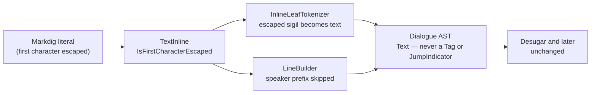

# Symbol escape

> [!NOTE]
> Status: **implemented**. The language's literal-punctuation rule: a backslash
> escapes the next punctuation character, so a DialogueDown sigil (`#tag`, `=>`)
> can be written as ordinary prose.

## Table of contents

- [Goal and scope](#goal-and-scope)
- [Functionality checklist](#functionality-checklist)
- [Ubiquitous language](#ubiquitous-language)
- [Writer-facing behavior](#writer-facing-behavior)
- [Grammar](#grammar)
- [Prior art](#prior-art)
- [Architecture](#architecture)
- [Key design decisions](#key-design-decisions)
  - [D1 — Markdown's backslash is the one escape character](#d1--markdowns-backslash-is-the-one-escape-character)
  - [D2 — An escape literals the sigil that begins at it](#d2--an-escape-literals-the-sigil-that-begins-at-it)
  - [D3 — Keep escape provenance from the front end](#d3--keep-escape-provenance-from-the-front-end)
  - [D4 — Resolve at tokenization; no new AST node](#d4--resolve-at-tokenization-no-new-ast-node)
  - [D5 — Canonical spelling escapes the sigil's leading character](#d5--canonical-spelling-escapes-the-sigils-leading-character)
- [Markdown interaction](#markdown-interaction)
- [Diagnostics](#diagnostics)
- [Error and boundary cases](#error-and-boundary-cases)
- [Integration](#integration)
- [Testability](#testability)
- [Alternatives not chosen](#alternatives-not-chosen)
- [Open questions and deferred work](#open-questions-and-deferred-work)

## Goal and scope

DialogueDown recognizes its sigils in text Markdown has **already unescaped**, so
a writer cannot express a literal `#word` (it becomes a tag) or a literal `=>`
(it becomes a jump indicator and, with no link, warns as a dangling arrow).

This note gives the language one **symbol escape**: a backslash before an ASCII
punctuation character writes what it begins literally.

**In scope:** literal `#` / `##` tags and `=>` jumps in prose, through one rule
that covers present and future sigils.

**Out of scope:** changing how an **unescaped** dangling arrow behaves (`DLG1113`
still warns); a diagnostic-suppression knob; a region escape
(`[nomarkup]`-style); and code spans, which stay game calls rather than a way to
write literal prose.

## Functionality checklist

- [x] `\#word` compiles to the text `#word`, not a tag.
- [x] `\##default` (or `\#\#default`) compiles to the text `##default`, not a
      reserved tag.
- [x] `\=>` compiles to the text `=>`, with no jump and no dangling-arrow warning.
- [x] A character that begins a sigil is literal whole (`\##default`); one that
      begins no sigil is literal alone (`\=#tag` keeps `#tag` a tag).
- [x] An escaped prefix element breaks the speaker prefix, so `Alice\: Hello`,
      `\@alice: Hi`, and `Alice \@alice: Hi` are default-speaker speech.
- [x] A condition before an escaped arrow still guards the line.
- [x] Markdown's escapes are untouched: `\*` stays literal styling punctuation,
      `\\` is a backslash, a trailing `\` is still a hard break, and `\` before a
      non-punctuation character stays a literal backslash.
- [x] An escape inside a code span keeps CommonMark semantics (no escape; the
      span is still a game call or `DLG1102`).
- [x] No new diagnostic code, and the `DLG1113` message offers `\=>` as the
      deliberate spelling.
- [x] The writer guide states the rule once, and the gallery demonstrates it.
- [x] Escaped sigils reach the report and the editor as plain text.

## Ubiquitous language

| Term | Meaning |
| --- | --- |
| **Sigil** | A punctuation sequence the language reads as syntax: `#` / `##` (tag), `=>` (jump). |
| **Symbol escape** | A backslash before an ASCII punctuation character, writing what it begins literally. |
| **Escaped character** | The character after the backslash; a sigil beginning there is text too. |
| **Escape provenance** | The front end's record that a run's first character was escaped (`TextInline.IsFirstCharacterEscaped`). |

## Writer-facing behavior

```markdown
Alice: The tag is \#main, and the rule is x \=> y.
```

Reads as *The tag is #main, and the rule is x => y.* — no tag, no jump.

| To write | Escape it as | Otherwise it becomes |
| --- | --- | --- |
| `#word` | `\#word` | a tag |
| `##default` | `\##default` | a reserved tag |
| `=>` | `\=>` | a jump |
| `\` | `\\` | the start of an escape |
| `*` `_` `~` | `\*` `\_` `\~` | Markdown styling |

The escape follows Markdown's lexical rules: only ASCII punctuation is
escapable, before anything else the backslash stays literal, a trailing
backslash is a hard break rather than an escape, and inside code spans a
backslash is an ordinary character of a game call.

Escape the leading character of the sigil (D5). An unescaped `=>` with no link
still warns — escape it when the characters are deliberate.

The same rule reaches the speaker prefix, whose elements are sigils too: a name,
an `@id`, `#tags`, and the closing `:`. Escaping one of them breaks the prefix
and the line plays in the default voice — `Alice\: Hello` reads "Alice: Hello",
`\@alice: Hi` reads "@alice: Hi", and `Alice \@alice: Hi` reads
"Alice @alice: Hi". An escape **demotes** syntax to text and never promotes text
to syntax: a name that is not a plain word is quoted (`"@alice": Hi`), and
`\Alice` is not an escape at all. To keep an escape inside speech, put the
speaker's colon first (`Alice: \@alice: Hi`).

## Grammar

```ebnf
EscapedCharacter = "\" , AsciiPunctuation ;
```

CommonMark's lexical rule, adopted unchanged; the language adds only its meaning
for DialogueDown's sigils (D2).

## Prior art

| Language | Escape | Lesson |
| --- | --- | --- |
| **CommonMark** | `\` before any ASCII punctuation (plus entities and code spans) | The escape is a one-character prefix, not a new grammar — the baseline this note adopts. |
| **MDX** | `\{` and `\<` extend Markdown's backslash to its own sigils | A Markdown-embedded language that gains sigils *extends the host's escape*, exactly as here. |
| **Yarn Spinner** | `\[` / `\]`, `\\`, and a `[nomarkup]…[/nomarkup]` region | Single-character escapes for the sigils; the region form answers how often brackets appear in prose, not how escapes work. |
| **Ren'Py** | Doubling the opening sigil: `[[`, `{{`, `【【` | Doubling works only while the doubled form is unclaimed; `##` is already the reserved-tag prefix. |
| **Twine Harlowe** | Verbatim: wrap symbols in backticks | Quoting-as-escape is valid, but code spans are already game calls here. |
| **Ink** | Almost none; a backslash before a space only, to force text where `{` would open markup | Contextual parsing covers Ink; it cannot cover a `#word` that is genuinely ambiguous. |

## Architecture

Markdig resolves the escape before DialogueDown sees the text, but its AST keeps
one exact fact: whether a literal's first character was escaped. That flag is the
whole mechanism.



| Type | Responsibility | Change |
| --- | --- | --- |
| `TextInline` | Markdown text plus its content span | Carries `IsFirstCharacterEscaped`, copied from Markdig. |
| `MarkdigToMarkdownAstConverter` | Markdig tree → Markdown AST | Copies `LiteralInline.IsFirstCharacterEscaped`; no span heuristic. |
| `InlineLeafTokenizer` | Text → `TextLeaf` / `TagLeaf` / `JumpLeaf` | An escaped leading character takes the sigil that begins there — or itself — as text. |
| `LineBuilder` | Peels a line's speaker prefix | Skips the prefix parse when the matched text starts escaped; `PrecedesAJump` asks the tokenizer's `StartsWithJumpIndicator`, which owns the arrow's spelling and escape rule. |
| Desugar, semantic analysis, graph, playbook | — | **Unchanged.** |

Two Markdig details make the flag exact:

- **Every escape opens a new literal.** `EscapeInlineParser` always creates a new
  `LiteralInline`, and the plain-text parser only extends it *forward*, so only
  the first character of a literal can ever be escaped. One boolean per
  `TextInline` suffices — no position list.
- **The flag is the signal; the span delta is a symptom.** The converter already
  computes `ContentSpan` from `Span.Length − Content.Length` (the stripped
  backslash). Flag and delta agree today, but the flag is explicit provenance
  while the delta is a length coincidence, so the design reads the flag.

The tokenizer's entry point takes the flag. On an escaped leading character it
tries the sigil parser at that position: a match becomes one literal `TextLeaf`
spanning the whole match, and a miss emits the single character; the remainder
tokenizes normally. The flag defaults to `false`; only the converter sets it,
and the other `TextInline` construction sites (the unmodeled handler's `Keep`,
`MarkdownInlineExtensions.TrimLeadingWhitespace`, `LineBuilder.RemoveSpeakerPrefix`)
stay exact with the default.

## Key design decisions

### D1 — Markdown's backslash is the one escape character

Markdown's own punctuation (`\*`, `\_`, `\~`) and DialogueDown's sigils (`\#`,
`\=>`) share one escape character and one mental model: writers already know it,
and a Markdown preview shows exactly the text the script will speak. The
alternatives below each break that coherence.

### D2 — An escape literals the sigil that begins at it

A sigil is recognized only where its characters are unescaped, and escaping the
leading character writes the whole sigil that begins there as text — or the lone
character, when no sigil begins there. So `\##default` writes `##default` (the
reserved sigil is taken whole) rather than `#` plus a custom tag. Escaping a
non-leading character still prevents the sigil, without literalizing the rest.

The speaker prefix follows from the same sentence, because its elements are
sigils. Escaping one breaks the prefix, and a half-literal prefix is never
half-recognized: the whole line stays speech rather than consuming the escaped
element as syntax. Escapes demote; they never promote text into a name.

### D3 — Keep escape provenance from the front end

The front end records *that* a character was escaped; it does not know what a
sigil is, so the flag is DSL-agnostic. Re-deriving escape state downstream is
rejected: scanning for backslashes would re-parse raw source after Markdown has
reinterpreted it, and reconstructing from span deltas would turn an explicit
fact into a coincidence. Markdig's flag rides on the literal it belongs to.

### D4 — Resolve at tokenization; no new AST node

An escape could be carried to desugar and turned back into text there. Resolving
it at tokenization is simpler and stricter: the tokenizer emits ordinary `Text`
and no `Tag` or `JumpIndicator`, so desugar, semantic analysis, the graph, and
the playbook need no change, and the desugared tree's no-`JumpIndicator`
invariant holds by construction.

### D5 — Canonical spelling escapes the sigil's leading character

The taught spellings are `\#word`, `\##default`, and `\=>` — the leading
character, per D2. `\#\#default` works too for writers who prefer Markdown
symmetry. Escaping a non-leading character is valid but untaught: `=\>` yields
the literal arrow without becoming the documented form.

## Markdown interaction

- **Previews agree with the compiler.** `\#word` renders as `#word` in any
  CommonMark preview, and `\=>` as `=>` — the exact text the script speaks.
- **One escape disarms both layers.** `\# Heading` at line start is neither a
  heading nor a tag; the escape protects the character itself.
- **Escapes do not reach code spans.** Per CommonMark, a backslash inside
  backticks is ordinary text, so game calls are unaffected.
- **The hard break is unchanged.** A trailing backslash still starts a new
  speech; `\\` writes a literal backslash at the end of a line.
- **The editor needs no new token.** An escaped sigil is `Text` in the Dialogue
  AST, and highlighting and completion project from that AST rather than from a
  source scan. The visualization phase verifies this.

## Diagnostics

No new diagnostic code, and no suppression knob. An escaped arrow emits no jump
indicator, so `DLG1113` cannot fire; the message of the unescaped case gains the
deliberate spelling as a remedy — "if you meant the characters, write `\=>`" —
in the `DiagnosticCatalog` descriptor and the `DiagnosticDocs.cs` worked
example. The error-code reference is then regenerated.

## Error and boundary cases

| Input | Result |
| --- | --- |
| `\#word` | Text `#word`; no `Tag`. |
| `\##default` (or `\#\#default`) | Text `##default`; no reserved `Tag`. |
| `\##tag` | Text `##tag` — the escaped `#` takes the whole reserved-style sigil. |
| `\# #tag` | Text `#` followed by a real tag `tag` — the space keeps a sigil from beginning at the escaped `#`. |
| `\=>` | Text `=>`; no jump, no `DLG1113`. |
| `=\>` | Text `=>`; valid but untaught (D5). |
| `\=`, `\\` | Text `=`, text `\`. |
| `\A` | Text `\A` — not an escape (CommonMark escapes ASCII punctuation only). |
| `\` at end of line | Hard break, unchanged. |
| `\# Heading` at line start | Text `# Heading`; neither a heading nor a tag. |
| `\=#tag` | Text `=` followed by a real tag `tag`. |
| `Alice: \#notatag` | Speech text `#notatag`, no tag, no tag diagnostics. |
| `Alice\: Hello` | Default speaker; speech `Alice: Hello` — the escaped colon declines the prefix. |
| `\Alice: Hello` | Default speaker; speech `\Alice: Hello` — `\A` is not an escape, so the backslash stays. |
| `\@alice: Hi` | No speaker prefix; the line speaks `@alice: Hi`. |
| `Alice \@alice: Hi` | Default speaker; speech `Alice @alice: Hi` — the escaped id breaks the prefix. |
| `Alice: \@alice: Hi` | Speaker Alice; speech `@alice: Hi` — the prefix colon comes before the escape. |
| `"@alice": Hi` | Speaker named `@alice` — quoting, not escaping, names unusual speakers. |
| `` `Ready?` \=> `` and `` `Ready?`\=> `` | The condition still guards the line; `PrecedesAJump` asks `StartsWithJumpIndicator`, with or without a space. |
| `` `\#word` `` (code span) | Still a game call or `DLG1102`; backslashes are literal inside code spans. |
| `*\#word*` | Styled literal `#word` inside emphasis. |
| `[\#tag](#x)` in a link label | Label text `#tag`; no tag, matching speech. |
| `#word`, `=>` unescaped | Unchanged: a tag, and a jump or a dangling-arrow warning. |

## Integration

- **Front end:** `TextInline` carries the flag and the converter copies it; no
  other front-end behavior changes.
- **Transpiler:** the tokenizer and the line builder honor the flag, per the
  architecture table.
- **Downstream:** desugar and later are unaffected (D4).
- **Writer guide:** one *Literal punctuation* section, an *Escaping a speaker
  prefix* subsection in Speakers and lines, a syntax-summary row, and pointers
  from the styling and jump sections; the complete example and the gallery each
  gain a natural literal. The [Markdown front-end](../core/Markdown%20Front-End.md)
  note, the [transpiler](../core/Markdown%20to%20Dialogue%20AST%20Transpiler.md)
  note, and the [dangling-arrow diagnostic](../diagnostics/Dangling%20Arrow%20Diagnostic.md)
  note are reconciled when the code lands.
- **Release:** the error-code reference is regenerated, one `Unreleased`
  changelog entry is added, and the gallery and example literals land with the
  code that makes them compile.

## Testability

- **Front end:** the flag is true for `\#` and `\*`, false for plain text, and
  `Text` and `ContentSpan` are unchanged; it stays false at every non-converter
  construction site.
- **Tokenizer:** an escaped leading character literalizes the sigil it begins
  (`\##default` → `##default`) and never yields a `TagLeaf` or `JumpLeaf`; a
  character that begins no sigil is literal alone (`\=#tag` keeps `#tag` a tag);
  `\=>x` and `=\>` yield text; adjacent text leaves still coalesce within a run.
- **Line builder:** leading escaped text never parses as a speaker prefix, and a
  condition before an escaped arrow peels as the line's condition.
- **Integration:** compiling `\#notatag`, `\##default`, `\=>`, and `=\>` yields
  the expected `Text` fragments and no `DLG1113`; the escaped cases join the
  transpiler tests' boundary set.
- **Coverage:** the changed front-end, tokenizer, and line-builder paths stay at
  100% line and branch coverage.

## Alternatives not chosen

| Alternative | Why not |
| --- | --- |
| A DialogueDown-specific escape marker | A second convention for the same job; Markdown already owns the backslash. |
| Code span as the literal escape (Harlowe-style verbatim) | Code spans are game calls; making a bad call silently literal would silence `DLG1102` and render prose as code. |
| Doubling the sigil (Ren'Py-style) | `##` is already the reserved-tag prefix; `==>` is ambiguous. |
| HTML entities (`&#35;`, `&#61;`) | Not writer-facing, and the front end keeps entities as source text rather than decoding them. |
| Carrying the escape to desugar | More model state for no benefit once the tokenizer writes the sigil as text. |
| Demoting `DLG1113` by configuration | Silences the evidence instead of expressing intent; the requirement is a writer spelling, not a quieter report. |

## Implementation crosscheck

Built as designed, with these notes:

- **Achieved.** Escape provenance rides from Markdig onto `TextInline`; the
  tokenizer takes an escaped leading character — and the sigil it begins — as
  text; the line builder skips an escaped speaker prefix and asks
  `StartsWithJumpIndicator` for jump precedence; the guide, complete example, and
  gallery demonstrate the rule; `DLG1113` and the error-code reference offer the
  escape as the deliberate spelling; the editor projection carries no tag or jump
  token for an escaped sigil.
- **Changed.** The review rounds added the speaker-prefix rule (an escaped prefix
  element makes the line default-speaker speech) and moved the arrow's spelling
  and its escape rule behind `StartsWithJumpIndicator`; both are recorded above.
- **Not implemented.** Two follow-ups stay deferred: the escaped-prefix warning
  and the editor affordance (literalizing and suggestions). Both are tracked.

## Open questions and deferred work

- **Editor affordance** — highlighting, a literalize transform (context menu and
  shortcut), and suggestions for escaped sigils are deferred to the editor
  surface.
- **Escaped-prefix warning** — a diagnostic for the ambiguous shapes: the leading
  text would parse as a speaker prefix if the escape were absent, and the escaped
  run starts a prefix element (`@`, `#`, or a quoted name) rather than the colon.
  It points at the better spelling (`"@alice": Hi`, or `Alice: \@alice: Hi`).
  `Alice\: Hello`, `\Alice: Hello`, `Alice: \@alice: Hi`, and `"@alice": Hi` are
  deliberate and stay quiet. Tracked as a separate follow-up.
