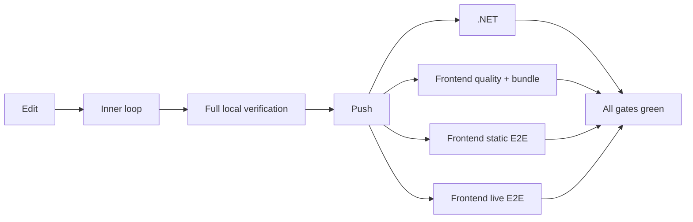

# Development Cycle Optimization

> [!NOTE]
> Status: **implemented**. The local and CI verification cycle is shaped by measured,
> behavior-preserving changes; each was kept only where it shortened feedback without weakening a
> gate. The commands a contributor types live in
> [CONTRIBUTING.md](https://github.com/pengzhengyi/dialoguedown/blob/main/CONTRIBUTING.md); this
> note records why they are shaped that way.

## Table of contents

- [Goal and scope](#goal-and-scope)
- [Ubiquitous language](#ubiquitous-language)
- [Safety invariants](#safety-invariants)
- [Verification flow](#verification-flow)
- [Results](#results)
- [Key design decisions](#key-design-decisions)
- [Approval-gated follow-ups](#approval-gated-follow-ups)
- [Measurement protocol](#measurement-protocol)

## Goal and scope

Shorten the time between an edit and trustworthy feedback while keeping every test, analyzer,
coverage threshold, bundle check, and end-to-end check. Process startup, repeated work, caches, and
CI job structure are optimized before any test or behavior changes.

Out of scope without separate approval: deleting tests or assertions, changing application
behavior, skipping checks by changed path, and changing branch protection, coverage thresholds, or
analyzer policy.

The served report's own load time is a product concern, recorded in
[Served Client Packaging](../visualization/session/Served%20Client%20Packaging.md).

## Ubiquitous language

| Term | Meaning |
| --- | --- |
| **Inner loop** | The smallest command run repeatedly while editing one behavior. |
| **Full verification** | Every required build, analyzer, unit, browser, live, bundle, and coverage check. |
| **Cold / warm run** | Without / with reusable build outputs and tool caches. |
| **CI wall time** | Elapsed job time, not the sum of parallel runner minutes. |
| **Increment** | One independently measured, reversible change. |
| **Behavioral equivalence** | The same test inventory, assertions, coverage policy, and shipped artifacts pass before and after. |

## Safety invariants

1. **No gate disappears silently.** Tests, analyzers, coverage thresholds, accessibility checks,
   and generated-bundle checks all remain.
2. **Build before no-build.** A `--no-build` or `--no-restore` command depends on an explicit
   successful build of the same configuration.
3. **One change, one measurement.** Optimizations are not combined before each has its own result.
4. **Fast is additive.** A fast inner-loop command supplements full verification, never replaces it.
5. **Flakiness is a regression.** A change that introduces retries, intermittent failures, shared
   state, or stale output is rejected, however fast.
6. **Generated files stay authoritative.** The committed `web/dist` assets must match their sources.
7. **The benchmark cannot tune itself.** Timeouts, waits, and coverage are never loosened to
   improve a number.

An increment is kept when it is behaviorally equivalent and saves at least 5 seconds or 20% of its
target path. Overlapping before/after ranges get five more warm runs; still overlapping means noise,
and the change is reverted. A reliability change, such as cancelling a superseded CI run, is exempt
from the timing bar.

## Verification flow



The lanes start without dependencies on one another, so a quality failure reports without waiting
for browser provisioning.

## Results

| # | Change | Verdict | Measured effect |
| --- | --- | --- | --- |
| 1 | Live E2E launches the built CLI DLL instead of `dotnet run` | Kept | Six-server startup 70.8 s → 2.9 s; warm live E2E 84.5 s → 28.3 s |
| 2 | Coverage from the Release/no-build binaries | Rejected | 25% faster, but valid sequence points fell from 3,601 to 2,828 |
| 3 | Install only Chromium's headless shell | Kept | CI browser install 24.5 s → 17.0 s; local install 3.4× faster |
| 4 | Cancel a superseded CI run for the same PR or ref | Kept | Reliability; other branches never cancel each other |
| 5 | Split the frontend job into quality, static, and live lanes | Kept | Frontend wall 128 s → 87 s, within the approved runner-minute ceiling |
| 6 | Analyzer-free local build (`-p:RunAnalyzers=false`) | Kept, local only | Clean build 1.6× faster; CI keeps analyzers |
| 7 | Targeted .NET test tasks (project, filter, class) | Kept, local only | ~3.6–4× faster than the full solution; `dotnet watch test` was slower and omitted |
| 8 | Targeted Vitest and Playwright tasks | Kept, local only | One Vitest file 3.4×, one static spec 2.8×, one live spec 1.9× faster |
| 9 | TypeScript, ESLint, Stylelint, and Prettier caches | Kept, local only | Warm runs 30–84% faster; CI starts cold |
| 10 | Overlap the CLI build with npm and browser provisioning in the live lane | Kept | Live job 89 s → 72 s |
| 11 | Node environment for DOM-free Vitest files | Kept | Targeted files 2.1× faster; full quality job 42 s → 39 s |
| 12 | MSBuild `-m:3` over the test projects | Removed | Invalid under the Microsoft Testing Platform (see D2) |
| 13 | One VM-backed Vitest fork | Rejected | 1.85× faster, but a probe proved globals leak across files |
| 14 | Microsoft Testing Platform scheduling options | Rejected for speed; safety adopted | No option beat noise; see D2 |

## Key design decisions

### D1 — One built CLI serves every live fixture

`npm run e2e:live` builds the Release CLI once and every Playwright web server runs
`dotnet path/to/DialogueDown.Cli.dll <arguments>` through one launcher helper. Six concurrent
`dotnet run` processes each re-evaluated and contended on the same project graph; a stale or missing
DLL cannot occur on the supported entry point because the build is part of it.

### D2 — Every full test command states the suite size it expects

The Microsoft Testing Platform forwards any argument it does not recognize to the test app, and an
app that rejects one exits without running anything: `Zero tests ran`, exit code 5, output that
reads like success. `-m:3`, `--maximum-failed-tests`, and a bare `--stop-on-fail` all reproduce it.
Banning flags one at a time cannot catch the next, so every documented full command carries a floor:

```bash
dotnet test DialogueDown.sln --configuration Release --no-build --minimum-expected-tests 3000
```

A short run then fails loudly with exit code 9. The floor is a tripwire, not a target: it sits below
the suite's size so ordinary test authoring never trips it, while catching both a zero-test run and a
partial one. A glob such as `--test-modules "tests/*/bin/Release/net10.0/*.Tests.dll"` shows why a
partial run matters: the multi-targeted test projects produce a `net8.0` module too, and a
framework-specific glob silently drops it.

MTP's own scheduling (`--max-parallel-test-modules`, `--pre-enumerate-theories`, module globs) was
measured with interleaved rounds, because a straight A-then-B sequence credits the machine's drift
to whichever ran first. Every range overlapped: the test modules already run concurrently, and wall
time is floored by the slowest module. Inner-loop tasks use `--stop-on-fail on` and xUnit's
`--filter-class`.

`Microsoft.Testing.Extensions.Retry` is not adopted — it hides flaky tests and has a restricted
license — and coverage stays on MIT-licensed coverlet.

### D3 — Coverage keeps its own Debug pass

Collecting coverage from the Release binaries was faster, but it changed the set of instrumented
sequence points, so coverage would have measured a different scope. The instrumented pass stays
separate and serial; parallelizing it slowed it down.

### D4 — Pure Vitest files run in Node, the rest in jsdom

jsdom stays the project default. A file with no DOM or browser globals opts into
`// @vitest-environment node`. If such a file later needs the DOM, it moves back to jsdom rather than
gaining browser shims. A shared VM-backed fork and `isolate: false` were both faster and both
rejected, because each let state from one file reach another.

### D5 — Local speed-ups never change CI

The analyzer-free build, targeted test tasks, and tool caches exist for the inner loop. CI keeps
analyzers enabled, runs full suites, and starts without caches, so it remains the reference result.

## Approval-gated follow-ups

These change which tests run or restructure the suite, so they need their own approval:

- **Drop the separate non-coverage .NET test pass.** Only after coverage is proven equivalent for
  discovery, failure reporting, and scope.
- **Gate frontend CI by changed paths.** Needs an exhaustive path map; a wrong one silently skips
  integration coverage.
- **Rebalance the browser-test pyramid.** Moving static browser tests to Vitest needs a matrix of
  what depends on real layout, CodeMirror, D3, or browser APIs.
- **Use a Playwright container.** Only if browser provisioning grows past about 15 seconds.
- **Change required checks or branch protection.** Repository policy.

## Measurement protocol

Local: record tool versions; run one cold measurement after removing only the relevant outputs;
run three warm measurements and report the median; keep logs and test counts until the change is
accepted; then run full verification. Do not benchmark beside another build.

CI: use job and step timestamps; collect three successful runs per change; report wall time,
runner minutes, retries, and test counts; a retried or flaky pass counts as a failed result.

Every change is one reversible commit, measured against a baseline refreshed in the same
environment.
