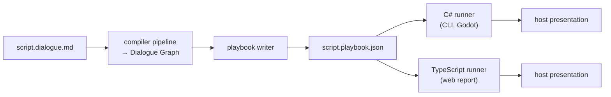
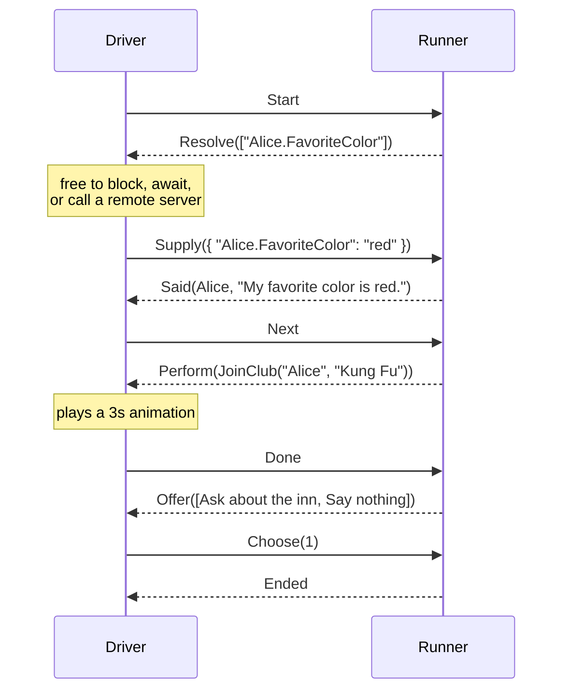
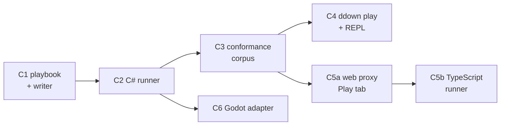

# Dialogue Runtime Architecture

> [!NOTE]
> Status: **partially implemented**. The umbrella for everything after the
> [Dialogue Graph](../core/Dialogue%20Graph.md): the portable **playbook**, the
> **runner** that plays one, the **protocol** between a runner and its driver, and
> the **conformance corpus** that keeps runtimes honest. The playbook, the corpus,
> and a runner that plays lines, jumps, effects, branches, menus, and the end, and
> asks the world what they need, are built; a menu that asks the world, random
> choices, saves, drivers, and every other host are not (see
> [components](#components-and-sequencing)).

## Table of contents

- [Goal and scope](#goal-and-scope)
- [Ubiquitous language](#ubiquitous-language)
- [Prior art](#prior-art)
- [The model: compile once, play anywhere](#the-model-compile-once-play-anywhere)
- [The playbook](#the-playbook)
- [Compatibility](#compatibility)
- [The runner](#the-runner)
- [Reading the world](#reading-the-world)
- [State, saves, and history](#state-saves-and-history)
- [Porting](#porting)
- [Key design decisions](#key-design-decisions)
- [Extension points](#extension-points)
- [Components and sequencing](#components-and-sequencing)
- [Testability](#testability)
- [Alternatives not chosen](#alternatives-not-chosen)
- [Open questions and deferred work](#open-questions-and-deferred-work)

## Goal and scope

The compiler ends at an `internal` `DialogueGraph`. This note designs how a
compiled script is **shipped** and **played**:

1. **Serialize** the graph into a portable, versioned artifact — the *playbook*.
2. **Play** a playbook through a small runner with clean seams into a host.
3. **Keep runtimes honest** with a shared, data-driven conformance corpus.

One compiler serves a **CLI**, the **web report**, and **Godot**, while each host
keeps complete freedom over presentation — and the host may sit in **another
process**, reachable only over a network. The compiler produces a text artifact,
and anything that can read it can play it.

This note owns the cross-cutting decisions: the artifact's purpose and
compatibility policy, the runner's execution model and protocol, read consistency
against external state, what a save holds, and how many runtimes exist. Each
component note owns its own details; the compile-time linker is
[Cross-File Jump Resolution](../language/Cross-File%20Jump%20Resolution.md).

## Ubiquitous language

| Term | Meaning |
| --- | --- |
| **Script** | The authored source, a `*.dialogue.md` file. |
| **Playbook** | The compiled, portable artifact for **one script**: nodes, edges, tables, and a compatibility header. What a compile emits and a runtime loads. |
| **Runner** | The pure function that advances play: given a playbook, a `PlayState`, and one command, it returns the next state and the events it reported. |
| **`PlayState`** | An immutable value: where play is. It *is* the save. |
| **`PlaySession`** | The stateful shell around the runner: holds the current `PlayState`, talks to the driver, records the transcript. Not built. |
| **Driver** | The party that drives a session — a CLI, the report, a game, a debugger. It sends commands and answers requests. |
| **World** | The game state a script asks about. A **role behind the driver**, not a separate protocol party. |
| **Event** | Something the runner reports: speech, a menu, a request, the end, a refusal. |
| **Effect** | A game call the host performs. |
| **Query** | A pure read of the world — a condition, a weight, or a value spliced into speech. |
| **Transcript** | The rendered history of a playthrough: what was said, offered, and chosen. |
| **Capability** | A named construct a runtime must understand — the unit of compatibility. |
| **Conformance corpus** | Language-neutral fixtures every runtime must reproduce. |

Deliberately avoided: *interpreter* and *virtual machine*. Both promise a bytecode
engine, and [D1](#d1--the-playbook-is-declarative-not-bytecode) explains why this
project needs neither.

## Prior art

| System | What we take | What we avoid |
| --- | --- | --- |
| [Ink](https://github.com/inkle/ink) | The pull loop; separate version lines for the story format and the save state; `StoryState` as one serializable value | Synchronous external functions, and the `lookaheadSafe` flag they force |
| [Yarn Spinner](https://github.com/YarnSpinnerTool/YarnSpinner) | The localization split; `[disabled]` options in its test plans | Push-style handlers, which impose reentrancy discipline on every host |
| [LSP](https://microsoft.github.io/language-server-protocol/) / [DAP](https://microsoft.github.io/debug-adapter-protocol/) | **Reverse requests** as a named concept, capability negotiation at handshake, and DAP's `Invalidated` event | — |
| [glTF 2.0](https://registry.khronos.org/glTF/) | `extensionsUsed` / `extensionsRequired`: advisory versus **must-understand** | — |
| [CommonMark](https://spec.commonmark.org/) | A data-driven conformance suite every implementation runs | — |
| [Ren'Py](https://www.renpy.org/) | A capped history log as a first-class feature | Rollback: it still cannot undo file I/O and needs opt-outs |

The most useful lesson is a negative one. **Neither ink nor Yarn Spinner has a
cross-language conformance suite.** inkjs tracks the C# runtime by hand, and drift
surfaces as user bug reports. A project that plans more than one runtime closes
that gap while there is still only one runtime to make conformant.

## The model: compile once, play anywhere



Three properties define the model:

- **The playbook is the only contract.** A runtime never references the compiler.
  A shipped game embeds a small runner and its playbooks — not Markdig, not Tomlyn,
  not the diagnostics engine.
- **A playbook is per script, never merged.** Cross-file links resolve *by
  reference* ([linker](../language/Cross-File%20Jump%20Resolution.md)), so a
  project is a **set** of playbooks and a runner loads the next script on demand.
  Merging would loop on legal reference cycles and destroy incremental recompiles.
- **Presentation belongs to the host.** The playbook carries **structured** speech
  fragments — styled runs, links, images, line breaks — never pre-rendered text.
  Godot renders [BBCode](../other/BBCode%20Rendering.md), the report renders HTML,
  and the CLI renders ANSI, all from the same artifact.

## The playbook

A playbook holds what *playing* needs and nothing else. Its document, field names,
and reader checks are owned by [Playbook Format](./Playbook%20Format.md); three
cross-cutting choices shape it:

- **Nothing derivable is stored.** A runner gathers the query keys a node needs by
  walking the node it just arrived at, so the artifact does not repeat them.
- **Options carry a compiled `label`**
  ([D7](#d7--options-carry-a-compiled-label)).
- **A node reference is a dense integer index**, checked on load by
  `nodes[i].id == i`. A reference into another script waits for the linker; a
  playbook that uses one will declare the `cross-file-jump` capability, so an older
  runner refuses it whole.

What it deliberately **excludes**:

| Excluded | Why | Where it goes instead |
| --- | --- | --- |
| Source spans | They churn on every edit and bloat a shipped artifact | An opt-in sidecar source map, on the JavaScript model |
| Diagnostics | A playbook is only emitted for a script without errors | The compile result |
| Semantic symbols, regions, AST | Compiler internals; welding them to the format makes every refactor a format break | Stay `internal` |
| History and visit counts | Derived, unbounded, and the host's business | [Transcript](#state-saves-and-history) and the world |

## Compatibility

A story that plays *wrongly* is worse than one that refuses to play. Unknown
constructs therefore cannot be skipped: **graceful degradation is not available**,
because a dropped condition does not error — it silently tells the wrong story. So
a runtime refuses, and the compiler can catch it earlier.

### Capabilities carry compatibility, not version numbers

A single monotonic version couples every feature together: add one construct and
every old runner refuses **every** playbook. So capabilities are the primary
mechanism:

```text
Load succeeds  ⟺  playbook.requires ⊆ runner.supported
```

| Change | Example | Mechanism | Effect on an old runner |
| --- | --- | --- | --- |
| New construct | `detour` | new capability name | Refuses *only* playbooks that use it |
| New optional metadata | a source-map link | unknown fields are ignored | No effect |
| Changed meaning of an existing construct | fall-through semantics change | `format.version` bump | Refuses everything — rare, and near-never after 1.0 |

Following glTF, the header carries **two** lists: `requires` is must-understand,
while `uses` is advisory. Without `uses`, every additive nicety would be a hard
gate. Version 0 defines `core` and reserves `cross-file-jump`.

### Three version coordinates

| Coordinate | Type | Moves when | Who reads it |
| --- | --- | --- | --- |
| `format.version` | integer | existing semantics change — near-never | runtime authors |
| `requires` / `uses` | string set | any new construct | the loader, per playbook |
| package version | semver | the library API changes | game developers, via NuGet and npm |

The compiler **writes** one version; a runner **accepts a range**. A published
compatibility matrix maps library versions to supported capabilities, so a team
asks *does my runtime support `detour` yet?* rather than comparing numbers.

### Compile-time targeting is opt-in

> [!NOTE]
> Proposed; not built.

Discovering "your shipped runtime cannot play chapter 7" inside a released game is
terrible, so the failure moves into the writer's editor, as `LangVersion`,
`--release`, and `browserslist` do:

```toml
# dialogue.toml — both sections optional
[compatibility]
target = ["core", "conditions"]    # ceiling: refuse anything beyond

[features]
detour = true                      # gate: opt into a preview construct
```

A target restricts to an older set and a feature flag unlocks a newer one; both
resolve into one rule:

```text
available(construct) = (construct is stable OR its feature flag is enabled)
                   AND (no target is set    OR its capability ∈ target)
```

Both are **opt-in**, so with no configuration the compiler emits everything stable.
Targeting is **never load-bearing for correctness** — the playbook always declares
`requires`/`uses`, so runtime refusal stays the safety net. Using a gated or
out-of-target construct is an **error** that names the construct and the fix.

Guidance for the component that builds it:

- **One capability registry** in the core, consumed by the compiler, the target
  check, the feature gate, the runtime's supported set, and the docs.
- **`core` is the 1.0 baseline**; constructs after 1.0 get their own names.
- **Name capabilities after the construct a writer recognizes** — `detour`,
  `random-choice`, `cross-file-jump` — never after a release.
- **A target takes an explicit capability list**; a version alias needs a map that
  goes stale.

## The runner

### A functional core and an imperative shell

The runner is a **total transition function over immutable state**. It performs no
I/O, holds no reference to a host, and never calls out; its signature, situations,
and refusals are owned by the [Runner](./Runner.md) note. `PlaySession` is the
imperative shell: it holds the current state, performs transport, and records the
transcript. Dialogue advances at human speed, so allocating a small record per
step costs nothing measurable.

### The protocol

Because the core never calls out, every interaction is a message, and the runner
behaves the same whether messages are method calls, `postMessage` to a worker, or
HTTP. There are **two parties**: the **driver** and the **runner**. The world is a
role *behind* the driver; LSP and DAP solve this by naming the message
**direction** rather than inventing a third party, and so does this design.

| Direction | Kind | Built | Designed, not built |
| --- | --- | --- | --- |
| driver → runner | **command** | `Start`, `Next`, `Done`, `Failed(explanation)`, `Supply(answers)`, `Choose(i)` | `Restore(state)` |
| runner → driver | **event** | `Said`, `Continued`, `Ended`, `Refused` | `Invalidated` |
| runner → driver | **request** | `Perform(effect)`, answered by `Done` or `Failed(explanation)`; `Resolve(keys)`, answered by `Supply(answers)`; `Offer(ordered, options)`, answered by `Choose(i)` | — |
| driver → runner | **query** | — | `Describe()`, answered with the current location |

`Resolve` is LSP's `workspace/configuration`: *the server knows what it needs; the
client knows where to find it.*



All waiting — network, animation, a player deliberating — happens *between*
messages. Drivers declare **capabilities** at session start, as in LSP and DAP, so
optional behavior stays optional.

### Describe: the query half

`Step` changes; `Describe` explains. `Describe` is pure — a function of playbook
and state — returning the current node, its properties, and each outgoing edge with
its condition and whether the last snapshot satisfied it. The
[Line Debugger](../visualization/editor/Line%20Debugger%20UI.md)
needs it to answer *why was this edge not taken?*

### Ergonomics: drivers

The protocol is the contract, not the API most hosts write. The runtime package is
to ship thin **drivers** — a synchronous one that answers requests from an
in-process world, and an asynchronous one that awaits one — so a CLI or simple
Godot host never sees the protocol.

## Reading the world

> [!NOTE]
> The protocol half is built: the runner asks with `Resolve` and reads the
> driver's `Supply`, as [Asking the World](./Asking%20the%20World.md) describes.
> The host-side seam below, with typed reads and a registration layer, is proposed
> and not built.

### The world seam

Effects travel the protocol, so the world seam only **reads**. Three questions with
three answer types — a condition needs a boolean, a weight a number, interpolation
text — want three reads rather than one stringly method. Above that sits a
registration layer, as ink and Yarn Spinner both settled on, so a host binds keys
rather than writing a `switch`.

The host interface that exists is `IGameSystem` (`Query(string)` returning a
string, and `Execute(string)`), and nothing in the compiler or runtime calls it. A
read-only replacement with a separate boolean read is proposed; its name is not
settled. It arrives with the drivers that answer the runner's questions from a world.

Unbound keys follow an explicit policy, reusing the **Keep / Ignore** vocabulary of
[unmodeled Markdown](../core/Unmodeled%20Markdown%20Handling.md). The default is
permissive, so a script plays with **no** bindings — the property that makes a
preview useful before any game exists.

### Read consistency

The world is a store other actors may write concurrently, so database vocabulary
applies. A per-node batch of reads is a **snapshot**:

- **within** one node — repeatable read, so a menu is internally consistent;
- **between** nodes — read committed, so the world may change as the story goes;
- **across the runner's own effects** — read your own writes, so a condition that
  follows an effect sees it. The protocol buys this one: `Perform` is answered by
  `Done`, and the run does not go on until it is. This part is built.

This is **snapshot isolation**: it prevents dirty and non-repeatable reads but
permits **write skew**. Serializability is not available and is not worth wanting.

### Choices and stale truth

A menu is checked when shown and acted on when the player picks — seconds later.
That is **time-of-check to time-of-use**; *Baldur's Gate 3* shows "Dialogue option
is no longer valid" because it re-checks on selection. The mitigation is the HTTP
`ETag` / `If-Match` pattern, gated by driver capability:

| Driver capability | Behavior on `Choose` |
| --- | --- |
| supplies a version token with `Supply` | Compare tokens. Match → traverse. Mismatch → `Invalidated`, re-snapshot, re-present |
| no token | **Trust** — traverse on the snapshot |

A world that knows when it changed may instead **push** invalidation, as DAP's
`Invalidated` does. Revalidation narrows the window; write skew remains possible.

## State, saves, and history

### What the runner keeps

`PlayState` is small, because the host owns the game. It holds only the
**position**. The design adds three fields, each with the feature that reads it:

| Field | Arrives with | Why |
| --- | --- | --- |
| **call stack** | the returning detour | a detour must know where to return |
| **effect ordinal** | saves over a wire | the idempotency key for a retried effect, and the mismatch detector on load |
| **playbook fingerprint** | saves | turns "loaded a save against a recompiled script" into a loud failure |

Once play crosses scripts, a position becomes a qualified reference, because a
bare index cannot say which playbook it indexes. A save carries its **own** version
number, independent of the playbook's, as ink versions `StoryState` separately.
**Visit counts stay out**: a host that wants "only once" answers a query it owns.

### Two ways to save

| Shape | Contents | Size | History after load |
| --- | --- | --- | --- |
| **Snapshot** | `PlayState` | O(1) | none — position only |
| **Journal** | `PlayLog` — the ordered inputs | O(n) | **regenerated by replay** |

Replaying `(playbook, PlayLog)` reproduces the transcript *and* the state, because
`Step` is deterministic and supplied answers are recorded. A `PlayLog` is therefore
also a **perfect bug report**. Replay is safe because a replaying driver runs in
`Simulate`, so no effect fires twice.

```text
SaveEnvelope { saveVersion, playbookFingerprint, playState, transcript?, log? }
```

### History is a shell-side fold

A backlog is standard — Ren'Py caps one at 250 entries by default — but history is
**derived**, so it belongs in the shell, not in `PlayState`. `Transcript` is an
optional fold over the event stream, bounded by a capacity:

```text
TranscriptEntry = Said      { speaker, fragments, nodeRef }
                | Offered   { options[], chosenIndex, nodeRef }
                | Performed { effect, nodeRef }
```

- **Join a continuation to its line.** A `Continued` adds its fragments to the
  `Said` entry before it, so a sentence a command divides still reads as one line.
  See [speaking a line](./Speaking%20a%20Line.md#s2--every-line-opens-with-its-said-the-words-after-a-command-are-continued).
- **Store resolved fragments.** A line spoken as "…is red" is recorded that way.
- **Record the menu and the selection.** The roads not taken are most of a
  backlog's value.
- **Keep fragments, never flat strings.** A backlog is a re-render.

Effects are recorded but filtered at render: a player backlog hides them, the
debugger shows them.

### Effects, restore, and why nothing is compensated

The runner rewinds *itself* for free, because state is a value. Whether the
**world** rewinds with it is the host's business:

- **Restore** — state and world return together. This is save/load.
- **Explore** — state returns but the world did not. Sound only when effects are
  simulated.

| Need | Mechanism |
| --- | --- |
| Save and load | `PlayState` *is* the save |
| Explore another branch | keep prior states, restore one |
| Do not fire real effects while previewing | `EffectPolicy: Simulate │ Perform` |
| Exactly-once effects over a wire | the **effect ordinal** |
| Detect a state/world mismatch | compare ordinal and fingerprint on load |

**The runner never compensates.** Inverses are usually wrong or meaningless — what
undoes `PlaySound`, and is the inverse of `JoinClub` really `LeaveClub` if the
player was already a member? A host that can roll back its world restores its own
snapshot and hands the runner the matching state and ordinal.

## Porting

Godot 4 runs .NET, so the C# runner serves **CLI and Godot directly**, the way
`godot-ink` embeds `Ink.Runtime.dll`. Everything else is a ladder:

| Level | What a porter does | Owner |
| --- | --- | --- |
| 0 | **Do not port the compiler.** Use `ddown` as a CLI tool | this repository |
| 1 | **Thin frontend.** Reimplement presentation; delegate play to the C# runner over a socket | community; cheap |
| 2 | **Subprocess REPL.** Drive the runner over stdio, as a debugger like `pdb` is driven. **The recommended route** | this repository ships the REPL |
| 3 | **Full port.** For engines such as Unreal, where a bundled runtime beats subprocess latency | **community-owned** |

Levels 1 and 2 are **the same message stream over different transports**. Only
level 3 reimplements the state machine, and that is what the conformance corpus
verifies. **The protocol is the portability strategy.**

### The web client is staged

| Stage | How it plays | What works |
| --- | --- | --- |
| **Proxy** (level 1) | Talks to the C# runner over the live server's transport | The served report, including the [Line Debugger](../visualization/editor/Line%20Debugger%20UI.md) |
| **TypeScript runner** (level 3) | Plays a playbook in the browser | The **exported** report, which has no server, becomes playable |

The exported single-file report is static, so only a TypeScript runner makes it
playable offline; until then it has no Play tab.

### Conformance

The [Conformance Corpus](./Conformance%20Corpus.md) pairs each playbook with a
**session** — the messages a driver sends interleaved with the replies a runner
must give. A runtime is conformant when it holds every session. With one runner it
is a regression suite and the format's executable specification; the day a port
appears, it is what stands between that port and silent divergence.

## Key design decisions

### D1 — The playbook is declarative, not bytecode

Ink and Yarn Spinner compile to instruction streams because both embed a scripting
language. **DialogueDown has none**: a `Condition` is a key the world answers, and
a weight is a number or a key. So the artifact is a **node-and-edge document** and
the runner is a **graph walker with a cursor** — no eval stack, no opcodes, no
variable table. That makes a second runtime cheap; a construct that would need a
stack machine deserves scrutiny first.

### D2 — JSON, with a formal schema

JSON parses natively in the browser and in Godot, and `System.Text.Json` is in the
BCL. The discriminator is spelled **`kind`**, because the format is a public
contract rather than a .NET detail. JSON Schema gives editor autocomplete and CI
validation, and `jq` gives shell inspection.

**KDL** is the strongest counterargument — more readable, better diffs — but has no
schema standard and a weaker parser ecosystem in both languages. **proto3** buys
compactness at the price of a `protoc` dependency and the "any language can just
parse it" property. Graph interchange formats (DOT, GraphML, GEXF) are
topology-first and payload-minimal, the opposite of a playbook. A binary encoding
stays available behind a CLI flag, because the writer is a seam.

### D3 — Capabilities carry compatibility

Version numbers gate releases; capabilities gate playbooks, which keeps old
runtimes useful. See [Compatibility](#compatibility).

### D4 — The runner is a functional core

The core must not call the shell. An async core that `await`s the world inverts
that, entangling every decision with I/O. A pure `Step` over immutable state keeps
the dependency one-way, and yields save, restore, replay, and deterministic tests
as consequences.

### D5 — Two parties; the world is reached by reverse request

The driver both sends commands and answers requests; LSP and DAP show the fix is to
name the **direction**, not invent a third party. The runner may sit with the UI
and query a remote world, or sit with the server and stream events to a thin client.

### D6 — Queries are pure reads; effects change the world

| | **Query** (read) | **Effect** (write) |
| --- | --- | --- |
| Purity | must not change the world | changes the world |
| Cardinality | may be asked 0..n times | **exactly once** |
| Ordering | order-independent, batchable | strictly ordered |
| On restore | re-ask freely | must not re-run |
| On transport failure | retry is safe | the effect ordinal makes retry idempotent |
| Before the next read | nothing to wait for | must have landed, which `Done` acknowledges |

The ordinal stops a *retried* effect running twice; the acknowledgement stops a
*pending* effect being read past. A world that cannot make an effect land answers
`Failed(explanation)`, and the run stands where it is. A world that implements a
query by mutating breaks the runner's guarantees; that contract is documented and
conformance-tested, not enforced.

### D7 — Options carry a compiled label

A runner could derive a menu label by peeking at the option's first node. Ink does
and pays for it: lookahead can invoke a side-effecting external function twice. The
compiler already knows the text, so the playbook carries an explicit `label` and
the runner never peeks. With D6, presenting a menu is pure even when a label holds
a query.

### D8 — A menu shows unavailable options

An option whose condition is false is reported **unavailable**, not filtered out.
Hiding versus disabling is presentation policy, and a runner that drops the option
removes the host's choice. Yarn Spinner encodes the same distinction as
`[disabled]`; the `an-unavailable-option` conformance case pins it.

### D9 — The runner restores; it never compensates

See [effects and restore](#effects-restore-and-why-nothing-is-compensated).

### D10 — History is a shell-side fold

A transcript is derived from the event stream, so it stays out of core state; the
runner stays lean and the save bounded, while a standard `Transcript` shape still
lets fixtures assert it.

## Extension points

Everything the notes promise, and the insurance each has in version 0.

| Expansion | Source | Retrofit cost | Insurance in v0 |
| --- | --- | --- | --- |
| Cross-file jumps | [Cross-File Jump Resolution](../language/Cross-File%20Jump%20Resolution.md) | None — additive | A playbook using them declares `cross-file-jump`, so an older runner refuses it whole |
| Negation, expressions | [Conditions](../language/Conditions.md#d10--no-negation-no-expressions) | Every playbook | A condition is an object with a `kind`, never a bare string, so `not` and `and` are additive |
| Detour and return | [Progression Order](../language/Progression%20Order.md) | Every save file | Saves are not serialized yet, so `PlayState` gains a call stack before any save exists |
| `#START`, cross-file entry | [Progression Order](../language/Progression%20Order.md) | None — additive | `anchors` names every scene a host may start at; `entry` states only the default |
| Hide versus disable an option | [Conditions](../language/Conditions.md#d9--a-player-option-is-shown-unavailable-not-removed) | The host API | [D8](#d8--a-menu-shows-unavailable-options) |
| Weight draws on replay | [Random Choice](../language/Random%20Choice.md) | Saves and conformance | Entropy is a seam; see [open questions](#open-questions-and-deferred-work) |
| Localization | — | Every script | Unknown properties are ignored, so a `lineId` is a field to populate, not a shape to change |
| Binary encoding | — | Nothing | The writer is a seam |

Anything this table misses is still recoverable through
[capabilities](#compatibility): an old runner refuses rather than misplays.

## Components and sequencing



| # | Component | Delivers | Note | Status |
| --- | --- | --- | --- | --- |
| C1 | **Playbook format and writer** | The schema, the header, the reader and its checks, and `ddown compile --output` | [Playbook Format](./Playbook%20Format.md), [Playbook Reader Rules](./Playbook%20Reader%20Rules.md) | Implemented |
| C2 | **C# runner** | `Step`, `PlayState`, the protocol, drivers, the world seam, saves | [Runner](./Runner.md) | Partially implemented: lines and the commands in them, jumps, effects, conditions and queries, block conditions, menus that ask the world nothing, the end |
| C3 | **Conformance corpus** | Fixtures plus a harness, owned as data | [Conformance Corpus](./Conformance%20Corpus.md) | Implemented |
| C4 | **`ddown play` and the REPL** | A terminal player, plus a raw stdio mode another language can drive | [Interactive Playthrough](../other/Interactive%20Playthrough.md) | Proposed |
| C5a | **Web proxy Play tab** | The served report plays through the C# runner (level 1) | [Interactive Playthrough](../other/Interactive%20Playthrough.md) | Proposed |
| C5b | **TypeScript runner** | The exported report plays a playbook offline (level 3), held to C3 | — | Proposed |
| C6 | **Godot adapter and sample** | BBCode presentation and a demo scene | [BBCode Rendering](../other/BBCode%20Rendering.md) | Proposed |
| C7 | **Compatibility and feature gating** | `[compatibility]` and `[features]`, the registry, diagnostics | [Compatibility](#compile-time-targeting-is-opt-in) | Proposed |
| C8 | **Exporters** | Yarn, DOT, and Mermaid projected from the playbook | — | Proposed |

`DialogueDown.Runtime` ships as its own package that **must not reference the
compiler**, guarded by an architecture test.

> [!IMPORTANT]
> The format stays **unstable at `version: 0`** until a runner plays every
> construct. Designing a format with no consumer is how formats go wrong; version
> `1` freezes only once C2 is complete, which leaves room to fix what the runner
> uncovers with no migration story.

## Testability

| Level | What it covers |
| --- | --- |
| Unit | Writer and reader round-trips; one test per node and edge kind; each condition and weight path. |
| Compatibility | **Negative** fixtures: an unknown `requires` is refused; an unknown `uses` still loads. |
| Golden | A committed playbook per example script; a committed transcript per example once sessions can be recorded. |
| Conformance | The corpus, run by **every** runtime in its own language. |
| Property | With a deterministic core: no input sequence leaves state invalid; every walk stays inside the playbook. |

A transcript is the right golden file because it is **semantic**: renumbering every
node leaves it byte-identical unless *behavior* changed. Because the core is pure, a
failing fixture also *shrinks* to the smallest reproduction.

## Alternatives not chosen

- **Serialize `DialogueGraph` directly.** Fastest to build, and exactly the
  coupling the portability rule warns against: the format would inherit
  `SourceSpan`, `SpeakerSymbol`, and every refactor of compiler internals.
- **One merged bundle per project.** Contradicts link-by-reference, loops on legal
  reference cycles, and destroys incremental recompilation.
- **An async core.** Inverts the dependency direction and taxes every runtime for a
  need most hosts do not have.
- **Push-style handlers (Yarn Spinner).** Impose reentrancy discipline on every host
  and fight `async` in both JavaScript and Godot.
- **Effect compensation.** See [D9](#d9--the-runner-restores-it-never-compensates).
- **One .NET runtime everywhere, via WebAssembly.** Removes the port and all drift,
  but adds megabytes to a single-file report measured in kilobytes.
- **A GDScript runner.** Unnecessary while Godot targets .NET; a level-3 port is
  community-owned by policy.

## Open questions and deferred work

- **Line identity for localization.** A node reference is positional and therefore
  not a localization key. A scheme stable across edits — Yarn writes `#line:` tags
  back into the source — needs its own note.
- **Entropy: specified generator or supplied values?** A specified generator costs
  one round trip fewer but must match bit-for-bit across languages; host-supplied
  values are simpler to conform. Decided by whichever change teaches the runner to
  play a random choice.
- **Detour syntax and return boundary** stay owned by
  [Progression Order](../language/Progression%20Order.md).
- **The world interface's name.** `IGameSystem` exists; the proposed read-only seam
  and its boolean read have no settled names.
