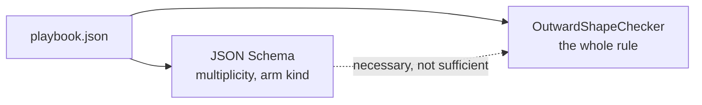

# Node outward shape

> [!NOTE]
> Status: **proposed / not yet implemented**. Every node kind has a well-defined
> set of ways out, and nothing states or enforces it: the compiler produces only
> well-shaped nodes, but the format does not describe the shape and the reader
> does not check it. This note designs the checker, the schema constraints, and
> the conformance cases that close that gap. It assumes the vocabulary of the
> [Playbook format](./Playbook%20Format.md) — *playbook*, *reader*, *checker*,
> *node*, *edge* — and does not restate it.

## Table of contents

- [Goal and scope](#goal-and-scope)
- [Ubiquitous language](#ubiquitous-language)
- [The rule](#the-rule)
- [Functionality checklist](#functionality-checklist)
- [Interfaces and abstractions](#interfaces-and-abstractions)
- [Key design decisions](#key-design-decisions)
- [Error and boundary cases](#error-and-boundary-cases)
- [Integration](#integration)
- [Testability](#testability)
- [Open questions](#open-questions)

## Goal and scope

A hand-edited playbook, or one written by another tool, can carry a line with two
successions, an option out of an `end`, or a fully gated choice with nowhere to
go when every option is withheld — and today the reader loads all of them. A
runtime then plays whatever the edge array happens to list first, a silent
disagreement between two conformant runtimes: exactly what the
[conformance corpus](./Conformance%20Corpus.md) exists to prevent.

In scope:

- a **reader rule** — each node carries only the edge kinds it can act on, in the
  counts it can act on, and always leads somewhere;
- **schema constraints** where JSON Schema 2020-12 can express them;
- **conformance `readable/` cases** for the refusals that result, built from
  `baseline` with one field changed, as every other case is.

Three pieces are deliberately left out, each tracked as its own follow-up:

- **The runner's own tightening.** The traversal code reads a node's succession
  with `FirstOrDefault` rather than `Single`, because nothing guarantees there is
  only one. Once this checker is in the default reader, a playbook that reaches
  the runner has at most one, and that call can tighten. The change belongs to
  the runner's code — made from here it would only cause a merge conflict.
- **Edge ordering.** A `branch` arm's `order` should ascend, and the `else` arm
  should come last. That is a separate invariant about the sequence of arms, not
  their shape.
- **A diagnostics channel on the reader** for valid-but-suspect documents — see
  [decision 3](#3-a-fall-through-that-cannot-run).

## Ubiquitous language

| Term | Meaning |
| --- | --- |
| **Outward shape** | The kinds and counts of edges a node's `out` may hold. |
| **Arm** | An edge the node chooses among to move forward: a `divert` for `line` and `control`, an `option` for `choice`, a `random-option` for `random-choice`, a `branch` for `branch`. Each node kind offers exactly one arm kind; `end` offers none. |
| **Gated arm** | An arm carrying a `condition`. A `branch` arm with no condition is the `else` arm and is never gated. |
| **Open arm** | An arm with no condition — one that always applies. |
| **Fall-through** | The single `succession` edge a node takes when no arm applies. |
| **Leads somewhere** | Following `out` always reaches a next node — an arm whose condition holds, or the fall-through. A node that leads nowhere is refused. |

## The rule

> A non-`end` node's `out` holds its **arms** — every edge of the one arm kind
> its node kind offers — and **at most one `succession` fall-through**. The
> fall-through is there when the node has no open arm, or is itself conditional:
> exactly the cases where an arm might not apply, and the node would otherwise
> lead nowhere. `end` carries no edges at all.

The property this buys is **every node leads somewhere**: whatever the conditions
decide at play time, `out` always has a next step. A node that could reach a dead
end is refused, and so is a node carrying an edge kind it cannot act on — that
means something the writer did not say.

A fall-through that *can* never run — the node has an open arm — is neither
required nor wrong; it plays identically. The checker accepts it, for the reasons
in [decision 3](#3-a-fall-through-that-cannot-run).

The per-kind table is the *consequence* of the rule, not the specification:

| Node kind | Arm kind | Arm count | A fall-through is needed when |
| --- | --- | --- | --- |
| `line` | `divert` | 0–1 | the node is conditional, its divert is gated, or it has no divert |
| `control` | `divert` | 0–1 | as `line` |
| `choice` | `option` | ≥ 1 | every option is gated |
| `random-choice` | `random-option` | ≥ 1 | every random-option is gated |
| `branch` | `branch` | ≥ 1 | every branch arm is gated (there is no `else`) |
| `end` | — | 0 | never — `end` carries no edges |

A needed fall-through that is **absent** means the node leads nowhere: refused. A
fall-through that is **present but not needed** is dead: accepted (decision 3).

"Gated" is read straight from the document: an `option`, `random-option`,
`branch`, or `divert` edge is gated exactly when it carries a `condition`; a
`line` or `control` node is conditional exactly when it carries one. A node with
zero arms is vacuously "every arm gated", so a plain line still needs its
fall-through.

## Functionality checklist

- [ ] Refuse a node carrying an edge kind its node kind cannot act on.
- [ ] Refuse a node with more than one `succession`.
- [ ] Refuse a `choice`, `random-choice`, or `branch` with no arm.
- [ ] Refuse a `line` or `control` with more than one `divert`.
- [ ] Refuse a non-`end` node that needs a fall-through and has none — a node
      that would lead nowhere.
- [ ] Refuse an `end` carrying any edge. (The schema already does; the reader
      states it too, so the reader stands on its own.)
- [ ] **Accept** a node with a fall-through it does not need
      ([decision 3](#3-a-fall-through-that-cannot-run)).
- [ ] Schema `maxItems` / `minContains` / `maxContains` on each node kind's `out`
      where JSON Schema 2020-12 reaches.
- [ ] Conformance `readable/` cases for each new refusal, from `baseline`.
- [ ] The checker wired into `PlaybookCheckerFactory.CreateDefault()`.

## Interfaces and abstractions

| Type | Responsibility | Collaborators |
| --- | --- | --- |
| `OutwardShapeChecker : IPlaybookChecker` | Walk the nodes; refuse the first whose `out` breaks [the rule](#the-rule). | `PlaybookDocument`, the `Node` / `Edge` model, `InvalidPlaybookException` |
| `PlaybookCheckerFactory` | Add `OutwardShapeChecker` to `CreateDefault()`, after `ReferenceChecker`. | `CompositeChecker` |
| `schema/playbook-0.schema.json` | Per-node-kind `out` constraints the schema can carry: `maxItems`, and `contains` + `minContains` / `maxContains` keyed on `kind`. | `check-jsonschema` in CI |
| `conformance/readable/<case>/` | One refusal each: `playbook.json` is `baseline` with one field changed, `fixture.json` verdict `refuse`. | the readable harness |

The checker follows the house contract: it refuses at the first fault with a
message naming the offending node and what was expected — a playbook is compiler
output, so there is no list for a reader to work through.

## Key design decisions

### 1. State the invariant, not the table

The design names three concepts — **arm**, **gated**, **fall-through** — and the
rule is one sentence over them; the per-kind table falls out. Naming the property
(**every node leads somewhere**) is what lets a refusal be explained in words a
writer understands — "this node has no way on" — rather than by reciting a row.

### 2. The reader is the authority; the schema helps where it can

Same split as `ReferenceChecker`. A schema describes shape in isolation: it can
cap an array's length and require it to contain an edge of a given `kind`, so it
catches a second `succession`, a missing arm, and a foreign arm kind. It cannot
relate the *presence* of a `succession` to the *conditions* on the other edges,
which is the "leads somewhere" half. So the reader states the whole rule and the
schema mirrors the part it can; seven of the nine existing `readable/` refusals
are already valid by the schema, and these will be too.

### 3. A fall-through that cannot run

Whether a `succession` is doing work is fully structural: it runs only when no
arm applies, which can happen only if the node has no open arm or is itself
conditional. So the checker can always tell a working fall-through from a dead
one.

A dead fall-through — the node has an open arm, so `out` already always has a
next step — is not wrong. It plays identically with or without it. Refusing it
would reject a harmless document and frustrate the hand-editors and tools the
format is meant to welcome. But silently accepting it throws away a real signal:
a dead `succession` usually means a hand-edit slip or a writer over-emitting.

`IPlaybookChecker` is throw-or-silent — there is no third answer — so the checker
**accepts** the dead fall-through. Turning it into a *warning* instead needs a
diagnostics channel on the reader, parallel to the compiler's, and something to
surface it through (a play command that reads a playbook before running it). That
is its own component, tracked as a follow-up, with the dead fall-through as its
first case.

### 4. Checker order: after `ReferenceChecker`

`ReferenceChecker` proves every edge lands on a node the document holds. Running
after it, this checker reasons about edges already known to be sound and never
has to guess whether a dangling edge is also a shape error.

## Error and boundary cases

| Case | Behaviour |
| --- | --- |
| `end` with any edge | refuse |
| `line` / `control` with two or more `divert` edges | refuse |
| `line` carrying an `option`, `branch`, or `random-option` | refuse (foreign arm kind) |
| `choice` carrying both an `option` and a `branch` edge | refuse (mixed arm kinds) |
| `choice` / `random-choice` / `branch` with no arm | refuse |
| any node with two or more `succession` edges | refuse |
| all-gated `choice`, `if` with no `else`, conditional `line`, `line` with a gated `divert` — and no `succession` | refuse (leads nowhere) |
| non-`end` node with an empty `out` | refuse (the zero-arm, no-fall-through case) |
| node with an open arm **and** a `succession` | accept — the `succession` is dead ([decision 3](#3-a-fall-through-that-cannot-run)) |
| `branch` whose `else` arm is a conditionless `branch` edge | that arm is open, so the fall-through is not needed |

## Integration

- **`PlaybookReader.Default`** gains the checker through
  `PlaybookCheckerFactory.CreateDefault()`. Every runtime built on the default
  reader refuses these documents from then on.
- **The playbook round-trip property** — that everything the writer produces the
  reader accepts — becomes a free guard that the checker never rejects valid
  compiler output. The script generator behind that property was recently taught
  to emit the three hard outward shapes (a line that diverts, an all-gated
  choice, an `if` with no `else`), so the guard exercises them rather than
  passing hollow.
- **The conformance corpus** gains `readable/` cases, so a port that fails to
  refuse a two-succession line fails conformance.

## Testability

| Layer | Test |
| --- | --- |
| Unit | `OutwardShapeCheckerTests` — one accept and one refuse per shape in the table above; nodes built through the shared test factory. |
| Metamorphic | Take a valid playbook, inject one fault (second `succession`, foreign arm kind, drop a needed `succession`, edge on an `end`); the checker must refuse. |
| Property | Wired into the round-trip property: every compiled script's playbook passes the checker. |
| Cross-runtime | One `readable/` case per new refusal, from `baseline`. |
| Schema | `check-jsonschema` on a valid playbook and on each expressible violation; snapshot the "Best Match" message so a tooling upgrade that regresses it is caught. |

Mutation testing of the checker — small, pure, boundary-heavy, a good target — is
left to the project's separate mutation-testing effort.

## Open questions

1. **Is the schema's `oneOf` message good enough?** With per-kind `out`
   constraints, `check-jsonschema`'s "Best Match" heuristic reports something
   like `$.nodes[0].out: [...] is too long`. That is serviceable, and the reader
   is the real authority, but confirm we are content shipping the schema part
   with that message quality.
2. **Does "gated" need to account for a condition the checker cannot see?** The
   definition here reads conditions straight off the edges and nodes. If a future
   capability introduces a way to withhold an arm that is not a `condition`
   field, this rule would need revisiting — flagged, not expected.
