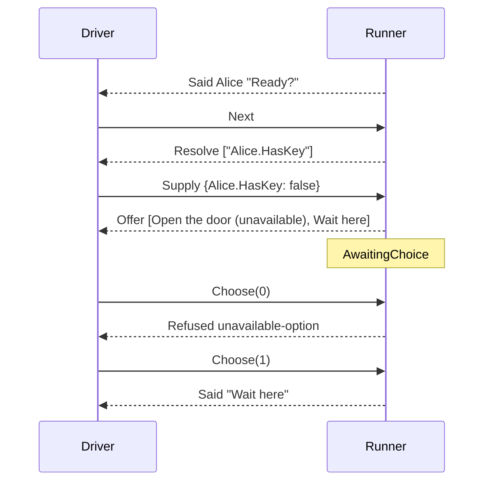

# Offering a choice

> [!NOTE]
> Status: **proposed**. The pass that lets the runner play a menu: it offers the
> player a choice node's options with an `Offer` request, waits, and follows the
> option the player takes with `Choose`. It builds on
> [asking the world](./Asking%20the%20World.md), which reads an option's
> condition, and on the [runner](./Runner.md)'s protocol, and applies the
> [dialogue runtime architecture](./Dialogue%20Runtime%20Architecture.md), which
> designed menus and `Choose` and owns the cross-cutting decisions this note
> uses.

## Table of contents

- [Goal and scope](#goal-and-scope)
- [Vocabulary](#vocabulary)
- [Functionality checklist](#functionality-checklist)
- [How a menu is played](#how-a-menu-is-played)
- [Interfaces and abstractions](#interfaces-and-abstractions)
- [Key design decisions](#key-design-decisions)
- [Error and boundary cases](#error-and-boundary-cases)
- [Integration](#integration)
- [Testability](#testability)

## Goal and scope

A writer offers the player a choice with a list:

```markdown
Alice: Ready?

1. `Alice.HasKey?` Open the door
2. Wait here
```

The runner refuses a choice node today, so no script with a menu can be played
past it. This pass plays one: the runner asks the world what decides the menu,
offers every option with its label and whether it can be taken, waits for the
player, and goes where the chosen option leads.

The pass has two milestones:

| Milestone | What it delivers |
| --- | --- |
| **M1 — a menu is offered and taken** | `Offer`, `Choose`, and the wait between them, for a menu that needs nothing from the world; labels with their commands removed; a choice the menu cannot take is refused |
| **M2 — the world decides the menu** | Option conditions and labels' queries asked in one request; an unavailable option offered but refused when chosen; a menu with nothing available skipped |

In M1 a menu with any condition or any query in a label is refused as
`unplayable-node`, so a run never offers an option it has not asked the world
about.

In scope:

- playing a `choice` node, and the `option` edges out of it;
- the sequence a menu is offered in: the writer's for an ordered menu, and nobody's
  for an unordered one;
- the `Offer` request, the `Choose` command, and the situation between them;
- reading the world once for a menu: its options' conditions and its labels'
  queries;
- two refusal reasons for a choice the menu cannot take;
- a `choose` send and an `offer` matcher in the harness, and corpus cases;
- menus in `PlaybookGen`, so the walk property offers and takes them.

Out of scope: a random choice, which needs a decision on where the runner's
randomness comes from; a menu checked again when the player picks, with
`Invalidated` and a version token (see
[choices and stale truth](./Dialogue%20Runtime%20Architecture.md#choices-and-stale-truth));
the protocol's `Describe`; saves; and the history a driver keeps, which records a
menu from the `Offer` it received and the `Choose` it sent.

## Vocabulary

| Term | Meaning |
| --- | --- |
| **Menu** | A `choice` node as the player meets it: the options offered together, and the wait for one to be taken |
| **Option** | One `option` edge out of a choice node: a label, the node it leads to, and an optional condition. A choice node's `succession`, when it has one, is not an option |
| **Label** | The words an option is offered by, compiled from the option's text; what the player reads, never what is said or performed |
| **Available** | Whether an option can be taken: true unless its condition failed |
| **Offer** | The `Offer` request: every option of a menu, each with its label and whether it is available; in the order written when the menu is ordered |
| **Take** | The player's `Choose(index)`: the option at that position in the `Offer` the driver received |

## Functionality checklist

M1:

- [ ] A choice node, once arrived at, offers its options in one `Offer` and waits
      for `Choose`.
- [ ] `Offer` is a request, so a driver answers it as it answers `Perform` and
      `Resolve`, and `Next` at a menu is refused.
- [ ] An ordered menu's options are offered in the order they appear in `out`;
      `Offer` says whether the menu is ordered.
- [ ] `Choose(index)` names a position in the `Offer` just sent, in either kind of
      menu.
- [ ] A label is offered with its commands removed, and a command in a label is
      never performed.
- [ ] `Choose` leads to the chosen option's node, which is arrived at as any node
      is.
- [ ] A `Choose` outside the options offered is refused as `no-such-option`, and
      the menu stays open.
- [ ] `Choose` anywhere else, and any other command while a menu is open, is
      refused as misplaced.
- [ ] A menu that needs anything from the world is refused as `unplayable-node`
      until M2.

M2:

- [ ] A menu's options' conditions and its labels' queries are asked on arrival in
      one request, in the sequence the options are offered.
- [ ] A label is offered with its queries filled.
- [ ] An option whose condition fails is offered unavailable, not hidden.
- [ ] A `Choose` of an unavailable option is refused as `unavailable-option`, and
      the menu stays open.
- [ ] A menu with no available option is skipped by its fall-through, and one with
      no fall-through leads nowhere.
- [ ] One key used as a condition and as a label's query in one menu is refused, as
      it is for any node.

## How a menu is played

A menu is its own step, after the line that asks the question:



What happens after `Choose` comes from the option's arm, not from the runner. The
compiler writes an option's text twice: as its label, and as the start of the arm
it leads to. Choosing arrives at that arm, which plays as any node does:

| Script | The option's label | What the arm does once it is taken |
| --- | --- | --- |
| `- Go east` | `Go east` | `Said` "Go east", by the anonymous default speaker |
| `- Bob: Is it really?` | `Is it really?` | `Said` Bob "Is it really?" |
| `- => [Take the east road](#the-market)` | `Take the east road` | nothing: the arm is a jump, walked past to the market |
| ``- `Wave()` `` | empty | `Perform` Wave, from a control block |

An arm ends by falling through to whatever the writer put after the menu, so every
option rejoins there unless its arm jumps away.

## Interfaces and abstractions

| Type | Responsibility | Collaborators |
| --- | --- | --- |
| `Offer(ordered, options)` | A request answered by `Choose`: the menu offered, and whether it is ordered, so its sequence is the writer's to keep | `Request` |
| `OfferedOption(label, available)` | One option as offered: its label with queries filled and commands removed, and whether it can be taken | `Offer` |
| `Choose(index)` | A command: take the option at that position among those offered | `Command` |
| `AwaitingChoice(node, available)` | Waiting for the player at a menu, and the positions of the options that could be taken when it was offered | `Situation` |
| `NodeQuestions` | For a choice node, its options' conditions and its labels' queries, in the sequence the options are offered; and the same whether read for the whole node or from its start | `Arrival` |
| `Arrival` | Walks past a menu with nothing available, as it walks past a branch | `Playing` |
| `Playing` | Hands a choice node to `Choosing` | `Arrival` |
| `Choosing` | Offers a menu's options and waits; takes `Choose` against the options offered, refusing one the menu cannot take, and arrives at the chosen option's node | `Playing`, `Runner`, `Arrival` |
| `OfferMatcher` | Holds an `Offer` to a fixture's `offer` expectation | The harness |

## Key design decisions

### O1 — A menu is its own step, after the line that asks

A menu is a node of its own, so the line before it is said in one step and the
menu offered in the next, once the player moves on. The corpus pins this order: in
`a-player-choice`, `said` comes first, then `next`, then `offer`. A host that
shows the question and the menu together keeps the line on screen when the menu
arrives.

### O2 — `Offer` is a request, answered by `Choose`

A driver's rule is to answer each request it receives and, when a step leaves
nothing to answer, give the player the turn with `Next`
([speaking a line](./Speaking%20a%20Line.md#s4--the-players-turn-comes-when-a-step-leaves-nothing-to-answer)).
A menu waits on an answer just as `Perform` and `Resolve` do, so `Offer` is a
request, and the rule holds unchanged: at a menu, the answer is the player's
`Choose`, not `Next`. Like them, it is named for what it asks the driver to do —
offer these options to the player — where an event is named in the past tense for
what already happened.

### O3 — `Choose` names a place in the offer; an ordered menu keeps its written order

The runner offers every option of a menu and never drops one. Two questions about
the options look alike and are kept apart:

| Question | Answered by | For |
| --- | --- | --- |
| Which option does the player take? | `Choose(index)`: a position in the `Offer` the driver just received | Every menu |
| In what sequence must the menu be shown? | The order its options appear in `out`, which is the order the writer numbered them | Ordered menus only |

`Choose` addresses what was offered, not the playbook. The runner rebuilds the same
listing from the node when `Choose` arrives, because its step is a function of its
state and command, and resolves the index against it. The index never counts a
choice node's fall-through.

An ordered menu (`1.`) is shown in the sequence the writer numbered. The compiler
writes its options into `out` in that sequence, and JSON keeps the order of an
array, so an option's position in `out` is its place in the menu, as it is for a
branch's arm ([reader rules D4](./Playbook%20Reader%20Rules.md#d4--the-array-is-the-order)).
The runner offers the options in that order.

An unordered menu (`-`) has no sequence to keep: the runner offers its options in
whatever sequence it reads them, and no conformance case depends on that sequence.
`Offer` says whether the menu is ordered, so the host knows whether it may shuffle
what it shows. Shuffling is presentation, so it is the host's; `Choose` still names
the position in the `Offer`.

### O4 — A label is shown, never performed

A label is what the player reads to decide. It reaches the host with its queries
filled from the world's answers and its commands removed: a command written in an
option runs when its arm plays, which is where the compiler also wrote it. The
label is the label's segments' words, joined, so emphasis around a removed
command stays on both sides of it.

A label keeps its whitespace as written, so a label whose command came first
starts with a space, as a `Continued` after a command does. How whitespace in
speech is normalized is the language's to settle.

A label's query is asked on arrival at the menu, and the same query in the arm's
first line is asked again when that line plays. The two answers may differ, which
is the rule [asking the world](./Asking%20the%20World.md#a2--the-runner-does-not-remember-an-answer)
sets for any two questions.

### O5 — What decides a menu is read once, on arrival

A menu's options' conditions and its labels' queries are all asked before it is
offered, in one `Resolve`, as the **before playing** moment of
[A1](./Asking%20the%20World.md#a1--one-ask-per-moment). The keys are named in
the sequence the options are offered: the first option's condition, then its
label's queries, then the next option's, each key once. In an unordered menu that
sequence is the runner's own, so the corpus pins the sequence of keys only for an
ordered menu. One snapshot decides the whole menu, so two options guarded by one
key are always both available or both unavailable.

A1 reads the conditions on a node's ways out as it leaves, because the node may
change the world in between. A choice node performs nothing, so nothing changes
between offering the menu and taking an option, and the conditions on its options
are read on arrival, where their answers are needed to offer it. A menu has no
**before leaving** moment.

An option whose condition fails is offered unavailable rather than hidden, as the
architecture's [D8](./Dialogue%20Runtime%20Architecture.md#d8--a-menu-shows-unavailable-options)
sets: whether to gray it out or leave it off is the host's call.

### O6 — The wait keeps what was offered

`AwaitingChoice` carries the positions of the options that were available when
the menu was offered. That is what lets the runner refuse an unavailable option
without asking the world again, and it is the **trust** row of
[choices and stale truth](./Dialogue%20Runtime%20Architecture.md#choices-and-stale-truth):
a driver with no version token is taken at the snapshot. The runner still
remembers no answer: the wait holds the state of its open request, as
`AwaitingSupply` holds the keys it asked.

How many options there are is read from the node, not from the wait, so a wait
that disagrees with its playbook cannot name an option the node lacks. A wait
standing at a node that is not a menu refuses `Choose` as misplaced, as a wait on
the host does at a node that asked the host nothing.

The wait carries no labels, so a run restored at a menu offers it again by
arriving at the choice node afresh, reading the world as it is then. Saves own
the restore; this is the seam they meet.

### O7 — A menu's offer and its choice live together

`Choosing` holds both halves of a menu: it builds the `Offer`, and it takes the
`Choose` that answers it. The two read the same options, so how the offer lists
them and how an index is counted against them change together, and one place
keeps them in step. `Playing` hands it a choice node, and `Runner.Step` sends it
`Choose` at a menu.

Taking an option is leaving the menu. A menu asks nothing as it is left
([O5](#o5--what-decides-a-menu-is-read-once-on-arrival)), so the run arrives at
the option's node as it arrives anywhere: asking what that node needs, walking
past a jump, or saying a line.

### O8 — A choice the menu cannot take is refused, and the menu stays open

| `Choose(index)` | Refused as | Why a reason of its own |
| --- | --- | --- |
| below zero, or past the last option | `no-such-option` | The index names nothing the menu offered |
| an unavailable option | `unavailable-option` | The option was offered, and the host let it be picked |

The run stays at the menu, as it does for any refusal, so the driver can take
another option. An index read off a wire can be anything, so every index outside
the options is refused by the runner rather than rejected where `Choose` is built.

### O9 — A menu with nothing available is walked past

The reader requires a choice node whose every option carries a condition to have a
**fall-through** beside them, so the node always leads somewhere (see
[playbook reader rules](./Playbook%20Reader%20Rules.md)). The compiler points it
past the menu. When no option is available, the walk takes it, as it takes a
branch's arm ([A8](./Asking%20the%20World.md#a8--a-branch-node-is-walked-past-not-stood-at)),
and offers nothing. Walking past inside the walk keeps a ring of such menus inside
the ring bound. A menu with nothing available and no fall-through leads nowhere,
and says so.

This is not the hiding D8 rules out. D8 keeps an unavailable option beside the
ones that can be taken, so the host decides how to show it. A menu with none that
can be taken would only wait forever, and the writer's fall-through says where
the run goes instead.

## Error and boundary cases

| Case | Behavior |
| --- | --- |
| A menu with one option | Offered; the player still takes it |
| An unordered menu | Offered in whatever sequence the runner reads its options; `Choose` names a position in that offer |
| An option whose label is only a command | Offered with an empty label; taking it performs the command |
| A label whose command comes first | Offered starting with a space, as written |
| An option whose arm is a jump | Taking it walks past the jump to where it leads |
| An option leading straight past the menu | Taking it arrives at what follows the menu |
| A menu inside an option's arm | Offered once that arm reaches it |
| `Choose` below zero or past the last option | Refused as `no-such-option`; the menu stays open |
| `Choose` of an unavailable option | Refused as `unavailable-option`; the menu stays open |
| `Choose` while the run is not at a menu | Refused as misplaced |
| `Next`, `Done`, `Failed`, or `Supply` at a menu | Refused as misplaced |
| `Start` at a menu | Begins again at the entry |
| A wait at a menu restored against a node that is not a menu | `Choose` refused as misplaced |
| Every option unavailable | The menu is walked past by its fall-through |
| Every option unavailable and no fall-through | Refused as `leads-nowhere` |
| A menu with no options, built by hand | Walked past, as one with nothing available |
| One key as one option's condition and in another's label | Refused as `key-needed-both-ways` before anything is asked; the compiler does not yet reject the script |
| An answer that does not fit the menu's request | Refused; the run keeps waiting where it asked |

## Integration

| Seam | Change |
| --- | --- |
| `protocol` | `Offer` joins the requests, with `OfferedOption`; `Choose` joins the commands; `RefusalReason` gains `NoSuchOption` and `UnavailableOption` |
| `situations` | `AwaitingChoice`, with its wording in a refusal |
| `stepping` | `Choosing` offers a menu and takes `Choose`, and `Playing` hands it a choice node; `Arrival` walks past a menu with nothing available; a choice node's questions are its options' conditions and labels' queries in the sequence the options are offered, asked on arrival and never on leaving |
| `Runner.Step` | `(AwaitingChoice, Choose)` goes to `Choosing`; `Choose` anywhere else is misplaced |
| Fixture schema | `asked` becomes `offer`, shaped `{ ordered, options }`; a `choose` send names the option by its label; the two new refusal reasons |
| Harness | A `choose` reader that finds the named label's position in the `Offer` received, and refuses a label offered twice; an `OfferMatcher` that matches an unordered menu's options in any sequence and an ordered menu's in the order written; the screen plays a choice node |
| Corpus | `a-player-choice`, `a-divert-option`, and `an-unavailable-option` conform; new cases for each refusal, a label with a query, a label with a command, an ordered menu, an ordered menu whose keys interleave conditions and queries, a menu with nothing available, and a `Choose` past the options of a menu with a fall-through |
| `PlaybookGen` | Draws menus, with conditions and a fall-through when every option has one; the walk takes an available option |
| Runner | D3 names `Offer` among the requests; the protocol matrix gains a `Choose` column and an `AwaitingChoice` row; the arriving table offers a menu; its deferred list loses choices |
| Speaking a line | S4 names `Offer` among the requests; S9's open half is settled: a label reaches the host with its commands removed |
| Asking the world, conditions | An option's condition is no longer deferred; A1 notes that a menu reads its options' conditions on arrival |
| Runtime architecture | `Offer` takes the place of the designed `Asked` — in the protocol table, the sequence diagram, and D8 — and is built, as is `Choose`; the history records a menu as `Offered` |
| Conformance corpus | The open question on menu ordering is settled |
| Guide | "Conditional choices" says a menu with no available option is skipped |

## Testability

| Level | What it covers |
| --- | --- |
| Unit — `Choosing` | The offer: an ordered menu's labels in the order written, queries filled, commands removed, availability, and the ordered flag; taking an option; each refusal, with the menu left open |
| Unit — `Arrival` | Walking past a menu with nothing available; leading nowhere without a fall-through |
| Unit — questions | A choice node's keys in the sequence its options are offered, the same whole or from its start, and nothing asked on leaving it |
| Unit — the protocol | Each new matrix cell |
| Unit — situations | `AwaitingChoice`'s wording in a refusal |
| Property | The walk offers and takes menus, and every `Choose` it sends is accepted |
| Conformance | The three waiting cases, and the new ones above |
