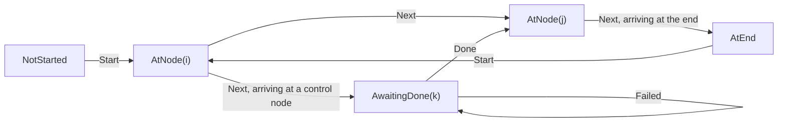
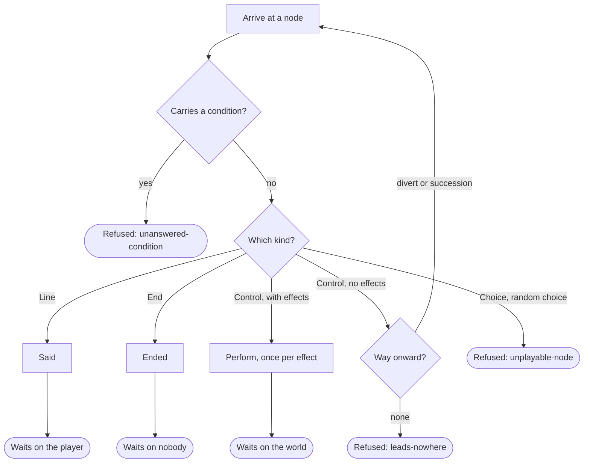

# Runner

> [!NOTE]
> Status: **partially implemented**. The C# runner plays lines, jumps, effects,
> and the end of a run, waits on the host for each effect, and refuses what it
> cannot play yet — choices, random choices, and anything that carries a condition.
> It applies the cross-cutting decisions of the
> [Dialogue Runtime Architecture](./Dialogue%20Runtime%20Architecture.md).

## Table of contents

- [Ubiquitous language](#ubiquitous-language)
- [Where the types live](#where-the-types-live)
- [State and position](#state-and-position)
- [Stepping](#stepping)
- [Arriving at a node](#arriving-at-a-node)
- [Refusals](#refusals)
- [The playable harness](#the-playable-harness)
- [Key design decisions](#key-design-decisions)
- [Error and boundary cases](#error-and-boundary-cases)
- [Testability](#testability)
- [Open questions and deferred work](#open-questions-and-deferred-work)

## Ubiquitous language

| Term | Meaning |
| --- | --- |
| **Runner** | The static `Runner.Step`: a total, deterministic transition from a context, a state, and a command. |
| **Driver** | Whoever sends commands and reads events — a harness, a CLI, a game. |
| **Command** | What a driver sends: `Start`, `Next`, `Done`, `Failed`. |
| **Event** | What a step reports: `Said`, `Ended`, `Refused`, or a request. |
| **Request** | An event the run waits on until the driver answers it: `Perform`, answered by `Done` or `Failed`. |
| **Position** | Where a run stands, and at what stage. |
| **Walk** | What arriving does: visit a node, and carry on only while it hands the host nothing. |

Event names follow the conformance corpus (`said`, `ended`, `perform`), so a
fixture, the harness, and the code read in one vocabulary. The past tense marks an
event as a report of something that already happened; `Perform` is named for what
it asks, because nothing has happened yet when it is sent.

## Where the types live

```text
src/DialogueDown.Runtime/          the facade: what a consumer calls
  PlayContext.cs  PlayState.cs  Runner.cs  StepResult.cs
  positions/                       Position, NotStarted, AtNode, AwaitingDone, AtEnd
  protocol/                        Command, Event, Request, RefusalReason
    commands/                      Start, Next, Done, Failed
    events/                        Said, Ended, Refused, Perform
  stepping/
    Arrival.cs                     one arm per node kind: the walk
    NodeTraversalExtensions.cs     one reader per edge kind: the way onward
```

Each member of a union gets its own file, as the playbook's nodes and edges do.
The root namespace keeps only the facade; positions live in
`DialogueDown.Runtime.Positions`, and commands and events share
`DialogueDown.Runtime.Protocol` because a consumer uses them together.

## State and position

`PlayState` holds only a `Position`, because the host owns the game. Visit counts
stay out: a host that wants "only once" answers a query it owns. The architecture
note's call stack, effect ordinal, and playbook fingerprint are not carried; each
arrives with the feature that reads it (see
[deferred work](#open-questions-and-deferred-work)).

A position is a closed union that carries the stage, so the state cannot
contradict itself:



`PlayContext` holds what a run needs and never changes — the playbook, and how a
position addresses a node — so the one signature every caller uses stays put as
that grows.

## Stepping

```csharp
public static StepResult Step(PlayContext context, PlayState state, Command command);

public sealed record StepResult(PlayState State, ImmutableArray<Event> Events);
```

`Step` is total and deterministic: no I/O, no mutation, and no reference to a host.
One step may report several events in order — a control node with two effects asks
for both.

What may be sent where is one matrix:

| Position | `Start` | `Next` | `Done` | `Failed` |
| --- | --- | --- | --- | --- |
| `NotStarted` | arrive at the entry | refused: `not-started` | refused: `misplaced` | refused: `misplaced` |
| `AtNode` | arrive at the entry | arrive at the way onward | refused: `misplaced` | refused: `misplaced` |
| `AwaitingDone` | arrive at the entry | refused: `misplaced` | arrive at the way onward | stand still, report nothing |
| `AtEnd` | arrive at the entry | refused: `already-ended` | refused: `misplaced` | refused: `misplaced` |

The way onward is the node's `divert` when it carries one, otherwise its
`succession`; with neither, the step is refused as `leads-nowhere`. A divert
beside a succession leaves the succession unreachable, which plays no differently.

## Arriving at a node

Arriving is a walk: visit a node, and carry on only while it hands the host
nothing. The first node that asks for something is where the run stands.

| Node | Arriving reports | The run then |
| --- | --- | --- |
| `line` | `Said(speaker name, speech)` | waits on the player — `Next` |
| `control` with effects | one `Perform` per effect, in order | waits on the world — `Done` moves on, `Failed` holds |
| `control` with no effects | nothing | walks on — this is a jump on its own line |
| `end` | `Ended` | waits on nobody |
| `choice`, `random-choice` | `Refused(unplayable-node)` | stands at that node |
| any node whose own or any out-edge's `condition` is set | `Refused(unanswered-condition)` | stands at that node |

The condition check comes first, so a `branch` node — whose arms always carry a
condition — is refused as `unanswered-condition`. `Said` carries the speaker's
**name**, never the index, and `null` for the anonymous default speaker; its speech
is the playbook's fragments as written.



## Refusals

A refusal carries a `Reason` from a closed set, which a fixture compares, and an
`Explanation` a person reads, which may differ in wording and language between
runtimes.

| Reason | The run refuses when |
| --- | --- |
| `not-started` | `Next` arrives before `Start` |
| `already-ended` | `Next` arrives after the run has ended |
| `misplaced` | a known command arrives where it cannot be taken — `Next` while the run waits on the host, or `Done`/`Failed` when nothing was asked |
| `unknown-command` | the command is one the runner does not define |
| `leads-nowhere` | the node the run stands at has no way onward |
| `endless-ring` | a walk enters a ring of nodes that hand the host nothing |
| `unanswered-condition` | a node or an out-edge carries a condition, and the run cannot ask the world yet |
| `unplayable-node` | the node kind is one this build does not play |

A refused command leaves the position where it was; a walk refused at a node
stands at that node (`AtNode`). The reason names what the driver did or what the
document cannot do, and carries no node index: a position is an encoding detail,
and the corpus asserts meaning rather than numbering.

`not-started` and `unknown-command` cannot be reached from a fixture — a session
that does not open with `start` is begun for it, and `Command` is a closed union
only this assembly extends — and stay in the set because it covers every site that
reports a refusal. A reason is **added**, never renamed or reused. Its spelling
belongs to the fixture schema, so the enum carries no serialization attribute.

## The playable harness

The harness in `DialogueDown.Runtime.Tests` plays the
[conformance corpus](./Conformance%20Corpus.md)'s `playable/` cases. Running a
session and judging it are separate pieces, each tested alone:

| Piece | Responsibility |
| --- | --- |
| `PlayableRun` | Reads one case's playbook, screens it, then holds its session against the runner |
| `Playability` | What this build can play: the node kinds, the sends a reader takes, and why a case is not there yet |
| `SessionMatcher` | Walks the session, playing each entry against the state the one before it left |
| `SessionOperator` | Steps the runner and holds the events nobody has read yet |
| `Commands` | Reads what a `send` names, one reader per command |
| `ExpectationMatchers` | Checks every claim an `expect` makes, one matcher per claim |

Each case reports **conformed**, **diverged**, or **not yet playable**. The
screening asks the playbook and the session before a step is taken, so a construct
the runner does not play reads as that rather than as a hang. A divergence outranks
not-yet-playable. `PlayableConformanceTests` names every case it expects to
conform, so a case that starts or stops passing is noticed.

## Key design decisions

### D1 — The runtime never references the compiler

`DialogueDown.Runtime` depends on `DialogueDown.Playbook` and nothing else; a
shipped game embeds a playbook and a runner, never a Markdown parser. The
architecture test `Runtime_DependsOnlyOn_ThePlaybook` enforces it.

### D2 — `Step` is a static function

There is no state to hold outside `PlayState`, so there is no runner instance. A
class would invite a field, and a field is what stops replay from working.

### D3 — The position carries the stage

`AwaitingDone` stands at the same node `AtNode` would, at a different stage.
Holding the stage in the position rather than beside it means the two cannot
disagree, and the protocol stays a relation between a position and a command
without looking at the playbook. No field declares what may be sent next: a driver
reacts to the event it just received — `Said` means advance, `Perform` means answer.

### D4 — A misplaced command is an event, not an exception

`Step` is total, so refusing is a value it returns. A driver may sit across a
transport where an exception cannot travel. This is the opposite of
`PlaybookReader`, which throws: a malformed playbook is a packaging error, while a
misplaced command is an ordinary thing a driver does and recovers from.

### D5 — The runner produces events; the driver distributes them

Several consumers want the same events — a view, a backlog, a log. Registering them
inside the core would be a subscriber list, which is state. The core returns a list;
who reads it is the driver's policy.

### D6 — One primitive, named `Next`

The runner advances one step, and that is the only way it moves. Running to a
breakpoint, stepping over, and playing to the end are driver policies built from
that primitive. It is `Next`, not Ink's `Continue`, because a debugger's `continue`
means *run until something stops you*, and a driver wants that word for the policy.

### D7 — Starting is a command, and therefore also a restart

`Step` is the only way in, so a log can record that the run began. Because state is
a value, `Start` is legal at every position and begins again at the entry — as
gdb's `run` does.

### D8 — A command validates itself; it never executes itself

A command checks invariants only it can know where it is built; legality against a
position belongs to the step. A command is a message — it crosses a transport and
is recorded in a log a port reads as data — so it never carries an
`Apply(context, state)`.

### D9 — The protocol is a matrix; the constructs are a list

`Runner.Step` keeps *what may be sent where* as one switch, because that is a
relation between a position and a command. Growth is on the other axis: node kinds
in `Arrival`, edge kinds in `NodeTraversalExtensions`, one reader apiece.

### D10 — A step runs on only while the host has been handed nothing

This is the rule every construct plugs into: a menu will be one more node that
waits, and a branch one more that does not. A jump on its own line compiles to a
control node with no effects, so it concerns nobody and the run walks past it.

### D11 — An effect is a request, not a report

The runner branches on what it reads, so an effect still in flight would send the
run down a different arm. `Perform` is answered by `Done`, and the run does not go
past it until `Done` lands — the *read your own writes* guarantee. A driver that
does not care answers at once; one awaiting a database awaits it. `Next` while the
run waits is refused as `misplaced`, so a fast-forward cannot skip a causal wait.

### D12 — One `Perform` per effect, one wait per node

A node's effects are independent things to do, so each gets its own request. They
were written as one line and effects only write, so the host applies them in order
and answers once, and round trips stay proportional to what was written.

### D13 — A ring is refused by counting

A walk that passes more nodes than the playbook has must have visited one twice,
and nothing it reads changes as it goes, so it is in a ring. The guard is a counter
against `Nodes.Length`: exact, allocation-free, and no number anybody picks.

### D14 — A condition is refused, not ignored

Speaking a conditional line without reading its condition would look like correct
play. Refusing keeps an untaught construct reading as untaught until the run can ask
the world.

### D15 — A failed effect holds the run

`Failed(explanation)` is legal exactly where `Done` is and carries the host's own
words. The run stands where it is and reports nothing — the driver's message is the
record — because a failure settles nothing, and a partial write is possible. The
driver may retry with `Done`, `Start` again, or stop; the runner offers no "skip",
because skipping is the silent wrong story the format refuses to tell.

## Error and boundary cases

| Case | Behavior |
| --- | --- |
| `Start` at any position | Accepted; begins again at the entry |
| A walk that passes exactly as many nodes as the playbook has | Legitimate; not refused |
| A control node with two effects | Two `Perform` events and one wait |
| A divert whose target is out of range, or an entry leading nowhere | Cannot occur; `PlaybookReader` refuses the document first |
| A line whose speaker index is out of range | Cannot occur; refused by the reader |
| An effect the host does not recognize | Not the runner's concern: it asks by the name the playbook gives |
| A fixture the runner cannot play yet | Reported as not yet playable, naming what is missing |

## Testability

| Level | What it covers |
| --- | --- |
| Unit — `Runner` | Each cell of the protocol matrix |
| Unit — `Arrival` | Each node kind: what it reports, and which party the run then waits on |
| Unit — traversal | Divert taken, succession fallen through to, neither available |
| Unit — harness | Each piece alone: reading a send, driving a runner, matching one claim, walking a session |
| Conformance | Every case the runner plays conforms; the rest are named as not yet playable |
| Architecture | The runtime references only the playbook |
| Property | A walk over any playbook `PlaybookGen` draws stands only at a node that playbook has, answering each stage as it reaches it |

Unit tests build playbooks by hand; the corpus supplies compiled ones. A total
function must handle shapes a compiler never emits — a line leading nowhere, a
control node with both a divert and a succession — and building them states the
indices a runner is about. `PlaybookGen` draws rather than compiles, because the
runtime tests may not reference the compiler, and a test holds it and the harness's
`Playability` screen to every node kind the format defines.

## Open questions and deferred work

- **Choices, the world seam, and saves.** `Choose`, `Asked`, `Resolve`/`Supply`,
  `Describe`, and `Restore` are designed in the
  [architecture note](./Dialogue%20Runtime%20Architecture.md#the-protocol) and not
  built; each adds commands, events, and position cases to the matrix above.
- **Undo is replay.** Rewinding the position is free because state is a value;
  rewinding the world is the host's. Replaying the log without its last command
  rewinds the runner exactly, with no inverses.
- **The playbook fingerprint.** A state resumed against a recompiled script would
  address the wrong node. Recording the fingerprint in `PlayState`, so `Step` can
  refuse the pair, arrives with saves.
- **Resolved or raw fragments in `Said`.** They are the same until queries are
  answered.
- **A writer cannot react to a failed effect.** A failure arm on a control block
  would be a language construct of its own; the held position is where it attaches.
- **The playbook format may change.** It stays at `version: 0` until a runner plays
  every construct, so this runner can still fix what it uncovers.
