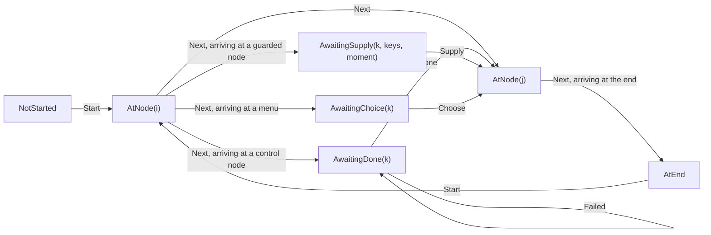
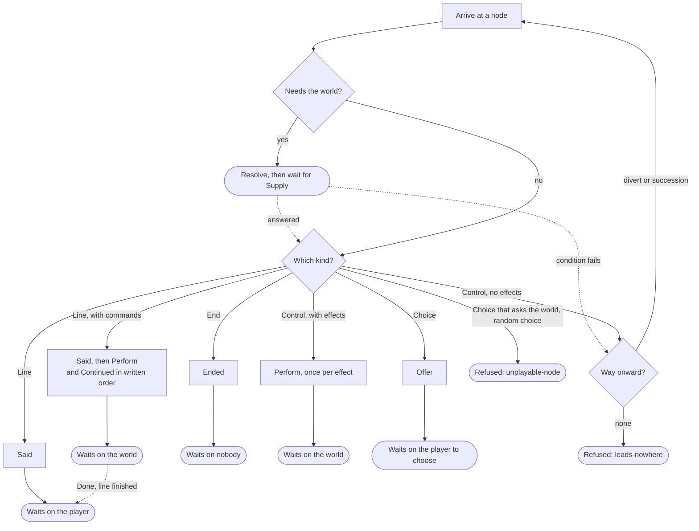

# Runner

> [!NOTE]
> Status: **partially implemented**. The C# runner plays lines, jumps, effects,
> branches, menus, and the end of a run. It waits on the host for each effect and
> on the player at each menu, asks the world about conditions and queries (see
> [Asking the World](./Asking%20the%20World.md)), and refuses what it cannot play
> yet: random choices, and menus whose options ask the world. It applies the
> cross-cutting decisions of the
> [Dialogue Runtime Architecture](./Dialogue%20Runtime%20Architecture.md).

## Table of contents

- [Ubiquitous language](#ubiquitous-language)
- [Where the types live](#where-the-types-live)
- [State and situation](#state-and-situation)
- [Stepping](#stepping)
- [Arriving at a node](#arriving-at-a-node)
- [Refusals](#refusals)
- [The playable harness](#the-playable-harness)
- [Key design decisions](#key-design-decisions)
- [Error and boundary cases](#error-and-boundary-cases)
- [Testability](#testability)
- [Open questions and deferred work](#open-questions-and-deferred-work)

## Ubiquitous language

| Term | Meaning |
| --- | --- |
| **Runner** | The static `Runner.Step`: a total, deterministic transition from a context, a state, and a command. |
| **Driver** | Whoever sends commands and reads events — a harness, a CLI, a game. |
| **Command** | What a driver sends: `Start`, `Next`, `Done`, `Failed`, `Supply`, `Choose`. |
| **Event** | What a step reports: `Said`, `Continued`, `Ended`, `Refused`, or a request. |
| **Request** | An event the run waits on until the driver answers it: `Perform`, answered by `Done` or `Failed`; `Resolve`, answered by `Supply`; `Offer`, answered by `Choose`. |
| **Menu** | A choice node: offered to the player with `Offer`, and left by the option they take with `Choose`. |
| **Situation** | Where a run is, and what it is doing there. |
| **Walk** | What arriving does: visit a node, and carry on only while it hands the host nothing. |

Event names follow the conformance corpus (`said`, `ended`, `perform`, `resolve`,
`offer`), so a fixture, the harness, and the code read in one vocabulary. The past
tense marks an event as a report of something that already happened; `Perform` is
named for what it asks, because nothing has happened yet when it is sent.

## Where the types live

```text
src/DialogueDown.Runtime/          the facade: what a consumer calls
  PlayContext.cs  PlayState.cs  Runner.cs  StepResult.cs
  situations/                      Situation, NotStarted, AtNode, AwaitingDone,
                                   AwaitingSupply, AwaitingChoice, AtEnd, Resume, Moment
  protocol/                        Command, Event, Request, RefusalReason
    commands/                      Start, Next, Done, Failed, Supply, Choose
    events/                        Said, Continued, Ended, Refused, Perform, Resolve,
                                   Offer, OfferedOption
    answers/                       Answer: what the world said about one key
  stepping/
    Arrival.cs                     arriving at a node: ask, then play or walk past
    Playing.cs                     playing a node: what it hands the host, and what follows Done
    Choosing.cs                    a menu: offer its options, then take the one chosen
    Departure.cs                   leaving a node: ask which way out, then arrive
    NodeTraversalExtensions.cs     one reader per edge kind: the way onward, a menu's options
```

Each member of a union gets its own file, as the playbook's nodes and edges do.
The root namespace keeps only the facade; situations live in
`DialogueDown.Runtime.Situations`, and commands and events share
`DialogueDown.Runtime.Protocol` because a consumer uses them together.

## State and situation

`PlayState` holds only a `Situation`, because the host owns the game. Visit counts
stay out: a host that wants "only once" answers a query it owns. The architecture
note's call stack, effect ordinal, and playbook fingerprint are not carried; each
arrives with the feature that reads it (see
[deferred work](#open-questions-and-deferred-work)).

A situation is a closed union that says where the run is and what it is doing
there, so the state cannot contradict itself:



`PlayContext` holds what a run needs and never changes — the playbook, and how a
situation addresses a node — so the one signature every caller uses stays put as
that grows.

## Stepping

```csharp
public static StepResult Step(PlayContext context, PlayState state, Command command);

public sealed record StepResult(PlayState State, ImmutableArray<Event> Events);
```

`Step` is total and deterministic: no I/O, no mutation, and no reference to a host.
One step may report several events in order — a control node with two effects asks
for both, and a line with a command in it says its words and asks for the command in
the order they were written.

What may be sent where is one matrix:

| Situation | `Start` | `Next` | `Done` | `Failed` | `Supply` | `Choose` |
| --- | --- | --- | --- | --- | --- | --- |
| `NotStarted` | arrive at the entry | refused: `not-started` | refused: `misplaced` | refused: `misplaced` | refused: `misplaced` | refused: `misplaced` |
| `AtNode` | arrive at the entry | leave by the way onward | refused: `misplaced` | refused: `misplaced` | refused: `misplaced` | refused: `misplaced` |
| `AwaitingDone` | arrive at the entry | refused: `misplaced` | at a line, go on from where it stopped or give the player the turn; otherwise leave by the way onward | stand still, report nothing | refused: `misplaced` | refused: `misplaced` |
| `AwaitingSupply` | arrive at the entry | refused: `misplaced` | refused: `misplaced` | refused: `misplaced` | play or leave the node, by its moment | refused: `misplaced` |
| `AwaitingChoice` | arrive at the entry | refused: `misplaced` | refused: `misplaced` | refused: `misplaced` | refused: `misplaced` | arrive where the chosen option leads, or refused: `no-such-option` |
| `AtEnd` | arrive at the entry | refused: `already-ended` | refused: `misplaced` | refused: `misplaced` | refused: `misplaced` | refused: `misplaced` |

The way onward is the node's `divert` when it carries one, otherwise its
`succession`; with neither, the step is refused as `leads-nowhere`. A divert
beside a succession leaves the succession unreachable, which plays no differently.
A `Choose` names an option by its position among those the menu offered, counting
from 0 in the order written. A menu's succession is not an option, so it is never
counted.

## Arriving at a node

Arriving is a walk: visit a node, and carry on only while it hands the host
nothing. The first node that asks for something is where the run stands.

| Node | Arriving reports | The run then |
| --- | --- | --- |
| `line` | `Said(speaker name, speech)` | waits on the player — `Next` |
| `line` with commands | `Said`, then a `Perform` per command and a `Continued` for the words after it, in the order written, up to a query written after a command | waits on the world — `Done` goes on with the line if it stopped, otherwise gives the player the turn; `Failed` holds |
| `control` with effects | one `Perform` per effect, in order | waits on the world — `Done` moves on, `Failed` holds |
| `control` with no effects | nothing | walks on — this is a jump on its own line |
| `branch` | nothing | leaves by the first arm, in the order written, whose condition holds |
| `end` | `Ended` | waits on nobody |
| `choice` | `Offer(ordered, options)`: every option in the order written, each label with its commands removed, each available | waits on the player — `Choose` |
| `choice` with an option's condition or a query in a label | `Refused(unplayable-node)` | stands at that node |
| `random-choice` | `Refused(unplayable-node)` | stands at that node |

Before a node plays, the run asks the world, in one `Resolve`, every key the node
needs to play: its own condition and the queries in its speech up to its first
[stop](./Speaking%20a%20Line.md#s8--the-world-is-asked-once-per-stop). A line asks once more at each stop, once the host is done. Before it leaves, it
asks in one more `Resolve` about the conditions on its ways out. The `Moment` on
`AwaitingSupply` says which of the two a `Supply` answers. A node whose own
condition fails is stepped over by its succession; a guarded way out whose
condition fails is not taken. [Asking the World](./Asking%20the%20World.md) owns
the details.

`Said` carries the speaker's **name**, never the index, and `null` for the
anonymous default speaker; its speech is the playbook's fragments with each query
replaced by what the world said.



## Refusals

A refusal carries a `Reason` from a closed set, which a fixture compares, and an
`Explanation` a person reads, which may differ in wording and language between
runtimes.

| Reason | The run refuses when |
| --- | --- |
| `not-started` | `Next` arrives before `Start` |
| `already-ended` | `Next` arrives after the run has ended |
| `misplaced` | a known command arrives where it cannot be taken — `Next` while the run waits on the host, or `Done`/`Failed` when nothing was asked |
| `unknown-command` | the command is one the runner does not define |
| `leads-nowhere` | the node the run stands at has no way onward |
| `endless-ring` | a walk enters a ring of nodes that hand the host nothing |
| `unanswered-key` | a `Supply` leaves out a key the run asked about |
| `unasked-key` | a `Supply` answers a key the run did not ask about |
| `wrong-answer-kind` | an answer is the wrong kind for its question — words for a condition, or a truth for a query |
| `key-needed-both-ways` | one node needs the same key as a truth and as words, which one answer cannot be |
| `unplayable-node` | the node kind is one this build does not play |

A refused command leaves the situation where it was; a walk refused at a node
stands at that node (`AtNode`). The reason names what the driver did or what the
document cannot do, and carries no node index: a node's position is an encoding detail,
and the corpus asserts meaning rather than numbering.

`not-started` and `unknown-command` cannot be reached from a fixture — a session
that does not open with `start` is begun for it, and `Command` is a closed union
only this assembly extends — and stay in the set because it covers every site that
reports a refusal. A reason is **added**, never renamed or reused. Its spelling
belongs to the fixture schema, so the enum carries no serialization attribute.

## The playable harness

The harness in `DialogueDown.Runtime.Tests` plays the
[conformance corpus](./Conformance%20Corpus.md)'s `playable/` cases. Running a
session and judging it are separate pieces, each tested alone:

| Piece | Responsibility |
| --- | --- |
| `PlayableRun` | Reads one case's playbook, screens it, then holds its session against the runner |
| `Playability` | What this build can play: the node kinds, the sends a reader takes, and why a case is not there yet |
| `SessionMatcher` | Walks the session, playing each entry against the state the one before it left |
| `SessionOperator` | Steps the runner and holds the events nobody has read yet |
| `Commands` | Reads what a `send` names, one reader per command |
| `ExpectationMatchers` | Checks every claim an `expect` makes, one matcher per claim |

Each case reports **conformed**, **diverged**, or **not yet playable**. The
screening asks the playbook and the session before a step is taken, so a construct
the runner does not play reads as that rather than as a hang. A divergence outranks
not-yet-playable. `PlayableConformanceTests` names every case it expects to
conform, so a case that starts or stops passing is noticed.

## Key design decisions

### D1 — The runtime never references the compiler

`DialogueDown.Runtime` depends on `DialogueDown.Playbook` and nothing else; a
shipped game embeds a playbook and a runner, never a Markdown parser. The
architecture test `Runtime_DependsOnlyOn_ThePlaybook` enforces it.

### D2 — `Step` is a static function

There is no state to hold outside `PlayState`, so there is no runner instance. A
class would invite a field, and a field is what stops replay from working.

### D3 — The situation says where the run is and what it is doing

`AwaitingDone` and `AwaitingSupply` stand at the same node `AtNode` would, doing
something else there. Holding that in the situation rather than beside the node
means the two cannot disagree, and the protocol stays a relation between a
situation and a command without looking at the playbook. No field declares what
may be sent next: a driver reacts to the events it just received — `Perform` and
`Resolve` mean answer, and a step that leaves nothing to answer means advance
([speaking a line](./Speaking%20a%20Line.md#s4--the-players-turn-comes-when-a-step-leaves-nothing-to-answer)).

### D4 — A misplaced command is an event, not an exception

`Step` is total, so refusing is a value it returns. A driver may sit across a
transport where an exception cannot travel. This is the opposite of
`PlaybookReader`, which throws: a malformed playbook is a packaging error, while a
misplaced command is an ordinary thing a driver does and recovers from.

### D5 — The runner produces events; the driver distributes them

Several consumers want the same events — a view, a backlog, a log. Registering them
inside the core would be a subscriber list, which is state. The core returns a list;
who reads it is the driver's policy.

### D6 — One primitive, named `Next`

The runner advances one step, and that is the only way it moves. Running to a
breakpoint, stepping over, and playing to the end are driver policies built from
that primitive. It is `Next`, not Ink's `Continue`, because a debugger's `continue`
means *run until something stops you*, and a driver wants that word for the policy.

### D7 — Starting is a command, and therefore also a restart

`Step` is the only way in, so a log can record that the run began. Because state is
a value, `Start` is legal in every situation and begins again at the entry — as
gdb's `run` does.

### D8 — A command validates itself; it never executes itself

A command checks invariants only it can know where it is built; legality against a
situation belongs to the step. A command is a message — it crosses a transport and
is recorded in a log a port reads as data — so it never carries an
`Apply(context, state)`.

### D9 — The protocol is a matrix; the constructs are a list

`Runner.Step` keeps *what may be sent where* as one switch, because that is a
relation between a situation and a command. Growth is on the other axis: node kinds
in `Arrival`, edge kinds in `NodeTraversalExtensions`, one reader apiece.

### D10 — A step runs on only while the host has been handed nothing

This is the rule every construct plugs into: a menu is one more node that waits,
and a branch one more that does not. A jump on its own line compiles to a
control node with no effects, so it concerns nobody and the run walks past it.

### D11 — An effect is a request, not a report

The runner branches on what it reads, so an effect still in flight would send the
run down a different arm. `Perform` is answered by `Done`, and the run does not go
past it until `Done` lands — the *read your own writes* guarantee. A driver that
does not care answers at once; one awaiting a database awaits it. `Next` while the
run waits is refused as `misplaced`, so a fast-forward cannot skip a causal wait.

### D12 — One `Perform` per effect, one wait per node

A node's effects are independent things to do, so each gets its own request. They
were written as one line and effects only write, so the host applies them in order
and answers once, and round trips stay proportional to what was written. A line
with commands in its speech waits the same way: once per step, after the words and
commands that step says, as [speaking a line](./Speaking%20a%20Line.md#s3--a-step-stops-before-a-query-written-after-a-command) describes.

### D13 — A ring is refused by counting

A walk that passes more nodes than the playbook has must have visited one twice,
and nothing it reads changes as it goes, so it is in a ring. The guard is a counter
against `Nodes.Length`: exact, allocation-free, and no number anybody picks.

### D14 — What the runner has not learned is refused, not guessed

Walking past a random choice, or offering a menu without asking the world about its
options, would look like correct play. Refusing keeps an untaught construct reading
as untaught until the runner learns it.

### D15 — A failed effect holds the run

`Failed(explanation)` is legal exactly where `Done` is and carries the host's own
words. The run stands where it is and reports nothing — the driver's message is the
record — because a failure settles nothing, and a partial write is possible. The
driver may retry with `Done`, `Start` again, or stop; the runner offers no "skip",
because skipping is the silent wrong story the format refuses to tell.

## Error and boundary cases

| Case | Behavior |
| --- | --- |
| `Start` in any situation | Accepted; begins again at the entry |
| A walk that passes exactly as many nodes as the playbook has | Legitimate; not refused |
| A control node with two effects | Two `Perform` events and one wait |
| A divert whose target is out of range, or an entry leading nowhere | Cannot occur; `PlaybookReader` refuses the document first |
| A line whose speaker index is out of range | Cannot occur; refused by the reader |
| An effect the host does not recognize | Not the runner's concern: it asks by the name the playbook gives |
| A fixture the runner cannot play yet | Reported as not yet playable, naming what is missing |

## Testability

| Level | What it covers |
| --- | --- |
| Unit — `Runner` | Each cell of the protocol matrix |
| Unit — `Arrival` | Each node kind: what it reports, and which party the run then waits on |
| Unit — traversal | Divert taken, succession fallen through to, neither available |
| Unit — harness | Each piece alone: reading a send, driving a runner, matching one claim, walking a session |
| Conformance | Every case the runner plays conforms; the rest are named as not yet playable |
| Architecture | The runtime references only the playbook |
| Property | A walk over any playbook `PlaybookGen` draws stands only at a node that playbook has, answering each stage as it reaches it |

Unit tests build playbooks by hand; the corpus supplies compiled ones. A total
function must handle shapes a compiler never emits — a line leading nowhere, a
control node with both a divert and a succession — and building them states the
indices a runner is about. `PlaybookGen` draws rather than compiles, because the
runtime tests may not reference the compiler, and a test holds it and the harness's
`Playability` screen to every node kind the format defines.

## Open questions and deferred work

- **Choices and saves.** `Choose`, `Asked`, `Describe`, and `Restore` are designed
  in the [architecture note](./Dialogue%20Runtime%20Architecture.md#the-protocol)
  and not built; each adds commands, events, and situations to the matrix above.
  An option's condition arrives with choices.
- **Undo is replay.** Rewinding the situation is free because state is a value;
  rewinding the world is the host's. Replaying the log without its last command
  rewinds the runner exactly, with no inverses.
- **The playbook fingerprint.** A state resumed against a recompiled script would
  address the wrong node. Recording the fingerprint in `PlayState`, so `Step` can
  refuse the pair, arrives with saves.
- **A writer cannot react to a failed effect.** A failure arm on a control block
  would be a language construct of its own; the held situation is where it attaches.
- **The playbook format may change.** It stays at `version: 0` until a runner plays
  every construct, so this runner can still fix what it uncovers.
