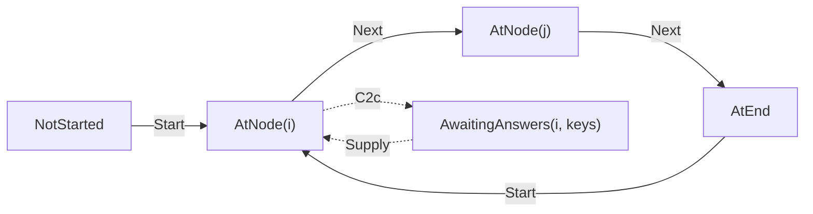

# Runtime core

> [!NOTE]
> Status: **proposed** — not yet implemented. This note designs the first pass of
> the C# runner: the state it keeps, the step that advances it, and the harness
> that runs the conformance corpus against it. It implements the runner half of
> the [Dialogue runtime architecture](./Dialogue%20Runtime%20Architecture.md),
> which owns the cross-cutting decisions this note applies.

## Table of contents

- [Goal and scope](#goal-and-scope)
- [Functionality checklist](#functionality-checklist)
- [Where the types live](#where-the-types-live)
- [The state](#the-state)
- [Stepping](#stepping)
- [The playable harness](#the-playable-harness)
- [Key design decisions](#key-design-decisions)
- [Error and boundary cases](#error-and-boundary-cases)
- [Integration](#integration)
- [Testability](#testability)
- [Open questions and deferred work](#open-questions-and-deferred-work)

## Goal and scope

A playbook can be written and read, and a corpus says what playing one must look
like, but nothing plays it. This component is the first slice that does: a
**functional core** that walks a script's plainest path — one line after another,
until the run ends — and the **harness** that holds it to the corpus.

In scope:

- `DialogueDown.Runtime`, a package that must never reference the compiler;
- `PlayState`: where a run stands, in a form that cannot contradict itself;
- `Step`: a total, deterministic transition from a state and a command;
- the protocol this slice needs — `Start`, `Next`, `Said`, `Ended`, `Refused`;
- renaming the corpus's `continue` to `next`, which this pass is the first to have
  a reason for;
- the **playable conformance harness**, and the corpus reader it shares with the
  readable half.

Out of scope, each with the pass that owns it: choices (C2b), the world seam and
conditions (C2c), effects and jumps (C2d), `Describe` (C2e), saves (C2f), and
`PlaySession` with its drivers (C2g).

This note assumes the vocabulary of the
[architecture note](./Dialogue%20Runtime%20Architecture.md) — *driver*, *runner*,
*command*, *event* — and of the
[conformance corpus](./Conformance%20Corpus.md), whose fixtures are this
component's acceptance suite.

### Why the harness ships in the first pass

The corpus was written before the runner precisely so it could specify one. If the
harness arrived last, every pass before it would be measured by argument; with it
first, each later pass is measured by fixtures that light up. It also front-loads
the risk: if a hand-authored session turns out to be unrunnable as written, that
is far cheaper to learn now than after six components assume it.

## Functionality checklist

- [x] `DialogueDown.Runtime`, referencing `DialogueDown.Playbook` and nothing else,
      with an architecture test that fails if it ever reaches for the compiler.
- [x] `PlayState` — a position, and nothing else it has no use for yet.
- [x] `Step` — total and deterministic, with no I/O and no mutation.
- [x] `Start` begins a run at the entry, from wherever it stood, so starting over needs no
      way to abort what was already running.
- [x] A line is spoken with its speaker's name, and succession advances.
- [x] A run ends, and an ended run accepts nothing further.
- [x] A command the run cannot take is refused as a message, not an exception.
- [x] `continue` becomes `next` in the fixture schema, every playable fixture, and
      the corpus README.
- [x] The corpus reader is shared by both halves rather than duplicated.
- [ ] A playable harness that runs a session and reports the first divergence.
- [ ] `linear-speech` and `styled-speech` pass; every other playable case is
      counted as not yet runnable rather than skipped in silence.

## Where the types live

```text
src/DialogueDown.Runtime/          the facade: what a consumer calls
  PlayContext.cs  PlayState.cs  Runner.cs  StepResult.cs
  positions/                       where a run stands, as a closed union
    Position.cs  NotStarted.cs  AtNode.cs  AtEnd.cs
  protocol/                        what a run is told, and what it reports
    Command.cs  commands/Start.cs  commands/Next.cs
    Event.cs    events/Said.cs  events/Ended.cs  events/Refused.cs
  stepping/                        the work each construct does
    Arrival.cs                     one arm per node kind
    NodeTraversalExtensions.cs     one reader per edge kind
```

Each member of a union gets its own file, as the playbook's nodes and edges do,
and each family gets a folder so the tree reads as the vocabulary it is.

The root namespace keeps only the façade, so `Position` and its cases live in
`DialogueDown.Runtime.Positions`. The protocol's folders are for reading: commands
and events are used together, so both stay in one namespace a consumer imports
once.

**Events are named as the corpus names them** — `said`, `ended` — so a fixture, a
harness, and the code that satisfies them read in one vocabulary. The past tense
is the point: an event reports something that already happened. This supersedes
the architecture note's `Speech` and `End`.

## The state

`PlayState` is deliberately small, because the host owns the game:

| Carries | Why |
| --- | --- |
| `Position` | Where the run stands, and at what stage |

That is the whole of it in this pass. The architecture note also gives `PlayState`
a **call stack**, an **effect ordinal**, and the **playbook fingerprint** it
belongs to. None has a consumer yet — the first needs cross-script jumps, the
second needs effects, and the third needs a save to be loaded against a script
that has since been recompiled — so each arrives with the pass that gives it
meaning rather than sitting empty through several of them. `PlayState` is not
serialized until C2f, so nothing is frozen by waiting.

**Visit counts stay out**, as the architecture note settles: a host that wants
"only once" answers a query it owns, and a counter in the core would grow every
save and duplicate the world's job.

### The position carries the stage

A run is not always simply *at* a node. In C2c it pauses at a line it has already
reached, waiting for the world to answer a question the line asks — the same node,
a different stage. So the position is a closed union rather than an index:



Holding the stage *in* the position, rather than in a flag beside it, means the
two can never disagree. It also keeps the state free of a "what may I send next"
declaration: the runner has just said what it wants — `Said` means advance,
`Asked` will mean choose — and a driver that reads state instead of reacting to the
message it received is coupled to the state model for nothing. Asking a run to
explain itself is [`Describe`](./Dialogue%20Runtime%20Architecture.md)'s job when
C2e arrives.

## Stepping

```csharp
public static StepResult Step(PlayContext context, PlayState state, Command command);

public sealed record StepResult(PlayState State, ImmutableArray<Event> Events);
```

Total, deterministic, no I/O, no mutation, and no reference to a host. Given the
same three arguments it returns the same result forever, which is what makes a
`PlayLog` replayable and a fixture meaningful.

**`PlayContext` holds what a run needs and never changes** — the playbook now,
and in later passes the entropy settings and the capabilities a driver declared.
Without it each of those would change the signature of the one function every
component calls.

One step may produce **several** events, in order: arriving at a line both says it
and leaves the run ready to advance, and the corpus's `an-effect` already expects
a performed effect before the line that follows it. Events are therefore an
ordered list from the first pass.

A `Said` event carries the speaker's **name**, not their index. The playbook
addresses speakers by position because that is cheap to write; a driver should
never have to look one up, and the anonymous default speaker has no name at all —
which is why the corpus asserts a `said` with no speaker.

## The playable harness

The harness walks a fixture's session, delivering each `send` and matching each
`expect` against the runner's next event.

Two rules, both settled by the corpus note and both easy to get wrong:

- **Take events in order, one per `expect`.** A harness that searched ahead for a
  match would accept a runner that reordered its replies, which is most of what a
  session exists to catch.
- **The run and the session must run out together**, and the two failures are
  reported differently, because one says the fixture is wrong and the other says
  the runner is.

### The corpus reader moves

`CorpusFolder` and the fixture types are `internal` to
`DialogueDown.Playbook.Tests` today. The playable harness needs them *and* a
runner, which the playbook tests must not reference, so they move into a small
shared library both test projects use.

The corpus note foresaw this: a port needs only a fixture and the document it
names, and C2 would want its own home once it had something the playbook tests
should not see.

## Key design decisions

### R1 — The runtime never references the compiler

`DialogueDown.Runtime` depends on `DialogueDown.Playbook` and nothing else. A game
embeds a playbook and a runner; shipping a Markdown parser inside a shipped game
would be a defect, not an inefficiency. An architecture test asserts it, in the
style the repository already uses for the core.

### R2 — `Step` is a static function, not a method on an object

There is no runner *instance* to hold, because there is no state to hold outside
`PlayState`. A class would invite a field, and a field is the thing that makes
replay stop working.

### R3 — The position carries the stage; nothing declares what it awaits

Argued in [the state](#the-position-carries-the-stage). One consequence is worth
stating on its own: this supersedes the architecture note's *"`PlayState` declares
what it awaits"*, which that note should be corrected to match when this ships.

### R4 — A misplaced command is an event, not an exception

`Step` is total, so refusing must be a value it can return. A driver may be across
a transport, where an exception cannot travel, and a `Refused` event says the same
thing in a form the protocol already carries.

This is the opposite of `PlaybookReader`, which throws: a malformed playbook is a
programming or packaging error, while a misplaced command is an ordinary thing a
driver does and must be able to recover from. The runner understands a narrow set
of instructions and says so plainly rather than guessing at the rest.

### R5 — The runner produces events; the driver distributes them

Several consumers will want the same events — a view, a backlog, a `PlayLog`. That
is **consumption policy**, and it belongs to the driver, which already knows how
many consumers there are and what each wants.

Registration inside the core would mean a subscriber list, which is state, which
is the thing that stops `Step` returning the same result for the same arguments.
The core returns a list; who reads it is not its business.

### R6 — One primitive, named as a debugger names it

The runner advances one step, and that is the only way it moves. Running to a
breakpoint, stepping over, and playing to the end are **driver policies** built by
sending that primitive repeatedly — so stop-and-play needs nothing from the core.

The primitive is therefore `Next`, not `Continue`. In a debugger `continue` means
*run until something stops you*, so a driver will want that word for the policy;
using it for the primitive as well would give one word two meanings at two layers.
The cost is real and paid once: ink spells it `Continue`, the architecture note
follows ink, and every playable fixture and the fixture schema spell it
`continue`. The playbook format is deliberately unstable at version 0 until a
runner plays it, which is exactly the licence to spend that now.

### R7 — Starting is a command, and therefore also a restart

`Step` is the only way in. Beginning a run through a separate entry point would
leave a `PlayLog` unable to say *"the run began"* — and a log that cannot record
its own start is not replayable from nothing.

Because state is a value, `Start` is accepted wherever a run stands and simply
produces a fresh one, which is how gdb's `run` behaves. The Debug Adapter Protocol
needs a distinct `restart` request precisely because its debuggee is an operating
system process: stateful, costly to recreate, impossible to hold as a value. None
of that applies here, so restart arrives without being designed.

### R8 — A command validates itself; it does not execute itself

A command checks its own invariants where it is built, as the playbook's records
do with `AssertNotNegative`: `Choose(-1)` should be impossible to construct. What
it cannot check there is legality — whether the index addresses an option that was
offered needs the playbook and the position, so it belongs to the step, where both
are in view. The line is *what only the command can know* against *what needs the
world*.

Execution stays out of the command for a reason that outlives this pass: a command
is a message. It crosses a transport, it is recorded in a `PlayLog`, and a port
reads that log as data. A message carrying `Apply(context, state)` is a message
that knows the playbook's internals, and the log stops being something another
language can simply read.

The commands in this pass carry no arguments, so there is nothing yet to validate.
The rule is recorded because `Choose` and `Start`'s anchor arrive with the passes
that need them.

### R9 — The protocol is a matrix; the constructs are a list

`Step` keeps the whole of *what may be sent where* as one switch, because that is
a **relation** between a position and a command: split it by either axis and
answering "what can I send here?" means reading several files. It stays small —
about seven arms once every command exists, since `Start` and `Restore` are legal
everywhere and the rest in one place each.

Growth is on the other axis: six node kinds to arrive at, five edge kinds to
follow, each with work of its own. Those live in `Arrival` and in the traversal
extensions, one reader apiece, as `emission/` already keeps a mapping per node,
edge, and fragment.

### R10 — The harness ships with the first pass, not the last

Argued in [Goal and scope](#goal-and-scope): it converts every later component's
review from a discussion into a count.

## Error and boundary cases

| Case | Behavior |
| --- | --- |
| A command the run cannot take here | A `Refused` event; the position does not move |
| `Next` at an ended run | Refused, for the same reason — an ended run goes nowhere |
| `Next` before a run has started | Refused: there is nothing to advance from |
| `Start` at any position | Accepted, and begins again at the entry |
| A state whose fingerprint is not this playbook's | Refused: a state from another script is not a state at all |
| A playbook whose entry leads nowhere | Cannot occur; `PlaybookReader` refuses it before a runner sees it |
| A line whose speaker index is out of range | Cannot occur; refused by the reader |
| A node kind this pass cannot play | A `Refused` event naming the kind, so an unteachable construct reads as such rather than as a hang |
| A fixture the runner cannot yet play | Counted as not yet runnable, naming the case, never skipped in silence |

## Integration

| Seam | Change |
| --- | --- |
| `src/DialogueDown.Runtime` | New project, referencing `DialogueDown.Playbook` |
| Architecture tests | A rule that the runtime reaches for neither the compiler nor any host |
| Shared corpus library | `CorpusFolder` and the fixture types move out of the playbook tests |
| `DialogueDown.Playbook.Tests` | Keeps the readable harness, now reading the corpus through the shared library |
| `conformance/` and `schema/fixture-0.schema.json` | `continue` becomes `next`, in the fixtures, the schema, and the README |
| Architecture note | `PlayState` no longer declares what it awaits, and the events are named as the corpus names them; both are corrected when this ships |
| C2b–C2g | Each adds commands, events, and position cases to what this pass establishes |
| CI | Nothing new is scheduled; the harness runs with the existing suite |

## Testability

| Level | What it covers |
| --- | --- |
| Unit — `Step` | One test per transition: a run started and restarted, a line spoken, succession taken, a run ended, a command refused |
| Unit — harness | The harness fails when it should: a divergence, a short run, a long session |
| Conformance | `linear-speech` and `styled-speech` play; the rest are counted as not yet runnable |
| Architecture | The runtime references neither the compiler nor a host |
| Property | Stepping any playbook from its entry terminates, and never leaves a position outside the document |

The property test is worth its keep here rather than later: a walk that can loop
forever or step off the end is the failure mode a handful of examples miss, and
CsCheck is already used this way in `CompilerPropertyTests`.

**Unit tests build playbooks by hand; the corpus supplies compiled ones.** A
playbook is an immutable record, so a real one is a better stand-in than a
substitute, and stepping dispatches on the kind of node it finds, which a
substitute would have to return anyway. More to the point, several cases a total
function must handle are shapes a compiler will never emit — a line leading
nowhere, a node kind this pass cannot play, a control node holding both a divert
and a succession — so they can only be stated outright. Building them also states
the indices, which is what a runner is *about*: a test that compiled a script
would assert against a position its source text does not show. Real compiler
output arrives where it belongs, in the conformance corpus, whose every playbook
is `ddown compile`'s and is checked against its source.

## Open questions and deferred work

- **How should a not-yet-runnable fixture be reported?** A failing test would make
  the suite red for six passes; a skip would make it invisible. The plan is to
  assert the count against an expected number: it stays green, it cannot drift
  unnoticed, and it goes up every pass. **The mechanism is temporary** and comes
  out when the last fixture runs, or it becomes a ceiling nobody revisits.
- **Undo is replay, not compensation.** Two undos exist, and only one is the
  runner's: rewinding the *position* is free because state is a value, while
  rewinding the *world* is the host's and is often impossible — a transferred item
  does not come back. The architecture note settles the second as
  [D9](./Dialogue%20Runtime%20Architecture.md), and a saga of host-declared
  compensators does not rescue it: compensation can itself fail, leaving a
  half-undone world, and the runner has no transaction boundary to offer, since
  whether "undo" means a step, a line, or the last choice is a driver's decision.
  What the command vocabulary *does* buy is cheaper: **replaying the log without
  its last command** rewinds the runner exactly, needs no inverses, and is safe
  because a replaying driver runs in `Simulate`. C2f and C2g inherit this rather
  than an `Undo` on each command.
- **The playbook fingerprint waits for C2f.** A state carried into a recompiled
  script resumes at an index that now means a different line, which is how this
  class of engine corrupts a playthrough. Catching it needs the state to record
  which playbook it came from, so that `Step` can refuse the pair rather than
  leave the check to whoever remembers. Nothing serializes a state until saves
  land, so it arrives with them. **Note for that pass:** the architecture note
  carries the fingerprint both on `PlayState` and in the save envelope, and once
  the state has it the envelope's copy is the same field written twice.
- **Does `Said` carry resolved fragments or the playbook's own?** They are the
  same until C2c introduces queries, so this pass cannot answer it and should not
  pretend to.
- **The playbook format may change.** It stays unstable at `playbookVersion: 0`
  until a runner plays it, precisely so the first runner can fix what it uncovers.
  Writing the corpus already found one such defect before any runner existed
  ([#369](https://github.com/pengzhengyi/dialoguedown/issues/369), since fixed);
  stepping a playbook is the next thing likely to find one.
