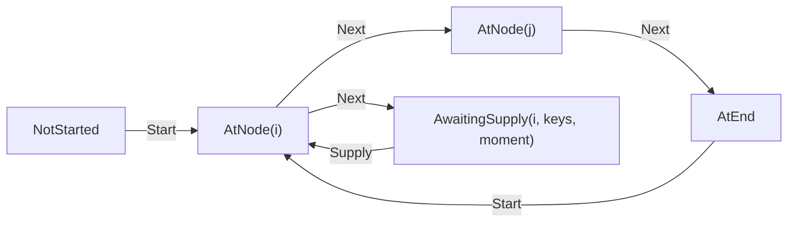

# Runtime core

> [!NOTE]
> Status: **implemented**. The first pass of the C# runner: the state it keeps,
> the step that advances it, and the harness that runs the conformance corpus
> against it. It implements the runner half of the
> [Dialogue runtime architecture](./Dialogue%20Runtime%20Architecture.md),
> which owns the cross-cutting decisions this note applies.

## Table of contents

- [Goal and scope](#goal-and-scope)
- [Functionality checklist](#functionality-checklist)
- [Where the types live](#where-the-types-live)
- [The state](#the-state)
- [Stepping](#stepping)
- [The playable harness](#the-playable-harness)
- [Key design decisions](#key-design-decisions)
- [Error and boundary cases](#error-and-boundary-cases)
- [Integration](#integration)
- [Testability](#testability)
- [Open questions and deferred work](#open-questions-and-deferred-work)

## Goal and scope

A playbook can be written and read, and a corpus says what playing one must look
like, but nothing plays it. This component is the first slice that does: a
**functional core** that walks a script's plainest path — one line after another,
until the run ends — and the **harness** that holds it to the corpus.

In scope:

- `DialogueDown.Runtime`, a package that must never reference the compiler;
- `PlayState`: where a run stands, in a form that cannot contradict itself;
- `Step`: a total, deterministic transition from a state and a command;
- the protocol this slice needs — `Start`, `Next`, `Said`, `Ended`, `Refused`;
- renaming the corpus's `continue` to `next`, which this pass is the first to have
  a reason for;
- the **playable conformance harness**, and the corpus reader it shares with the
  readable half.

Out of scope, each with the pass that owns it: choices (C2b), the world seam and
conditions (C2c), `Describe` (C2e), saves (C2f), and `PlaySession` with its
drivers (C2g). Effects and jumps were C2d, and
[waiting on the host](./Waiting%20on%20the%20Host.md) has since delivered them.

This note assumes the vocabulary of the
[architecture note](./Dialogue%20Runtime%20Architecture.md) — *driver*, *runner*,
*command*, *event* — and of the
[conformance corpus](./Conformance%20Corpus.md), whose fixtures are this
component's acceptance suite.

### Why the harness ships in the first pass

The corpus was written before the runner precisely so it could specify one. If the
harness arrived last, every pass before it would be measured by argument; with it
first, each later pass is measured by fixtures that light up. It also front-loads
the risk: if a hand-authored session turns out to be unplayable as written, that
is far cheaper to learn now than after six components assume it.

## Functionality checklist

- [x] `DialogueDown.Runtime`, referencing `DialogueDown.Playbook` and nothing else,
      with an architecture test that fails if it ever reaches for the compiler.
- [x] `PlayState` — a situation, and nothing else it has no use for yet.
- [x] `Step` — total and deterministic, with no I/O and no mutation.
- [x] `Start` begins a run at the entry, from wherever it stood, so starting over needs no
      way to abort what was already running.
- [x] A line is spoken with its speaker's name, and succession advances.
- [x] A run ends, and an ended run accepts nothing further.
- [x] A command the run cannot take is refused as a message, not an exception.
- [x] A refusal names why, from a closed set a fixture can assert without reading English.
- [x] `continue` becomes `next` in the fixture schema, every playable fixture, and
      the corpus README.
- [x] The corpus reader is shared by both halves rather than duplicated.
- [x] A playable harness that runs a session and reports the first divergence.
- [x] `linear-speech` and `styled-speech` pass; every other playable case is
      named as not yet playable rather than skipped in silence.

## Where the types live

```text
src/DialogueDown.Runtime/          the facade: what a consumer calls
  PlayContext.cs  PlayState.cs  Runner.cs  StepResult.cs
  situations/                      where a run is and what it is doing, as a closed union
    Situation.cs  NotStarted.cs  AtNode.cs  AtEnd.cs
  protocol/                        what a run is told, and what it reports
    Command.cs  commands/Start.cs  commands/Next.cs
    Event.cs  RefusalReason.cs  events/Said.cs  events/Ended.cs  events/Refused.cs
  stepping/                        the work each construct does
    Arrival.cs                     one arm per node kind
    NodeTraversalExtensions.cs     one reader per edge kind
```

Each member of a union gets its own file, as the playbook's nodes and edges do,
and each family gets a folder so the tree reads as the vocabulary it is.

The root namespace keeps only the facade, so `Situation` and its cases live in
`DialogueDown.Runtime.Situations`. The protocol's folders are for reading: commands
and events are used together, so both stay in one namespace a consumer imports
once.

**Events are named as the corpus names them** — `said`, `ended` — so a fixture, a
harness, and the code that satisfies them read in one vocabulary. The past tense
is the point: an event reports something that already happened.

## The state

`PlayState` is deliberately small, because the host owns the game:

| Carries | Why |
| --- | --- |
| `Situation` | Which node the run has reached, and what it is doing there |

That is the whole of it in this pass. The architecture note also gives `PlayState`
a **call stack**, an **effect ordinal**, and the **playbook fingerprint** it
belongs to. None has a consumer yet — the first needs cross-script jumps, the
second needs effects, and the third needs a save to be loaded against a script
that has since been recompiled — so each arrives with the pass that gives it
meaning rather than sitting empty through several of them. `PlayState` is not
serialized until C2f, so nothing is frozen by waiting.

**Visit counts stay out**, as the architecture note settles: a host that wants
"only once" answers a query it owns, and a counter in the core would grow every
save and duplicate the world's job.

### One value for where and what

A run is not always simply *at* a node. It can pause at a node it has already
reached, waiting for the world to answer a question the node asks — the same node,
a different thing being done there. So the situation is a closed union rather than
an index:



Holding what the run is doing *in* the situation, rather than in a flag beside the
node, means the two can never disagree. It also keeps the state free of a "what may I send next"
declaration: the runner has just said what it wants — `Said` means advance,
`Asked` will mean choose — and a driver that reads state instead of reacting to the
message it received is coupled to the state model for nothing. Asking a run to
explain itself is [`Describe`](./Dialogue%20Runtime%20Architecture.md)'s job when
C2e arrives.

## Stepping

```csharp
public static StepResult Step(PlayContext context, PlayState state, Command command);

public sealed record StepResult(PlayState State, ImmutableArray<Event> Events);
```

Total, deterministic, no I/O, no mutation, and no reference to a host. Given the
same three arguments it returns the same result forever, which is what makes a
`PlayLog` replayable and a fixture meaningful.

**`PlayContext` holds what a run needs and never changes** — the playbook now,
and in later passes the entropy settings and the capabilities a driver declared.
Without it each of those would change the signature of the one function every
component calls.

One step may produce **several** events, in order: a control node carrying more
than one effect asks the host to perform each of them, in the order written,
before the run waits for them to be done. Events are therefore an ordered list
from the first pass.

A `Said` event carries the speaker's **name**, not their index. The playbook
addresses speakers by position because that is cheap to write; a driver should
never have to look one up, and the anonymous default speaker has no name at all —
which is why the corpus asserts a `said` with no speaker.

## The playable harness

The harness walks a fixture's session, delivering each `send` and matching each
`expect` against the runner's next event.

Two rules, both settled by the corpus note and both easy to get wrong:

- **Take events in order, one per `expect`.** A harness that searched ahead for a
  match would accept a runner that reordered its replies, which is most of what a
  session exists to catch.
- **The run and the session must run out together.** A run that falls silent while
  the session still expects, and a session that ends while events sit unread, are
  both divergences, and each says which one happened.

### What the harness is made of

Running a session and judging it are separate jobs, and each piece is tested on
its own:

| Piece | Responsibility |
| --- | --- |
| `PlayableRun` | Reads one case's playbook, and reports a construct this pass cannot play before a step is taken |
| `SessionMatcher` | Walks the session, playing each entry against the state the one before it left |
| `SessionOperator` | Steps the runner and holds the events nobody has read yet |
| `Commands` | Reads the command a `send` names |
| `ExpectationMatchers` | Checks every claim an `expect` makes, one matcher per claim |

Each reports a `SessionOutcome`: **conformed**, **diverged** with what disagreed,
or **not yet playable** with what nobody has taught the harness. A divergence
outranks a construct nobody has taught the runner, so a session that turns up
both is reported as diverged.

### The shared corpus reader

`CorpusFolder` and the fixture types live in `DialogueDown.Conformance`, a small
library both test projects reference. The playable harness needs them *and* a
runner, which the playbook tests must not reference.

The corpus note foresaw this: a port needs only a fixture and the document it
names, and C2 would want its own home once it had something the playbook tests
should not see.

## Key design decisions

### R1 — The runtime never references the compiler

`DialogueDown.Runtime` depends on `DialogueDown.Playbook` and nothing else. A game
embeds a playbook and a runner; shipping a Markdown parser inside a shipped game
would be a defect, not an inefficiency. An architecture test asserts it, in the
style the repository already uses for the core.

### R2 — `Step` is a static function, not a method on an object

There is no runner *instance* to hold, because there is no state to hold outside
`PlayState`. A class would invite a field, and a field is the thing that makes
replay stop working.

### R3 — The situation says where and what; nothing declares what it awaits

Argued in [the state](#one-value-for-where-and-what). A driver reacts to the
event it just received rather than reading the state, so the state needs no
declaration of what may be sent next.

### R4 — A misplaced command is an event, not an exception

`Step` is total, so refusing must be a value it can return. A driver may be across
a transport, where an exception cannot travel, and a `Refused` event says the same
thing in a form the protocol already carries.

This is the opposite of `PlaybookReader`, which throws: a malformed playbook is a
programming or packaging error, while a misplaced command is an ordinary thing a
driver does and must be able to recover from. The runner understands a narrow set
of instructions and says so plainly rather than guessing at the rest.

### R5 — The runner produces events; the driver distributes them

Several consumers will want the same events — a view, a backlog, a `PlayLog`. That
is **consumption policy**, and it belongs to the driver, which already knows how
many consumers there are and what each wants.

Registration inside the core would mean a subscriber list, which is state, which
is the thing that stops `Step` returning the same result for the same arguments.
The core returns a list; who reads it is not its business.

### R6 — One primitive, named as a debugger names it

The runner advances one step, and that is the only way it moves. Running to a
breakpoint, stepping over, and playing to the end are **driver policies** built by
sending that primitive repeatedly — so stop-and-play needs nothing from the core.

The primitive is therefore `Next`, not `Continue`. In a debugger `continue` means
*run until something stops you*, so a driver will want that word for the policy;
using it for the primitive as well would give one word two meanings at two layers.
Ink spells the primitive `Continue`, and this diverges from it deliberately: the
playbook format is unstable at version 0 until a runner plays it, which is what
made renaming the corpus cheap.

### R7 — Starting is a command, and therefore also a restart

`Step` is the only way in. Beginning a run through a separate entry point would
leave a `PlayLog` unable to say *"the run began"* — and a log that cannot record
its own start is not replayable from nothing.

Because state is a value, `Start` is accepted wherever a run stands and simply
produces a fresh one, which is how gdb's `run` behaves. The Debug Adapter Protocol
needs a distinct `restart` request precisely because its debuggee is an operating
system process: stateful, costly to recreate, impossible to hold as a value. None
of that applies here, so restart arrives without being designed.

### R8 — A command validates itself; it does not execute itself

A command checks its own invariants where it is built, as the playbook's records
do with `AssertNotNegative`: `Choose(-1)` should be impossible to construct. What
it cannot check there is legality — whether the index addresses an option that was
offered needs the playbook and the situation, so it belongs to the step, where both
are in view. The line is *what only the command can know* against *what needs the
world*.

Execution stays out of the command for a reason that outlives this pass: a command
is a message. It crosses a transport, it is recorded in a `PlayLog`, and a port
reads that log as data. A message carrying `Apply(context, state)` is a message
that knows the playbook's internals, and the log stops being something another
language can simply read.

The commands in this pass carry no arguments, so there is nothing yet to validate.
The rule is recorded because `Choose` and `Start`'s anchor arrive with the passes
that need them.

### R9 — The protocol is a matrix; the constructs are a list

`Step` keeps the whole of *what may be sent where* as one switch, because that is
a **relation** between a situation and a command: split it by either axis and
answering "what can I send here?" means reading several files. It stays small —
about seven arms once every command exists, since `Start` and `Restore` are legal
everywhere and the rest in one place each.

Growth is on the other axis: six node kinds to arrive at, five edge kinds to
follow, each with work of its own. Those live in `Arrival` and in the traversal
extensions, one reader apiece, as `emission/` already keeps a mapping per node,
edge, and fragment.

### R10 — The harness ships with the first pass, not the last

Argued in [Goal and scope](#goal-and-scope): it measures every later component by
the fixtures that light up rather than by argument.

### R11 — A refusal names a reason, from a closed set

A refusal says two things. `Reason`, from a **closed set**, is what a fixture
compares: it is the same in every runtime, so two either agree or they do not.
`Explanation` is the sentence a person reads, naming what was sent and why it did
not fit, and it stays free to differ in wording and language — the rule the readable
half already applies to a reader's message (F5 in the
[corpus note](./Conformance%20Corpus.md)).

| Reason | The run refuses when |
| --- | --- |
| `not-started` | `Next` arrives before `Start`, so there is nothing to advance from |
| `already-ended` | `Next` arrives after the run has ended |
| `misplaced` | a command the runner knows arrives where it cannot be taken — `Next` while the run waits on the host, or `Done`/`Failed` when nothing was asked |
| `unknown-command` | the command is one the runner does not define |
| `leads-nowhere` | the node the run stands at has no way onward |
| `endless-ring` | a walk enters a ring of nodes that hand the host nothing |
| `unplayable-node` | the node kind is one this build has not learned to play |

`misplaced` is the one worth naming twice: the protocol knows the command, and only
the situation is wrong, so a `Next` offered while the run waits on the host is refused
rather than taken — which is what stops a fast-forward from skipping an effect.

The reason is a **message, not a diagnosis**. It says what the driver did wrong, or
what the document cannot do, and carries no node index: a position is an encoding
detail, and the corpus asserts meaning rather than numbering.

Where a reason is **spelled** is the fixture format's business rather than this
enum's: the schema declares the names and the fixtures that use them pin them, so
the runtime carries no serialization attribute. One fact, one place: the runner's
types are about playing a playbook, not about how a message is written down.

Two members are not reachable from a fixture — a session that does not open with
`start` is begun for it, and a harness sends only commands it knows — and they stay
in the set because it covers every site that fires a `Refused`, not only the sites
the corpus can reach. `unknown-command` is out of a test's reach as well: `Command`
is a closed union, so only this assembly can define one, and the member is the guard
for the command a later pass adds. A reason is **added**, never renamed or reused: a
fixture may assert any member, so the set grows compatibly and changes only with a
break.

## Error and boundary cases

| Case | Behavior |
| --- | --- |
| A command the run cannot take here | A `Refused` event; the run does not move |
| `Next` at an ended run | Refused, for the same reason — an ended run goes nowhere |
| `Next` before a run has started | Refused: there is nothing to advance from |
| `Start` in any situation | Accepted, and begins again at the entry |
| A state whose fingerprint is not this playbook's | Refused: a state from another script is not a state at all |
| A playbook whose entry leads nowhere | Cannot occur; `PlaybookReader` refuses it before a runner sees it |
| A line whose speaker index is out of range | Cannot occur; refused by the reader |
| A node kind this pass cannot play | A `Refused` event naming the kind, so an unteachable construct reads as such rather than as a hang |
| A fixture the runner cannot yet play | Reported as not yet playable, naming the case and what nobody plays yet |

## Integration

| Seam | Change |
| --- | --- |
| `src/DialogueDown.Runtime` | New project, referencing `DialogueDown.Playbook` |
| Architecture tests | A rule that the runtime reaches for neither the compiler nor any host |
| Shared corpus library | `CorpusFolder` and the fixture types live in `DialogueDown.Conformance`, which both test projects reference |
| `DialogueDown.Playbook.Tests` | Keeps the readable harness, now reading the corpus through the shared library |
| `conformance/` and `schema/fixture-0.schema.json` | `continue` becomes `next`, in the fixtures, the schema, and the README |
| Architecture note | `PlayState` no longer declares what it awaits, and the commands and events are named as the corpus names them |
| C2b–C2g | Each adds commands, events, and situation cases to what this pass establishes |
| CI | Nothing new is scheduled; the harness runs with the existing suite |

## Testability

| Level | What it covers |
| --- | --- |
| Unit — `Step` | One test per transition: a run started and restarted, a line spoken, succession taken, a run ended, a command refused |
| Unit — harness | Each piece alone: reading a send, driving a runner, matching one claim, walking a whole session |
| Conformance | Every case the runner has been taught plays; the rest are named as not yet playable |
| Architecture | The runtime references neither the compiler nor a host |
| Property | A walk over any playbook the reader accepts only ever stands at a node that playbook has |

The property test is worth its keep here rather than later: stepping off the end
of the document is the failure mode a handful of examples miss, and each pass adds
a way to compute the next position, so the guard is cheapest to put up first.
Playbooks are drawn rather than compiled, because the generator must not reach for
a compiler the runtime may not reference, and what it draws is put to the reader
so the drawing and the rules cannot drift apart in silence.

A walk is cut off after a fixed number of steps rather than run to an end: a
playbook may legitimately loop, so reaching an end is not something every walk
owes.

**Unit tests build playbooks by hand; the corpus supplies compiled ones.** A
playbook is an immutable record, so a real one is a better stand-in than a
substitute, and stepping dispatches on the kind of node it finds, which a
substitute would have to return anyway. More to the point, several cases a total
function must handle are shapes a compiler will never emit — a line leading
nowhere, a node kind this pass cannot play, a control node holding both a divert
and a succession — so they can only be stated outright. Building them also states
the indices, which is what a runner is *about*: a test that compiled a script
would assert against a position its source text does not show. Real compiler
output arrives where it belongs, in the conformance corpus, whose every playbook
is `ddown compile`'s and is checked against its source.

## Open questions and deferred work

- **The not-yet-playable list is temporary.** Each case is *named* as conforming
  or not yet playable rather than counted, so a case that starts passing and a
  case that stops are both noticed. Whether a case can run is asked of the
  playbook before a step is taken, so a construct the runner has not learned
  reads as that. The list comes out when the last fixture runs, or it becomes a
  ceiling nobody revisits.
- **Undo is replay, not compensation.** Two undos exist, and only one is the
  runner's: rewinding the *situation* is free because state is a value, while
  rewinding the *world* is the host's and is often impossible — a transferred item
  does not come back. The architecture note settles the second as
  [D9](./Dialogue%20Runtime%20Architecture.md), and a saga of host-declared
  compensators does not rescue it: compensation can itself fail, leaving a
  half-undone world, and the runner has no transaction boundary to offer, since
  whether "undo" means a step, a line, or the last choice is a driver's decision.
  What the command vocabulary *does* buy is cheaper: **replaying the log without
  its last command** rewinds the runner exactly, needs no inverses, and is safe
  because a replaying driver runs in `Simulate`. C2f and C2g inherit this rather
  than an `Undo` on each command.
- **The playbook fingerprint waits for C2f.** A state carried into a recompiled
  script resumes at an index that now means a different line, which is how this
  class of engine corrupts a playthrough. Catching it needs the state to record
  which playbook it came from, so that `Step` can refuse the pair rather than
  leave the check to whoever remembers. Nothing serializes a state until saves
  land, so it arrives with them. **Note for that pass:** the architecture note
  carries the fingerprint both on `PlayState` and in the save envelope, and once
  the state has it the envelope's copy is the same field written twice.
- **The playbook format may change.** It stays unstable at `playbookVersion: 0`
  until a runner plays it, precisely so the first runner can fix what it uncovers.
  Writing the corpus already found one such defect before any runner existed
  (since fixed);
  stepping a playbook is the next thing likely to find one.
