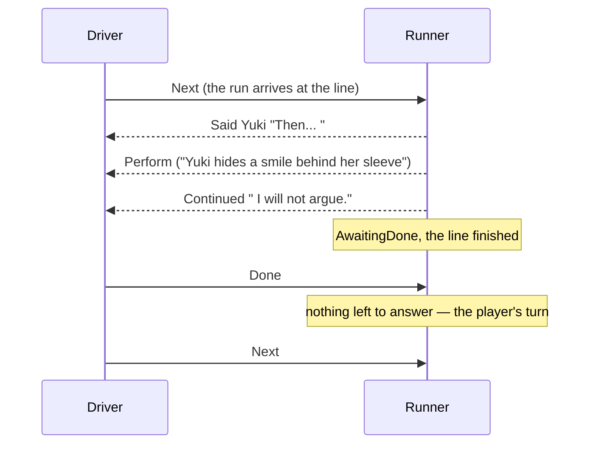
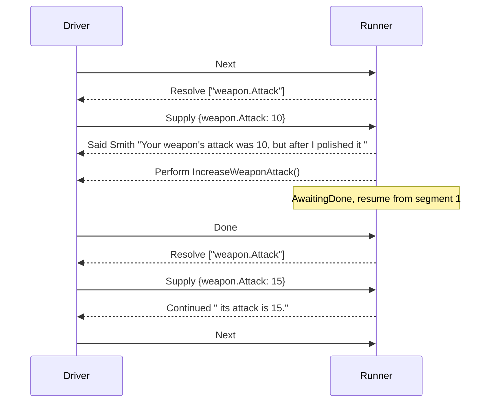

# Speaking a line

> [!NOTE]
> Status: **implemented**. The pass that plays a line whose speech carries commands:
> its words and its commands reach the host in the order they were written, and
> the run stops inside the line only before a query written after a command. It
> builds on [asking the world](./Asking%20the%20World.md) and the
> [runner](./Runner.md)'s wait on the host, whose requests it
> interleaves with speech, and applies the
> [dialogue runtime architecture](./Dialogue%20Runtime%20Architecture.md), which
> owns the cross-cutting decisions this note uses.

## Table of contents

- [Goal and scope](#goal-and-scope)
- [Vocabulary](#vocabulary)
- [Functionality checklist](#functionality-checklist)
- [How a line is played](#how-a-line-is-played)
- [Interfaces and abstractions](#interfaces-and-abstractions)
- [Key design decisions](#key-design-decisions)
- [Error and boundary cases](#error-and-boundary-cases)
- [Integration](#integration)
- [Testability](#testability)

## Goal and scope

A writer puts a command inside a line to tie it to the words around it:

```markdown
Keeper: Steel and nerve. Perhaps you *will* come back. `GiveQuest("EmberCrown")`
```

The host needs to know when to carry out each command, a command there must be
able to report failure, and a query after a command must see what the command
changed. So the runner plays such a line in the order it was written: the line
opens with a `Said` that names its speaker, each command arrives as a `Perform`,
and each run of words after a command arrives as a `Continued`. A step stops
inside the line only before a query written after a command, so that query is
read once the command has run.

The pass has two milestones:

| Milestone | What it delivers |
| --- | --- |
| **M1 — a line performs its commands in place** | Words and commands in written order in one step; the run waits for `Done`, then stands at the line for `Next` |
| **M2 — a query after a command stops the line** | The step stops after the last command before that query; once the host is done, the world is asked, and the line resumes |

In scope:

- the segment walk, driven by `SpeechTemplate.Segments`;
- `Continued`, the event for a later part of the same utterance;
- the place inside a line the run resumes from, carried by the situation;
- asking the world once per stop rather than once per line;
- playing a node in its own step type, `Playing`, beside `Arrival` and
  `Departure`;
- a `continued` expectation in the fixture schema, its matcher, and corpus cases.

Out of scope: choices (C2b), `Describe` (C2e), and saves (C2f), though the
resume place is designed to be saved; a command written before a line's speaker
prefix, as in `` `Wave()` Alice: Hello. ``, losing that speaker, which the compiler
owns; and how whitespace and quotes in speech are normalized, which the language
owns.

## Vocabulary

| Term | Meaning |
| --- | --- |
| **Segment** | A run of words and the command that follows them, as `SpeechTemplate.Segments` returns. A line is one or more segments; either half of one may be empty |
| **Part** | The words of one segment as the host receives them. The first segment's words are the `Said`; the words of each later segment are a `Continued` |
| **Says something** | A segment says something when its words hold anything other than whitespace and line breaks, judged on the fragments before any query is filled |
| **Stop** | A point inside a line where the step ends before the line does |
| **Resume place** | The segment the run carries on from after a stop |

## Functionality checklist

M1:

- [x] A line's words and commands reach the host in written order, in one step.
- [x] Every line opens with a `Said` that names its speaker, carrying the words
      before its first command, which may be none.
- [x] The words after each command are a `Continued`, with no speaker, sent only
      when they say something.
- [x] Once the host is done, a line waits for the player's `Next`; a control block
      moves on.
- [x] `Failed` on a command inside a line holds the run, as it does for a control
      block, and `Done` then carries on.
- [x] The player's turn comes when a step leaves the host nothing to answer.
- [ ] An option's label is never performed. Deferred to choices (C2b).

M2:

- [x] A step stops after the last command before a query written after it.
- [x] Once the host is done, the run asks about the keys of the segment it
      resumes from, then continues.
- [x] A line's guard and its first segment's keys are asked on arrival in one
      request.
- [x] One key asked on both sides of a stop is asked twice.
- [x] The run only ever stands at a resume place its line has.

## How a line is played

Each line below plays in one step unless it stops; the arrow marks the host's
`Done`.

| Line | What the host receives |
| --- | --- |
| `Alice: Hello.` | `Said` Alice "Hello." |
| ``Alice: Hello. `Wave()` `` | `Said` Alice "Hello. " · `Perform` Wave → the player's turn |
| ``Alice: `Wave()` `` | `Said` Alice "" · `Perform` Wave → the player's turn |
| ``Alice: `Wave()` Hello.`` | `Said` Alice "" · `Perform` Wave · `Continued` " Hello." → the player's turn |
| ``Alice: Hi. `Bow()` `Wave()` Bye.`` | `Said` Alice "Hi. " · `Perform` Bow · `Perform` Wave · `Continued` " Bye." → the player's turn |

The last row has a single space between the two commands. That segment says
nothing, so no `Continued` is sent for it.

A line with no command is one `Said`. A line with commands but no
query after any of them is still one step: the host hears everything in order,
answers every `Perform` with one `Done`, and then the player reads and moves on.
A stage direction inside a sentence plays that way:

```markdown
Yuki: Then... `("Yuki hides a smile behind her sleeve")` I will not argue.
```



A query written after a command is the one case that stops. In this line the
second query must read the value the command changed, so the step stops after the
command, and the second question is asked only once the host has made the change:

```markdown
Smith: Your weapon's attack was `"weapon.Attack"`, but after I polished it `IncreaseWeaponAttack()` its attack is `"weapon.Attack"`.
```



## Interfaces and abstractions

| Type | Responsibility | Collaborators |
| --- | --- | --- |
| `SpeechTemplate.Segments` | Breaks speech into segments at each command | `Playing` |
| `SpeechSegment.SaysSomething` | Whether a segment's words say something, judged before any query is filled | `LineEventsBuilder` |
| `SpeechTemplate.HasKeys` | Whether a run of speech holds a query, which is where a step stops | `Playing` |
| `LineEventsBuilder` | Gathers the events of the part of a line a step plays, one segment at a time: the `Said` when the part starts the line, each `Continued`, and each `Perform` | `Playing` |
| `Continued(speech)` | An event: the words after a command, in the utterance the line's `Said` opened | `Event`, alongside `Said` |
| `AwaitingDone(node, resume)` | Waiting for the host, and where the node carries on once it is done | `Situation` |
| `Resume` | A closed union: `From(segmentIndex)`, the line continues from that segment; or `FromNodeEnd`, the node has finished playing | `AwaitingDone` |
| `AwaitingSupply(node, keys, moment)` | Waiting for the world; the moment says where in the node the keys were asked | `Situation` |
| `Moment` | A closed union: `ToPlay(segmentIndex)`, asked before playing from a segment; or `ToLeave`, asked before leaving. Named by `BeforePlaying`, `BeforeContinuingFrom(segmentIndex)`, and `BeforeLeaving` | `AwaitingSupply`, `Runner` |
| `NodeQuestions.RequiredToPlayFrom(node, segmentIndex)` | The guard when playing from the start, and the keys of the segment playing starts from | `Arrival`, `Playing` |
| `Playing` | Plays a node and says where the run then stands: a line's segments from a place up to its next stop, a control block's effects, or the end. Also takes the host's `Done`, and the world's answers part-way through a line | `Arrival`, `Runner` |
| `ContinuedMatcher` | Holds a `Continued` to a fixture's `continued` expectation | The harness |

## Key design decisions

### S1 — A line is played in the order it was written

The words and the commands of a line reach the host as one ordered list of
events: parts for its words, a `Perform` for each command. The writer says when a
command happens by where they put it, and this order keeps that.

This is right for both kinds of command, without the runner telling them apart.
A command that must happen *with* the words — a sprite change, a sound, a stage
direction — arrives beside those words. A command that only has to happen
*before the next read* — raising a stat, giving a quest — arrives before every
later query, because S3 never lets a query be asked before the commands written
ahead of it are done. The playbook could not tell the two kinds apart anyway: a
command's meaning belongs to the host.

So a part carries words only. The one place a command can sit among words is a
link's label or an image's alt text, which `SpeechTemplate.Segments` keeps whole
because a link or an image is one thing; the compiler writes a call there as
plain text, so no compiled line puts one in a part.

### S2 — Every line opens with its `Said`; the words after a command are `Continued`

A line opens with a `Said` naming its speaker and carrying the words before its
first command. When the line opens with a command, those words are none, and the
`Said` is sent anyway: it tells the host who is acting before any of the line's
commands arrive. In ``Alice: `Wave()` ``, the host learns that Alice waves, and a
host that advances on the player's click can show her waving until the player
moves on.

The words after each command are a `Continued`. The host needs to know that they
belong to the same utterance, or it opens a second speech box for one sentence;
`Continued` is that signal, as its own event. It carries no speaker, because a
continuation is spoken by whoever opened the line, and a field that could
disagree with the `Said` would only raise the question of what a mismatch means.
As its own event, a port that has not learned it fails a fixture rather than
quietly showing two name plates.

A `Continued` is sent only when its words say something, so the space a writer
leaves between two commands, or after the last one, sends nothing. Whether words
say something is judged before any query is filled, so an empty answer never
changes which events are sent.

The history a driver keeps joins a `Continued` onto the `Said` before it, and a
save taken at a stop carries that history, so a restored run that resumes with a
`Continued` still has the `Said` it belongs to.

### S3 — A step stops before a query written after a command

A step plays segments until the next one it would play asks the world something,
and stops there, after the command that ends the segment before it. Everything
before that point goes out in one step, and one `Done` answers every `Perform` in
it, as it already does for a control block with several effects.

The stop falls after the *last* command before the query. In
``A `One()` B `Two()` `"k"` ``, both commands and `B` go out together, and the run
stops once, before asking about `k`, and one `Done` answers both commands.

The runner cannot tell whether a command changes what a query reads, so it stops
before every query written after a command. That costs little: the host answers
the `Perform` anyway, and a line without a query after a command never stops.

### S4 — The player's turn comes when a step leaves nothing to answer

A driver answers requests in the order they arrive — `Perform` with `Done`,
`Resolve` with `Supply` — and when a step leaves nothing to answer, the player
has the turn and the driver waits for `Next`. After a `Failed`, the run is still
waiting on the host, so the driver's own retry or give-up decides.

That rule holds for every shape this pass creates. A line with no commands sends
`Said` and nothing to answer. A line that ends with a command sends `Said` and
`Perform`; after `Done`, the step sends nothing new, and with nothing left to
answer, the player has the turn. A control block sends `Perform`s; after `Done`,
the next node's events arrive.

The driver reacts to the messages it receives rather than reading the situation,
as the [runner](./Runner.md#d3--the-situation-says-where-the-run-is-and-what-it-is-doing)
sets out; it reacts to the absence of a request, not to one kind of event, because
a command can follow a line's words in the same step.

### S5 — Once the host is done, a line waits for the player and a control block moves on

A line belongs to a speaker, whether it has words or not, so once the host is done
the run stands at it until the player moves on with `Next`. A control block
belongs to nobody, so once the host is done the run leaves it.

The kind of node decides, not what the line happened to say. A line whose only
speech is a command still waits for the player, which is what lets a host hold the
moment on screen.

Control blocks keep their own path: each effect is a `Perform`, and `Done` leaves.
They are not played through the segment walk, because a control block's effects
are whatever the playbook holds there, and treating them as speech would say any
text an effect contained.

### S6 — `Done` means the world has changed, not that the show is over

A host answers a `Perform` with `Done` once the command's effect on the world has
landed. It need not wait for the presentation to finish: a host may start Alice's
wave, answer `Done`, and keep her waving until the player moves on. A query after
the command needs the changed world, not the finished animation, and that is all
`Done` promises.

### S7 — Where the run is inside a node lives in the situation

A stop leaves the run part-way through a line, and the runner remembers nothing
between steps, so where it is inside the node is carried by the situation, as the
node and the asked keys already are. Each wait carries a small closed union, so
no wait ever holds a value that means nothing for it:

| Wait | Carries | Members |
| --- | --- | --- |
| `AwaitingDone` | `Resume` — where the node carries on once the host is done | `From(segmentIndex)`: the line continues from that segment · `FromNodeEnd`: the node has finished playing, so S5 decides what follows |
| `AwaitingSupply` | `Moment` — where in the node the keys were asked | `ToPlay(segmentIndex)`: before playing from that segment · `ToLeave`: before leaving |

A control block's `Done` is always `FromNodeEnd`; so is a line's once its last
segment has been played.

A resume place is an index into `SpeechTemplate.Segments`, so how speech is
segmented becomes part of what a saved run depends on. The save version (C2f)
covers it along with the playbook's fingerprint.

The runner trusts a resume place as it trusts a node position: it produces
only places the node has, which the walk property checks, and checking a restored
state against its playbook is the save pass's job.

### S8 — The world is asked once per stop

Every segment after a stop holds a query — that is why the stop is there — and no
segment between two stops holds one. So the keys to ask before playing from a
segment are that segment's keys, plus the line's guard when playing from the
start. On arrival that is the guard and the first segment's keys, in one request.

One key asked on both sides of a stop is asked twice, and may be answered
differently the second time. That is the point of the stop, and it is the rule
[asking the world](./Asking%20the%20World.md#a2--the-runner-does-not-remember-an-answer)
already set for two lines asking one key.

A key needed as a truth and as words both is refused for the whole node,
before anything is asked, even where the two uses fall either side of a stop. The
compiler is to reject that script outright, and one rule for the whole node is the
one it will enforce.

### S9 — An option's label is shown, never performed

An option's label is a compiled copy of the words of the line it leads to, so a
label can carry the commands that line carries. Performing them would fire every
option's commands when a menu is shown. A label is display-only: a command is
performed only when the run plays the line that owns it. Whether a label reaches
the host with its commands removed is for choices (C2b) to decide.

### S10 — Playing is its own step, beside arriving and leaving

Playing is the part of a step that grows: a line has a resume place and is played
from three places — arriving, a `Supply` given inside the line, and a `Done` — and
every node kind the language gains is played there too. So playing has its own
step type, `Playing`, beside `Arrival` (walking to a node and deciding whether it
plays) and `Departure` (leaving it):

| Step type | Owns | Entered from |
| --- | --- | --- |
| `Arrival` | The walk, and whether a node plays; the ring bound | `Start`, every way onward, and a `Supply` for playing from the start |
| `Playing` | What a node hands the host, by kind: a line from a resume place to its next stop, a control block's effects, the end | `Arrival`, a `Supply` for continuing inside a line, and every `Done` |
| `Departure` | Leaving a node by the way the world allows | `Next`, `Playing` once a control block is done, and a `Supply` for `ToLeave` |

The walk's loop stays in `Arrival`, which keeps the ring bound counting every node
the walk passes. Every `Done` goes to `Playing`, so the rule that the kind of node
decides what follows (S5) sits beside the code that made the host a request.

## Error and boundary cases

| Case | Behavior |
| --- | --- |
| A line with no commands | One `Said` |
| A line that opens with a command | `Said` with no words, then the `Perform` |
| A line whose only speech is a command | `Said` with no words, `Perform`; after `Done`, the player's turn |
| A line that ends with a command, or with a command and a space | No `Continued` after it |
| Two commands with only a space between them | Both performed in order, no `Continued` between them |
| A command inside a link's label or an image's alt text | Nothing to perform: the compiler writes such a call as plain text |
| `Failed` on a command inside a line | The run holds where it is; `Done` then carries on from the resume place |
| `Next` while a line waits on the host or the world | Refused as misplaced |
| An answer that does not fit a mid-line request | Refused; the run keeps waiting where it asked |
| `Done` at a node that asks nothing of the host | Refused as misplaced; the run keeps waiting |
| A `Supply` for continuing at a node with nothing to continue | Refused as misplaced; the run keeps waiting |
| A guarded line the world withholds | Stepped over before any of it is played |
| A query whose answer is empty | Said as empty words; whether its segment says something was decided before the answer |
| One key asked before and after a stop | Asked twice |
| A resume place the line does not have | Never produced by the runner; a restored state is checked by the save pass |

## Integration

| Seam | Change |
| --- | --- |
| `protocol` | `Continued` joins the events; `Said` carries the words before a line's first command, with queries filled and no commands |
| `situations` | `AwaitingDone` carries `Resume`; `Moment` becomes a closed union |
| Playbook | `SpeechSegment.SaysSomething` and `SpeechTemplate.HasKeys`; `SpeechTemplate.Fill` leaves nothing where a query is answered with no words |
| `stepping` | `Playing` plays a node (S10) and walks a line's segments; `LineEventsBuilder` gathers a line's events; `NodeQuestions.RequiredToPlayFrom` reads from a starting segment |
| `Runner.Step` | `(AwaitingDone, Done)` goes to `Playing`, which continues or stands at a line, and leaves a control block; a `Supply` answering a later segment goes to `Playing` |
| Fixture schema | A `continued` expectation beside `said` |
| Harness | `ContinuedMatcher`; the screen learns `continued` |
| Corpus | New cases: a command at the end of a line, one mid-line, one opening a line, a line whose only speech is a command, a query after a command, and a failed command inside a line |
| `PlaybookGen` | Draws lines with commands, and queries after commands, so the walk property stops inside lines |
| Guide | The Commands section says a command in a line is carried out where it is written, and a query after it reads what the command changed |
| Asking the world | A1 counts one more moment at each stop inside a line |
| Runner | D3 states S4's rule; D12 and the arriving table let a line wait on the host once per step; its vocabulary lists `Continued` |
| Runtime architecture | The transcript fold joins a `Continued` onto the `Said` before it |

## Testability

| Level | What it covers |
| --- | --- |
| Unit — segments | `SpeechTemplate`'s own tests, plus "says something" on whitespace, line breaks, and a lone query, and `HasKeys` on a query however deeply it sits |
| Unit — `LineEventsBuilder` | The `Said` only when a part starts the line; a part starting later continues it; a part ending early leaves the rest |
| Unit — `Playing` | Parts and commands in order; the `Said` sent even with no words; no `Continued` for words that say nothing; stopping after the last command before a query; resuming from a place |
| Unit — questions | The guard and first segment's keys on arrival; a later segment's keys alone |
| Unit — situations | `Resume` and `Moment` each covering their members, and `Describe` wording each |
| Unit — the protocol | `Done` resuming inside a line; `Done` at the end of a line standing; `Done` at a control block leaving |
| Property | The walk property draws lines with commands and queries after commands, and only ever stands where the playbook has a node — and, inside a line, at a resume place the line has; some walk does stop inside a line |
| Conformance | The new cases, each written with the speaker first, since a command written before the speaker prefix loses the speaker in the compiler; every existing case unchanged |
