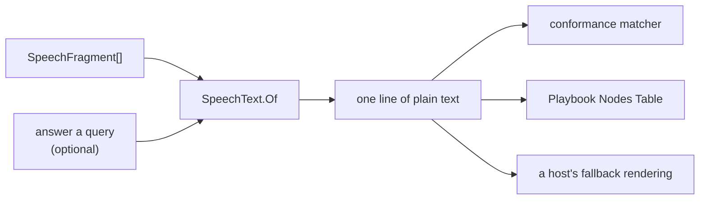

# Speech as Plain Text

> [!IMPORTANT]
> Status: **implemented**. A line's speech is a list of fragments, because a host
> renders it and every host renders it differently. But several readers want the
> same lossy rendering: the words, as one line of plain text. `SpeechText.Of` is
> the public function they share, and the compiler's own flattening was repaired
> to agree with it.
>
> One divergence remains by design: the runtime's test helper still keeps a
> flattening of its own, and adopts this one when that work next rebases.

## Table of contents

- [Goal and scope](#goal-and-scope)
- [Ubiquitous language](#ubiquitous-language)
- [The readings that exist](#the-readings-that-exist)
- [Functionality checklist](#functionality-checklist)
- [The flattening](#the-flattening)
- [Interfaces and abstractions](#interfaces-and-abstractions)
- [Key design decisions](#key-design-decisions)
- [Error and boundary cases](#error-and-boundary-cases)
- [Integration](#integration)
- [Testability](#testability)
- [Open questions](#open-questions)

## Goal and scope

A playbook holds prose in two places — a line's `speech` and an option's `label` —
and both are lists of fragments rather than strings. That is deliberate: a host
renders them, and Godot, a browser, and a terminal each render them differently.

Some consumers do not render, though. They need the words. A conformance fixture
asserts what was said without caring that one word was bold. A report table shows
a node's line in a cell. A log line names what a runner emitted. For all of them
the answer is the same string, and the conformance corpus already specifies that
string normatively, because a port's conformance depends on producing it.

This component is that specification, implemented once as a public function.

**In scope:**

- `SpeechText.Of(speech)` — public, in `DialogueDown.Playbook`: a fragment list in,
  one line of plain text out.
- A defined contribution for each of the nine fragment kinds.
- Resolving a query fragment, for callers that can answer one, and a documented
  placeholder for callers that cannot.
- A `Query` case in the compiler's `InlineText.Of`, so the report stops dropping
  queries from the words it draws.

**Out of scope:**

- **Rendering with styling.** BBCode, HTML, and terminal markup are a separate,
  surveyed concern with its own note. Plain text is the one rendering that throws
  styling away, which is why it can be a function rather than a framework.
- **Parsing plain text back into fragments.** The flattening is lossy by design and
  has no inverse.
- **Any change to the playbook format, its schema, or the serialized document.**
  This adds a way to read what is already there.
- **Migrating the runtime's own test helper.** It lives on a branch this work does
  not touch, and it adopts this function after this lands. See
  [The readings that exist](#the-readings-that-exist).

## Ubiquitous language

| Term            | Meaning                                                                                                                        |
| --------------- | ------------------------------------------------------------------------------------------------------------------------------ |
| **Fragment**    | One piece of what a line says — text, a styled run, a link, an image, a break, a query, a tag, or a command. Nine kinds.       |
| **Flattening**  | Turning a fragment list into one line of plain text. The conformance corpus already uses this word for exactly this operation. |
| **Plain text**  | What a flattening yields: the words, without styling, nesting, or markup.                                                      |
| **Query**       | A fragment that asks the world for a value and says the answer. The only fragment whose plain text depends on something else.  |
| **Answer**      | What a caller supplies for a query key.                                                                                        |
| **Placeholder** | What stands in for a query a caller cannot answer: the key in braces, `{HeroName}`.                                            |

*Flattening* and *plain text* are the repository's existing words, taken from the
corpus note and from the helper the compiler already has. This note invents no
vocabulary.

## The readings that exist

Reading speech as plain text happens in three places, and they have to give the
same answer.

| Where                   | What reads                                                                                                                                      | Agreement                                                           |
| ----------------------- | ----------------------------------------------------------------------------------------------------------------------------------------------- | ------------------------------------------------------------------- |
| `Conformance Corpus.md` | Specifies the reading normatively for every port: "concatenate each fragment's plain text, drop style markers, and substitute resolved queries" | The contract all three answer to                                    |
| `SpeechText.Of`         | A playbook's speech, after a script ships                                                                                                       | The public one; every kind covered, enforced by a test              |
| `InlineText.Of`         | The compiler's own fragments, while a script compiles                                                                                           | Held to `SpeechText` fragment by fragment, through the real mapping |

The compiler's reading had no arm for a query and ended in a catch-all, so it
contributed nothing for one. That reading labels a line, a divert, an option, and a
scene heading across the graph, the semantic model, and the desugared AST, which
meant every surface drawing a line's words drew it with its queries missing. It now
names a query using this function's own wording, so the two cannot disagree about
the one fragment whose words are not in the fragment.

A fourth reading sits outside this work. The runtime's `StepAssert` test helper
concatenates only the top-level text fragments, so nested styling vanishes from it:
the corpus note's own `"My key is **rusty**."` example reads as `"My key is ."`. It
is latent, because no runtime test uses a styled fragment yet — and it stops being
latent as soon as a fixture about conditions happens to contain a bold word, which
the corpus invites by reserving the string form for fixtures whose subject is *not*
styling. That helper lives on in-flight runtime work rather than on the main line,
so this component does not reach in and change it. Landing the shared function first
is what makes the fix available: the playbook library is already referenced there,
so adoption is a one-call-site change owned by the branch that needs it.

## Functionality checklist

- [x] Every one of the nine fragment kinds has a defined plain text.
- [x] Styled runs contribute their words and drop their style.
- [x] Nesting is followed to any depth.
- [x] A link contributes its label; an image contributes its alt text.
- [x] A line break contributes a single space, because it records where the writer's source
      wrapped rather than a break they asked for.
- [x] A tag and a command contribute nothing — they are not words in the line.
- [x] A caller that can answer a query gets the answer substituted.
- [x] A caller with no answers gets the key in braces, `{HeroName}`.
- [x] An option's label flattens by the same function as a line's speech.
- [x] The result is returned exactly as composed; trimming is the caller's business.
- [x] `InlineText.Of` renders a query the same way, so the report stops drawing a
      line with its queries missing.
- [x] The placeholder's rough edges are documented where a writer will meet them.

## The flattening

| Fragment          | Plain text                | Why                                                       |
| ----------------- | ------------------------- | --------------------------------------------------------- |
| `text`            | its `text`                | The words themselves.                                     |
| `styled`          | its `children`, flattened | The corpus says to drop style markers, not styled words.  |
| `link`            | its `label`, flattened    | The label is what a reader sees; the target is not said.  |
| `image`           | its `alt`, flattened      | Alt text exists to stand in for the image in words.       |
| `break`           | a single space            | It marks where the source wrapped, not a break asked for. |
| `query`           | the answer, else `{Key}`  | The corpus says to substitute resolved queries.           |
| `tag`             | nothing                   | Metadata about the line, not words in it.                 |
| `default-command` | nothing                   | An effect the host performs, not something said.          |
| `custom-command`  | nothing                   | As above.                                                 |

## Interfaces and abstractions

| Type                                                                  | Responsibility                                                                                          | Collaborators                 |
| --------------------------------------------------------------------- | ------------------------------------------------------------------------------------------------------- | ----------------------------- |
| `SpeechText`                                                          | Public static class in `DialogueDown.Playbook.Speech`. The flattening, and nothing else.                | the nine fragment records     |
| `SpeechText.Of(ImmutableArray<SpeechFragment>)`                       | Flattens, naming each query rather than saying what it is worth.                                        | `SpeechText.PlaceholderFor`   |
| `SpeechText.Of(ImmutableArray<SpeechFragment>, Func<string, string>)` | Flattens, asking the caller what each query key is worth.                                               | the caller's world or fixture |
| `SpeechText.PlaceholderFor(string)`                                   | Writes one key as `{Key}`. Public, so a caller answering only some keys has somewhere to send the rest. | —                             |

## Key design decisions

### DD1 — It lives in the playbook library, public

The playbook library is the contract between a compiler and a runtime, and its
project file says what that means: a game embeds this and a runner, never the
compiler. Rendering happens at play time, from what the runner emits, so a
fallback rendering has to be reachable from there.

The three callers settle it between them. A conformance matcher lives in the
runtime's tests, the Nodes table lives in the visualization assembly, and a host's
fallback lives in somebody else's game. The only assembly all three already
reference is this one.

### DD2 — A function now, the formatter seam later

A surveyed sibling note proposes an `ISpeechFormatter` seam with one `Format`
method per target — BBCode for Godot, markup for a terminal, HTML for the web —
and a shared visitor walking the fragment tree while each formatter fills in
`OpenStyle` / `CloseStyle` / `EscapeText` hooks. Plain text is clearly one of those
targets, so the question is whether to build the seam now and make plain text its
first implementation.

The recommendation is **no, not yet** — and the reason is not cost, it is fit.
Plain text is the **degenerate** formatter: it is the one target that needs no
`OpenStyle`, no `CloseStyle`, and no escaping, because it throws all of that away.
Designing the shared visitor against it would shape the abstraction around the one
case that exercises none of it, and the first real formatter would then be a
rewrite rather than an addition. An interface extracted from two implementations
fits both; an interface extracted from the empty case fits neither.

Nothing is lost by waiting. A static `Of` can be wrapped by an implementation of
the seam whenever the seam arrives, without touching a single caller.

This is a judgment call about sequencing rather than about whether the abstraction
is worth having, so it is worth disagreeing with if the seam feels closer than it
looks from here.

### DD3 — Two implementations coexist, and that is not duplication

The compiler already has `InlineText.Of`, and it is correct. It is also on a
different type: the compiler's `InlineFragment`, which is internal to the compiler
assembly and which a game never sees. The playbook's `SpeechFragment` is the public
type a runtime holds.

Neither can be expressed in terms of the other. They are different types in
different assemblies with different lifetimes — `InlineText` runs during a compile,
on scene headings and jump labels, before a playbook exists at all; `SpeechText`
runs after, on what was written. Collapsing them would mean either making the
compiler's AST public or making the playbook depend on the compiler, and the
project is deliberately arranged so that neither is true.

What they must not do is disagree. A test pairs corresponding fragments of the two
types and asserts both helpers produce the same string, so a change to one that the
other does not follow fails a build rather than a port's conformance run.

That test is what pulls the compiler's query bug into this component. `SpeechText`
renders a query; `InlineText` drops one; the two cannot both be right. Rather than
exempt the one fragment kind this note is mostly about, `InlineText.Of` gains the
same `Query` case — one arm before its catch-all, which leaves commands and tags
contributing nothing as they do today. No existing test flattens a query through it,
so nothing else moves.

### DD4 — A query is answered by the caller, not by the function

A query is the one fragment whose plain text is not in the fragment. The corpus
says to substitute **resolved** queries, which is unambiguous there because a
fixture supplies its own answers — and undefined for a caller that has none.

The three callers genuinely differ:

| Caller              | Answers available                   | Wants                        |
| ------------------- | ----------------------------------- | ---------------------------- |
| Conformance matcher | The fixture's own answers           | The substituted value        |
| The report          | None — a static report has no world | Something that names the key |
| A host's fallback   | The live world                      | The substituted value        |

So the function takes the answers rather than owning them. The asking is a **total**
`string` to `string`, which settles two things at once.

It is the shape a host already implements. A host answers a query through
`string Query(string query)`, so it hands that very method in rather than wrapping it
to admit a null the format never asks for anywhere else.

And it leaves the caller in charge of a key it cannot answer, which is what this
decision claims to do. A function that took a nullable answer and filled the gap
itself would be deciding query policy after all — the same overreach DD6 avoids for
trimming. Total means the braces are a default rather than a rule: a terminal that
would rather mark an unknown key its own way can.

The alternatives for an unanswerable key were a throw and an empty string. A throw
would crash a report over a script that is perfectly valid. An empty string is what
the report does today, and it is the defect this note repairs.

### DD5 — An unanswered query reads as `{Key}`

The placeholder is `{HeroName}`: the key, in braces. It is a rendering convention,
not DialogueDown syntax, and it is deliberately not written the way a writer writes
a query.

That looks like it breaks a good rule — do not make a writer learn a second
notation for something the language already spells. The reason it does not is that
**the placeholder says a different thing than the source does.** A writer's
`` `"HeroName"` `` says *a query is written here*, which the writer already knows,
having written it. The placeholder says *a value goes here, and this surface cannot
know it yet — the runtime resolves it later.* That second fact is the one worth
drawing, because it is exactly what differs between the script and what a player
will see. It shows a writer which parts of a line are dynamic.

Echoing the source back cannot say that. It also cannot be written honestly. The
writer's notation for a query is the whole code span, backticks included — the
backticks are what mark the content as a game construct rather than prose. So the
candidates were:

| Rendering                                                    | Why not                                                                                                                                         |
| ------------------------------------------------------------ | ----------------------------------------------------------------------------------------------------------------------------------------------- |
| `You are "HeroName", and your purse holds "Gold" gold`       | Not the writer's notation, only the inside of it; and the quotes collide with the quotes a report puts around speech.                           |
| ``You are `"HeroName"`, and your purse holds `"Gold"` gold`` | Shows Markdown delimiters as content. In a table cell or an SVG label there is no code-span rendering, so the backticks are literal characters. |
| `You are HeroName, and your purse holds Gold gold`           | Reads as though the line says the word "HeroName".                                                                                              |

Brace-wrapping also follows a precedent this project already set. The Dialogue
Graph draws a jump as `⇒` rather than the `=>` a writer types, and says why: a
drawing shows the meaning and leaves the source characters to the source. A query
is the same question with the same answer.

Because the asking is total, this placeholder is public rather than buried. A caller
that knows some of the world and not the rest has to produce something for the keys
it does not know, and without a named default every such caller would spell the
braces again — which is how two renderings of the same idea start to drift.

The rough edges are real, and are documented rather than designed away:

- A writer who sees `{HeroName}` and types it into a script gets literal text and no
  diagnostic. Braces mean nothing in DialogueDown, and teaching them to would be a
  language change for a rendering detail.
- A writer whose prose genuinely contains a brace produces a summary that cannot be
  told apart from a resolved query.
- A query key may contain any character except a double quote, so a key holding a
  closing brace nests confusingly. Quotes would be provably unambiguous here, since
  a key cannot contain one — but that trade buys safety in a case no real script
  reaches, at the cost of the collision above in the common one.

### DD6 — Nothing is trimmed, and nothing is capped

`Of` returns exactly what the fragments compose. A line's speech often has
meaningful leading or trailing space — the corpus example's first fragment ends in
one — and a function that trimmed would make round-tripping through it lossy in a
second, undocumented way.

Callers trim when they want to: the Dialogue Graph's label already does, and the
Nodes table's cap belongs to the table. This follows what `InlineText.Of` already
established.

### DD7 — Commands and tags are not words

A tag is metadata a host reads for a portrait or a voice; a command is an effect a
host performs. Neither is something a speaker says, so neither contributes plain
text — which is also what `InlineText.Of` does today with its catch-all, and what
the corpus implies by calling the result the line's plain text.

The consequence worth stating: a line that is *only* a command flattens to the
empty string. That is correct, and a caller that wants to say something about such
a line has to say it itself. The Nodes table does exactly this, describing a
control node by its effects rather than by its speech.

## Error and boundary cases

| Case                                        | Behavior                                                                                                                                  |
| ------------------------------------------- | ----------------------------------------------------------------------------------------------------------------------------------------- |
| An empty fragment list                      | The empty string. A line with no speech is a line that says nothing.                                                                      |
| A styled run with no children               | Contributes nothing.                                                                                                                      |
| Nesting many levels deep                    | Followed to the bottom; the recursion is over a tree the reader already validated.                                                        |
| A link or image whose label or alt is empty | Contributes nothing, rather than the target or source URL. A reader asked for words, and a path is not words.                             |
| A caller that can answer only some keys     | It sends the rest to `PlaceholderFor`, so one unknown key costs only that key.                                                            |
| A query whose answer is the empty string    | The empty string. An answered query is answered, even when the answer is nothing.                                                         |
| A fragment kind added to the format later   | Contributes nothing, via the catch-all the match needs anyway — and fails the coverage test described below, so it cannot ship unnoticed. |
| A line that is only commands and tags       | The empty string.                                                                                                                         |

## Integration

- **`speech/SpeechText.cs`** — new, public, in `DialogueDown.Playbook`.
- **`script/ast/InlineText.cs`** — gained a `Query` arm before its catch-all, which
  stops the report drawing a line with its queries missing. It calls this component's
  own placeholder rather than spelling the braces again, so the convention has one
  definition. The reference is aliased rather than imported, because that namespace
  has a `SpeechStyle` of its own and importing the other would leave two of that name
  in scope. Kept rather than merged away; see DD3.
- **The report's label sites** — unchanged code, changed output: eight places across
  the Dialogue Graph, the Semantic Model, and the Desugared AST tab now draw a query
  instead of swallowing it. No existing assertion had to move, because none of them
  flattened a script carrying a query.
- **`PlaybookNodeSummary`** — the Nodes table's summary consumes it, for a line's
  speech and for an option's label alike.
- **The conformance harness** — its speech matcher, still to be written, compares a
  fixture's string form against this function, so the normative flattening and the
  implementation are the same thing by construction.
- **The runtime's `StepAssert`** — not touched here. It adopts this function when the
  in-flight runtime work next rebases, which retires its own flattening and the
  nested-styling bug with it.
- **The writer's guide** — the queries section of the game-state guide gained a
  short passage on the placeholder: that a surface with no world shows `{Key}`, that braces
  are a drawing convention rather than script syntax, and that typing them into a
  script writes literal braces. This is where a writer already goes to learn what a
  query is, so it is where they should meet what one looks like unresolved.
- **No format change.** Nothing about the serialized document moves.

The public surface grows by one static class holding three members — two `Of`
overloads and `PlaceholderFor` — which is worth counting because the library's
published API is meant to stay small and deliberate.

## Testability

| Level                               | Covers                                                                                                                                                                                                                                                                                           |
| ----------------------------------- | ------------------------------------------------------------------------------------------------------------------------------------------------------------------------------------------------------------------------------------------------------------------------------------------------ |
| xUnit — one test per kind           | The nine rows of the flattening table, each asserted on its own.                                                                                                                                                                                                                                 |
| xUnit — nesting                     | Styling inside styling; a link whose label is styled; the corpus note's own example, asserted to produce the string the corpus prints.                                                                                                                                                           |
| xUnit — queries                     | Substituted from a resolver; `{Key}` with no resolver; a `null` answer; an empty answer; several keys where only some resolve.                                                                                                                                                                   |
| xUnit — coverage                    | Reflecting over the fragment union's registered members, every kind is handled deliberately rather than reaching the catch-all. The repository's `UnionAssert` already asserts union completeness this way.                                                                                      |
| xUnit — agreement with `InlineText` | Corresponding fragment pairs of the two types flatten to the same string, queries included — the assertion that keeps the compiler's helper and this one from drifting apart.                                                                                                                    |
| Generative (optional)               | Flattening never throws and never returns `null`, over randomly generated fragment trees. Worth little for a total function on a closed union, and this test project does not reference Bogus today, though two sibling projects do. Listed so the decision is deliberate rather than forgotten. |

Every test is a pure function call on hand-built fragments: no document, no
compile, no playbook.

## Open questions

- **Should speech be able to hold a break a writer does mean?** The only break that
  reaches a playbook is where the source wrapped, because a break a writer asks for
  is split into the next line during the compile. So a writer who wants two lines of
  one speaker's speech to arrive as one line with a break inside it has no way to say
  so. That is the format's existing shape rather than anything this function decides,
  and changing it would be a format change — but the question belongs somewhere, and
  flattening is where it surfaces.
- **Should the report mark an unanswered query as a diagnostic rather than only
  drawing it?** A line whose words depend on the world is worth knowing about when
  auditing a script, and the report has a Problems panel that could say so. Against:
  a query is perfectly valid and enormously common, so a diagnostic per query would
  bury the panel in noise. Probably the answer is no, but the question belongs to
  whoever next works on reader diagnostics rather than to this function.
- **Should `Of` take `IEnumerable<SpeechFragment>` instead of
  `ImmutableArray<SpeechFragment>`?** The model exposes immutable arrays, so the
  concrete type matches every real call and avoids an allocation. A broader
  parameter would accept a `Where` over fragments without a round trip through an
  array, which a host writing its own partial rendering might want.
