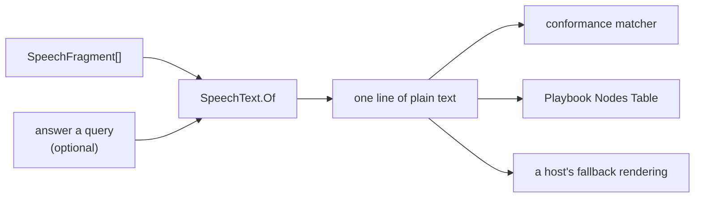

# Speech as Plain Text

> [!NOTE]
> Status: **implemented**. `SpeechText.Of` is the one public function that reads a
> playbook's speech fragments as a single line of plain text, for every consumer
> that wants the words rather than a rendering; the compiler's `InlineText.Of` is
> held to the same answer.

## Table of contents

- [Goal and scope](#goal-and-scope)
- [Ubiquitous language](#ubiquitous-language)
- [The readings that exist](#the-readings-that-exist)
- [The flattening](#the-flattening)
- [Interfaces and abstractions](#interfaces-and-abstractions)
- [Key design decisions](#key-design-decisions)
- [Error and boundary cases](#error-and-boundary-cases)
- [Integration](#integration)
- [Testability](#testability)
- [Open questions](#open-questions)

## Goal and scope

A playbook holds prose in two places — a line's `speech` and an option's `label` —
and both are lists of fragments rather than strings. That is deliberate: a host
renders them, and Godot, a browser, and a terminal each render them differently.

Some consumers do not render, though. They need the words. A conformance fixture
asserts what was said without caring that one word was bold. A report table shows
a node's line in a cell. A log line names what a runner emitted. For all of them
the answer is the same string, and the conformance corpus already specifies that
string normatively, because a port's conformance depends on producing it.

This component is that specification, implemented once as a public function.

**In scope:**

- `SpeechText.Of(speech)` — public, in `DialogueDown.Playbook`: a fragment list in,
  one line of plain text out.
- A defined contribution for each of the nine fragment kinds.
- Resolving a query fragment, for callers that can answer one, and a documented
  placeholder for callers that cannot.
- A `Query` case in the compiler's `InlineText.Of`, so the report draws a query in
  the words it shows.

**Out of scope:**

- **Rendering with styling.** BBCode, HTML, and terminal markup are a separate,
  surveyed concern with its own note. Plain text is the one rendering that throws
  styling away, which is why it can be a function rather than a framework.
- **Parsing plain text back into fragments.** The flattening is lossy by design and
  has no inverse.
- **Any change to the playbook format, its schema, or the serialized document.**
  This adds a way to read what is already there.

## Ubiquitous language

| Term            | Meaning                                                                                                                        |
| --------------- | ------------------------------------------------------------------------------------------------------------------------------ |
| **Fragment**    | One piece of what a line says — text, a styled run, a link, an image, a break, a query, a tag, or a command. Nine kinds.       |
| **Flattening**  | Turning a fragment list into one line of plain text. The conformance corpus already uses this word for exactly this operation. |
| **Plain text**  | What a flattening yields: the words, without styling, nesting, or markup.                                                      |
| **Query**       | A fragment that asks the world for a value and says the answer. The only fragment whose plain text depends on something else.  |
| **Answer**      | What a caller supplies for a query key.                                                                                        |
| **Placeholder** | What stands in for a query a caller cannot answer: the key in braces, `{HeroName}`.                                            |

*Flattening* and *plain text* are the words the conformance corpus and the
compiler's helper use.

## The readings that exist

Every reading of speech as plain text gives the same answer.

| Where | What reads | Agreement |
| --- | --- | --- |
| The conformance corpus | A fixture's string form of `speech` or `label` is this flattening, for every port | The contract the others answer to |
| `SpeechText.Of` | A playbook's speech; called by the runtime's `SaidMatcher` and `StepAssert`, and by the Nodes table for a divert's label | The public one; every kind covered, enforced by a test |
| `InlineText.Of` | The compiler's own fragments, while a script compiles | Held to `SpeechText` fragment by fragment, through the real mapping |
| The Nodes table | Walks speech into styled segments with the same per-kind rules, and names a query through `SpeechText.PlaceholderFor` | Same rules; not held to `SpeechText` by a test |

Eight label sites across the graph, the semantic model, and the desugared AST read
through `InlineText.Of`. Four can hold a query — a line's speech, and a scene's
heading wherever the report names it — and draw it as `{Key}`. The other four label
a link — a divert, an option, an image alt — where a code span is restored to the
characters the writer typed, so a reader there sees the backticks.

## The flattening

| Fragment          | Plain text                | Why                                                       |
| ----------------- | ------------------------- | --------------------------------------------------------- |
| `text`            | its `text`                | The words themselves.                                     |
| `styled`          | its `children`, flattened | The corpus says to drop style markers, not styled words.  |
| `link`            | its `label`, flattened    | The label is what a reader sees; the target is not said.  |
| `image`           | its `alt`, flattened      | Alt text exists to stand in for the image in words.       |
| `break`           | a single space            | It marks where the source wrapped, not a break asked for. |
| `query`           | the answer, else `{Key}`  | The corpus says to substitute resolved queries.           |
| `tag`             | nothing                   | Metadata about the line, not words in it.                 |
| `default-command` | nothing                   | An effect the host performs, not something said.          |
| `custom-command`  | nothing                   | As above.                                                 |

```mermaid
flowchart LR
    F["SpeechFragment[]"] --> T["SpeechText.Of"]
    A["answer a query<br/>(optional)"] --> T
    T --> S["one line of plain text"]
    S --> C1["conformance matcher"]
    S --> C2["Playbook Nodes Table"]
    S --> C3["a host's fallback rendering"]
```

## Interfaces and abstractions

| Type                                                                  | Responsibility                                                                                          | Collaborators                 |
| --------------------------------------------------------------------- | ------------------------------------------------------------------------------------------------------- | ----------------------------- |
| `SpeechText`                                                          | Public static class in `DialogueDown.Playbook.Speech`. The flattening, and nothing else.                | the nine fragment records     |
| `SpeechText.Of(ImmutableArray<SpeechFragment>)`                       | Flattens, naming each query rather than saying what it is worth.                                        | `SpeechText.PlaceholderFor`   |
| `SpeechText.Of(ImmutableArray<SpeechFragment>, Func<string, string>)` | Flattens, asking the caller what each query key is worth.                                               | the caller's world or fixture |
| `SpeechText.PlaceholderFor(string)`                                   | Writes one key as `{Key}`. Public, so a caller answering only some keys has somewhere to send the rest. | —                             |

## Key design decisions

### D1 — It lives in the playbook library, public

The playbook library is the contract between a compiler and a runtime, and its
project file says what that means: a game embeds this and a runner, never the
compiler. Rendering happens at play time, from what the runner emits, so a
fallback rendering has to be reachable from there.

The three callers settle it between them. A conformance matcher lives in the
runtime's tests, the Nodes table lives in the visualization assembly, and a host's
fallback lives in somebody else's game. The only assembly all three already
reference is this one.

### D2 — A function, not a formatter seam

A surveyed sibling note proposes an `ISpeechFormatter` seam with one `Format`
method per target — BBCode for Godot, markup for a terminal, HTML for the web —
and a shared visitor walking the fragment tree while each formatter fills in
`OpenStyle` / `CloseStyle` / `EscapeText` hooks. Plain text is clearly one of those
targets, so the question is whether to build the seam now and make plain text its
first implementation.

It does not, and the reason is fit, not cost.
Plain text is the **degenerate** formatter: it is the one target that needs no
`OpenStyle`, no `CloseStyle`, and no escaping, because it throws all of that away.
Designing the shared visitor against it would shape the abstraction around the one
case that exercises none of it, and the first real formatter would then be a
rewrite rather than an addition. An interface extracted from two implementations
fits both; an interface extracted from the empty case fits neither.

A static `Of` can be wrapped by an implementation of the seam when one exists,
without touching a caller.

### D3 — Two implementations coexist, and that is not duplication

The compiler already has `InlineText.Of`, and it is correct. It is also on a
different type: the compiler's `InlineFragment`, which is internal to the compiler
assembly and which a game never sees. The playbook's `SpeechFragment` is the public
type a runtime holds.

Neither can be expressed in terms of the other. They are different types in
different assemblies with different lifetimes — `InlineText` runs during a compile,
on scene headings and jump labels, before a playbook exists at all; `SpeechText`
runs after, on what was written. Collapsing them would mean either making the
compiler's AST public or making the playbook depend on the compiler, and the
project is deliberately arranged so that neither is true.

What they must not do is disagree. A test pairs corresponding fragments of the two
types and asserts both helpers produce the same string, so a change to one that the
other does not follow fails a build rather than a port's conformance run.

That test is why `InlineText.Of` has a `Query` case: one arm before its catch-all,
which leaves commands and tags contributing nothing.

### D4 — A query is answered by the caller, not by the function

A query is the one fragment whose plain text is not in the fragment. The corpus
says to substitute **resolved** queries, which is unambiguous there because a
fixture supplies its own answers — and undefined for a caller that has none.

The three callers genuinely differ:

| Caller              | Answers available                   | Wants                        |
| ------------------- | ----------------------------------- | ---------------------------- |
| Conformance matcher | The fixture's own answers           | The substituted value        |
| The report          | None — a static report has no world | Something that names the key |
| A host's fallback   | The live world                      | The substituted value        |

So the function takes the answers rather than owning them. The asking is a **total**
`string` to `string`, which settles two things at once.

It is the shape a host already implements. A host answers a query through
`string Query(string query)`, so it hands that very method in rather than wrapping it
to admit a null the format never asks for anywhere else.

And it leaves the caller in charge of a key it cannot answer, which is what this
decision claims to do. A function that took a nullable answer and filled the gap
itself would be deciding query policy after all — the same overreach D6 avoids for
trimming. Total means the braces are a default rather than a rule: a terminal that
would rather mark an unknown key its own way can.

The alternatives for an unanswerable key were a throw and an empty string. A throw
would crash a report over a valid script, and an empty string drops the word from
the line.

### D5 — An unanswered query reads as `{Key}`

The placeholder is `{HeroName}`: the key, in braces. It is a rendering convention,
not DialogueDown syntax, and it is deliberately not written the way a writer writes
a query.

That looks like it breaks a good rule — do not make a writer learn a second
notation for something the language already spells. The reason it does not is that
**the placeholder says a different thing than the source does.** A writer's
`` `"HeroName"` `` says *a query is written here*, which the writer already knows,
having written it. The placeholder says *a value goes here, and this surface cannot
know it yet — the runtime resolves it later.* That second fact is the one worth
drawing, because it is exactly what differs between the script and what a player
will see. It shows a writer which parts of a line are dynamic.

Echoing the source back cannot say that. It also cannot be written honestly. The
writer's notation for a query is the whole code span, backticks included — the
backticks are what mark the content as a game construct rather than prose. So the
candidates were:

| Rendering                                                    | Why not                                                                                                                                         |
| ------------------------------------------------------------ | ----------------------------------------------------------------------------------------------------------------------------------------------- |
| `You are "HeroName", and your purse holds "Gold" gold`       | Not the writer's notation, only the inside of it; and the quotes collide with the quotes a report puts around speech.                           |
| ``You are `"HeroName"`, and your purse holds `"Gold"` gold`` | Shows Markdown delimiters as content. In a table cell or an SVG label there is no code-span rendering, so the backticks are literal characters. |
| `You are HeroName, and your purse holds Gold gold`           | Reads as though the line says the word "HeroName".                                                                                              |

Brace-wrapping also follows a precedent this project already set. The Dialogue
Graph draws a jump as `⇒` rather than the `=>` a writer types, and says why: a
drawing shows the meaning and leaves the source characters to the source. A query
is the same question with the same answer.

Because the asking is total, this placeholder is public rather than buried. A caller
that knows some of the world and not the rest has to produce something for the keys
it does not know, and without a named default every such caller would spell the
braces again — which is how two renderings of the same idea start to drift.

The rough edges are real, and are documented rather than designed away:

- A writer who sees `{HeroName}` and types it into a script gets literal text and no
  diagnostic. Braces mean nothing in DialogueDown, and teaching them to would be a
  language change for a rendering detail.
- A writer whose prose genuinely contains a brace produces a summary that cannot be
  told apart from a resolved query.
- A query key may contain any character except a double quote, so a key holding a
  closing brace nests confusingly. Quotes would be provably unambiguous here, since
  a key cannot contain one — but that trade buys safety in a case no real script
  reaches, at the cost of the collision above in the common one.

### D6 — Nothing is trimmed, and nothing is capped

`Of` returns exactly what the fragments compose. A line's speech often has
meaningful leading or trailing space — the corpus example's first fragment ends in
one — and a function that trimmed would make round-tripping through it lossy in a
second, undocumented way.

Callers trim when they want to: the Dialogue Graph's label already does, and the
Nodes table's cap belongs to the table. This follows what `InlineText.Of` already
established.

### D7 — Commands and tags are not words

A tag is metadata a host reads for a portrait or a voice; a command is an effect a
host performs. Neither is something a speaker says, so neither contributes plain
text — which is also what `InlineText.Of` does with its catch-all, and what
the corpus implies by calling the result the line's plain text.

The consequence worth stating: a line that is *only* a command flattens to the
empty string. That is correct, and a caller that wants to say something about such
a line has to say it itself. The Nodes table does exactly this, describing a
control node by its effects.

## Error and boundary cases

| Case                                        | Behavior                                                                                                                                  |
| ------------------------------------------- | ----------------------------------------------------------------------------------------------------------------------------------------- |
| An empty fragment list                      | The empty string. A line with no speech is a line that says nothing.                                                                      |
| A styled run with no children               | Contributes nothing.                                                                                                                      |
| Nesting many levels deep                    | Followed to the bottom; the recursion is over a tree the reader already validated.                                                        |
| A link or image whose label or alt is empty | Contributes nothing, rather than the target or source URL. A reader asked for words, and a path is not words.                             |
| A caller that can answer only some keys     | It sends the rest to `PlaceholderFor`, so one unknown key costs only that key.                                                            |
| A query whose answer is the empty string    | The empty string. An answered query is answered, even when the answer is nothing.                                                         |
| A fragment kind added to the format later   | Contributes nothing, via the catch-all the match needs anyway — and fails the coverage test described below, so it cannot ship unnoticed. |
| A line that is only commands and tags       | The empty string.                                                                                                                         |

## Integration

- **`speech/SpeechText.cs`** — public, in `DialogueDown.Playbook`: two `Of`
  overloads and `PlaceholderFor`, the library's whole addition to its public API.
- **`script/ast/InlineText.cs`** — a `Query` arm that calls `PlaceholderFor`, so the
  braces have one definition. Kept rather than merged away; see D3.
- **The conformance harness** — `SaidMatcher` compares a fixture's string form
  against `SpeechText.Of`, so the normative flattening and the implementation are the
  same thing by construction.
- **The writer's guide** — the game-state guide's
  [queries section](../../../guide/game-state.md#where-a-query-has-no-answer-yet)
  explains the `{Key}` placeholder.
- **No format change.** The serialized document is untouched.

## Testability

| Level                               | Covers                                                                                                                                                                                                                                                                                           |
| ----------------------------------- | ------------------------------------------------------------------------------------------------------------------------------------------------------------------------------------------------------------------------------------------------------------------------------------------------ |
| xUnit — one test per kind           | The nine rows of the flattening table, each asserted on its own.                                                                                                                                                                                                                                 |
| xUnit — nesting                     | Styling inside styling; a link whose label is styled; the corpus note's own example, asserted to produce the string the corpus prints.                                                                                                                                                           |
| xUnit — queries                     | Substituted from an answering function; the key in braces when none is given; an answer of the caller's own choosing; an empty answer; a query nested inside styling; several keys where only some are answered.                                                                                 |
| xUnit — coverage                    | Reflecting over the fragment union's registered members, every kind is handled deliberately rather than reaching the catch-all. The repository's `UnionAssert` already asserts union completeness this way.                                                                                      |
| xUnit — agreement with `InlineText` | Corresponding fragment pairs of the two types flatten to the same string, queries included — the assertion that keeps the compiler's helper and this one from drifting apart.                                                                                                                    |
| xUnit — the report's labels         | Script text compiled through the real pipeline, asserting that a query written in a line and in a scene's name reaches the label a reader sees. One test per affected tab.                                                                                                                       |

The reading's own tests are pure function calls on hand-built fragments — no
document, no compile, no playbook. The report's label tests are the deliberate
exception: what they guard is the whole chain from the writer's backticks to the
drawing, which only a real compile exercises.

## Open questions

- **Should speech be able to hold a break a writer does mean?** The only break that
  reaches a playbook is where the source wrapped, because a break a writer asks for
  is split into the next line during the compile. So a writer who wants two lines of
  one speaker's speech to arrive as one line with a break inside it has no way to say
  so. That is the format's existing shape rather than anything this function decides,
  and changing it would be a format change — but the question belongs somewhere, and
  flattening is where it surfaces.
- **Should the report mark an unanswered query as a diagnostic rather than only
  drawing it?** A line whose words depend on the world is worth knowing about when
  auditing a script, and the report has a Problems panel that could say so. Against:
  a query is perfectly valid and enormously common, so a diagnostic per query would
  bury the panel in noise. Probably the answer is no, but the question belongs to
  whoever next works on reader diagnostics rather than to this function.
- **Should `Of` take `IEnumerable<SpeechFragment>` instead of
  `ImmutableArray<SpeechFragment>`?** The model exposes immutable arrays, so the
  concrete type matches every real call and avoids an allocation. A broader
  parameter would accept a `Where` over fragments without a round trip through an
  array, which a host writing its own partial rendering might want.
