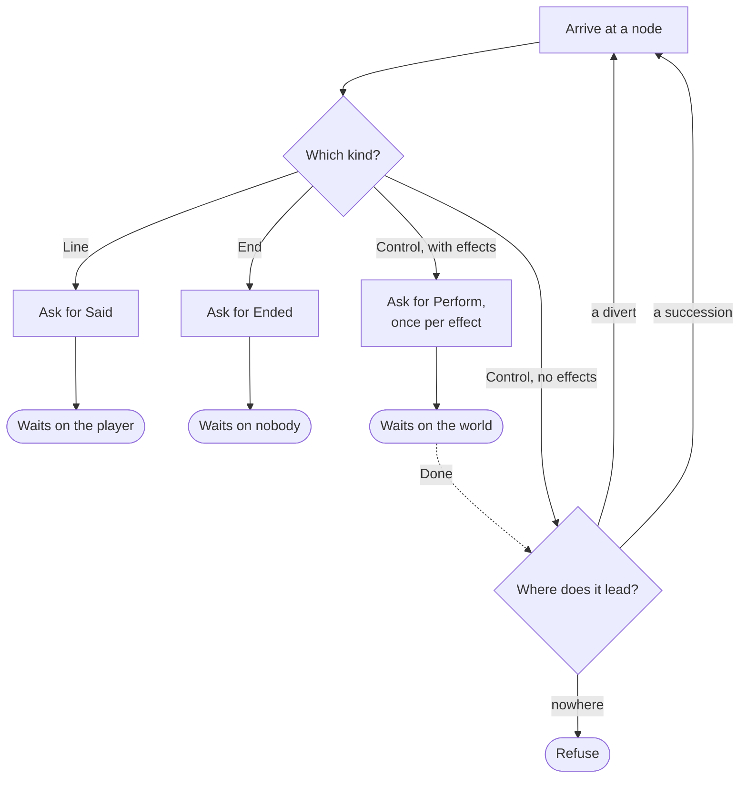

# Waiting on the host

> [!NOTE]
> Status: **proposed** — not yet implemented. The pass that teaches the runner
> when to keep going and when to stop: a step runs on only while the run has
> handed the host nothing to do. It builds on the
> [runtime core](./Runtime%20Core.md), whose protocol and harness it extends, and
> applies the
> [dialogue runtime architecture](./Dialogue%20Runtime%20Architecture.md), which
> owns the cross-cutting decisions this note uses.

## Table of contents

- [Goal and scope](#goal-and-scope)
- [Functionality checklist](#functionality-checklist)
- [What waits, and what does not](#what-waits-and-what-does-not)
- [Key design decisions](#key-design-decisions)
- [Error and boundary cases](#error-and-boundary-cases)
- [Integration](#integration)
- [Testability](#testability)
- [Open questions and deferred work](#open-questions-and-deferred-work)

## Goal and scope

The first pass plays the plainest rhythm there is: arrive at a line, say it, wait
for `next`. Two constructs in the corpus do not fit that rhythm, and neither is
exotic — a jump and an effect are ordinary things to write.

A jump compiles to a node with **nothing to say**. In `a-jump`, a `=>` on its own
line becomes a control node carrying no effects and one divert, and the fixture
sends a single `next` across it. Nothing there concerns the host, so nothing
should stop the run.

An effect is the opposite case. The host must change the world, and the run must
not go on until it has — otherwise a guard a few lines later reads the world as it
was, and the runner takes an arm it should not have taken.

So the pass has one rule with two halves, and the two fixtures that need them.

In scope:

- the rule that a step runs on only while the run has handed the host nothing to
  do;
- `ControlNode` — its effects are asked for, and the run waits until they are
  done;
- `DivertEdge` — a way onward beside succession;
- `Perform(effect)`, answered by `Done()`: the protocol's second reverse request;
- refusing a construct that carries a condition, rather than playing past it;
- a guard so a ring of nodes that concern nobody is refused rather than hung.

Out of scope, each with the pass that owns it: conditions and the world seam
(C2c), choices (C2b), branches and random choices (later).

## Functionality checklist

- [x] A step runs on only while the run has handed the host nothing to do.
- [x] Arriving at a control node asks the host to perform each of its effects, in
      the order written, and the run waits for `Done`.
- [x] A control node with no effects concerns nobody, says nothing, and the run
      carries on — which is what a jump on its own line compiles to.
- [x] `Next` is refused where the run waits on the world, so fast-forwarding
      cannot skip past an effect.
- [x] A divert is the way onward when a node carries one; succession is the
      fall-through.
- [x] A node or edge carrying a condition is refused by name, not played as though
      the condition held.
- [x] A ring of nodes that concern nobody is refused, so `Step` stays total.
- [x] `perform` and `done` are settled in the fixture schema, written into
      `an-effect`, and matched by the harness.
- [x] `a-jump` and `an-effect` play, and join the named conforming list.
- [x] The walk property's generator draws control nodes and diverts, so the
      property keeps covering what a run can meet.

## What waits, and what does not

**The run carries on only while it has handed the host nothing to do.** Where it
stops, it is waiting on one of two parties, and which one decides what may be sent
next.

| Node | Arriving asks for | The run then |
| --- | --- | --- |
| `LineNode` | `Said` | waits on the **player** — `Next` |
| `ChoiceNode` | `Asked` *(C2b)* | waits on the **player** — `Choose` |
| `ControlNode` with effects | `Perform`, once per effect | waits on the **world** — `Done` moves it on |
| `ControlNode` with no effects | nothing | carries on |
| `EndNode` | `Ended` | waits on nobody |
| `BranchNode` | nothing *(later)* | carries on |
| `RandomChoiceNode` | nothing *(later)* | carries on |

## Key design decisions

### W1 — A step runs on only while the host has been handed nothing

`Arrival.At` reports what one node means and stops. It becomes a **walk**: it
visits a node, collects what being there asks for, and carries on only while the
node has asked the host for nothing.

This is the seam every later pass plugs into. A menu becomes one more thing that
waits; a branch and a random choice become two more that do not. Discovering the
rule halfway through choices would mean rewriting choices around it, so it is
cheaper to establish first — which is why this pass runs ahead of the one the
runtime core note numbered before it.

### W2 — A way onward is the divert when it applies, and the succession otherwise

A line and a control node may each carry **one divert and one succession**. The
shape rule allows both, and they are not alternatives at the same level: the
divert is the way out the writer asked for, and the succession is where the run
falls through when the divert does not apply.

So reading the way onward is: take the divert if it applies; otherwise fall
through by succession; and if there is neither, refuse. A divert that always
applies makes any succession beside it dead, which the reader knowingly accepts —
it plays no differently.

An unconditional divert always applies. A **conditional** one cannot be answered
without the world, so this pass refuses it rather than guessing (W7).

### W3 — An effect is a request, not a report

Reading the world already waits: `Resolve(keys)` is a reverse request, and the run
stands still until `Supply` answers it. Writing the world did not. That asymmetry
is the whole bug — a seam where reads block and writes do not cannot promise that
a guard sees the effect written two lines above it.

The damage is not confined to the host. The runner **branches** on what it reads,
so an effect still in flight does not merely produce a stale answer: it sends the
run along a different arm. Host timing would be rewriting the dialogue's control
flow, and determinism is the one thing a functional core exists to provide.

So an effect joins `Resolve` as a reverse request. `Perform(effect)` is answered
by `Done()`, and the run does not go past it until it is. In the isolation
vocabulary the architecture note already uses, this is **read your own writes**,
and it is the guarantee the protocol has to buy.

The wait costs a careless host nothing: a driver that does not care about `fade
in` answers at once, and one awaiting a database awaits it. What the wait buys is
the *option* — without it, a careful host has no way to be careful.

### W4 — One `Perform` per effect, and one wait per node

A control node holds an array of effects, which raises two questions that are
easily run together.

**How many requests?** One per effect. A line's fragments compose into a single
utterance — text, a styled word, a value spliced in — which a host renders
together. A node's effects are independent things to do: fade in, then play a
sound. One request each keeps that true and spares every driver a loop inside a
single message.

**How many waits?** One, at the end of the node. The effects were written as one
line, so the host applies them in order and answers once. Round trips then stay
proportional to what somebody wrote rather than to how many commands they fitted
on a line. Nothing is lost by grouping them: effects only write, so no effect
needs the world settled before the next one runs.

### W5 — A ring that concerns nobody is refused by counting, not by remembering

A control node that diverts into a ring of control nodes would walk forever, and
`Step` is documented as total. The walk needs a bound.

An arbitrary step budget would work and would be wrong at the edges: too low
refuses a legitimate playbook, too high is still a hang from the host's side. A
visited-set is exact but allocates on every step.

The playbook supplies an exact bound for free. A walk that passes **more nodes
than the playbook has** must have visited one twice, and a walk that has visited
one twice is in a ring, because nothing the walk reads changes as it goes. So the
guard is a counter against `Nodes.Length`: no false refusal, no missed ring, no
allocation, and no number anybody has to pick.

### W6 — Waiting is a stage of the run, so the position carries it

Waiting for the host is something the *run* is doing, not something the playbook
says. `AwaitingDone` stands at the same node `AtNode` would, at a different stage,
which is the shape the position union exists for: a run is not always simply *at*
a node, and holding the stage in the position rather than beside it means the two
can never disagree.

That keeps the protocol a relation between a position and a command. `Next`
advances from `AtNode`, `Done` advances from `AwaitingDone`, and neither arm has
to look at the playbook to work out which stage the run is in.

`Next` sent while the host is still working is refused, and nothing has to say so:
it falls to the arm that already reports what a run at a given stage cannot take.
The refusal matters rather than being incidental — a host fast-forwarding through
dialogue must be able to collapse the waits that are only presentation, and must
not be able to collapse the one that is causal.

The same shape serves the pass that reads the world: a run paused for an answer is
another stage at a node it has already reached, and the keys it is waiting on have
nowhere else to live.

### W7 — A condition is refused, not ignored

Arriving at a line today says it without reading `line.Condition`. A conditional
line therefore speaks regardless of its condition, and the corpus does not catch
it: `a-conditional-line` reads as not yet runnable because its session sends
`supply`, not because the runner declined to guess.

This pass refuses any node or edge carrying a condition, naming it, exactly as an
unplayable node kind is refused. Refusing is what keeps the not-yet-runnable list
honest — a construct nobody has taught the runner should read as untaught, never
as played correctly by luck.

## Error and boundary cases

| Case | Behavior |
| --- | --- |
| A control node with no effects | Concerns nobody; the run carries on. This is a jump on its own line |
| `Next` where the run waits on the world | Refused, so fast-forwarding cannot skip an effect |
| `Done` where the run waits on the player | Refused: nothing was asked of the host here |
| A control node whose divert applies | The divert is the way onward; any succession beside it is dead |
| A node carrying neither a divert that applies nor a succession | Refused: it leads nowhere |
| A ring of nodes that concern nobody | Refused after passing more nodes than the playbook has |
| A node or edge carrying a condition | Refused by name; this pass cannot answer one |
| A divert whose target is out of range | Cannot occur; the reader refuses it before a runner sees it |
| An effect a host does not recognize | Not the runner's concern: it asks by the name the playbook gives |

## Integration

| Seam | Change |
| --- | --- |
| `Arrival` | Becomes a walk that carries on while the node has asked the host for nothing |
| `NodeTraversalExtensions` | Reads the way onward — the divert when it applies, else the succession |
| `protocol` | `Request`, the kind of event an answer is owed to; `Perform` carrying one effect; `Done` answering it |
| `positions` | `AwaitingDone`, the stage a run is at once it has asked and not yet heard back |
| `Runner.Step` | One arm per stage: `Next` advances from `AtNode`, `Done` from `AwaitingDone` |
| `schema/fixture-0.schema.json` | `performed` becomes `perform` and gains its shape; `done` joins the sends |
| `conformance/playable/an-effect` | Gains the send, and a `because` that states the ordering it now proves |
| Harness | A `PerformMatcher` by key, and `done` among the commands a session can send |
| `PlayableConformanceTests` | `a-jump` and `an-effect` join the named conforming list |
| `PlaybookGen` | Draws control nodes and diverts, so the walk property keeps pace |
| Architecture note | `Perform` sits with `Resolve` as a reverse request; read-your-own-writes joins the isolation levels |
| Runtime core note | Its node-kind table and not-yet-runnable list move on by two |

## Testability

| Level | What it covers |
| --- | --- |
| Unit — arrival | Each node kind: what it asks for, and which party the run then waits on |
| Unit — traversal | Divert taken, succession fallen through to, neither available |
| Unit — the protocol | `Next` refused where the host is still working, and `Done` where nothing was asked |
| Unit — the guard | A ring refuses rather than hangs, and a walk the length of the playbook does not |
| Conformance | `a-jump` and `an-effect` play end to end |
| Property | The existing walk holds, over a generator that now draws control nodes and diverts |

Three tests are worth naming because they are easy to leave out. A walk that
passes exactly as many nodes as the playbook has is **legitimate** and must not be
refused, which is the off-by-one the counting guard invites. A conditional line
must be refused rather than spoken — a test that fails against the runner as it
stands today. And a node with two effects must produce two requests and **one**
wait, which is the half of W4 a single-effect fixture cannot show.

## Open questions and deferred work

- **Nothing validates a fixture against the fixture schema.** The schema is
  published and referenced by every fixture's `$schema`, but no test reads it, so
  a fixture and the schema can disagree in silence. Worth closing separately from
  this pass.
- **Can an effect fail?** `Done` says it was carried out. A host whose database
  refused has no way to say so, and what a dialogue should do about it is a real
  question — skip the line, end the run, take a branch — that no construct
  currently asks. The seam is reserved by leaving `Done` an answer rather than a
  bare acknowledgement.
- **Conditions are refused, not evaluated.** Every construct in the playbook format
  except a choice node, a branch node, and a random choice node can carry one, so
  the pass that brings the world seam unlocks more than its own constructs.
- **Entropy stays open.** Whether a random choice draws from a specified generator
  or from host-supplied values is left to the pass that plays one; nothing here
  reads a weight.
