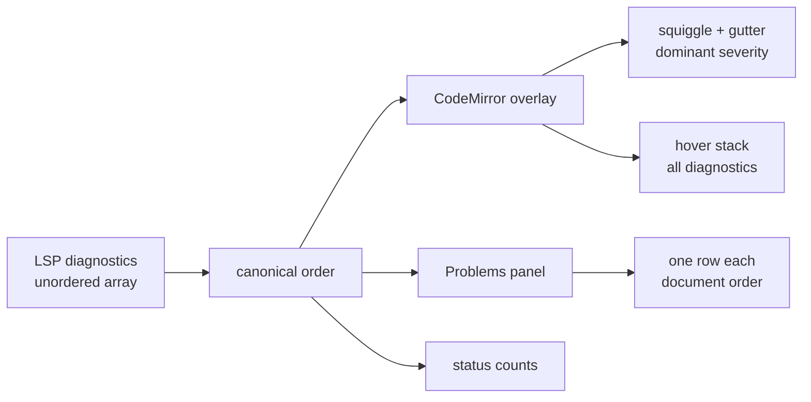

# Co-located diagnostics presentation

> [!NOTE]
> Status: **implemented**.

## Table of contents

- [Goal and scope](#goal-and-scope)
- [Functionality checklist](#functionality-checklist)
- [Ubiquitous language](#ubiquitous-language)
- [Current behavior](#current-behavior)
- [Editor research](#editor-research)
- [Design](#design)
- [Key design decisions](#key-design-decisions)
- [Error and boundary cases](#error-and-boundary-cases)
- [Integration](#integration)
- [Testability](#testability)
- [Open questions](#open-questions)

## Goal and scope

Give diagnostics that share a line, position, or range one deterministic,
editor-like presentation. The most severe active diagnostic controls the
squiggle and gutter marker; hover details and the Problems panel retain every
diagnostic and order ties by severity.

This component changes presentation order only. It does not change which
diagnostics the compiler produces, merge duplicate diagnostics, alter status
counts, or introduce a new dependency.

In scope:

- Overlapping squiggles and one gutter marker per affected line.
- Range-hover and gutter-hover diagnostic stacks.
- Same-position ordering in the Problems panel.
- One canonical ordering policy shared across initial load, save, and hot reload.
- Static and live browser fixtures covering error, warning, info, hint,
  zero-width, exact-range, and partially overlapping diagnostics.

Out of scope:

- Grouping diagnostics behind an expandable row.
- Hiding lower-severity diagnostics.
- Reordering the whole Problems panel by severity.
- Compiler-side prioritization or deduplication.
- Changing CodeMirror's geometry-driven segmentation of partially overlapping
  ranges.

## Functionality checklist

- [x] An overlapping editor segment uses the most severe active diagnostic's
      squiggle class.
- [x] A line with several diagnostics shows one gutter marker at the line's most
      severe level.
- [x] An exact-range hover stack lists Error, Warning, Info, then Hint,
      independent of compiler/LSP array order.
- [x] A gutter hover keeps every diagnostic on the line and lists
      same-position diagnostics severity first.
- [x] The Problems panel remains document ordered; diagnostics at the same start
      position list severity first.
- [x] Equal-severity ties are deterministic by range end, code, then message.
- [x] Status-line counts include every diagnostic, including co-located ones.
- [x] Reapplying the same diagnostics in a different input order produces the
      same overlay, tooltip, Problems list, and counts.
- [x] Tooltip and Problems controls retain their existing navigation,
      documentation links, keyboard access, and accessible labels.
- [x] Problems code links meet WCAG AA contrast in light and dark themes.

## Ubiquitous language

| Term | Meaning |
| --- | --- |
| **Co-located diagnostics** | Diagnostics whose source ranges have the same start position. An **exact collision** also has the same end position. |
| **Overlapping diagnostics** | Diagnostics whose ranges intersect, even when their starts or ends differ. |
| **Collision segment** | A contiguous editor span covered by more than one diagnostic. CodeMirror splits overlapping ranges into these segments. |
| **Dominant severity** | The most severe diagnostic active on a collision segment or line: Error, then Warning, Info, Hint. |
| **Visual marker** | The editor squiggle or gutter icon. One compact marker represents a collision through its dominant severity. |
| **Detail stack** | The complete list shown by a range or gutter tooltip. |
| **Canonical order** | The deterministic ordering applied before diagnostics fan out to the overlay, Problems panel, and counts. |

## Current behavior

A browser fixture supplied three diagnostics on the exact same range in
least-to-most-severe order, plus three nested diagnostics on another line.

| Surface | Observed behavior |
| --- | --- |
| Squiggle | CodeMirror collapses overlapping decorations into collision segments and assigns each segment its maximum severity. The exact info/warning/error collision is one red error squiggle. |
| Gutter | CodeMirror emits one marker per line at the maximum severity. Both test lines show one red error marker. |
| Range tooltip | Every exact-range diagnostic is retained, but shown in input order: Info, Warning, Error. |
| Gutter tooltip | Every diagnostic is retained, with the same input-derived ordering. |
| Problems panel | One row per diagnostic, ordered by start position only. Exact-position ties preserve compiler input order: Info, Warning, Error. |
| Status line | Every item is counted independently: two errors, two warnings, two infos. |

The visual marker behavior is already correct. The defect is that detail order
depends on an array order that the Language Server Protocol does not define.

## Editor research

| Editor / protocol | Visual collision | Detail/list behavior | Primary source |
| --- | --- | --- | --- |
| VS Code / Monaco | Independent decorations use severity z-index: Error 30, Warning 20, Info 10, Hint 0. The severest decoration is visible. | Hover retains all markers. The Problems model sorts severity first, then resource and range. | [marker decorations](https://github.com/microsoft/vscode/blob/main/src/vs/editor/common/services/markerDecorationsService.ts), [Problems model](https://github.com/microsoft/vscode/blob/main/src/vs/workbench/contrib/markers/browser/markersModel.ts) |
| Neovim | With `severity_sort`, sign priority follows severity; its documented custom-handler pattern keeps the worst sign per line. | Diagnostics can be severity sorted; the comparator then uses line, column, end position, and an ID tie-breaker. | [diagnostic docs](https://neovim.io/doc/user/diagnostic/), [`diagnostic_cmp`](https://github.com/neovim/neovim/blob/master/runtime/lua/vim/diagnostic/_shared.lua) |
| CodeMirror 6 lint | `maxSeverity(active)` determines the collision-segment class and the gutter marker. | All active diagnostics stay in the tooltip, but their order comes from position-sorted input; no severity tie-break is applied. | [`@codemirror/lint` source](https://github.com/codemirror/lint/blob/main/src/lint.ts) |
| Visual Studio | Error List categories put errors before warnings and messages. | The list supports severity/category sorting; identical-range rendering is not specified. | [Error List](https://learn.microsoft.com/en-us/visualstudio/ide/reference/error-list-window) |
| LSP 3.17 | The client owns rendering. | `diagnostics` is only specified as an array; no ordering guarantee is defined. | [`publishDiagnostics`](https://github.com/microsoft/language-server-protocol/blob/gh-pages/_specifications/lsp/3.17/language/publishDiagnostics.md) |

JetBrains documents independent inspection descriptors and highlight types, but
its public SDK documentation does not specify a stable collision-ordering
algorithm. It therefore does not drive this design.

The strongest shared convention is:

1. dominant severity controls the compact visual marker;
2. every diagnostic remains available; and
3. consumers establish their own deterministic order instead of trusting LSP
   array order.

## Design



One pure comparator defines the order:

```text
start line
→ start character
→ severity (Error, Warning, Info, Hint)
→ end line
→ end character
→ code
→ message
```

The comparator returns a sorted copy; it never mutates the report payload.
Position remains primary so the Problems panel keeps its established reading
order. Severity changes only diagnostics that begin at the same location. Range
end, code, and message make the result deterministic when the compiler or a
future language server sends the same set in another order.

Severity ranks are explicit: Error `0`, Warning `1`, Info `2`, Hint `3`; an
unknown runtime value falls back to Error, matching the overlay's current safe
default. Code and message use ordinal JavaScript string comparison (`<` / `>`),
not locale-sensitive collation. DialogueDown's `LspDiagnostic` projection
requires string `code` and `message` values, even though the general LSP
protocol permits an absent or numeric code; this component orders the
DialogueDown model, so no mixed-code policy is needed.

| Collaborator | Responsibility |
| --- | --- |
| Diagnostic ordering helper (new) | Compare and copy-sort LSP diagnostics by the canonical order; expose the same severity rank for editor diagnostics. |
| `app.ts` diagnostic fan-out | Apply the canonical order once before updating the overlay, Problems panel, and summary. |
| `diagnostics-overlay.ts` | Map ordered LSP diagnostics to CodeMirror values; configure the gutter tooltip to use the canonical position-first order with severity breaking same-position ties. |
| CodeMirror lint | Keep its existing `maxSeverity` squiggle and gutter behavior; retain all active diagnostics. |
| `problems-panel.ts` | Use the shared comparator defensively so the panel is deterministic when tested or mounted independently. |
| Diagnostic summary | Count all diagnostics; ordering does not affect totals. |

## Key design decisions

### D1 — One dominant visual marker, not stacked marks

An editor line has room for one gutter icon, and multiple squiggle colors on the
same pixels do not communicate three problems—they produce visual noise. The
existing CodeMirror behavior already follows the mainstream convention:
`maxSeverity` chooses the squiggle class for each collision segment and the
gutter marker for the line.

Keep that behavior. No custom stacked gutter, multicolor underline, badge, or
count is added.

### D2 — Preserve every diagnostic in details

The dominant marker is a summary, not a filter. Hovering it shows every active
diagnostic, and the Problems panel keeps one navigable row per diagnostic. A
warning may explain how to repair the error; an info may explain an intentional
omission. Dropping either would trade a clean marker for lost information.

The diagnostic code remains its own documentation link and uses the report's
established link color, rather than muted metadata color, so it remains legible
in dark mode.

### D3 — Keep document order; severity breaks position ties

VS Code's workspace-wide Problems panel groups errors before warnings globally.
DialogueDown compiles one script and deliberately orders its flat list by source
position so stepping downward walks the document. Preserve that useful local
contract.

For diagnostics at the same start position, show the most urgent first:

```text
Error → Warning → Info → Hint
```

This makes an exact collision read correctly without moving a later error above
an earlier line in the script.

### D4 — Sort on the client because LSP does not

The compiler may report rules in pass order, and a future language server may
send the same diagnostics in another order. LSP promises a set-like array, not a
presentation order. The web client therefore owns ordering.

Keep the `.NET` projection unchanged. One client-side comparator feeds every
surface from the existing `applyDiagnostics` fan-out, preventing tooltip, panel,
and summary updates from drifting apart.

CodeMirror sorts diagnostics by `from` and `to` before building decorations.
ECMAScript requires `Array.prototype.sort` to be stable, so diagnostics with an
identical converted range retain the canonical input order. A browser regression
test pins that integration assumption.

### D5 — Use stable value tie-breakers

Do not fall back to insertion order. After position and severity, compare the
range end, diagnostic code, and message. These values survive serialization and
hot reload, so the order is reproducible in static reports, served reports,
tests, and a future LSP transport.

### D6 — Do not group exact collisions

An expandable “three problems here” row reduces vertical space but adds another
interaction and hides the individual codes and navigation targets. Collision
counts are usually small, while the existing flat row is already compact.
Severity-first rows provide the useful signal without a disclosure control.

### D7 — Keep CodeMirror's geometry order for partial overlaps

Partially overlapping diagnostics describe different source spans, not one exact
collision. CodeMirror orders their range-hover stack by outer/earlier geometry,
while still painting every collision segment and line at its dominant severity.
Keep that public behavior.

Severity-first ordering is guaranteed for exact converted ranges and for
same-position Problems rows. Replacing CodeMirror's range tooltip would require
custom collision segmentation, duplicate-message handling in the gutter, and a
new accessible tooltip implementation. CSS-only visual reordering is rejected
because it would disagree with DOM, keyboard, and screen-reader order.

## Error and boundary cases

| Case | Intended behavior |
| --- | --- |
| Error, warning, and info on the exact same range | One red squiggle, one red gutter marker; tooltip and same-position Problems rows show Error, Warning, Info. |
| Several diagnostics on one line at different positions | One severest gutter marker; Problems rows remain left-to-right by start position. |
| Partially overlapping ranges | Every collision segment uses its active maximum severity. Hover retains every active diagnostic; CodeMirror may segment non-identical ranges by geometry. |
| Same start, different ends | Problems rows use severity before range end. The range tooltip retains all active items; exact-range ordering is guaranteed, while CodeMirror controls partially overlapping span geometry. |
| Same range and severity | Code, then message, determines stable order. |
| Zero-width diagnostic | Keep the collapsed range and include it in gutter tooltip, Problems rows, and counts. |
| Hint severity | Editor keeps Hint; Problems summary and row styling continue to treat Hint as Info. Within the canonical order, Info precedes Hint. |
| Unknown severity | Preserve the existing overlay fallback to Error and place it with errors rather than trusting an invalid numeric order. |
| Input array permuted | Every user-visible order and count remains unchanged. |
| Clean compile | Overlay, gutter, Problems list, and counts clear as today. |

## Integration

- **New ordering module** — pure comparator and copy-sort helpers for LSP and
  CodeMirror diagnostics.
- **`app.ts`** — canonicalize once at the existing diagnostic fan-out before
  applying all three surfaces.
- **`diagnostics-overlay.ts`** — keep `maxSeverity` visual behavior; feed
  converted diagnostics in canonical order and apply the same position-first
  order to the gutter tooltip stack.
- **`problems-panel.ts`** — replace the position-only comparator with the shared
  canonical comparator.
- **Design notes** — update
  [Diagnostics Overlay](./Diagnostics%20Overlay.md) and
  [Problems Panel](../session/Live%20Visualization%20-%20Problems%20Panel.md) with the
  collision policy.
- **Changelog** — describe deterministic multi-diagnostic presentation as a
  report fix.

## Testability

### Unit tests

- Every permutation of an exact-range Error/Warning/Info set sorts identically.
- Position wins across different lines and columns.
- Severity wins when starts match.
- End position, code, and message break complete ties deterministically.
- Sorting returns a new array and leaves the payload untouched.
- Problems rows and gutter tooltip filters use the canonical order.
- Counts include every co-located diagnostic.

### Browser tests

A static report carries:

- three exact-range diagnostics supplied Info, Warning, Error;
- three diagnostics on another line: an outer Info, an inner Warning, and a
  deep Error; and
- one zero-width Hint on a third line.

The test asserts:

- one error squiggle and gutter marker for the exact collision;
- tooltip text order Error, Warning, Info;
- Problems rows at the exact position use the same order;
- nested ranges retain all active messages;
- status counts remain two errors, two warnings, three infos; and
- the display passes axe in light and dark themes.

Comparator permutation tests and a second browser payload apply the same set in
reverse input order and assert that the surfaces do not reorder or duplicate
diagnostics.

## Open questions

None. Partially overlapping range tooltips deliberately retain CodeMirror's
geometry order; exact collisions and same-position Problems rows use the
canonical severity tie-break.
