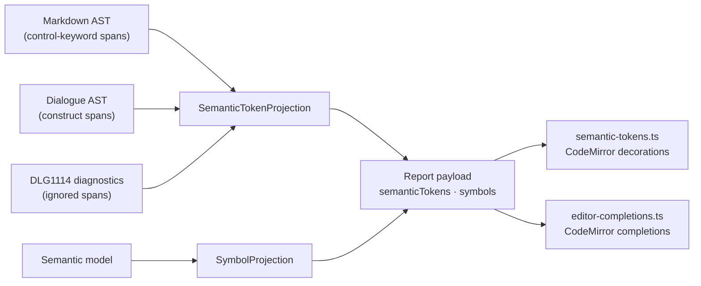

# Compiler-Projected Editor Semantics

> [!NOTE]
> Status: **implemented**. The Source editor highlights dialogue constructs and completes names from
> what the compiler projects into the report payload; the browser never re-lexes the dialogue
> grammar.

## Table of contents

- [Goal and scope](#goal-and-scope)
- [Ubiquitous language](#ubiquitous-language)
- [Architecture](#architecture)
- [Semantic tokens](#semantic-tokens)
- [Completions](#completions)
- [Key design decisions](#key-design-decisions)
- [Error and boundary cases](#error-and-boundary-cases)
- [Testability](#testability)
- [Out of scope](#out-of-scope)

## Goal and scope

The editor gains two dialogue-aware features — **highlighting** and **completion** — without a
second implementation of DialogueDown's grammar in TypeScript. Both are projections of the
compiler's own parse, carried in the payload beside the diagnostics, and drawn by the browser. A
grammar change touches only the C# parser and flows to the editor unchanged.

Standard Markdown and YAML are different: they are established languages the client parses itself
(see [Unmodeled Markdown Highlighting](./Unmodeled%20Markdown%20Highlighting.md) and
[Front Matter Source Highlighting](./Front%20Matter%20Source%20Highlighting.md)). The compiler owns
DialogueDown grammar and configured policy, nothing more.

## Ubiquitous language

| Term | Meaning |
| --- | --- |
| **Semantic token** | A source `range` (zero-based, LSP-shaped) plus a `kind` from the legend. The LSP `semanticTokens` concept. |
| **Token legend** | The stable set of token kinds (`TokenKind`). A language server would publish it as its legend. |
| **Completion symbol** | A completable name from the compiler's `SymbolSet`: a jump target, speaker, speaker id, or tag. |
| **Jump target** | A scene's anchor, written `[Label](#slug)`; `slug` is the GitHub-style slug of its heading. |
| **Jump indicator** | The `=>` that opens a jump. |
| **Transport** | How a projection reaches the editor: the report payload. |

## Architecture



`CompilationVisualizer.BuildContent` runs both projections on every compile. The tokens and symbols
reach the client on load, on a View hot reload, and in every save response — the same path the
diagnostics take. The shapes are LSP-shaped, so a language server could publish them unchanged.

## Semantic tokens

```ts
export interface SemanticToken {
    range: LspRange; // zero-based line/character, shared with diagnostics
    kind: TokenKind;
}
```

| Source node | Token kind |
| --- | --- |
| Speaker prefix parts (`Alice @alice:`) | `SpeakerName`, `SpeakerId`, `Separator` — one per written part |
| `CustomTag` / `ReservedTag` | `CustomTag` (`#happy`, `#mood=calm`) / `ReservedTag` (`##…`) |
| `JumpIndicator` | `JumpIndicator` (`=>`) |
| A reserved jump anchor such as `#END` | `ReservedAnchor` |
| Marker paragraph in a marker-headed quote | `ControlKeyword` (`` `if` ``, `` `elseif` ``, `` `else` ``) |
| `Query` | `Query` (`` `"playerName"` ``) |
| `Condition` | `Condition` (`` `Rainy?` ``) |
| `NumberWeight`, `AutoWeight` | `StaticWeight` |
| `QueryWeight` | `DynamicWeight` |
| `DefaultCommand`, `CustomCommand` | `Command` |
| A `DLG1114` span | `IgnoredMarkdown` — see [Unmodeled Markdown Highlighting](./Unmodeled%20Markdown%20Highlighting.md) |

For `Alice @alice #happy:` the tokens are disjoint:

```text
Alice   @alice   #happy   :
└Name┘  └─Id──┘  └─Tag──┘ └Separator
```

The parser keeps each prefix part's position (Superpower's `.Located()` on the name, id, and colon)
and stores them on the speaker node as `SpeakerPrefixSpans(SourceSpan? Name, SourceSpan? Id,
SourceSpan Separator)`. A quoted name's span includes its quotes; an id's includes its `@`.

Each kind maps to one `dd-tok-*` class through `TOKEN_CLASS`, shared with the preview's
[construct marks](./Construct%20Marks%20in%20the%20Source%20Preview.md). Colors follow VS Code
Light+/Dark+ roles: control keywords use the control-flow hue, `#END` the constant hue, commands the
function hue, static weights the number hue, and queries, conditions, and dynamic weights distinct
string, variable, and type hues.

## Completions

Completion is an Edit-only extension (it joins the other authoring aids in the editable
compartment). Every list comes from the payload's `symbols`; the cursor-context patterns below only
decide *where* to offer, never *what* is valid.

| Source | Fires at | Offers | Inserts |
| --- | --- | --- | --- |
| `jumpIndicatorCompletions` | `=>` plus an optional partial label, before any `[` | every scene by heading, plus `#END` as "End the run" | `=> [${Heading}](#slug)` — the heading an editable snippet field, the slug fixed |
| `jumpSlugCompletions` | `](#` inside a hand-typed link | every scene slug, heading as detail | the slug |
| `speakerIdCompletions` | `@` | speaker ids | the id |
| `tagCompletions` | a mid-line `#` (a line-start `#` is a heading) | tags | the tag |
| `speakerCompletions` | a line's leading word | speaker names | the name |

Each source drops the word being typed from its own list, so a half-typed `@gu` is not offered back.
<kbd>Tab</kbd> accepts as well as <kbd>Enter</kbd>; with no list open, Tab indents.

## Key design decisions

### D1 — The compiler is the single source of truth

Highlighting comes from projected tokens and completions from projected symbols, so the editor and
the compiler cannot disagree. A client-side scanner offered shapes the compiler rejects (an unquoted
`Marie-Claire`) and missed valid ones (a leading underscore); sourcing from the compiler makes those
mismatches impossible by construction.

### D2 — Tokens come from the Dialogue AST, not the Desugared AST

The Dialogue AST reflects what the writer typed. The Desugared AST adds synthetic nodes, such as a
filled default speaker, that have no source text. Control keywords come from the Markdown AST,
because the semantic `Branch` keeps no marker kind; they are still compiler-parsed spans, reused
through `MarkerRecognition`.

### D3 — Tokens layer over Markdown highlighting

The projection emits only dialogue-specific tokens. Headings, emphasis, lists, links, and plain
inline code keep CodeMirror's Markdown highlighting. Because tokens come from AST nodes, front
matter, fenced code, and link destinations are never colored as dialogue. Recognized code-span
forms override nested Markdown and blockquote styling so their color shows.

### D4 — Speaker parts are precise, non-overlapping tokens

LSP semantic tokens are delta-encoded and may not overlap. Disjoint name, id, and separator tokens
encode directly and interleave with the tag tokens, so the editor needs no decoration precedence.
The spans are one nullable value object rather than three properties on four node types, so the
projection reads one shape; it is `null` for a speaker with no written prefix (a filled default, an
orphan-tag recovery, a config-built speaker), which therefore emits nothing. `Name` and `Id` stay
plain strings, so the semantic analyzer and every other reader are untouched.

### D5 — Complete the whole jump target from `=>`

Writing `[Label](#slug)` by hand means remembering the heading, typing brackets, and slugifying
correctly; a mistyped slug is a silent dead link. Firing at `=>` inserts the complete target with
the heading pre-selected, so the common case is one keystroke and a different label is one retype.
The popup's info panel previews the full `[Heading](#slug)`. A single space always follows `=>`.
The in-link slug source stays for links typed by hand.

### D6 — Highlighting refreshes on recompile

Tokens reflect the last compile. Between compiles CodeMirror maps and clamps their ranges; a
per-keystroke client lexer would mean a second grammar to keep in step, and autosave already keeps
the gap near one second.

## Error and boundary cases

| Case | Behavior |
| --- | --- |
| Synthetic node (zero-width span) | No token. |
| Halted compile | The Dialogue AST is still produced, so tokens still appear. |
| Malformed or incomplete line | Only nodes the transpiler produced are tokenized. |
| Buffer edited since the last compile | Ranges map through the edit and clamp until the next recompile. |
| Empty document, or no scenes | No tokens; completion offers nothing (or only `#END` after `=>`). |
| Duplicate scene headings | The compiler's slugs; the duplicate is `DLG2001`. |
| Read-only View or static export | No completion extension. |

## Testability

- **.NET** (`SemanticTokenProjectionTests`): each node maps to its kind and zero-based range; speaker
  tokens are disjoint for every prefix form (quoted, id-only, name-only, name and id, with tags,
  odd whitespace); control keywords only inside marker-headed quotes; synthetic speakers emit
  nothing; a halted compile still yields tokens. Parser tests pin `SpeakerPrefixSpans` per form.
- **.NET** (`CompilationVisualizerTests`, `DisplayGraphJsonTests`): tokens reach `semanticTokens`;
  an empty document carries an empty array.
- **Vitest:** tokens convert to decorations at the right offsets and classes; each completion source
  is tested with an `EditorState` and a `CompletionContext` at a cursor, asserting `from`, options,
  the snippet insert, and `null` outside its context.
- **Browser:** tokens and code-span forms color distinctly in both themes; a live edit re-highlights
  after save; accepting a scene after `=>` yields `=> [Heading](#slug)`; nothing completes in View.

## Out of scope

- A language server: it would publish the same tokens, legend, and symbols.
- Inline ghost text for the jump completion; CodeMirror's popup cannot render a pending insert
  inline.
- Cross-file jump targets; the symbol set is the current script's scenes plus `#END`.
- Completing game-call verbs, front-matter keys, or Markdown syntax.
