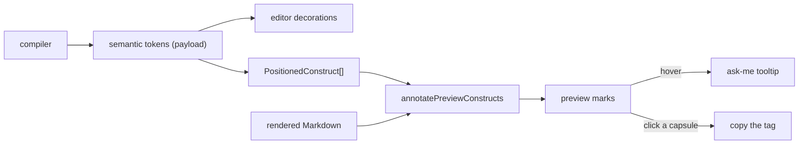

# Construct Marks in the Source Preview

> [!NOTE]
> Status: **implemented** — the rendered Source preview marks every dialogue construct the
> compiler projects, in the classes the editor beside it already uses, so a tag, a speaker, a
> command, or a jump reads the same on both halves of the split.

## Goal and scope

The Source tab is a split view: the editor on the left, the rendered Markdown on the right.
The editor has highlighted dialogue constructs since
[Compiler-Projected Editor Semantics](./Compiler-Projected%20Editor%20Semantics.md) — `#wise` in
tag pink, `@guide` in speaker-id green, `` `playSound("wind")` `` in command olive — while the
preview rendered the same words as ordinary prose: a tag looked like a word that happened to
start with `#`, and a command looked like inline code. The two halves of one screen disagreed
about what the script says.

This note covers closing that gap: the preview marks the **constructs the compiler already
found**, wearing the vocabulary the rest of the report established for them.

**In scope:**

- A **construct mark** pass over the rendered preview, driven by the compiler's semantic tokens:
  every token kind the preview can mark, at every occurrence in the document.
- The **tag capsule** in running prose, tightened so it hugs the punctuation that follows a
  speaker prefix.
- The **affordances** the report's tables already have: an ask-me tooltip on hover and copy on a
  tag.

**Out of scope (deliberate, see D7):**

- The `Separator` token (a colon is a colon wherever it appears), the `ControlKeyword` (its
  block already carries a region), and `IgnoredMarkdown` (the preview renders it plain on
  purpose).
- Marks for constructs typed but not yet compiled. The compiler positions tokens on a compile;
  between compiles the marks move with their spans but do not appear or vanish.
  Instant, per-keystroke semantics are the deferred item of the sibling note above.

## Ubiquitous language

| Term | Meaning |
| --- | --- |
| **Construct** | A dialogue-language element the compiler tokenized: a speaker's name or id, a tag, a command, a query, a condition, a weight, a jump indicator, or a reserved anchor. |
| **Semantic token** | The compiler's positioned projection of a construct (kind + range), carried in the report payload. Defined in the sibling note above. |
| **Construct mark** | What the preview draws for a construct: a tinted span wearing the editor's token class, or the shared tag capsule. |
| **Capsule** | The tag chip the report draws everywhere it shows a tag — a capsule with an identity dot. |
| **Token vocabulary** | `dd-tok-*` classes mapped from token kinds, shared by both text surfaces. |
| **Ask-me mark** | A mark that explains itself on hover (help cursor + tooltip) rather than acting. |
| **Acting mark** | A mark with a click: a capsule copies. |

## Functionality checklist

- [x] The preview marks each projected construct kind, at every occurrence of its text.
- [x] A tag renders as the shared capsule, with its identity dot and its copy affordance.
- [x] The marks wear the same classes as the editor, so one construct is one color in both panes.
- [x] Ask-me marks carry a help cursor and a tooltip; a capsule copies and shows no tooltip.
- [x] The capsule is drawn with even sides, snug against the punctuation that closes a speaker
      prefix.
- [x] A tag in prose leaves off the identity dot that tells tags apart in a table.
- [x] Ignored Markdown, front matter, link text, and a code span that merely contains a
      construct's words stay unmarked.
- [x] Edits move the marks with their spans until the next compile replaces them.
- [x] `web/dist/report.html`, `report.js`, and `report.css` are rebuilt for both themes.

## Interfaces and abstractions

| Type | Responsibility | Collaborators |
| --- | --- | --- |
| `PreviewSemantics` | What the compiler says about the document being previewed: ignored spans, control keywords, and positioned constructs. | `source-view`, `text.ts` |
| `PositionedConstruct` | One construct as the compiler reported it — kind + span, before the text is read back. | `PreviewSemantics` |
| `PreviewConstruct` | A positioned construct resolved against the buffer: kind, span, and the text as written. | `annotatePreviewConstructs` |
| `annotatePreviewConstructs` | Walk the rendered preview and mark every construct occurrence. | `construct-highlight.ts` |
| `TOKEN_CLASS` | The one mapping from token kind to class, shared by the editor's decorations and the preview's marks. | `semantic-tokens.ts`, `construct-highlight.ts` |
| `renderTag` | The one capsule every surface draws a tag with; `identityDot` is off for prose. | `tag-chip.ts`, the Config tab, the tables |

## Key design decisions

### D1 — The compiler decides what a construct is

The mark pass re-lexes nothing. It is handed the constructs the compiler projected and matches
their text in the rendered document, exactly as the ignored-span pass beside it matches its own
spans. A string the compiler did not report as a construct is never marked, so the preview cannot
disagree with the editor about the grammar.

### D2 — One vocabulary, promoted out of the editor's scope

The token classes were scoped `.source-pane .cm-content .dd-tok-*` — the editor's scope was
load-bearing, because CodeMirror's own highlight classes must lose the cascade to the tokens.
The rules now read `:is(.source-pane .cm-content, .source-preview) .dd-tok-*`: same specificity
for the editor, a second surface for the preview, one place to change a color. A parallel
`dd-preview-*` vocabulary would have been two stylesheets to keep in sync.

### D3 — A tag is the capsule, not a tinted word

Every other construct is a word inside a sentence and takes a color. A tag is an object the
report shows as a capsule in the Config tab, the Semantic Model, and the Playbook, so the preview
draws the same capsule — the same component, hues, and copy affordance. It deliberately does *not*
also wear `dd-tok-custom-tag`: the capsule's own two-hue design (pink for custom, violet for
reserved) is what identifies it, and a token tint on top would fight it.

The capsule's **identity dot** is left off in prose. The dot answers "which tag is this?" — worth
asking when several tags compete for the eye in one table cell, and worth little in a sentence
where the tag's own text stands in plain sight. The capsule keeps the canonical tag hue, which is
the part that says "this is a tag"; the dot, and its hash of the name, stay a table's aid.

### D4 — A DOM pass after rendering, not a Marked extension

The ignored and control-keyword decorations are Marked token renderers. Tags, ids, and the jump
arrow are not Markdown tokens at all — they are plain text inside a paragraph — so a renderer
seam cannot reach them. The pass walks the rendered DOM instead: one implementation covers both
the constructs that arrive as code spans and those that arrive as prose. It runs after the
control-region and heading-anchor annotations, so those elements already exist and can be
skipped rather than fought.

### D5 — A code-span token covers its backticks

The compiler tokenizes `` `playSound("wind")` `` as one span *including* the backticks, while the
rendered `<code>` holds only what is between them. The mark therefore matches the span's content
for the code-span kinds, and the text as written for the rest. Getting this wrong is silent —
the editor stays colored while the preview goes bare — so both the unit tests and an end-to-end
test pin the two shapes together.

### D6 — Placement guards keep a repeated word from being over-marked

A construct's text is matched wherever the document repeats it, because the same text in the same
script is the same construct. Two guards keep that honest. A tag or id must stand alone: `#wise`
is not the `#wise` of `#wisdom`, and one glued to the word before it belongs to that word. A
speaker's name is marked only where it opens a prefix — the occurrence a `:`, an `@id`, or a tag
follows — because the same name appears in prose without being anybody's line.

### D7 — Three kinds stay plain, on purpose

`Separator` is a colon: matching that text would tint colons throughout the prose. `ControlKeyword`
already has a region annotation (`dd-preview-control-region`) and the keyword itself now wears the
token's color through its existing class. `IgnoredMarkdown` is what the preview renders plain, by
definition. The pass skips all three rather than inventing a mark for them.

### D8 — Two affordances, borrowed from the tables

A mark that names something the reader may need explained — who speaks, what the game performs, a
value only the running game can answer, a weight, where a jump goes — takes the graph's help
pointer and a tooltip through the same delegated Tippy instance the tables use. A capsule copies,
through the same delegated handler the tables use.

The preview deliberately offers **no reveal-in-editor click**. The two panes already scroll
together, so the reader is looking at the line in question, and a click that reached across the
split would be a reverse mapping no other mark has — a stray affordance rather than a rule. The
editor stays reachable from the stage tabs, which is where a reader asks "where did this come
from?" Its arrow therefore wears the same ask-me pointer as every other mark, because nothing in
the preview should promise a click it cannot keep.

## Error and boundary cases

| Case | Behavior |
| --- | --- |
| No tokens (a halted compile, an empty report) | No marks; the preview renders as before. |
| The same construct several times | Every occurrence is marked — same text, same construct. |
| A tag and a longer tag sharing a prefix (`#default` / `##default`) | The longest construct wins; the shorter one does not double-mark it. |
| A construct inside ignored Markdown, front matter, or a link | Left alone: those regions are spoken for. |
| A code span that contains a construct's words but is not one | Left alone: a code-span mark requires the whole span to be the construct. |
| An edit between compiles | Spans map through the change; the text is read back out of the buffer, so a mark follows its construct. A construct typed but not yet compiled is unmarked until the next compile. |
| A second pass over the same DOM | Already-marked elements are skipped, so the pass is idempotent. |

## Integration

- **Data**: `report.semanticTokens` (unchanged) and `report.symbols` — no compiler or payload
  change; the marks are a client-side rendering of what the report already carried.
- **Wiring**: `createSourceView` builds the positioned constructs in `setSemanticTokens`, resolves
  them to marks on every preview render, and installs the tooltip and copy handlers once
  on the stable preview element so a re-render keeps them.
- **Styles**: the promoted token rules and the preview interaction layer live together in
  `src/styles.css`; the build output the report embeds (`report.js`, `report.css`) changes with
  them and is committed.

## Testability

- **Unit** — `construct-highlight.test.ts`: every kind, the capsule's DOM, the code-span shape,
  the placement guards, precedence, idempotence, and the plain kinds. The tests carry the
  compiler's real token text, backticks included.
- **View** — `source-view.test.ts`: the marks appear from pushed tokens and clear when tokens empty.
- **Capsule** — `tag-chip.test.ts`: the identity-dot option leaves the capsule otherwise unchanged.
- **End to end** — `e2e/highlight.spec.ts`: the editor's marks (scoped to the editor pane), the
  preview's marks for a prefix and for every code-span kind, and the capsule's copy attribute.
  `semantic-tokens.test.ts` pins the shared class mapping.

## Open questions

- **Marks between compiles.** The pass only knows what the last compile projected. Projecting
  tokens in the browser would remove that lag at the cost of a second grammar; the sibling note
  defers the same idea, and the marks inherit the decision.
- **A condition's guard.** The tooltip says what follows is gated, without naming whether that is
  a line, a choice, a jump, or a block: the token does not carry the construct it guards, so a
  sharper tooltip needs more of the parse in the payload. Worth it only if writers ask.
- **The editor's own hover.** The editor could carry the same tooltips through a CodeMirror hover
  source. Deferred: the editor's colors already say what a construct is, and its tooltips would
  compete with the diagnostics overlay for the same hover.
