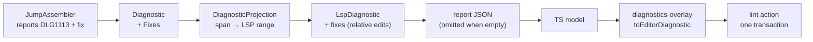

# Diagnostic quick fixes

> [!NOTE]
> Status: **proposed**. A diagnostic may carry a **fix** — a title and literal
> text edits — and the Source editor offers it as an action in the diagnostic
> tooltip. The first producer is the dangling jump arrow, whose fix inserts the
> escape its message already recommends.

## Table of contents

- [Diagnostic quick fixes](#diagnostic-quick-fixes)
  - [Table of contents](#table-of-contents)
  - [Goal and scope](#goal-and-scope)
  - [Functionality checklist](#functionality-checklist)
  - [Ubiquitous language](#ubiquitous-language)
  - [Writer-facing behavior](#writer-facing-behavior)
  - [Architecture](#architecture)
  - [Key design decisions](#key-design-decisions)
    - [D1 — The producer attaches fixes to its diagnostic](#d1--the-producer-attaches-fixes-to-its-diagnostic)
    - [D2 — A fix is data, not a callback](#d2--a-fix-is-data-not-a-callback)
    - [D3 — Edit ranges are relative to the diagnostic span](#d3--edit-ranges-are-relative-to-the-diagnostic-span)
    - [D4 — Applying a fix is one ordinary edit transaction](#d4--applying-a-fix-is-one-ordinary-edit-transaction)
    - [D5 — A fix repeats the remedy its message names](#d5--a-fix-repeats-the-remedy-its-message-names)
    - [D6 — Fixes are an edit-mode affordance](#d6--fixes-are-an-edit-mode-affordance)
  - [Error and boundary cases](#error-and-boundary-cases)
  - [Integration](#integration)
  - [Testability](#testability)
  - [Alternatives not chosen](#alternatives-not-chosen)
  - [Open questions and deferred work](#open-questions-and-deferred-work)

## Goal and scope

The compiler diagnoses a problem and, for some diagnostics, knows the exact
repair. The dangling jump arrow is the first: `DLG1113` tells the writer that an
arrow with no link is read literally and to escape it (`\=>`); a fix turns that
advice into one click, at the moment the warning appears.

This note adds a **fix channel** to the diagnostic model, projects it to the
editor, and offers each fix as an action in the diagnostic tooltip. Applying a
fix is an ordinary buffer edit, so undo, dirty state, autosave, and recompilation
all inherit.

**In scope:** the fix model, the dangling-arrow producer, the projection into the
report payload, and the editor action.

**Out of scope:** general refactors, "fix all", a CLI mode that applies fixes
(queued as separate follow-up work), fixes in the published reference, and a
"Make literal" command for valid sigils — deferred, tracked separately, and
deliberately not needed for this seam.

## Functionality checklist

- [ ] `Diagnostic` carries an ordered list of fixes, empty by default.
- [ ] A fix has a writer-facing title and one or more text edits.
- [ ] `DLG1113` attaches *"Escape as literal text"*, inserting `\` at the arrow's
      start.
- [ ] The projection carries the fixes on the LSP-shaped diagnostic, with edit
      ranges relative to the diagnostic's own span.
- [ ] The editor shows one action per fix in the diagnostic tooltip and applies
      its edits as a single undoable transaction.
- [ ] A diagnostic with no fixes is unchanged in payload and UI.
- [ ] A read-only report offers no actions.
- [ ] An action whose diagnostic range has collapsed (the text is gone) is a
      no-op.
- [ ] Applying a fix marks the document dirty and lets autosave and the live
      recompile clear the warning.

## Ubiquitous language

| Term          | Meaning                                                                     |
| ------------- | --------------------------------------------------------------------------- |
| **Fix**       | A diagnostic's suggested repair: a title plus text edits.                   |
| **Edit**      | A source span and the text that replaces it; an insertion is an empty span. |
| **Action**    | The editor's affordance for one fix — a CodeMirror lint action.             |
| **Quick fix** | The writer-facing name for the fix-and-action pair.                         |

## Writer-facing behavior

The dangling-arrow warning gains an action in its tooltip:

```text
warning DLG1113: `=>` makes a jump only when a link follows it. …
  Escape as literal text
```

Activating it inserts the backslash before the arrow — the buffer reads
`\=>` — and the next compile is quiet, because an escaped arrow is prose and no
longer a dangling indicator.

## Architecture

A fix is born with its diagnostic, travels with it through the store and the
projection, and is applied by the editor as a plain text edit.



| Type                                                         | Responsibility                                 | Change                                                                     |
| ------------------------------------------------------------ | ---------------------------------------------- | -------------------------------------------------------------------------- |
| `Diagnostic`                                                 | One located problem                            | Carries an ordered list of fixes; empty by default.                        |
| `DiagnosticFix`, `DiagnosticEdit`                            | New core value types                           | A title plus the edits that apply it; a span plus its replacement text.    |
| `JumpAssembler`                                              | Reports the dangling arrow as it degrades it   | Attaches the escape fix.                                                   |
| `DiagnosticProjection`, `LspDiagnostic`, `LspFix`, `LspEdit` | Locate a diagnostic and its fixes in LSP terms | Projects fixes with ranges relative to the diagnostic span.                |
| `DisplayGraphJson`                                           | The report payload                             | Serializes `fixes`; an empty list is omitted like the other absent fields. |
| `model.ts` (`LspDiagnostic`)                                 | The client's view of a diagnostic              | Gains the optional fixes.                                                  |
| `diagnostics-overlay.ts`                                     | Renders diagnostics into CodeMirror            | Maps each fix to a lint action; applies the edits on activation.           |

## Key design decisions

### D1 — The producer attaches fixes to its diagnostic

The stage that knows the repair attaches it where the diagnostic is made
(`JumpAssembler`, at the moment it degrades the arrow). Consumers then only
forward or ignore it: the CLI and the published reference keep rendering the
message alone, the projection carries the fix, and a future language server
serves it without moving knowledge around.

Deriving fixes in the visualization from a diagnostic's code and span was
rejected: it would re-derive what the producer already knew, and the fix would
grow a second home the day a second consumer wanted it.

### D2 — A fix is data, not a callback

A fix is a title and literal edits. It is serializable, comparable, and testable
without an editor; the client applies text and knows nothing about tags, arrows,
or escaping. A callback would tie the model to a process and defeat the
projection.

### D3 — Edit ranges are relative to the diagnostic span

Every edit is expressed against the diagnostic's own span — the arrow's fix is
"insert `\` at offset 0". The compiler's spans are absolute, but the payload is
**pushed** once and then goes stale while the writer types; the diagnostic's
range is the one position the editor keeps remapping, so anchoring edits to it
keeps them correct without the client tracking change deltas or re-reading the
source.

An LSP server computes edits fresh per request, so the relative shape costs
nothing later. Absolute offsets were rejected: between the last compile and the
next save they can point at the wrong text, and a misplaced insertion corrupts
the buffer.

### D4 — Applying a fix is one ordinary edit transaction

The action dispatches all of its edits in a single transaction tagged
`userEvent: "input"`, exactly as typing would. Undo restores the previous text in
one step, the live-edit state machine sees a dirty buffer, autosave arms, and the
recompile clears the warning through the normal path. No special-case save or
notification exists.

### D5 — A fix repeats the remedy its message names

`DLG1113`'s message already says "escape the arrow". The fix is the same remedy,
one click closer; a fix never appears that the diagnostic's own prose does not
explain. Fixes that would need a different explanation belong in the message
first.

### D6 — Fixes are an edit-mode affordance

The exported report and the View mode are read-only, so they render the
diagnostic and no action. The quick fix is part of authoring, alongside typing,
and needs the live loop to save and recompile.

## Error and boundary cases

| Case                                                     | Behavior                                                               |
| -------------------------------------------------------- | ---------------------------------------------------------------------- |
| A diagnostic with no fixes                               | Unchanged: no `fixes` field in the payload, no action in the tooltip.  |
| Several diagnostics, one with a fix                      | Only that diagnostic offers an action; there is no fix-all.            |
| A collapsed diagnostic range (the text it named is gone) | The action is a no-op; the warning refreshes on the next compile.      |
| The report lags the buffer (mid-debounce typing)         | Edits stay anchored to the remapped diagnostic range (D3).             |
| A read-only report or View mode                          | Diagnostics render; actions are not offered (D6).                      |
| An arrow in a choice body or control branch              | The diagnostic is reported there today; its fix rides along unchanged. |
| A fix with several edits                                 | Applied in order within one transaction (D4).                          |

## Integration

- **Payload:** `diagnostics[].fixes` in the report JSON; empty lists are omitted
  like the other absent fields, so nothing changes for diagnostics without a fix.
- **Live loop:** applying a fix dirties the buffer and inherits autosave and the
  generation-safe save (see the Autosave note).
- **Editor:** `toEditorDiagnostic` gains the action mapping; semantic tokens and
  completions are untouched.
- **Help:** the editor's help text gains one line for the action.

## Testability

- **Core:** the assembler test asserts the dangling arrow's fix — its title and
  the insertion at the arrow's start — and that no other diagnostic carries one.
- **Projection:** a diagnostic's fixes survive projection with ranges relative to
  the diagnostic span, including a multi-edit fix.
- **Serialization:** the payload carries `fixes`, and omits the field when empty.
- **Web unit:** an action is created per fix; activating it dispatches one
  transaction with the expected edit; a collapsed range is a no-op.
- **Web live e2e:** the served session offers the action on a dangling arrow;
  activating it inserts `\`, saves, and the recompile clears the warning.
- **Coverage:** the new core, projection, and overlay paths at 100% line and
  branch coverage.

## Alternatives not chosen

| Alternative                                           | Why not                                                                                                         |
| ----------------------------------------------------- | --------------------------------------------------------------------------------------------------------------- |
| Derive fixes in the visualization from code and span  | Re-derives producer knowledge and gives the fix a second home (D1).                                             |
| Absolute edit offsets                                 | Stale within the live-edit window; a misplaced insert corrupts text (D3).                                       |
| Callbacks instead of data                             | Not serializable, not testable without an editor, not portable to a server (D2).                                |
| A client-side "Make literal" command for valid sigils | A valid tag or jump carries no diagnostic, and the escape is one typed character; deferred, tracked separately. |
| Attaching fixes to the descriptor                     | A descriptor is shared by every instance; a fix needs a span.                                                   |

## Open questions and deferred work

- **The literalize command and suggestions** remain deferred, tracked separately;
  the shortlist of agreed behavior (shortcut, selection semantics) lives there.
- **More producers** may follow; the seam is one attach call, and each new fix
  should arrive with its message already naming the remedy (D5).
- **CLI `--fix`** — a compile mode that applies a document's fixes and writes the
  result is queued as separate follow-up work; this seam only carries them.
