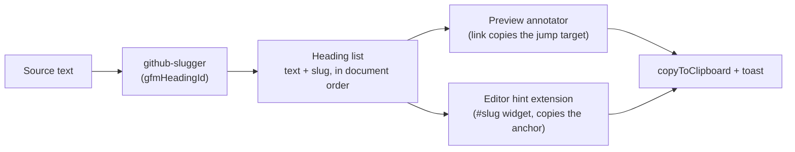

# Live visualization — heading anchors

> [!NOTE]
> Status: **implemented**. Copy a scene heading's GitHub-style anchor straight from
> the Source view: a chain-link on each rendered preview heading copies the full
> jump target, while an inline slug hint on the active editor heading copies the
> bare anchor. Pure frontend — no core, projection, or payload change.

## Table of contents

- [Goal and scope](#goal-and-scope)
- [Prior art](#prior-art)
- [Ubiquitous language](#ubiquitous-language)
- [Writer experience](#writer-experience)
- [Why the client slug is correct](#why-the-client-slug-is-correct)
- [Architecture](#architecture)
- [Key design decisions](#key-design-decisions)
- [Error and boundary cases](#error-and-boundary-cases)
- [Testability](#testability)
- [Deferred and out of scope](#deferred-and-out-of-scope)
- [Resolved questions](#resolved-questions)

## Goal and scope

A jump is written `[text](#slug)`, where `slug` is the GitHub-style anchor of a
scene heading. Today a writer must know or hand-type that slug. This feature lets
them **copy a heading's anchor directly from the Source view**, through two
affordances:

1. **Preview heading link** — a hover-revealed chain-link icon after each rendered
   preview heading. Its tooltip previews, and clicking copies, the full jump target
   `[<heading>](#<slug>)`.
2. **Editor slug hint** — a subtle, non-editing `#<slug>` hint revealed after the
   **active** heading line (the caret's line) in the CodeMirror editor. Clicking
   copies the bare anchor `#<slug>`.

Both are **read-only affordances over existing data** — the slugs the preview
already computes. The feature touches only `web/src`; it adds no core, projection,
model, or payload change.

Out of scope: authoritative-slug plumbing (see
[Why the client slug is correct](#why-the-client-slug-is-correct)), full-URL
copying, and affordances on the graph-tab scene nodes.

## Prior art

- **GitHub / GitLab / VS Code Markdown preview** — hovering a rendered heading
  reveals a link glyph that copies the heading's anchor. This affordance is a
  near-universal, learnable convention; the preview chain-link mirrors it directly.
- **Editor inlay hints** — VS Code and LSP render non-editing hints inline (types,
  parameter names, anchors). CodeMirror 6 has no built-in inlay-hint API, but an
  inline [widget decoration](https://codemirror.net/docs/ref/#view.Decoration^widget)
  is the idiomatic equivalent, and is how community inlay-hint packages are built.
  The editor slug hint is one such widget.
- **DialogueDown jump autocomplete** ([issue #71](https://github.com/pengzhengyi/dialoguedown/issues/71))
  already surfaces scene-heading slugs when *completing* a jump destination. This
  feature is its complement: copying a slug *out* from a heading.

## Ubiquitous language

- **Scene heading** — a Markdown heading that opens a scene.
- **Anchor** / **slug** — the GitHub-style slug (compiler
  `Slug.From`;
  client `github-slugger`) that a jump `](#slug)` resolves to.
- **Jump link** — `[text](#slug)`, the Markdown a `=>` choice or jump uses.

## Writer experience

**Preview heading link.** Hovering a rendered heading fades in a chain-link icon
after the title (GitHub-style), vertically centered on the text and slightly
shorter than its line height. Its Tippy tooltip previews the full jump target
`[<heading text>](#<slug>)`; clicking copies that value and confirms through the
shared toast (`Copied …`). It is a real focusable button with an accessible label,
so it works from the keyboard, not only on hover.

**Editor slug hint.** When the caret rests on a heading line, a muted,
unselectable `#<slug>` chip is revealed inline after that heading's text — never
part of the document, never editable. Only the active heading line shows a hint,
so a heading-dense script stays uncluttered. Hovering the chip shows the slug
tooltip; clicking copies the bare `#<slug>` and toasts. It works in both View
(read-only — the caret still moves) and Edit.

The two granularities are deliberate: the preview chain-link yields a **whole
jump target** ready to paste after a `=>`, while the editor hint yields the
**bare anchor** `#<slug>` ready to paste inside an existing `](../../…)`.

## Why the client slug is correct

The affordance uses the slug the preview already computes with
[`marked-gfm-heading-id`](https://www.npmjs.com/package/marked-gfm-heading-id)
(backed by `github-slugger`) — **not** an authoritative slug plumbed from the
compiler. This is safe because the compiler's
`Slug.From` is written to
reproduce the `github-slugger` algorithm *exactly*, for the express purpose of
editor parity:

> Parity matters: a writer who autocompletes a jump target against a scene heading
> gets the editor's slug, so the compiler must produce the identical one or the
> jump silently breaks.

The two slugs are therefore **identical for every valid heading**. They diverge
only in the two states that are already compiler diagnostics:

| Case | Compiler | Client (`github-slugger`) | Resolution |
| --- | --- | --- | --- |
| Duplicate headings | keeps the base slug, reports `DLG2001` (the `AnchorTable` deliberately does **not** disambiguate) | suffixes `-1`, `-2` | Diagnosed; the preview's `-1` even hints at the collision. Accepted. |
| Empty / punctuation-only slug | `""`, reports `DLG2002` (never a jump target) | `""` | No affordance is shown (see below). |

Plumbing an authoritative slug would need a **new projection** carrying, per
heading, `{ sourceSpan, slug }` — because `SymbolProjection` exposes slugs with no
source position and the semantic `Scene` has no span (spans live on the AST
heading nodes, a different layer). That projection would bridge two layers and is
a reusable seam that could migrate toward the core; given the parity above, it
would buy correctness only in already-diagnosed states, so it is **not** built.

## Architecture

One slug source of truth feeds both affordances, so the preview and editor can
never disagree:

New and touched modules (all under `web/src`):

- **`heading-anchors.ts`** *(new)* — given the preview container after
  `renderDocument`, walk `h1…h6[id]` and attach one chain-link button to each
  non-empty slug. Idempotent, so it can re-run after every preview re-render.
- **`heading-slug-hints.ts`** *(new)* — a CodeMirror `StateField` + inline
  `Decoration.widget` extension, mirroring the existing
  `semantic-tokens.ts`
  decoration pattern. It recomputes on **selection** changes as well as document
  changes, placing a single widget on the heading line the caret is on. Heading
  lines come from the Markdown **syntax tree** (so fenced code and front matter are
  skipped); slugs come from `github-slugger` fed the heading texts in document
  order (matching the preview's duplicate handling).
- **`source-view.ts`** *(wire)* — call the preview annotator after each render and
  register the editor extension.
- **Reused as-is** — `path-display.copyToClipboard`, `toast.showToast`, `tippy`.

A small direct dependency on `github-slugger` (already transitive via
`marked-gfm-heading-id`, ~1 kB, the exact algorithm the compiler mirrors) lets the
editor extension compute slugs itself rather than depend on render ordering.

## Key design decisions

1. **Client `gfmHeadingId` slug, shared by both affordances** — identical to the
   compiler for valid headings; no core, projection, or payload change. See
   [Why the client slug is correct](#why-the-client-slug-is-correct).
2. **Two copy granularities** — the editor hint copies the bare anchor `#slug`;
   the preview chain-link copies the full jump target `[title](#slug)`. Each
   affordance's tooltip previews exactly what it copies.
3. **Empty-slug headings get no affordance** — they are not jump targets
   (`DLG2002`), so there is nothing meaningful to copy.
4. **The preview link is hover-revealed**, keeping the rendered preview clean, but
   stays focusable for keyboard and assistive tech. Its inline SVG has no text
   content, so the heading's textContent stays the plain title.
5. **Editor hint is an inline widget on the active heading line only** — revealed
   when the caret is on a heading line, and never document text (it cannot be
   typed, selected into a copy of the buffer, or saved). Showing only the active
   line's hint keeps a heading-dense script uncluttered.
6. **The copied jump-link label is the heading's plain rendered text** — the same
   text the reader sees, so `# The Market` yields `[The Market](#the-market)`.
7. **Reuse the existing copy/tooltip/toast infrastructure**, so the interaction
   matches the path chip and config table a writer already knows.

## Error and boundary cases

- **Empty slug** → no preview link and no editor hint.
- **Duplicate heading** → suffixed slug, consistent between preview and editor;
  the writer still sees `DLG2001`.
- **Formatted heading text** (emphasis, inline code) → the link label uses the
  heading's plain text and the anchor uses its slug, both as `github-slugger`
  derives them.
- **Front matter / fenced-code `#` lines** → not headings; the syntax tree and
  `marked` both exclude them, so no affordance appears.
- **Preview re-render on every edit** → the annotator is idempotent and re-attaches
  affordances without leaking duplicates or listeners.
- **Clipboard API unavailable** → the existing hidden-textarea fallback in
  `copyToClipboard` still copies.

## Testability

- **Unit (Vitest)** — jump-link and anchor formatting (the label is the heading's
  plain text); the preview annotator adds one link copying `[title](#slug)` per
  non-empty heading, leaves the heading's textContent the plain title, and skips
  empty slugs; the editor extension shows a single widget on the active heading
  line with the matching slug, hides it off a heading line, skips
  fenced-code/front-matter `#` lines, and suffixes duplicates in step with the
  preview.
- **Live e2e (Playwright)** — hovering a preview heading reveals the link icon;
  clicking it puts `[title](#slug)` on the clipboard and toasts; placing the caret
  on a heading line reveals the `#slug` hint and clicking it copies the bare
  anchor. Reuses `gallery.dialogue.md` and grants clipboard permissions to read
  the result.

## Deferred and out of scope

- **Authoritative-slug projection** — unnecessary given compiler/client parity.
- **Full-URL copying** — only in-document anchors are copied.
- **Graph-tab scene-node affordances** — the Semantic tab already cross-links
  scenes; this feature is Source-view only.
- **Anchor rename/refactor** — updating every jump when a heading changes is a
  separate, larger feature.

## Resolved questions

- **Editor hint density** — *resolved:* reveal the hint only on the **active
  heading line** (the caret's line), not after every heading, keeping a
  heading-dense script uncluttered.
- **Link label fidelity** — *resolved:* the copied jump link uses the heading's
  **plain rendered text** as its label (`# The Market` → `[The Market](#the-market)`).
