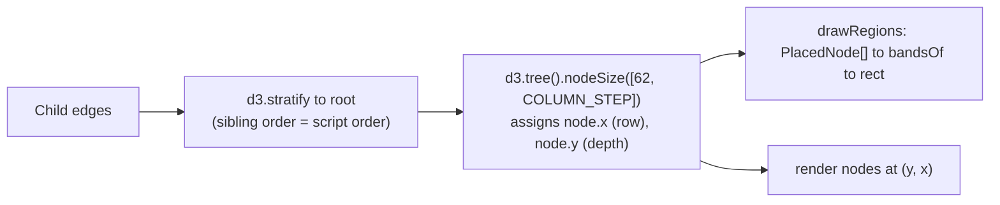
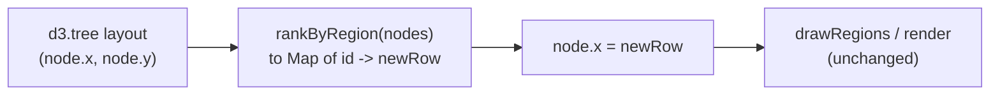

# Region-Aware Graph Layout

> [!NOTE]
> Status: **proposed** — not yet implemented. The Dialogue Graph lays its nodes
> out with a region-blind tree layout, so a scene's nodes interleave with another
> scene's rows and the bands drawn behind them overlap. This note adds a layout
> pass that gives every scene a contiguous band of rows, so a band is never drawn
> over another.
>
> Like the rest of the visualization tooling, this surface is "vibe-coded" (see
> the visualization note's maturity caveat); the compiler stays the reviewed
> surface.

## Table of contents

- [Goal and scope](#goal-and-scope)
- [Ubiquitous language](#ubiquitous-language)
- [Functionality checklist](#functionality-checklist)
- [How it works today](#how-it-works-today)
- [Design](#design)
- [Interfaces and abstractions](#interfaces-and-abstractions)
- [Key design decisions](#key-design-decisions)
- [Error and boundary cases](#error-and-boundary-cases)
- [Integration](#integration)
- [Testability](#testability)
- [Open questions](#open-questions)

## Goal and scope

The Dialogue Graph draws a tinted **band** behind the nodes of each scene. A band
is the bounding box of its nodes, and the layout that places those nodes does not
know which scene a node belongs to. When flow crosses between scenes — a scene
entered from partway through another, two scenes both diverting into a third — the
scenes' rows interleave and their bounding boxes **overlap**: translucent tints
stack into a third colour, and a node in the overlap reads as belonging to two
scenes at once.

Measured on `examples/highrise-fire.dialogue.md`, five band pairs overlap, several
by more than 500 px.

This component makes the overlap **impossible**: after the tree layout runs, a
re-ranking pass moves each node's row so that every scene occupies a contiguous,
disjoint interval of rows. A band's bounding box is then guaranteed not to touch
another's.

**In scope:**

- A pure `rankByRegion` pass that reassigns node rows so scenes do not interleave.
- Wiring it into the Dialogue Graph's `update()` between the tree layout and the
  render.
- Keeping it correct under scene folding and node collapse.

**Out of scope:**

- The tree layout itself (`d3.tree`) — column/depth positions and the parent
  fan-out shape are unchanged.
- Routing the longer cross-scene edges the re-ranking produces — see
  [DD5](#dd5--cross-scene-edges-stretch-and-that-is-acceptable).
- The other stage tabs (Markdown AST, Dialogue AST, …) — they draw no bands, so
  the pass is a no-op there and is not applied.
- Any C# change: a node already carries its `Region`.

## Ubiquitous language

One concept, one name — here, in the code, and in the tests.

| Term | Meaning |
| --- | --- |
| **Region** | A scene: the named area of the document a node sits in. `DisplayNode.region`. A node has zero or one. |
| **Band** | The rounded rectangle drawn behind a region's nodes — its bounding box, from `bandsOf`. |
| **Row** | A node's cross-axis position (`node.x` from `d3.tree`, drawn as the vertical coordinate). Depth is the other axis and is not touched. |
| **Lane** | The contiguous interval of rows one region is given. Two lanes never overlap; that is the whole point. |
| **Rank** | The order the lanes are stacked in, top to bottom. |
| **Loose node** | A node with no region — the entry, a control line outside every scene, unreachable content. It is not in any lane. |

## Functionality checklist

- [ ] `rankByRegion(nodes)` returns a new row for every node such that each
      region's rows form a contiguous interval and no two intervals overlap.
- [ ] Within a lane, nodes keep the **relative row order** the tree layout gave
      them, so a scene still reads top-to-bottom as its flow does.
- [ ] Lanes are stacked in **document order** — the order scenes first appear —
      matching the legend and the anchor table.
- [ ] The node pitch inside a lane is unchanged; lanes are separated by a fixed
      gap that clears the band's header and padding.
- [ ] Loose nodes keep their tree row and are not pushed into a lane; a lane's
      interval is computed to leave room for any loose rows that fall inside it.
- [ ] The Dialogue Graph applies the pass on every `update()`; no other stage
      does.
- [ ] Folding a scene, collapsing a node, and reverting all re-run the pass and
      stay disjoint.
- [ ] `bandsOf` output for a re-ranked graph has no overlapping bands — asserted.

## How it works today



`d3.tree` sets a node's row from its position among its siblings and the vertical
extent of its subtree, with a `separation` that only widens the gap between
different parents. **Region membership is never read.** A scene reached by a
divert from deep inside another scene's subtree gets its rows wherever that
subtree put them — interleaved with the other scene's — and `bandsOf`, which only
sees final positions, draws two boxes that cross.

## Design

One pure function sits between the tree layout and the render.



### The re-ranking pass

Given the laid-out nodes (each with an `id`, a `region`, and a tree row `x`):

1. **Order the lanes.** Collect the distinct regions in document order (the order
   their first node appears in the stage's node list — the same order the legend
   and anchor table use).
2. **Order nodes within a lane.** For each region, take its nodes sorted by their
   current tree row. This keeps the scene reading the way the flow laid it out.
3. **Lay the lanes down, top to bottom.** Walk a cursor down the row axis. For
   each lane in rank order:
   - place the lane's nodes at `cursor, cursor + PITCH, cursor + 2·PITCH, …`;
   - advance the cursor past the lane, then by `LANE_GAP` (enough to clear the
     band's `PAD_TOP`/`PAD_BOTTOM` and its name).
4. **Place the loose nodes.** A loose node keeps its original tree row, mapped
   through the same top-to-bottom compression so it lands near the lane it was
   drawn beside. Where a loose row falls inside a lane's interval, the lane's
   cursor is nudged so the two do not collide.
5. **Return** a `Map<id, newRow>`; the caller assigns `node.x` from it and renders
   as before.

Depth (`node.y`) is never touched, so every node stays in its column and the
parent-to-child fan-out keeps its shape; only the cross-axis order changes.

```text
rankByRegion(nodes):
    laneOrder   = distinct regions, in first-appearance order
    looseRows   = sorted rows of region-less nodes
    cursor      = topmost row
    newRow      = {}

    for region in laneOrder:
        members = nodes with this region, sorted by current row
        # keep room for any loose node whose row sits in this lane's span
        cursor  = skipLooseRowsBefore(cursor, looseRows)
        for m in members:
            newRow[m.id] = cursor
            cursor += PITCH
        cursor += LANE_GAP

    for n in region-less nodes:
        newRow[n.id] = compressedPosition(n.row, laneOrder, ...)

    return newRow
```

## Interfaces and abstractions

| Type | Responsibility | Collaborators |
| --- | --- | --- |
| `rankByRegion(nodes: RankInput[]) -> Map<string, number>` | The pure pass. Reassigns rows so regions do not interleave. No d3, no DOM. New file `region-layout.ts`. | called from `tree-view.ts` `update()` |
| `RankInput` | What the pass needs from a laid-out node: `{ id: string; region?: string; row: number }`. | `tree-view.ts` adapts `TreeNode` to this |
| `tree-view.ts` `update()` | After `layout(root)`, when the stage has regions, overwrite each `node.x` from `rankByRegion`. | `rankByRegion`, `drawRegions` |
| `bandsOf` (unchanged) | Bounding box per region. Fed disjoint positions, it now yields disjoint bands. | `drawRegions` |

The pass takes a plain array, not d3 nodes, so it is unit-tested with hand-built
rows and never needs a rendered tree.

## Key design decisions

### DD1 — Re-rank after the tree layout, do not replace it

`d3.tree` gives the graph its readable shape: columns by depth, children fanning
out below a parent. That is worth keeping. The pass runs **after** it and only
rewrites the cross-axis coordinate, so the fan-out, the column pitch, and the
depth of every node survive. A from-scratch region-aware layout (laying each
scene out on its own and stitching the diverts back) was considered and rejected:
it is a compound-graph layout problem, weeks of work, and it would throw away the
flowchart read the current layout gets for free.

### DD2 — A lane per scene, stacked in document order

Each scene is given one contiguous interval of rows — a lane — and no two lanes
overlap, so `bandsOf` cannot produce overlapping boxes. The lanes are stacked in
the order the scenes first appear in the document, which is the order the legend
lists them and the order the anchor table shows them. A reader scanning the graph
top to bottom meets the scenes in the same order as everywhere else.

The alternative — ordering lanes by where the tree layout happened to put each
scene's first node — would track the flow more closely but would disagree with
every other surface that lists scenes, for no clear gain.

### DD3 — Within a lane, keep the tree's row order

The pass does not re-lay-out a scene; it only lifts the scene's rows into their
lane. Each scene's nodes stay in the relative order `d3.tree` gave them, so the
scene still reads top-to-bottom as its own flow, and a node the reader was
looking at is roughly where they left it.

### DD4 — Loose nodes keep their row; lanes make room

The entry, a scene-less control line, and unreachable content belong to no lane.
Forcing them into one would misrepresent the document. They keep their tree row,
compressed through the same top-to-bottom walk so they stay near the scene they
were drawn beside, and a lane whose interval would land on a loose row is nudged
down to clear it. This keeps loose nodes visible and roughly in place without
giving them a band.

### DD5 — Cross-scene edges stretch, and that is acceptable

Lifting a scene into its lane moves its nodes away from the nodes in other scenes
that lead into it, so a **divert** or a **jump** edge between two scenes gets
longer and more diagonal. This is a real cost, taken deliberately: a jump already
reads as "control goes elsewhere", the legend draws jump and divert edges in
their own colours and dash patterns, and the alternative (routing those edges
around the lanes) is a separate, larger piece of work. Succession and choice
edges, which stay within a scene far more often, are barely affected.

### DD6 — Fold and collapse re-run the pass

Folding a scene contracts its nodes to one supernode; collapsing a node hides its
subtree. Both rebuild the hierarchy and call `update()`, so `rankByRegion` runs
again on whatever nodes are now drawn. A folded scene is a single node and its
lane is one row — trivially disjoint. Nothing special is needed; a test pins it.

### DD7 — The pass is Dialogue-Graph-only

Only the Dialogue Graph draws region bands. The other stage tabs pass no regions,
so `rankByRegion` would be a no-op, but rather than rely on that it is only wired
in when the stage has regions. The pass lives in its own module so a future
banded stage can opt in without copying it.

## Error and boundary cases

| Case | Behaviour |
| --- | --- |
| Stage has no regions (every AST tab) | The pass is not applied; the tree layout stands. |
| One region, rest loose | One lane; loose nodes flow around it; nothing can overlap. |
| A region with a single node | A one-row lane. |
| Two scenes both divert into a third | The third scene is one lane below both; its band sits clear of theirs. |
| A scene whose nodes the tree layout already placed contiguously | The pass still lifts them into a lane; the visible change is only the inter-lane gap. |
| Folded scene | Its lane is the supernode's single row. |
| All nodes collapsed to the root | One loose node, no lanes, no bands — unchanged. |
| A loose node whose tree row sits between two lanes | Kept between them; the lower lane's cursor clears it. |
| Regions present but every node is loose (cannot happen from the compiler, but the pass is total) | No lanes; every row is the compressed tree row. |

## Integration

- **`tree-view.ts`** — `createTreeView` learns whether the stage has regions (it
  already receives them for the bands). In `update()`, after `layout(root)` and
  before the node/region render, when regions are present it builds `RankInput[]`
  from `root.descendants()` and overwrites each `node.x` from `rankByRegion`.
- **`region-layout.ts`** — new: `rankByRegion` and its small helpers. No imports
  from d3 or the DOM.
- **`region-bands.ts`** — unchanged. It consumes final positions; disjoint
  positions give disjoint bands. Its existing "scattered region" test still
  passes because a lane is still one box around all the region's nodes.
- **`graph-camera.ts`, `fit-view.ts`, reverse jump** — all read node positions
  fresh each `update()`, so they see the re-ranked layout with no change. Camera
  overrides and fold state are keyed by stage title and are untouched.
- **No C# change.** `DisplayNode.Region` already carries what the pass needs.
- **Design notes** — a link from `Dialogue Graph Region Fold.md` (which mentions
  the flat-region model) and from the Dialogue Graph tab note's "Open questions",
  where the overlap is currently listed.

## Testability

| Level | Covers |
| --- | --- |
| Vitest — `rankByRegion` | Lanes are contiguous and disjoint; document order; within-lane order preserved; a loose node between lanes; one region; a single-node region; the pitch and gap. Built from hand-written `RankInput[]`, no d3. |
| Vitest — `region-bands` composed with `rankByRegion` | Feed an interleaved node set through both; assert `bandsOf` yields no overlapping boxes. This is the regression the whole component exists to prevent. |
| Vitest — `tree-view` (jsdom) | A stage with interleaved regions renders bands that do not overlap (read the `<rect>` geometry); an AST stage is unaffected. |
| Playwright | Load a report whose Dialogue Graph has interleaving scenes; assert no two `.region-band` rectangles intersect; fold a scene and re-assert; `axe` clean. |
| Playwright | The existing Dialogue Graph specs (fold, reverse jump, camera) still pass — the layout moved but the behaviours did not. |

A generative check is worth its keep here: random region assignments over a
random tree, asserting "no two bands overlap" for every case. The overlap is a
geometric property that hand-picked examples miss.

## Open questions

- **Lane order — document order or flow order?**
  [DD2](#dd2--a-lane-per-scene-stacked-in-document-order) picks document order to
  agree with the legend and anchor table. If a reader reasons about the graph
  purely as flow, tracking the tree's own vertical order might read better. Which
  matters more?
- **Loose-node placement.**
  [DD4](#dd4--loose-nodes-keep-their-row-lanes-make-room) keeps a loose node at
  its compressed tree row. An alternative is to attach each loose node to the
  lane of its tree parent (or nearest regioned ancestor), so loose nodes never
  sit between bands. Simpler visually, but it puts a scene-less node inside a
  scene's band. Worth it?
- **Edge stretch — accept or mitigate now?**
  [DD5](#dd5--cross-scene-edges-stretch-and-that-is-acceptable) accepts longer
  divert/jump edges. If the stretch turns out to dominate a real script's graph,
  a lightweight mitigation (order lanes to minimise total cross-lane edge length
  instead of by document order) could be folded in — at the cost of the
  document-order property. Decide after seeing it on `highrise-fire` and
  `rpg-quest`.
- **Should `bandsOf` keep a cheap overlap guard** (a dev-only assertion) as a
  safety net, or trust the pass entirely?
