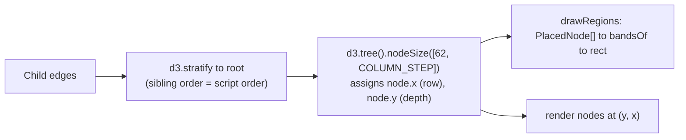
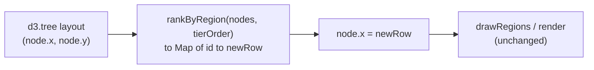

# Region-Aware Graph Layout

> [!NOTE]
> Status: **implemented**. The Dialogue Graph used to lay its nodes out with a
> region-blind tree layout, so a scene's rows interleaved with another scene's and
> the bands drawn behind them overlapped. A pass now gives every scene a
> contiguous **tier** of rows, so no band is ever drawn over another and no node
> sits inside a band it does not belong to.
>
> Like the rest of the visualization tooling, this surface is "vibe-coded" (see
> the visualization note's maturity caveat); the compiler stays the reviewed
> surface.

## Table of contents

- [Goal and scope](#goal-and-scope)
- [Ubiquitous language](#ubiquitous-language)
- [Functionality checklist](#functionality-checklist)
- [How it works today](#how-it-works-today)
- [Design](#design)
- [Interfaces and abstractions](#interfaces-and-abstractions)
- [Key design decisions](#key-design-decisions)
- [Error and boundary cases](#error-and-boundary-cases)
- [Integration](#integration)
- [Testability](#testability)
- [Open questions](#open-questions)

## Goal and scope

The Dialogue Graph draws a tinted **band** behind the nodes of each scene. A band
is the padded bounding box of its nodes, and the layout that places those nodes
does not know which scene a node belongs to. When flow crosses between scenes — a
scene entered from partway through another, two scenes both diverting into a
third — the scenes' rows interleave and their bounding boxes **overlap**:
translucent tints stack into a third colour, and a node in the overlap reads as
belonging to two scenes at once.

Measured on `examples/highrise-fire.dialogue.md` by reading the rendered
`rect.region-band` geometry out of the live report and testing every pair for
intersection: **five pairs overlap**, the largest by 550 × 176 px. That script is
the regression baseline.

This component makes the overlap **impossible**. After the tree layout runs, a
re-ranking pass rewrites each node's row so that every scene owns a contiguous,
disjoint interval of rows — a **tier** — and the nodes belonging to no scene own
a tier of their own above them. Two bands then cannot intersect, and no node can
fall inside a band that is not its own. Re-measured the same way with the pass in
place, that script reports **no overlapping pair**.

**In scope:**

- A pure `rankByRegion` pass that reassigns rows so scenes never interleave.
- Wiring it into the Dialogue Graph's `update()` between the tree layout and the
  render.
- Keeping it correct when a scene is folded.

**Out of scope:**

- The tree layout itself (`d3.tree`) — depth/column positions are untouched.
- Routing the cross-tier edges the re-ranking lengthens — see
  [DD5](#dd5--cross-tier-tree-edges-stretch-and-have-no-detour).
- The other stage tabs — they draw no bands, so the pass is not applied there.
- Any compiler change: a node already carries its `Region`.

## Ubiquitous language

One concept, one name — here, in the code, and in the tests.

| Term | Meaning |
| --- | --- |
| **Region** | A scene: the named area of the document a node sits in (`DisplayNode.region`). A node has zero or one. |
| **Band** | The rounded rectangle drawn behind a region's nodes — its padded bounding box, from `bandsOf`. |
| **Row** | A node's cross-axis position (`node.x` from `d3.tree`, drawn as the vertical coordinate). Depth is the other axis and is never touched. |
| **Tier** | The contiguous interval of rows one region owns. Two tiers never overlap; that is the point. Deliberately **not** "lane" — `tree-view.ts` already uses *lane* for the corridors cross-links travel along below the drawing. |
| **Prologue tier** | The one tier holding every node that belongs to no region. |
| **Loose node** | A node with no region: the entry, and anything written before the first scene heading. |

## Functionality checklist

- [x] `rankByRegion(nodes)` returns a new row for every node such that each
      region's rows form a contiguous interval and no two intervals overlap.
- [x] Nodes the tree layout placed on the **same** row stay on the same row;
      distinct rows keep their relative order within a tier.
- [x] Scene tiers are stacked in the order `regionCounts(stage.nodes)` gives —
      the same order the legend lists.
- [x] Every loose node sits in the prologue tier, above every scene tier.
- [x] Consecutive tiers are separated by more than `PAD_TOP + PAD_BOTTOM`, so the
      **padded** bands clear each other, not merely the node rows.
- [x] The row origin is preserved, so the drawing does not shift wholesale
      relative to the root.
- [x] A region named by the stage but with no drawn node consumes no vertical
      space.
- [x] The Dialogue Graph applies the pass on every `update()`; no other stage
      does.
- [x] Folding a scene and reverting re-run the pass and stay disjoint.
- [x] `bandsOf` output for a re-ranked graph has no intersecting bands, and no
      node lies inside a band whose region it does not share — both asserted.

## How it works today



`d3.tree` sets a node's row from its place among its siblings and the extent of
its subtree. **Region membership is never read.** A scene reached by a divert
from deep inside another scene's subtree takes its rows from wherever that
subtree put them — interleaved with the other scene's — and `bandsOf`, which sees
only final positions, draws two boxes that cross.

Two properties of the real layout shape the design, and both are easy to get
wrong from intuition:

- **Many nodes share one row.** A straight run of dialogue is a single-child
  chain, and `d3.tree` gives every node in it the *same* `x`. A scene of thirty
  lines is one horizontal row marching rightwards across thirty columns, not
  thirty rows.
- **Rows are signed and centred on the root.** The root sits near `x = 0` with
  descendants spread above (negative) and below (positive).

## Design

One pure function sits between the tree layout and the render.



### The pass

A tier is built from the **distinct rows** its members occupy, not from its
members, so nodes the tree layout put side by side on one row stay there.

1. **Order the tiers.** The prologue tier first, then one tier per region in
   `regionCounts(stage.nodes)` order. A region with no drawn member is skipped.
2. **Group by tier.** Each node joins its region's tier, or the prologue tier if
   it has none.
3. **Lay the tiers down.** Start a cursor at the drawing's original minimum row.
   For each tier in order:
   - take its members' **distinct** rows, ascending;
   - map the *k*-th distinct row to `cursor + k · ROW_PITCH`, giving every node
     on that row the same new row;
   - advance the cursor past the tier's last row, then by `TIER_GAP`.
4. **Return** a `Map<id, newRow>`; the caller assigns `node.x` from it.

```text
rankByRegion(nodes, tierOrder):
    tiers  = [PROLOGUE] + tierOrder            # regions with no member are dropped
    cursor = min(row of any node)              # keep the drawing's origin
    newRow = {}

    for tier in tiers:
        members = nodes in this tier
        if members is empty: continue
        rows    = distinct rows of members, ascending
        for k, row in enumerate(rows):
            place = cursor + k * ROW_PITCH
            for n in members with this row:
                newRow[n.id] = place
        cursor = cursor + (len(rows) - 1) * ROW_PITCH + TIER_GAP

    return newRow
```

Depth (`node.y`) is never read or written, so every node keeps its column.

### Why the bands cannot touch

`bandsOf` pads a region's box by `PAD_TOP` above and `PAD_BOTTOM` below. Two
tiers' bands are therefore disjoint exactly when the gap between the last row of
one and the first row of the next exceeds `PAD_TOP + PAD_BOTTOM` (26 + 18 = 44).
`TIER_GAP` is defined as that sum plus air, and `region-bands.ts` exports the two
pads so the invariant is derived rather than copied. The cursor only ever
increases, so the tiers' row intervals are ordered and disjoint by construction;
disjoint vertical intervals give non-intersecting axis-aligned boxes whatever the
columns do.

## Interfaces and abstractions

| Type | Responsibility | Collaborators |
| --- | --- | --- |
| `rankByRegion(nodes: RankInput[], tierOrder: readonly string[]) → Map<string, number>` | The pure pass. No d3, no DOM. New file `region-layout.ts`. | called from `tree-view.ts` `update()` |
| `RankInput` | What the pass needs from a laid-out node: `{ id: string; region?: string; row: number }`. | `tree-view.ts` adapts `TreeNode` to this |
| `PAD_TOP`, `PAD_BOTTOM` | The band's vertical padding, newly **exported** from `region-bands.ts` so `TIER_GAP` is derived from the geometry it must clear. | `region-layout.ts` |
| `tree-view.ts` `update()` | After `layout(root)`, when the stage has regions, overwrite each `node.x` from `rankByRegion`, passing `foldableRegions` as the tier order. | `rankByRegion`, `drawRegions` |
| `bandsOf` (unchanged) | Padded bounding box per region. Fed disjoint rows, it yields disjoint bands. | `drawRegions` |

The pass takes a plain array and a plain order, not d3 nodes, so it is unit-
tested with hand-built rows and never needs a rendered tree.

## Key design decisions

### DD1 — Re-rank after the tree layout, do not replace it

`d3.tree` gives the graph its columns and its overall reading direction, and that
is worth keeping. The pass runs **after** it and rewrites only the cross-axis
coordinate, so depth, column pitch, and the left-to-right flow survive. A
from-scratch region-aware layout — laying each scene out independently and
stitching the diverts back — is a compound-graph problem, far more work, and it
would throw away a readable result the current layout already produces.

### DD2 — A tier per region, ordered as the legend orders them

Each region owns one contiguous interval of rows, and no two intervals overlap,
so `bandsOf` cannot produce intersecting boxes. The tiers are stacked in
`regionCounts(stage.nodes)` order — first appearance in the stage's own node
list, which is what the legend shows and what `tree-view.ts` already computes as
`foldableRegions`. A reader scanning top to bottom meets the scenes in the order
the legend lists them.

Three orders were rejected. `root.descendants()` (d3 pre-order) is *not* the same
list and would disagree with the legend. The Semantic tab's anchor table is not an
authority here at all: it belongs to another stage, is ordered by scene-tree
pre-order, and omits scenes with no anchor.

**Ordering the tiers by flow** — by where the layout first reaches each scene —
was built and measured, and it is clearly worse. Tree rows are signed and centred
on the root, so a scene down a deep branch takes a large negative row and floats
to the top. On `examples/highrise-fire.dialogue.md` it stacks the scenes
`Shelter in Place, Rescued, The Door, The Alarm, …` — the fourth scene first and
the first scene fourth. Naming order stacks them exactly as the document and the
legend read: `The Alarm, The Door, The Stairwell, The Elevator, Shelter in Place,
Outside, Rescued`. Both orders remove every overlap; only one of them is
readable.

### DD3 — Order is preserved within a tier; spacing is normalised

The pass keeps the relative order of a scene's distinct rows, and keeps nodes
that shared a row together. It does **not** keep the tree's *spacing*: rows are
re-laid at a uniform `ROW_PITCH`, so the proportional gaps `d3.tree` gives a
scene — wider between big subtrees, zero along a chain — are lost, and a parent is
no longer centred over its children.

That is a real cost, accepted deliberately. What a reader needs from a scene is
which lines it holds and in what order; the exact vertical proportions inside it
carry far less than the guarantee that the scene is one unbroken block. Uniform
pitch is also what makes a tier's height predictable, which is what lets the
tiers be stacked without measuring.

### DD4 — Loose nodes get their own tier at the top

Every node with no region goes into one **prologue tier**, above every scene
tier, ordered among themselves by their tree rows.

This is exact rather than approximate because of an invariant the projection
already guarantees: `ScenesByNode` walks the nodes in document order and never
clears the scene it is inside, so a node has no region **only if it precedes the
first scene heading**. Loose nodes are a document prefix — the entry and whatever
was written above the first `#` — not an arbitrary scatter. Putting them in one
block at the top is therefore where they belong in the document too.

Keeping each loose node near its original row was considered and rejected: a
loose node's row can fall in the *middle* of a scene's interval, and a tier is
contiguous by construction, so there is nowhere inside it to make room. The node
would be drawn inside a band it does not belong to — the same defect this
component exists to remove. The entry node makes this the default rather than an
edge case: it is the hierarchy root, so `d3.tree` centres it over everything.

### DD5 — Cross-tier tree edges stretch, and have no detour

Lifting each scene into its own tier moves it away from the scenes that lead into
it, so an edge crossing tiers gets longer and steeper. The exposure is uneven,
and the important split is **`Child` versus `Reference`**, not divert versus
succession:

- A **`Reference`** edge already detours: it drops to a corridor below the whole
  drawing and travels there, so a longer span costs it little.
- A **`Child`** edge is drawn as a plain S-curve between its two ends, with no
  detour. The spanning-tree edge into a scene's first node — often the very
  divert that caused the interleave — is a `Child` edge, so after re-ranking it
  becomes a near-vertical curve crossing one column horizontally and possibly
  several tiers vertically, passing through whatever bands and labels lie between.

Routing those edges is out of scope and would be its own component. Whether the
cost is acceptable is settled by looking at it: see
[the open question](#open-questions).

### DD6 — Folding a scene re-runs the pass

Folding contracts a scene's nodes to one supernode that still carries the
region, so the folded scene is a tier of one row — trivially disjoint. Folding
rebuilds the hierarchy and calls `update()`, so the pass simply runs again on
whatever is now drawn; nothing special is needed.

Node collapse does not arise here: the Dialogue Graph is not node-foldable,
because every edge it draws carries a category.

### DD7 — The pass is Dialogue-Graph-only

Only the Dialogue Graph carries regions, so only it is banded. Rather than rely
on the pass being a no-op elsewhere, it is applied only when the stage has
regions. It lives in its own module so a future banded stage can opt in.

### DD8 — No runtime overlap assertion in `bandsOf`

A cheap development-only check inside `bandsOf` — test every pair of bands and
complain on an intersection — was considered as a safety net and rejected.

The invariant is structural, not statistical: the cursor only increases, and it
increases by more than the padding, so disjointness follows from the construction
rather than from luck. A pairwise scan would therefore never fire for a reason the
tests do not already cover, and it would cost a quadratic scan on every `update()`
— which runs on every pan, fold, and rebuild. The guarantee is asserted where
assertions belong: against the pass directly, against a drawing rendered in jsdom,
and against one rendered in a browser, each checked to fail without the pass.

## Error and boundary cases

| Case | Behaviour |
| --- | --- |
| Stage has no regions (every AST tab) | The pass is not applied; the tree layout stands. |
| A scene whose nodes all share one row (a straight run of lines) | A one-row tier — the run stays horizontal, as it is drawn today. |
| A region named by the stage with no drawn node | Skipped; it consumes no vertical space. |
| No loose nodes at all | The prologue tier is empty and skipped; the first scene starts at the origin. |
| Every node loose (no scenes) | One prologue tier; no bands; ordering is the tree's own. |
| Two scenes both diverting into a third | The third is a tier of its own below both; its band is clear of theirs. |
| Folded scene | A tier of one row. |
| A scene already contiguous before the pass | Still lifted into its tier; the visible change is only the inter-tier gap. |
| Repeated `update()` calls | Idempotent: `d3.tree` recomputes `x` from scratch each time, so the pass always sees pristine tree rows. |

## Integration

- **`region-layout.ts`** — new: `rankByRegion`, `RankInput`, `ROW_PITCH`,
  `TIER_GAP`. No d3, no DOM imports.
- **`region-bands.ts`** — exports `PAD_TOP` and `PAD_BOTTOM` so
  `TIER_GAP` is derived from the padding it must clear. `bandsOf` itself is
  unchanged.
- **`tree-view.ts`** — in `update()`, after `layout(root)` and before the render,
  when `foldableRegions` is non-empty, build `RankInput[]` from
  `root.descendants()` and overwrite each `node.x` from `rankByRegion`, passing
  `foldableRegions` as the tier order.
- **Framing** — the drawing grows taller, so a graph that opens framed today may
  fall below the legibility floor and open anchored on its root instead. Keeping
  the row origin (step 3) stops the root from drifting to the top of the
  viewport. The Dialogue Graph tab note already tracks automatic legend folding
  for the fit-fallback case; this makes that want stronger.
- **Cross-link corridors** — `assignLanes` puts its first corridor below the
  deepest row, so the corridor stack moves down with the taller drawing. No
  change needed.
- **Keyboard navigation** — arrow keys move between *siblings in the hierarchy*,
  which today reads as up/down because siblings are ordered by row. Siblings in
  different regions now land in different tiers, so an arrow can move the
  selection against its apparent direction. Accepted for now; noted so it is not
  a surprise.
- **No compiler change.** `DisplayNode.Region` already carries what the pass needs.
- **Design notes** — this note joins `design-notes/toc.yml`. The Dialogue Graph
  tab note no longer has the overlap to describe, and carries the follow-on
  instead: routing the diverts the tiers have stretched.

## Testability

| Level | Covers |
| --- | --- |
| Vitest — `rankByRegion` | Tiers are contiguous and disjoint; co-row nodes stay co-row; distinct-row order preserved; legend order followed; prologue tier above every scene tier; empty region skipped; origin preserved; gap exceeds `PAD_TOP + PAD_BOTTOM`. Hand-written `RankInput[]`, no d3. |
| Vitest — `rankByRegion` + `bandsOf` | An interleaved node set through both: no two bands intersect, **and** no node lies inside a band whose region it does not share. A companion case feeds the *same* set through `bandsOf` un-re-ranked and asserts the bands *do* overlap, so the fixture is proven to be the defect rather than an easy case. |
| Vitest — property | Over a random tree with **contiguous-run** region assignment (the shape `ScenesByNode` can actually emit): the two band properties above hold. A second, unconstrained generator asserts only that the pass is total and its tiers are disjoint — loose-node and order properties are not asserted there, since scattered membership cannot occur. Both run a hundred seeded drawings. |
| Vitest — `tree-view` (jsdom) | A stage whose scenes the flow weaves through renders bands whose row intervals are disjoint, stacked in legend order, and still disjoint with a scene folded. jsdom has no `getComputedTextLength`, so measured label widths are zero and band *widths* degenerate — the assertions are on rows, which is what the pass guarantees. |
| Playwright | The same woven stage through a real browser, where widths are measured: no two `.region-band` rectangles intersect, they stack in legend order, no node's dot falls inside a foreign band, and folding a scene keeps them apart. |
| Playwright | The existing Dialogue Graph specs (fold, reverse jump, camera) still pass, static and live. |

Both the jsdom and the browser fixture were checked against a build with the pass
switched off: three of the four browser assertions and all three jsdom assertions
fail there. A test that passes either way would guard nothing.

There is no `axe` scan among them. The pass moves nodes and bands; it adds no
element, no role, and no text, so a scan here would only re-cover what the
Dialogue Graph's existing accessibility specs already assert.

## Open questions

Two questions this design had to settle are settled: the tier order, by building
both orders and measuring them
([DD2](#dd2--a-tier-per-region-ordered-as-the-legend-orders-them)), and the runtime
overlap assertion ([DD8](#dd8--no-runtime-overlap-assertion-in-bandsof)). One
judgement is left, and no measurement settles it:

- **Are the stretched cross-tier `Child` edges acceptable?**
  [DD5](#dd5--cross-tier-tree-edges-stretch-and-have-no-detour) explains why the
  divert into a scene's first node becomes a near-vertical curve, and why routing
  it would be its own component. Whether that reads well enough is settled by
  looking at the drawing; if not, a detour for cross-tier `Child` edges is the
  next piece of work.
