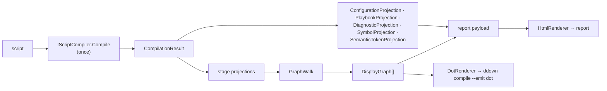

# Compilation Visualization

> [!NOTE]
> Status: **implemented**. `DialogueDown.Visualization` compiles a script once and shows every
> stage's output — plus the configuration it applied and the playbook it ships as — as one
> interactive, self-contained HTML report.

**Maturity.** Unlike the compiler, the visualization tooling was built quickly ("vibe-coded") with
lighter design review. It is well tested and works, but its abstractions may still change. This
caveat covers every note under `visualization/`.

## Table of contents

- [Goal and scope](#goal-and-scope)
- [Ubiquitous language](#ubiquitous-language)
- [The tabs](#the-tabs)
- [Architecture](#architecture)
- [Key design decisions](#key-design-decisions)
- [Unavailable stages](#unavailable-stages)
- [Stage tooltips](#stage-tooltips)
- [Error and boundary cases](#error-and-boundary-cases)
- [Testability](#testability)

## Goal and scope

Full-process transparency is a goal of DialogueDown: a reader should be able to *see* what the
compiler produced at each step, and trace any node back to the text it came from. The report
renders each intermediate representation as a readable, interactive graph or table, from the
Markdown AST to the playbook a runtime loads.

**Out of scope here:** the `ddown visualize` command and the served session, which wrap this
component and have their own notes under [the reading guide](../../README.md#served-session).

## Ubiquitous language

| Term | Meaning |
| --- | --- |
| **Stage** | A compiler step that produces an IR, shown as one tab. |
| **IR** | The tree or graph a stage produces (for example `MarkdownDocument`, `DialogueGraph`). |
| **Node projection** | `INodeProjection<TNode>`: a stage's `Title`, `Description`, and, per node, `Describe` (label, attributes, source, category) and `Neighbors`. One small implementation per IR family. |
| **Walk** | `GraphWalk`: the traversal that builds a display graph from an IR root and a projection, using a visited set so cycles terminate. |
| **Display graph** | `DisplayGraph`: one stage's title, description, nodes, and edges, plus optional `tables` and an `unavailable` reason. |
| **Display node / edge** | `DisplayNode` (id, label, attributes, source, span, category) and `DisplayEdge` (`FromId`, `ToId`, `Kind`, plus an optional `Category` and `Label`). |
| **Category** | A stable, cross-stage group name (`call`, `speech`, …) the client maps to a color. |
| **Renderer** | `IDisplayRenderer`: turns a display graph into one format (HTML or DOT). |
| **Report** | The multi-tab HTML page. |

## The tabs

The tab order is the pipeline order, from configuration to shipped artifact:

| Tab | Shows | Built by | Note |
| --- | --- | --- | --- |
| **Config** | The applied `dialogue.toml` and its speakers | `ConfigurationProjection` | [Configuration Tab](./Configuration%20Tab.md) |
| **Source** | The script beside a live Markdown preview | — (the input, not a stage) | [Source editor notes](../../README.md#source-editor) |
| **Markdown AST** | The parsed Markdown tree | `MarkdownAstProjection` | This note |
| **Dialogue AST** | The transpiler's tree | `DialogueAstProjection` | [AST Stage Tabs](./AST%20Stage%20Tabs.md) |
| **Desugared AST** | The normalized tree | `DialogueAstProjection` | [AST Stage Tabs](./AST%20Stage%20Tabs.md) |
| **Semantic Model** | The scene tree and three lookup tables | `SemanticProjection` | [Semantic Model Visualization Tab](./Semantic%20Model%20Visualization%20Tab.md) |
| **Dialogue Graph** | The flow graph a runtime walks | `GraphProjection` | [Dialogue Graph Visualization Tab](./Dialogue%20Graph%20Visualization%20Tab.md) |
| **Playbook** | The serialized playbook JSON and its tables | `PlaybookProjection` | [Playbook Tab](./Playbook%20Tab.md) |

Config appears only when the report has a configuration context, Source only when it has a
script, and Playbook only when it was built through the compiler; a bare single-graph render has
none of them. The report opens on Source.

## Architecture



`CompilationVisualizer.BuildContent` compiles once and projects everything the report needs from
that one result, so the stages, the editor's diagnostics and highlighting, the Config tab, and the
Playbook tab never disagree. The payload is `{ source, stages, path, mode, project, symbols,
configuration, playbook, diagnostics, … }`; see `Report` in `model.ts`.

The walk is one generic routine:

```text
Walk(root, projection):
    visited = {}                       # node identity -> display id
    Visit(node):
        if node in visited: return visited[node]   # caller adds a Reference edge
        add DisplayNode(projection.Describe(node)); visited[node] = it
        for neighbor in projection.Neighbors(node):
            kind = neighbor already visited ? Reference : Child
            add edge(node -> Visit(neighbor), kind)
```

The Dialogue Graph is the exception: it is a flat node list with cycles and unreachable nodes, so
`GraphProjection` emits every node in graph order and resolves each edge by id, with a
`SpanningTree` naming one `Child` parent per node for the client's tree layout.

## Key design decisions

### D1 — A separate project keeps the core pure

The core `DialogueDown` library stays engine-agnostic. The visualizer lives in
`DialogueDown.Visualization`, which references the core; the core grants it and its test project
`InternalsVisibleTo`, so the internal IRs are reachable without new public API.

### D2 — The visualization layer owns traversal through one projection seam

Each IR family implements one `INodeProjection<TNode>`, and extension methods
(`ir.ToDisplayGraph(source)`) give a uniform call site. Adding a stage is one projection; the core
AST records carry no traversal code.

### D3 — A graph model with a cycle-safe walk

The display model is a graph, and a tree is its acyclic case. The visited set is keyed by
**reference identity**, not value equality: AST nodes are records, and two distinct nodes with
equal content must stay two nodes.

### D4 — One display model, pluggable renderers

Renderers are `IDisplayRenderer` strategies over the same display graph. `HtmlRenderer` builds the
report; `DotRenderer` backs `ddown compile --emit dot`. Mermaid appears only as fenced diagrams a
writer authors in the preview — see
[Mermaid Authoring Diagrams](../editor/Mermaid%20Authoring%20Diagrams.md).

### D5 — One self-contained file, built from a TypeScript client

The client in `web/` is TypeScript built by Vite, with D3 for layout and interaction, CodeMirror
for editors, Pico.css for chrome, Tippy.js for tooltips, and marked for previews. Exporting inlines
everything into one HTML file that works offline; serving links the assets so a browser caches
them. Mermaid is loaded only for a script that draws a diagram. Dependencies are pinned by
`package-lock.json`, licenses are listed in `web/NOTICE.md`, and CI fails if the committed
`web/dist/report.html` is stale.

### D6 — Categories drive one color scheme across stages

A projection tags each node with a category and the client's `palette.ts` maps it to a color, so a
concept keeps its color from stage to stage: a Markdown code span and the command it compiles to
are both `call`. Labels stay stage-local — the Markdown AST legend says "Code span". The legend
counts each category, highlights it on hover, and dims it on click.

### D7 — The Source tab grounds every stage in the text

The Source tab shows the script in a CodeMirror editor (read-only in View, editable in Edit) beside
a live preview. Every graph node carries its span, so the inspector shows the text a node came
from and [Node Inspector](../graph/Node%20Inspector.md) jumps back to it;
[Jump to Stage](../graph/Jump%20to%20Stage.md) goes the other way.

## Unavailable stages

The visualizer always compiles **stage-boundary** (`CompilationMode.StageBoundary`), whatever
`--mode` the CLI is given for `compile`: a valid script yields every stage, and a broken one halts
with its later stages absent. Fail-fast is never used, because it throws instead of returning a
renderable result.

An absent stage is still a tab, carrying an `unavailable` reason instead of a graph
(`DisplayGraph.ForUnavailableStage`):

| Stage | Unavailable when | Reason shown |
| --- | --- | --- |
| Desugared AST, Semantic Model | The compile halted before reaching them | *This stage is unavailable due to compilation errors.* |
| Dialogue Graph | The compile reported any error, even one later stages recovered from | *The dialogue graph is built only for a script that compiles without errors.* |

### D8 — A marker on the stage, not a union

`unavailable?` is optional on `Stage`, and an unavailable stage carries empty `nodes` and `edges`,
so code that reads an available stage is unchanged.

### D9 — `aria-disabled`, never `disabled`

A `disabled` button suppresses pointer events, so its tooltip — the only place the reason appears —
would never show. The tab is grayed, `aria-disabled="true"`, and carries the reason as its
`data-tip`; a click or Enter is refused, and neither the default nor the remembered tab lands on
it. The diagnostics themselves appear in the Source editor's
[diagnostics overlay](../editor/Diagnostics%20Overlay.md) and the
[Problems panel](../session/Chrome%20and%20Layout.md#problems-panel).

## Stage tooltips

Each stage tab explains itself on hover. The text is `INodeProjection.Description`, authored beside
the stage's `Title` and carried through `GraphWalk` into `DisplayGraph.Description`, so a new stage
brings its own tip. The client sets it as the tab's `data-tip`, drawn by the report's shared Tippy
tooltips. Config, Source, and Playbook are not projected stages, so their tips are constants in
`app.ts` (`CONFIG_TIP`, `SOURCE_TIP`, `PLAYBOOK_TIP`).

## Error and boundary cases

| Case | Behavior |
| --- | --- |
| Empty script | A lone root with no edges; every renderer draws an empty but valid diagram. |
| Deep nesting | The walk recurses; renderers assume no depth limit. |
| A cycle | A revisit is a `Reference` edge, so the walk terminates. |
| Special characters in labels | Each renderer escapes for its format. |
| A halted compile | Later stages render as [unavailable](#unavailable-stages). |
| A tab that fails to render in the browser | That tab shows an inline error; the others are unaffected. |

The visualizer never mutates an IR and does not throw for well-formed compiler output; a null
argument is an ordinary .NET argument exception.

## Testability

| Level | Covers |
| --- | --- |
| .NET — walk and model | Nodes, edges, and child order for a small projected IR; a synthetic cyclic projection terminates with a `Reference` edge. |
| .NET — projections | One test file per projection: labels, attributes, categories, spans, descriptions. |
| .NET — renderers | Output and escaping for a tiny graph. |
| .NET — `CompilationVisualizer` | A real script yields the expected tabs; a halted compile yields unavailable placeholders; the payload serializes `unavailable` and `description`. |
| Vitest | Pure and DOM-light client modules, including disabled-tab activation and tab selection. |
| Playwright | The built report in Chromium: tabs, graph interaction, tooltips, disabled tabs, and axe (including color contrast, which jsdom cannot measure). |

The client's gates — `tsc --noEmit`, ESLint, Stylelint, Prettier, Vitest, and the build-freshness
check — run through `npm run check` and the CI Frontend job; see
[CONTRIBUTING](https://github.com/pengzhengyi/dialoguedown/blob/main/CONTRIBUTING.md).
