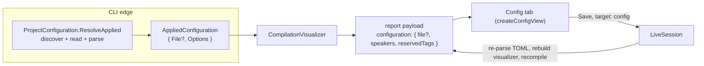

# Configuration Tab

> [!NOTE]
> Status: **implemented**. The Config tab shows the project's `dialogue.toml` beside the speakers
> it configures, lets a served session edit and save it with schema autocompletion, and offers to
> create one when the project has none.

## Table of contents

- [Goal and scope](#goal-and-scope)
- [Ubiquitous language](#ubiquitous-language)
- [Where it sits](#where-it-sits)
- [View](#view)
- [Edit](#edit)
- [Autocompletion](#autocompletion)
- [Create](#create)
- [Error and boundary cases](#error-and-boundary-cases)
- [Testability](#testability)
- [Open decisions](#open-decisions)

## Goal and scope

The compiler reads a `dialogue.toml` to seed configured speakers, but a reader cannot otherwise
see which configuration a compile applied, or whether one was found. The Config tab answers both,
and closes the loop for writing one:

| Mode | What the tab does |
| --- | --- |
| **View** | The raw TOML on the left, the resolved configured speakers on the right, and the config path in the status bar. |
| **Edit** (served) | The TOML is a real editor; saving it writes the file and recompiles the script. |
| **Edit, autocompletion** | The editor suggests the `[[speakers]]` header, its keys, and the reserved tag names. |
| **Edit, no config** | A **Create `dialogue.toml`** button writes a starter file and opens it for editing. |

**Out of scope:** choosing another name or folder for a new file, and deleting or renaming one.

## Ubiquitous language

| Term | Meaning |
| --- | --- |
| **Applied configuration** | What a compile applied: an optional **configuration file** plus the resolved `CompilerOptions` (`AppliedConfiguration`). |
| **Configuration file** | A found `dialogue.toml`: its path and raw source, always present together (`ConfigurationFile`). |
| **Configured speaker** | A speaker supplied by configuration: a name, an optional id, and custom or reserved tags. |
| **No-config state** | The tab when the compile found no `dialogue.toml`, so the compiler ran on its built-in defaults. |
| **Config document** | The Config tab's editable buffer. **Document** alone always means the dialogue script. |
| **Save target** | Which file a save writes: `document` (the script) or `config`. |
| **Serve root** | The folder the server hosts; a created `dialogue.toml` is written there. |
| **Adopt** | A running session starting to apply a config file it did not start with. |

The word **source** is overloaded, so it is always qualified: `report.source` is the script,
`report.configuration.file.source` is the TOML.

## Where it sits



Configuration is resolved once, at the CLI edge, and travels as a document into the visualizer.
The types live in `DialogueDown.Visualization`, not the core, because they carry a file path and
raw TOML — tooling concerns the engine-agnostic core does not have.

## View

### D1 — The report carries the applied configuration as a document

`AppliedConfiguration { ConfigurationFile? File, CompilerOptions Options }` has two levels of
optionality, and each names one fact:

| Payload | Meaning | Tab |
| --- | --- | --- |
| No `configuration` field | A bare library render, with no configuration context | No Config tab |
| `configuration` without `file` (`UsesDefaultConfiguration`) | No `dialogue.toml` was found | The no-config state |
| `configuration.file` present (`IsConfiguredFromFile`) | A real file: path and text together | TOML and speakers |

Call sites read the named predicates — `IsConfiguredFromFile` in .NET, `isConfiguredFromFile` in
`model.ts` — rather than testing the nullable field.

### D2 — The first tab, with a gear, but the report opens on Source

The tab sits before Source and carries a Feather `settings` gear. A reader who wants the script is
undisturbed; the configuration is one click away.

### D3 — Its own split, sharing the Source tab's machinery

The tab reuses `initSplitDivider`, `initCollapsiblePanel`, and the maximize control, but owns its
classes (`.config-view`, `.config-source`, `.config-divider`, `.config-side`) and its
`--config-split` variable. Config and Source are both in the DOM at once, so shared `.source-*`
selectors would match two panes.

### D4 — TOML highlighting through the legacy mode

`@codemirror/legacy-modes/mode/toml`, wrapped in `StreamLanguage`, highlights the file. There is no
official Lezer TOML grammar.

### D5 — The speakers table is a small dedicated renderer

The right pane is a `Name · Id · Tags` table drawn by `config-view.ts` with the shared
`.semantic-table` styling, not a `createTablePanel` call. Tags use the report's shared
[tag capsules](./Table%20Cell%20Conventions.md#tag-capsules). Every value cell — the name, the
`@id`, and each capsule — copies on click, confirmed by the shared toast (`showToast`).

### D6 — Two paths in the status bar

`path-display.ts` shows the script's path and the config's, each led by an icon (a document, a
gear), shortening the directory with an ellipsis and copying the full path on click. With no file, the config path
reads **No config file**.

### D7 — No config file is an ordinary state

Most scripts need no `dialogue.toml`, so its absence is explained rather than reported as an error:
the left pane says the script compiled with the built-in defaults and what a config file would add;
the speakers table says **No configured speakers yet.**

## Edit

In Edit mode the TOML is editable; the rest of the edit loop is the Source tab's, shared rather
than duplicated. See [Live Edit](../session/Live%20Edit%20and%20Autosave.md) and
[Autosave](../session/Live%20Edit%20and%20Autosave.md) for the save protocol itself.

### D8 — One compile, two editable inputs

A served session compiles one thing: the script. The config is a second **input** to that compile,
not a second thing to compile. So there is still one report, one View⇄Edit toggle, one save
surface, and one recompile; only the save target and the dirty buffer multiply.

### D9 — One document is dirty at a time

The navigation lock that keeps a dirty Source tab from being left also locks a dirty Config tab.
At most one editable document therefore has unsaved edits, so a config save never has to reconcile
two buffers: the server recompiles the script from disk with the new configuration.

### D10 — A save carries its target

`POST /api/save` takes `target: "config"` for the Config tab (default `document`). The client picks
the target from the dirty document. A config save carries the same expected baseline and
validation policy as a script save, so an external change is a conflict rather than an overwrite.

### D11 — Saving re-parses the TOML and rebuilds the visualizer

`LiveSession` parses the saved text with the same `TomlConfigurationLoader` the CLI uses, rebuilds
its `CompilationVisualizer` with the new options, and recompiles. The response is the same report
payload a script save returns, so the client applies it the same way and refreshes the speakers.

An invalid TOML save persists the text but keeps the last valid report (`saved-invalid`); a save
that requires validity (Auto, or leaving the tab) does not write it (`invalid-auto`).

### D12 — The speakers refresh on save, not per keystroke

Resolving TOML into speakers is .NET logic, so while the buffer is dirty the speakers pane shows
**Unsaved changes — save to refresh the speakers.** The hint clears when the recompiled report
arrives.

### D13 — External edits hot-reload

The server watches `dialogue.toml` like the script; an external change pushes a `reload-config`
event that refreshes the tab.

## Autocompletion

`config-completions.ts` adds schema completion to the editable Config editor:

```toml
[[speakers]]      # offered when a line starts with "["
name = "Guide"    # name, id, tags, and the reserved tag names
id = "guide"      # are offered at a key position under [[speakers]]
tags = ["wise"]
```

### D14 — Schema completion, not a document scan

The Source editor completes from symbols scanned out of the script. The config's vocabulary is a
small fixed schema, so its two sources (`tableHeaderCompletions`, `speakerKeyCompletions`) return
constant lists filtered by the typed prefix.

### D15 — Reserved tag names come from the compiler

The structural keys (`[[speakers]]`, `name`, `id`, `tags`) are a constant in the client. The
reserved tag names are a closed set the loader enforces, so they travel in the payload
(`configuration.reservedTags`, projected from `ReservedTagNames.Known`) and cannot drift.

### D16 — Context decides; Edit only

A key position is the start of a line, before any `=`, under a `[[speakers]]` header. Value
positions, comments, and strings get nothing. The completion lives in the Edit-only compartment
with Tab as a second accept key, as in the Source editor. `closeBrackets` there skips `[`, so a
typed or accepted `[[speakers]]` header is not left with a stray `]`.

## Create

### D17 — Create in place, from the no-config state

In Edit, the no-config pane shows **Create `dialogue.toml`**; in View it shows **Switch to Edit to
add one.** The static export shows neither, because it has no server to write with. The button
posts to `POST /api/create-config` and the reader stays in the report.

### D18 — The server owns the path

The route takes no path. The server writes `<serve root>/dialogue.toml`
(`ConfigurationFile.DefaultName`), which is at or above the script, so the next compile's upward
discovery finds it — and no request value can reach the filesystem.

### D19 — A commented starter template

The new file is a commented `[[speakers]]` example with `name`, `id`, `tags`, and `##default`. It
compiles to the same defaults until the writer uncomments it.

### D20 — The session adopts the file; the page reloads onto Config

`LiveSession.CreateConfig` sets the session's config path, rebuilds the visualizer, starts the
config watcher, and returns the recompiled payload. The client then reloads, with a one-shot
`sessionStorage` flag (`config-create.ts`) so the reloaded page opens on the Config tab instead of
Source.

### D21 — An existing file is adopted, never overwritten

The create is exclusive, so a file that appeared first is never clobbered:

| Found on disk | Outcome | HTTP |
| --- | --- | --- |
| Nothing | Starter written and adopted (`Created`) | 200 |
| The starter template (a retry) | Adopted as is (`Adopted`) | 200 |
| A different file | Adopted as is (`AdoptedExisting`) | 200 |
| The session's adopted file, since changed | Nothing written (`Conflict`) | 409 |
| Serve root not writable | Write failure | 400 |

## Error and boundary cases

| Case | Behavior |
| --- | --- |
| Config file present but has no `[[speakers]]` | The TOML shows; the speakers table shows its empty note. |
| Malformed TOML at startup | The loader throws before a report is built. |
| Malformed TOML saved from the tab | `saved-invalid` or `invalid-auto`, per [D11](#d11--saving-re-parses-the-toml-and-rebuilds-the-visualizer). |
| Served session with no script path | A configuration context exists, so the tab shows, in the no-config state. |
| No reserved tags in the payload | Reserved-tag suggestions are empty; structural keys still complete. |

## Testability

| Level | Covers |
| --- | --- |
| .NET — `ProjectConfiguration.ResolveApplied` | An explicit `--config`, a discovered file, and none found. |
| .NET — payload | `configuration` present or omitted; `file` and `reservedTags` projected. |
| .NET — `LiveSession` | A config save re-parses and recompiles; invalid TOML outcomes; `CreateConfig` outcomes; the route's 409 and 400. |
| Vitest — `config-view` | Read-only and editable modes; chip classes; no-config pane with the button in Edit and the hint in View. |
| Vitest — `config-completions` | Each source at a header, a key position, a value, a comment, and another table. |
| Vitest — `config-create` | Success reloads and flags the tab; a 409 surfaces its message. |
| Playwright | The tab is first with a gear and the report opens on Source; edit, save, and the speakers refresh; the nav lock; autocompletion; creating a file lands on the editable tab. |

## Open decisions

- **Copyable names.** The Config table copies a speaker's name on click. The report's
  [cell rule](./Table%20Cell%20Conventions.md#copyable-identifiers) says a name is prose and does
  not copy, and the Semantic Model and Playbook speaker tables follow it. One of the two should
  change.
- **The `Id` header.** The Config table heads its id column `Id`; the other two speaker tables head
  it `@id`.
