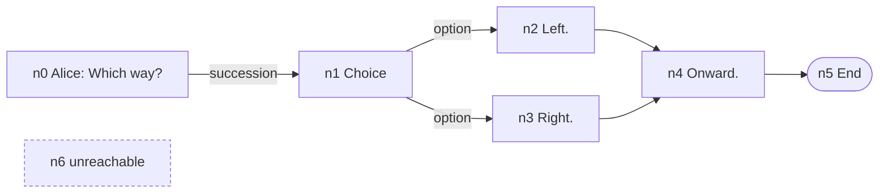

# Dialogue Graph Visualization Tab

> [!NOTE]
> Status: **implemented**. The **Dialogue Graph** tab draws the
> [dialogue graph](../../core/Dialogue%20Graph.md) — the compiler's final in-memory artifact and
> the flow a runtime walks — with every node, every route, and each scene as a tinted band.

## Table of contents

- [Goal and scope](#goal-and-scope)
- [Ubiquitous language](#ubiquitous-language)
- [Projection](#projection)
- [Client](#client)
- [Key design decisions](#key-design-decisions)
- [Error and boundary cases](#error-and-boundary-cases)
- [Testability](#testability)
- [Open questions](#open-questions)

## Goal and scope

The dialogue graph is the first stage where a writer can *see the flow*: where a choice leads,
which scene a jump enters, and which lines nothing reaches. `GraphProjection` turns a
`DialogueGraph` into the report's `DisplayGraph`; the client draws it with routes, bands, and an
inspector that reads the flow as text.

**Out of scope:** playing the graph (the runtime and its debugger) and reachability diagnostics.

## Ubiquitous language

| Term | Meaning |
| --- | --- |
| **Node** | One unit of flow: a line, a control line, a choice, a random choice, a branch, or the End sentinel. |
| **Route** | An edge, by what it means: succession, divert, option, random option, or branch. |
| **Condition** | A `key?` game-state check on a node or route. |
| **Orphan** | A node no route reaches — unreachable content the writer likely did not intend. |
| **Region** | The scene a node belongs to, drawn as a band rather than as flow. |
| **Placement link** | A link that positions an orphan after the block before it; not a route. |

## Projection

| Node | Label | Category |
| --- | --- | --- |
| `LineNode` | The speaker and speech (`Alice: Which way?`) | `speech` |
| `ControlNode` | Its effects (`(fade in)`, `ShowBackground(…)`); a bare jump reads `⇒` and the jump's words, or `(jump)` when it has none | `call` |
| `ChoiceNode` / `RandomChoiceNode` | `Choice` / `Random choice` | `structure` |
| `BranchNode` | `Conditional` | `structure` |
| `EndNode` | `End` | `terminal` |

A label does not count its ways out; the drawing shows one edge per way. A node's attributes carry
its `condition`, its `Span` powers Jump to source, and its `Region` names its scene.

| Route | Edge category | Edge label |
| --- | --- | --- |
| Succession | `break` | — |
| Divert | `jump` | The jump's words |
| Option | `choice` | The option's words |
| Random option | `choice` | — |
| Branch | `control` | — |
| Placement link | `deferred` | — |

The edge label is shown in the inspector when a route is selected; the drawing itself draws no
route text, because it would repeat the node a hop away.

## Client

The graph is not a tree, and lines must not cross words, so the tab has client work of its own:

| Concern | Where |
| --- | --- |
| A graph drawn with a tree layout | `SpanningTree` names one `Child` parent per node; every other edge is a `Reference` |
| Telling routes apart | `edge-style.ts`: each route's name, dash, arrow, glyph, and meaning |
| Lines crossing words | `edge-path.ts`: [the gutter a cross-link travels in](#d5--a-cross-link-moves-vertically-only-in-a-gutter) |
| A scene as an area | `region-bands.ts` and [Region-Aware Graph Layout](../graph/Region-Aware%20Graph%20Layout.md) |
| Reading the flow as text | `neighbors.ts` and `region-detail.ts`: what leads here, what it leads to, what crosses a region's border |
| Putting a scene away | [Dialogue Graph Region Fold](../graph/Dialogue%20Graph%20Region%20Fold.md) |
| Moving by keyboard | [Keyboard Navigation](../graph/Keyboard%20Navigation.md) |

A node, a route, or a region is the reader's current object — only one at a time.

## Key design decisions

### D1 — Every node, not only reachable ones

`graph.Nodes[0]` is the entry, but walking from it would silently drop content after an
unconditional jump (`DLG1003`). This tab is where a writer should see that content, so every node
is emitted in graph order, and an orphan is placed after the block before it by a placement link
drawn apart from the routes.

### D2 — Display ids mirror `NodeId`

Graph order keeps `n4` on screen the same `n4` a diagnostic or debugger names.

### D3 — Routes resolve by id; the layout is a spanning tree

The projection maps each target `NodeId` to its display id, so a back-edge is an ordinary route.
The client lays every stage out with `d3.stratify`, a strict tree builder, so `SpanningTree` marks
the edge that first reaches each node as its `Child` and every other as a `Reference`. The stage
sets `Nests = false`: its `Child` edges are layout, not containment.

### D4 — A region is a band, not an edge or a label

A region is metadata, not flow. It is drawn once as a tinted band around its nodes, not as a
`scene:` line under each node and never as an edge.

### D5 — A cross-link moves vertically only in a gutter

A `Reference` edge leaves its row, runs in a lane below the whole drawing, and climbs back. Its
two vertical moves are the only places it can cross a row. Each column reserves a **gutter** at its
end that no label enters (`LABEL_BUDGET` is what remains for words), so:

- **A climb goes on the target's left,** whichever way the route travels, because the right of a
  dot is where its words are.
- **A drop goes in a gutter,** not beside the source's dot: the gutter ending the source's column
  when traveling forward, the one before it when doubling back.

Climbs take the gutter's far end and drops the near end, so the two never share a place. On
`examples/highrise-fire.dialogue.md` this leaves no cross-link crossing a label that belongs to
neither of its endpoints.

### D6 — A visual change is reviewed by looking and measuring

Green unit tests once shipped a tab that drew nothing. So a visual change is previewed before
merging, and what the eye would judge — lines through labels, shared lanes, overprinted labels — is
measured by a test.

## Error and boundary cases

| Case | Behavior |
| --- | --- |
| The compile reported an error | The tab is [unavailable](./Compilation%20Visualization.md#unavailable-stages) with its own reason: the graph needs a clean compile, not merely a stage reached. |
| Empty script | One node, End, and no edges. |
| An unreachable node | Placed by a placement link, with no route in. |
| A cycle | An ordinary route to an earlier node, drawn as a cross-link. |

## Testability

| Level | Covers |
| --- | --- |
| .NET — `GraphProjection` | Real compiled scripts: nodes, labels, categories, conditions, regions, edge categories and labels; empty script, orphan, cycle; the stage is unavailable without a clean compile. |
| Vitest | Edge routing and gutters, region bands, neighbor and region queries, the inspector. |
| Playwright | A cyclic script renders; no line crosses a label; one thing is chosen at a time. |

## Open questions

- **Folding the legend automatically** when a fit would otherwise fall back to anchoring the root.
- **A doubling-back cross-link overshoots its target** to climb on the left. It could climb on the
  right when the rows above are empty, but that needs per-edge knowledge of what stands there.
- **Cross-linking a jump to its target scene** in the Semantic Model's tables, as the earlier
  stages cross-link by entity key.
