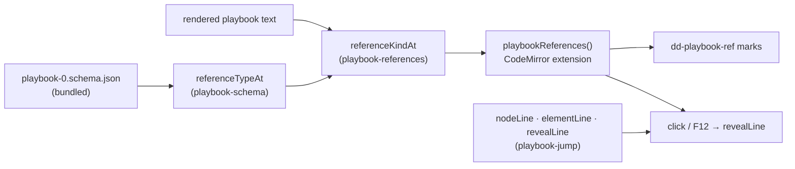

# Following an index in the Playbook

> [!NOTE]
> Status: **implemented**. In the [Playbook tab](./Playbook%20Tab.md), a bare
> index in the serialized JSON — a node reference or a speaker reference — is a
> link the reader follows to the node or speaker it names, without leaving the
> editor.
>
> The companion note [Jumping into the Playbook](./Jumping%20into%20the%20Playbook.md)
> covers the other direction: from a summary table into the JSON. This one starts
> from the JSON text itself.

## Table of contents

- [Goal and scope](#goal-and-scope)
- [Where it sits](#where-it-sits)
- [Ubiquitous language](#ubiquitous-language)
- [Functionality checklist](#functionality-checklist)
- [Interfaces and abstractions](#interfaces-and-abstractions)
- [Key design decisions](#key-design-decisions)
- [Error and boundary cases](#error-and-boundary-cases)
- [Integration](#integration)
- [Testability](#testability)
- [Open questions and deferred work](#open-questions-and-deferred-work)

## Goal and scope

[Jumping into the Playbook](./Jumping%20into%20the%20Playbook.md) lets a reader
jump *from a summary table* into the JSON — click the entry-node row, land on that
node. The JSON itself is still inert: it is full of bare integers that point
somewhere — `"entry": 0`, `"target": 5`, `"speaker": 1`, an anchor's node — and
following one means scrolling and counting by hand.

This component makes each of those integers a link. Following it reveals the node
or speaker it refers to, in the same editor, centered — the reading motion the
table jumps already use.

**In scope:** classifying which integers in a rendered playbook are references,
marking them in the read-only editor, and following one by click or by a
keyboard **Go to Definition**.

**Out of scope, and revisited once this lands:** a cross-link that opens the
Dialogue Graph or Semantic tab on the target; a hover card previewing the target
node; a right-click **Go to Definition** menu item. Following a reference *within
the JSON* is the whole of this pass.

## Where it sits

The classification reuses the schema walk that already powers the tab's hover;
the navigation reuses the line-finding the table jumps already use. The new code
is the CodeMirror extension that connects them and the mark it paints.

## Ubiquitous language

| Term | Meaning |
| --- | --- |
| **Reference** | An integer in the playbook that names something elsewhere in it — a node by position or a speaker by position. The schema tags these as `nodeReference` and `speakerReference`. |
| **Definition** | The place a reference points to: a node's `"id"` line, or a speaker object's opening line. A node's own `"id"` is a definition, never a reference. |
| **Reference mark** | The `dd-playbook-ref` decoration over a reference's digits: a dotted underline and a pointer cursor. |
| **Go to Definition** | Following a reference to its definition — by clicking the mark, or pressing `F12` with the cursor on a reference line. |

## Functionality checklist

- [x] `referenceTypeAt(path, kinds)` reports whether a schema path ends at a
      `nodeReference`, a `speakerReference`, or neither, by walking the bundled
      schema the same way the hover does.
- [x] `referenceKindAt(state, lineNumber)` classifies a rendered line: `"node"`,
      `"speaker"`, or `null`, combining the line's schema path with its text.
- [x] A node's own `"id"` line is never classified as a reference.
- [x] `referenceRanges(state, from, to)` returns the digit spans to mark within
      a range, each with its kind and value.
- [x] `playbookReferences()` marks every reference in the viewport with
      `dd-playbook-ref` and keeps the marks current as the reader scrolls.
- [x] A click on a reference mark reveals its definition, centered, and focuses
      the editor.
- [x] `F12` with the cursor on a reference line reveals its definition.
- [x] A reference whose target is absent from the document is left alone — no
      jump, no error, the reader stays put.
- [x] The Playbook editor wires the extension in; no other tab changes.
- [x] `dd-playbook-ref` follows the page's light and dark themes.
- [x] The Playbook tab's help panel documents the underline, the click, and `F12`.

## Interfaces and abstractions

| Type | Responsibility | Collaborators |
| --- | --- | --- |
| `referenceTypeAt(path, kinds) → "node" \| "speaker" \| null` | Read the schema: does this path end at a reference `$ref`, and to which list? Added beside `describeSchemaPath` in `playbook-schema.ts`, reusing its private `expand`/`step`. | `playbook-0.schema.json` |
| `referenceKindAt(state, lineNumber) → "node" \| "speaker" \| null` | Classify one rendered line, excluding a node's own `"id"`. | `schemaPathAt`, `referenceTypeAt` |
| `referenceRanges(state, from, to) → ReferenceRange[]` | The digit spans to mark within a document range, each `{ from, to, kind, value }`. Pure, so it is unit-tested without a view. | `referenceKindAt` |
| `definitionLineFor(state, lineNumber) → number \| null` | The line a reference line points to, or `null` when it is not a reference or its target is absent. A click and `F12` both go through it, so they cannot disagree. Exported so it is unit-tested directly. | `referenceKindAt`, `nodeLine`, `elementLine` |
| `playbookReferences() → Extension` | The `ViewPlugin` that paints marks over the viewport and carries the `mousedown` handler that follows one. | `referenceRanges`, `definitionLineFor` |
| `playbookReferenceKeymap: readonly KeyBinding[]` | `F12` → Go to Definition from the cursor line. Exported apart from the extension so the editor orders it against its other bindings. | `definitionLineFor` |
| `dd-playbook-ref` (CSS) | The mark's look: dotted underline and pointer, firming to solid and the link hue on hover. Carries a `title` so hovering the number also names the gesture. | `styles.css` |

## Key design decisions

### DD1 — The jump stays inside the JSON

Following a reference reveals its definition in the same editor, reusing
`revealLine` — the motion the table jumps already use. It keeps the feature whole
within the tab and needs no cross-tab plumbing. Opening the graph or the Semantic
tab on the target is a larger, separate idea, deferred until this is in hand.

### DD2 — The schema decides what is a reference

The playbook schema already names its references: `entry`, every `anchors/*`,
every edge `target`, and a line's `speaker` all `$ref` `#/$defs/nodeReference` or
`#/$defs/speakerReference`. Rather than list those paths here — where they would
drift from the format — the classifier walks the bundled schema exactly as the
hover's `describeSchemaPath` does, and reads the `$ref` at the path's end.

A plain number the schema never refs — `format.version`, an edge's `order`, a
weight's `percentage` — is not a reference and gets no mark.

### DD3 — A node's `"id"` is a definition, not a reference

The schema refs `nodeReference` for a node's own `"id"` too, because an id and a
reference to it are the same kind of value. Semantically they are opposites: `id`
is where a node *is*. `referenceKindAt` excludes any path ending `/id`, so the
line a jump lands *on* is never itself a link to follow.

### DD4 — Marks are painted over the viewport, not the document

A playbook runs to hundreds or thousands of lines. `playbookReferences()` is a
`ViewPlugin` that scans only `view.visibleRanges` and rebuilds when the viewport
or the document changes — the document changes only on a recompile, which rebuilds
the tab anyway. Classification reads the text and the schema, never `syntaxTree`,
so it answers the same at any scroll depth — the reasoning
[`playbook-json`](./Playbook%20Tab.md) already sets out for the rest of the tab.

### DD5 — Two ways in: a click, and `F12`

The mark carries a dotted underline, a pointer cursor, and a `title` naming the
gesture, so a reference *looks* followable; a plain click follows it. The editor
is read-only, so a click on a digit has no other meaning to compete with — no
`Ctrl` or `Cmd` gate, which would only hide the feature in a surface whose whole
purpose is reading.

`F12` is VS Code's **Go to Definition**, offered for the keyboard: with the
cursor anywhere on a reference line, it follows that reference. It is bound on
the Playbook editor's keymap ahead of the defaults so nothing else claims it
there, and the tab's help panel names it — a shortcut with no on-screen control
has to be written down somewhere.

### DD6 — An unresolved reference is a quiet no-op

If the target id or index is not in the document — a truncated or hand-edited
playbook — the jump does nothing and the reader stays where they are, the same
choice the table jumps make. A reference is still marked whether or not its
target resolves; checking every target's existence up front would mean a second
scan for a case that barely arises.

## Error and boundary cases

| Case | Behavior |
| --- | --- |
| Reference target absent from the document | Click and `F12` do nothing; no error, no move. |
| A node's own `"id"` line | Never marked; never followable. |
| A number that is not a schema reference (`version`, `order`, `percentage`) | Never marked. |
| `"entry": 0` and other zero-valued references | Marked and followable like any other. |
| The playbook did not compile (no editor) | The extension never mounts. |
| A very large playbook | Only visible lines are scanned; marks refresh on scroll. |
| The definition sits inside a folded block | `revealLine` scrolls to it; the fold is not opened — matching the table jumps today. Noted in [deferred work](#open-questions-and-deferred-work). |
| `F12` on a line with no reference | Falls through; the editor's other bindings act normally. |

## Integration

- **`playbook-schema.ts`** gains `referenceTypeAt`, exported beside
  `describeSchemaPath` and sharing its private schema walk. No change to the
  hover.
- **`playbook-references.ts`** is new: `referenceKindAt`, `referenceRanges`,
  `definitionLineFor`, `playbookReferences()`, `playbookReferenceKeymap`.
- **`playbook-view.ts`** adds `playbookReferences()` to the editor's extensions
  and spreads `playbookReferenceKeymap` in ahead of the defaults in its existing
  `keymap.of([...])`.
- **`styles.css`** gains the `.playbook-source .cm-content .dd-playbook-ref`
  rules, beside the existing `dd-jump-preview` rule for that pane.
- **`help.ts`** — the Playbook tab's help panel gains a *Following an index*
  paragraph naming the underline, the click, and `F12`, since a keyboard shortcut
  a reader cannot see needs somewhere to be found.
- **No .NET change.** Every input — the rendered text and the schema — is already
  on the client.
- **Docs:** a new row in the design-notes README's
  [Report and stage tabs](../../README.md) table and its `toc.yml`.

## Testability

| Level | Covers |
| --- | --- |
| Vitest — `referenceTypeAt` | `entry`, `anchors/*`, each edge `target` by `kind`, a line's `speaker`, a node's `id` (still `"node"` at this layer), a non-reference number, and a path outside the format. |
| Vitest — `referenceKindAt` | The same paths read off a rendered document, with `/id` now excluded and a non-reference line `null`. |
| Vitest — `referenceRanges` | The digit spans in a slice of a playbook, their kinds and values; nothing outside the range; an empty result where there is nothing to mark. |
| Vitest — `definitionLineFor` | A classified line to its target line via `nodeLine`/`elementLine`; `null` on an `"id"` line, a non-reference, and an absent target. |
| Vitest — the extension in jsdom | The marks painted match `referenceRanges`; a click on a mark follows it; `F12` from the cursor line moves to the definition and does nothing off a reference. |
| Playwright — marks | Reference digits carry `dd-playbook-ref`; a node's `"id"` and a plain `version` do not. |
| Playwright — click | Clicking an edge `target` centers the node with that id — proven with a sparse id, as the table-jump test is. |
| Playwright — `F12` | Cursor on a `speaker` reference, press F12, the speaker object is revealed. |
| Playwright / Vitest — help | The Playbook help panel names *Following an index* and `F12`. |
| Playwright — axe | No accessibility violations on the Playbook tab with the marks present. |

Unit tests build playbook text as multi-line raw string literals, reusing the
sparse-id fixture shape from `playbook-jump.test.ts`.

## Open questions and deferred work

- **Cross-tab Go to Definition.** Opening the Dialogue Graph or Semantic tab
  focused on the target node. Deferred; revisit once in-JSON navigation is in use.
- **A hover preview of the target.** A small card — `→ node 5 · line · "Guide:
  …"` — shown over a reference before following it. Deferred; needs a one-line
  summary of an arbitrary node.
- **A right-click menu item.** A **Go to Definition** entry in a context menu,
  beside the click and `F12`. Deferred.
- **Unfolding on arrival.** A definition inside a folded block is scrolled to but
  not revealed. The table jumps have the same gap; closing it for both is its own
  small change.
