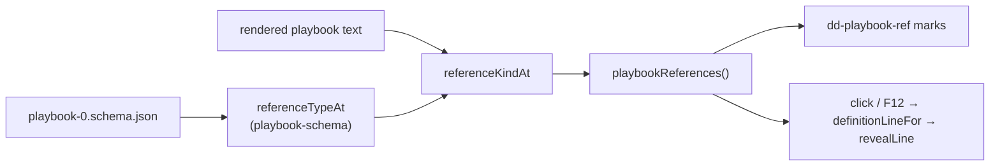

# Navigating the Playbook

> [!NOTE]
> Status: **implemented**. In the [Playbook tab](./Playbook%20Tab.md), a table cell that names a
> node or speaker takes the reader to it in the JSON, and a bare index in the JSON is a link to the
> node or speaker it names.

## Table of contents

- [Goal and scope](#goal-and-scope)
- [Ubiquitous language](#ubiquitous-language)
- [From a table into the JSON](#from-a-table-into-the-json)
- [From an index to its definition](#from-an-index-to-its-definition)
- [Finding the place](#finding-the-place)
- [Key design decisions](#key-design-decisions)
- [Error and boundary cases](#error-and-boundary-cases)
- [Testability](#testability)
- [Open questions](#open-questions)

## Goal and scope

The playbook is full of pointers — `"entry": 0`, an edge's `"target": 5`, a line's
`"speaker": 1` — and the tables beside it are full of references to the same places. Following
any of them by hand means scrolling and counting. Both directions land in the same editor, on
the element's opening brace, centered.

**Out of scope:** opening another tab (the Dialogue Graph or Semantic Model) on the target, and
highlighting a table row from the JSON.

## Ubiquitous language

| Term | Meaning |
| --- | --- |
| **Reference** | An integer in the playbook that names a node or a speaker. The schema types it `nodeReference` or `speakerReference`. |
| **Definition** | Where a reference points: the opening line of a node (found by its `"id"`) or of a speaker object (found by its index). A node's own `"id"` is a definition, never a reference. |
| **Reference mark** | The `dd-playbook-ref` decoration over a reference's digits: a dotted underline and a pointer. |
| **Go to Definition** | Following a reference, by a click on its mark or `F12` on its line. |

## From a table into the JSON

Most cells are facts. The ones that name a place carry a `PlaybookTarget` and become a jump:

| Table | Cell | Goes to |
| --- | --- | --- |
| Playbook | **Entry node** | The node a playthrough starts on |
| Speakers | **Name** | That speaker's object |
| Anchors | **Node** | The node the anchor lands on |
| Nodes | **#**, each number in **Leads to**, and each summary piece that names a node | That node |

An anchor's own `#the-market` cell copies instead: it is what a writer pastes into a script, not
a place in this document (see [Table Cell Conventions](./Table%20Cell%20Conventions.md)). The
Nodes table's targets are described in [Playbook Nodes Table](./Playbook%20Nodes%20Table.md#d7--every-way-out-is-a-link-of-its-own).

## From an index to its definition

`playbookReferences()` (`playbook-references.ts`) marks every reference in the viewport. A click
on a mark, or `F12` with the cursor on a reference line, reveals its definition. The Playbook
tab's help panel documents both under *Following an index*.

| Function | Responsibility |
| --- | --- |
| `referenceTypeAt(path, kinds)` | Whether a schema path ends at a `nodeReference`, a `speakerReference`, or neither. Shares the schema walk the hover uses. |
| `referenceKindAt(state, line)` | Classifies a rendered line as `"node"`, `"speaker"`, or `null`, excluding a node's own `/id`. |
| `referenceRanges(state, from, to)` | The digit spans to mark in a range, with kind and value. |
| `definitionLineFor(state, line)` | The line a reference points to, or `null`. A click and `F12` both use it. |
| `nodeLine`, `elementLine`, `revealLine` (`playbook-jump.ts`) | Find an element and reveal it centered; shared with the table jumps. |

## Finding the place

The playbook is `JsonSerializer` output with `WriteIndented`, so its shape is exactly regular
([Playbook Tab D11](./Playbook%20Tab.md#d11--the-grammar-folds-the-text-answers)). Finding an
element is a scan: locate the named array, then walk the lines that open a block one level inside
it, stepping over nested objects by depth.

A node's id is not its position. `conformance/readable/node-out-of-position` carries a playbook
whose ids run `0, 5`, so the search reads each element's `"id"`. A speaker has no id, so it is
found by index — bound **when the table is built**, because a sorted table no longer holds the
speaker where the array put it. *A node is found by what it says it is, a speaker by where it
was.*

## Key design decisions

### D1 — The cell carries the target; the tab performs the jump

The shared table component draws cells for tabs that have no document. It marks the cell with its
target, and the Playbook tab, which owns the editor, listens.

### D2 — The schema decides what is a reference

The schema already types `entry`, every `anchors/*`, every edge `target`, and a line's `speaker`
as references. The classifier reads the `$ref` at the end of a line's path instead of listing
those paths, so it cannot drift from the format. A plain number — `format.version` or a weight's
`percentage` — gets no mark.

### D3 — Marks cover the viewport and read the text

A playbook can run to thousands of lines, so the plugin scans only `view.visibleRanges`.
Classification reads the text and the schema, never `syntaxTree`, so it answers the same at any
scroll depth.

### D4 — A plain click follows

The editor is read-only, so a click on a digit has nothing else to mean; a `Ctrl`/`Cmd` gate would
only hide the feature. `F12` is bound ahead of the defaults for the keyboard.

### D5 — Land on the opening brace, centered

The brace shows the whole element; a line revealed at the bottom edge would leave its object off
screen.

### D6 — An unresolvable target does nothing

A reference whose target is absent stays marked, and following it leaves the reader where they
are. Sending them somewhere plausible and wrong is worse.

### D7 — A dotted underline, not the copy cue

Copying and going somewhere are different promises, so they look different.

## Error and boundary cases

| Case | Behavior |
| --- | --- |
| The script did not compile | No editor, so no cell is a jump and no mark is drawn. |
| A target absent from the document | Nothing happens. |
| A sorted or filtered table | Still correct, because the target was bound when the row was built. |
| An empty cell | Never a jump. |
| `"entry": 0` | Marked and followable like any other reference. |
| `F12` off a reference line | Falls through to the editor's other bindings. |
| A definition inside a folded block | Scrolled to, but the fold stays closed. |

## Testability

| Level | Covers |
| --- | --- |
| Vitest — `playbook-jump` | Against sparse ids: node `5` is the second element, id `1` resolves to nothing, a speaker is found by index. |
| Vitest — `playbook-view` | Which cells carry which target. |
| Vitest — `playbook-schema`, `playbook-references` | Reference classification per path, `/id` excluded, digit spans, `definitionLineFor`, and the extension's marks, click, and `F12` in jsdom. |
| Playwright — `playbook.spec.ts` | A table jump and a reference click land on the right line and on screen; `F12` from a speaker reference; marks absent on `"id"` and `version`; the help names `F12`; axe passes. |

## Open questions

- **A hover card over a reference.** A card such as `→ node 5 · line · Guide: …` shown before
  following. The Nodes table's [summary segments](./Playbook%20Summary%20Segments.md) are the text
  it would show, so it needs only the card itself.
- **Unfolding on arrival.** A definition inside a folded block is scrolled to but not unfolded.
- **A context-menu item.** **Go to Definition** beside the click and `F12`.
