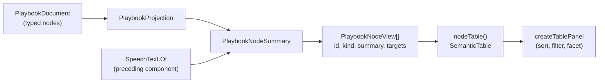

# Playbook Nodes Table

> [!NOTE]
> Status: **proposed** — not yet implemented. The Playbook tab shows the compiled
> playbook verbatim, and a node in that document is the one part of it a reader
> cannot read: an integer id, a speaker index, and a list of target numbers. This
> note adds a fourth table beside the JSON in which every node is one row that
> reads as a sentence.
>
> It depends on one thing it does not build: a public flattening of speech to
> plain text, designed in the sibling note *Speech as Plain Text*. That flattening
> is a format-level contract shared with the runtime, so it is its own component
> and lands first.
>
> Like the rest of the visualization tooling, this surface is "vibe-coded" (see
> the visualization note's maturity caveat); the compiler stays the reviewed
> surface.

## Table of contents

- [Goal and scope](#goal-and-scope)
- [Ubiquitous language](#ubiquitous-language)
- [Functionality checklist](#functionality-checklist)
- [How it reads today](#how-it-reads-today)
- [Design](#design)
- [Interfaces and abstractions](#interfaces-and-abstractions)
- [Key design decisions](#key-design-decisions)
- [Error and boundary cases](#error-and-boundary-cases)
- [Integration](#integration)
- [Testability](#testability)
- [Open questions](#open-questions)

## Goal and scope

The Playbook tab already answers *what a host receives* — the document itself,
read-only, beside tables naming its header, its speakers, and its anchors. What it
does not answer is *what any single node is*. A node in the JSON is an id, a
`kind`, a speaker **index**, a list of speech **fragments**, and a list of `out`
edges naming **target numbers**. Every one of those is a pointer, and following a
pointer costs a scroll.

This component adds a **Nodes table**: one row per node, in which the node's
identity, its kind, what it holds, and where it leads are all readable without
resolving anything by hand.

**In scope:**

- A `PlaybookNodeView` projection: one view per node, carrying the node's id, its
  kind, its summary, and its targets.
- A **summary** — one line of plain text saying what the node holds — derived from
  the typed playbook model.
- A fourth table in the tab, built from the same component the other three use.

**Out of scope:**

- **Flattening speech to plain text.** That is the preceding component. A node's
  summary consumes it; this note does not specify it, because the flattening is a
  contract the conformance corpus already fixes for every runtime, not a report
  detail.
- **A hover preview over a reference in the JSON.** Planned as the next component,
  and the reason the summary is projected rather than computed at the table: a card
  shown over `"target": 8` needs exactly this string, so the two surfaces must
  share one source.
- Rendering the speech's structure — styling, nesting, inline images. The summary
  is a flat line by design; the document beside it carries the structure.
- Any change to the playbook format, the schema, or the serialized document.

## Ubiquitous language

One concept, one name — here, in the code, and in the tests.

| Term           | Meaning                                                                                                                                            |
| -------------- | -------------------------------------------------------------------------------------------------------------------------------------------------- |
| **Node**       | One step of a playthrough, as the playbook records it: a `line`, `choice`, `random-choice`, `branch`, `control`, or `end`.                         |
| **Summary**    | The single line of plain text that says what a node holds — a speaker and their words, the options on offer, a condition, a command. One per node. |
| **Kind**       | Which of the six sorts of node it is, as the document's own `kind` field names it.                                                                 |
| **Target**     | The node an edge leads to, as an index into the playbook's node list.                                                                              |
| **Way out**    | One edge leaving a node. A node has zero or more.                                                                                                  |
| **Plain text** | What the flattening of a fragment list yields: the words, without styling, nesting, or markup. The preceding component owns it.                    |

Every term here is the playbook's own word, or — for *summary* and *plain text* —
the word the rest of the repository already uses for the same idea. This note
invents none.

## Functionality checklist

- [ ] Every node in the playbook has exactly one row.
- [ ] A `line`'s summary names its speaker and quotes what is said.
- [ ] A `control`'s summary lists the commands it performs.
- [ ] A `control` with no effects — which is a divert wearing a control's clothes —
      is given the words the writer put on the divert.
- [ ] A `choice` and a `random-choice` quote the options they offer, and mark the
      ones offered only on a condition.
- [ ] A node that is itself conditional says so, ahead of everything else.
- [ ] A `branch` says what it tests.
- [ ] An `end` says that it ends the script.
- [ ] A node's kind carries the same color the Dialogue Graph gives that kind.
- [ ] A node with one way out has that target as a link, which reveals the node in
      the JSON beside the table; a node with several lists them as text.
- [ ] The table can be faceted by kind.
- [ ] Narrowing the panel wraps the summary and leaves every number on one line.

## How it reads today

```json
{
  "kind": "line",
  "id": 6,
  "speaker": 1,
  "speech": [
    { "kind": "text", "text": "North, past the burned mile. Take a torch — and take " },
    { "kind": "styled", "style": "italic", "children": [{ "kind": "text", "text": "care" }] },
    { "kind": "text", "text": "." }
  ],
  "out": [{ "kind": "succession", "target": 16 }]
}
```

To learn that this is *the Keeper saying "North, past the burned mile…", leading
to node 16*, a reader must resolve `speaker: 1` against a table above, flatten
three fragments in their head, and hold `16` until they find it. The row below
says the same thing:

| #   | Kind | Summary                                                              | Leads to |
| --- | ---- | -------------------------------------------------------------------- | -------- |
| 6   | line | Keeper: "North, past the burned mile. Take a torch — and take care." | 16       |

## Design



The projection does the reading; the client does the drawing. That split is the
same one the speaker and anchor tables already follow, and it is what lets the
planned hover card show the identical words without a second implementation.

### Writing a summary

A summary is composed by matching on the node's type. Speech and option labels
reach it already flattened, from the preceding component; everything else here is
the node's own shape.

```text
summaryOf(node, speakers):
    line          -> "{speaker}: “{speech}”"
    control       -> effects, if any -> "{name}({args}) · …"
                     otherwise       -> "⇒ {the words on its divert}"
    choice        -> "“{option}” / “{option}” / …"
    random-choice -> "“{option}” / …", each with its weight
    branch        -> "if {key} · otherwise"
    end           -> "Ends the script"

    # An option available only on a condition carries it in parentheses:
    #     “Brave the west road” (if Alice.HasMap)
    #
    # A line or a control may itself be conditional, and then nothing it holds
    # happens unless the key is true. That governs the whole node rather than one
    # way out of it, so it leads instead of trailing:
    #     if Hero.IsBrave · Keeper: “…”
```

Quotation marks set off **words that reach a player verbatim** — a line's speech
and an option's label. Everything else in the column is the table's own prose: it
says that a node ends the script, or what a branch tests. The quotes are what keep
the two apart inside one cell. The Dialogue Graph draws a line's label unquoted,
and is right to: a node box holds nothing else that could be confused with speech.
A table column does.

## Interfaces and abstractions

| Type                                                                                    | Responsibility                                                        | Collaborators                                     |
| --------------------------------------------------------------------------------------- | --------------------------------------------------------------------- | ------------------------------------------------- |
| `PlaybookNodeView(int Id, string Kind, string Category, string Summary, int[] Targets)` | One node as the table shows it. New record in `PlaybookReport.cs`.    | `PlaybookProjection`                              |
| `PlaybookProjection.NodesOf(PlaybookDocument)`                                          | Projects every node to a view, in document order.                     | `PlaybookNodeSummary`                             |
| `PlaybookNodeSummary`                                                                   | Writes one node's summary. New internal static class.                 | the playbook's node and edge models, `SpeechText` |
| `nodeTable(nodes)` in `playbook-view.ts`                                                | Shapes the views into a `SemanticTable`.                              | `createTablePanel`                                |
| `createTablePanel`                                                                      | Draws it, with sorting, filtering, faceting, and collapse. Unchanged. | —                                                 |
| `styles.css`                                                                            | One new rule pinning the three short columns to one line.             | —                                                 |

## Key design decisions

### DD1 — The summary is projected, not computed in the client

The client receives the playbook as text and as three projections; a fourth is
consistent with that, and it is what keeps the client a renderer.

The decisive reason is that the hardest part of a summary is no longer the report's
to own. A line's speech and an option's label arrive as fragment lists, and
flattening them is a contract the conformance corpus fixes normatively for every
runtime — so the flattening lives in the format library, in C#, and the report
consumes it. Composing the summary anywhere else would mean either reimplementing
that contract in TypeScript or shipping half of it over the wire and finishing the
job in the client.

It also settles the next component. A hover card over `"target": 8` must show the
same words as the row for node 8; projecting the summary once means it cannot
drift.

What this decision does **not** buy is a compiler-checked reminder when the format
grows. C# cannot prove a match over a class hierarchy is exhaustive: the match needs
a discard arm and compiles silently when a seventh node kind appears. The guarantee
comes from a test that reflects over the union's registered members and asserts the
summary handles each, the way `UnionAssert` already asserts that every member of a
tagged union is registered for serialization.

### DD2 — One flat line per node, not a structure

A table's job here is **survey**: see the whole script's shape, find the choices,
notice three routes converging on one node. Structure — nested styling, a
condition's full expression, an option's own styling — is what the document beside
it already renders, and what the planned hover card will show for one node at a
time.

So the summary is flat. A styled run contributes its words without its styling; a
query contributes the key it will read rather than a value the report cannot know.

### DD3 — A node's kind wears the color the Dialogue Graph gives that kind

`palette.ts` exists to keep one idea in one hue across stages — it says so
outright, noting that a Markdown code span and the game call it compiles to are
both `call` and both red. A playbook node is the same node the Dialogue Graph drew
one tab earlier, so it takes the color the graph gave it:

| Kind                                | Category    |
| ----------------------------------- | ----------- |
| `line`                              | `speech`    |
| `control`                           | `call`      |
| `choice`, `random-choice`, `branch` | `structure` |
| `end`                               | `terminal`  |

The mapping is copied from the graph's own classification rather than derived
afresh, so a reader who has learned the graph's colors reads this table without
being taught them twice. The color arrives through `SemanticCell.category`, which
already draws a thin accent in the category's hue — no new drawing code.

This does mean a choice, a random choice and a branch share one hue, which loses a
distinction a reader might want. Giving choices their own `choice` color would
read better, but only if the graph changed with it: two surfaces coloring the same
node differently is worse than one surface coloring two nodes alike. Recoloring a
shipped tab is a change of its own, not a rider on a new table.

### DD4 — An effect-less control node is summarized by its divert

A `control` node with no effects is what a bare scene-to-scene jump compiles to.
Three of them appear in `examples/rpg-quest.dialogue.md`, and a summary that listed
their effects would say nothing at all for each.

Its one way out is a divert, and a divert carries the words the writer wrote for
it, so the summary becomes `⇒ The Mountain Road`. Those rows then say more than
most: they are the script's scene changes, named as the writer named them.

The Dialogue Graph already reached this conclusion and labels a bare jump the same
way, down to the rendered `⇒` rather than the `=>` a writer types. The table
follows it rather than inventing a second treatment.

### DD5 — Three columns hold their line; the summary wraps

`#`, `Kind`, and `Leads to` are pinned to one line; the summary takes the remaining
width and wraps. Narrowing the panel — or the window — then grows a row's height
and leaves every number legible, which is the opposite of what an evenly divided
table does.

This follows the component rather than fighting it. A table cell in this report is
already `vertical-align: top` with `overflow-wrap: anywhere` and no fixed layout, so
cells wrap by default and there is no cell-ellipsis machinery to reach for. Pinning
a short column is the established exception: the jump-resolutions table already
pins its leading `Type` column, keyed off the table's own `data-table` attribute,
for exactly this reason. This table is `data-table="nodes"` and gains the same kind
of rule.

The projection still caps a summary at a couple of hundred characters, so one
enormous paragraph cannot bloat the payload or wrap a row into a wall of text. The
cap is generous enough that most rows never meet it.

### DD6 — Faceting by kind, because that is the question a reader asks

"Show me every choice" is the question this table makes answerable, and the
faceted filter the Speakers table already uses answers it for free — `kind` joins
`facetColumns` and nothing else is needed.

### DD7 — A single way out is a link; several are listed, and the summary names them

A cell in this table carries **one** jump, not several: the table marks a cell with
a single `data-jump` key and labels the link with the cell's whole text. So the
column behaves differently depending on how many ways out a node has.

- **One way out** — the cell is a link carrying `PlaybookTarget { kind: "node" }`,
  which the tab already knows how to reveal in the JSON. That is the same mechanism
  the Anchors table's Node column and the header's Entry node use, so the target
  behaves the way every other node reference in the tab behaves, including from the
  keyboard. This is most rows: every line, every succession, every bare jump.
- **Several ways out** — the cell lists the targets as plain text. A link labeled
  `16, 22, 31` that lands on `16` would announce three destinations and deliver
  one, and a cell that silently picks the first is worse than a cell that does not
  pretend to be clickable at all. The JSON beside the table is how a reader follows
  any of them.

What makes a branching row readable is therefore the summary, not the link: it
quotes each option in order, so the row says *what* the ways out are even where it
cannot offer them individually.

That is worth doing on its own merits. An option's label is text a player will
read, and it currently appears on **no** surface in the report: the graph draws it
on an edge only when there is room, and the JSON buries it in a fragment list.
Putting it in the summary is the feature, not a consolation for the single jump.

Teaching `SemanticCell` to carry a jump per target would be the richer answer, and
it is a real option later. It is a change to a component four tables share, which is
not a rider on adding the fourth.

## Error and boundary cases

| Case                                                     | Behavior                                                                                                                                                                                                                                                                  |
| -------------------------------------------------------- | ------------------------------------------------------------------------------------------------------------------------------------------------------------------------------------------------------------------------------------------------------------------------- |
| The compile produced no playbook                         | No Nodes table, as there are no Speakers or Anchors tables either.                                                                                                                                                                                                        |
| A node with no ways out (`end`)                          | The Leads to cell is empty, per the report's rule that an absent value is an empty cell. An empty cell is never a link, which the table already enforces.                                                                                                                 |
| A line whose speaker is the anonymous one                | Named `(anonymous)`, the same rendering the Speakers table uses.                                                                                                                                                                                                          |
| A line with no speech                                    | The summary is the speaker and an empty quotation, which is what the document says.                                                                                                                                                                                       |
| A speaker index outside the speaker list                 | Cannot occur in a playbook the writer produced; projected defensively as `(unknown speaker)` rather than throwing, because a report that renders nothing is worse than one that says so.                                                                                  |
| A control node with neither effects nor a labeled divert | `passes straight through`.                                                                                                                                                                                                                                                |
| An option with no label                                  | Rendered as `(no label)`. The compiler already reports a blank menu row as a diagnostic, so this names a script the writer has been told about rather than inventing text for it.                                                                                         |
| A line or control carrying its own condition             | The condition leads the summary: `if Hero.IsBrave · Keeper: "…"`. No shipped example produces one — every condition in `rpg-quest` and `highrise-fire` sits on an edge — but the format allows it, and a summary that dropped it would misdescribe what the runtime does. |
| A choice with many options                               | Options are quoted in order until the cap is reached; the row then ends in an ellipsis. Every target is still listed in the Leads to cell, so the number of ways out stays readable.                                                                                      |
| A summary longer than the cap                            | Cut at the cap, on a word boundary, with an ellipsis.                                                                                                                                                                                                                     |
| A very large playbook                                    | One row per node, drawn by a component that already carries thousands of rows elsewhere in the report.                                                                                                                                                                    |

## Integration

- **`PlaybookReport.cs`** — gains `PlaybookNodeView` and a `Nodes` member on the
  report record.
- **`PlaybookProjection.cs`** — projects the node list; unchanged for the
  unavailable case, which already returns empty lists.
- **`PlaybookNodeSummary.cs`** — new, internal: the match that writes a summary.
- **`SpeechText`** — consumed, not changed. It is the preceding component's public
  flattening, and the only thing this component needs from outside the
  visualization assembly.
- **`model.ts`** — gains `PlaybookNodeView` and `nodes` on `PlaybookReport`.
- **`playbook-view.ts`** — gains `nodeTable`, added to `tablesOf` after the
  anchors, so the tab reads header, speakers, anchors, then the nodes themselves.
- **`styles.css`** — one rule pinning this table's `#`, `Kind`, and `Leads to`
  columns to a single line.
- **No format change.** The playbook document, its schema, and the bytes
  `ddown compile --emit playbook` writes are untouched.

## Testability

| Level                           | Covers                                                                                                                                                                                        |
| ------------------------------- | --------------------------------------------------------------------------------------------------------------------------------------------------------------------------------------------- |
| xUnit — `PlaybookNodeSummary`   | One test per node kind; the effect-less control node; a node-level condition; a conditional option; an unlabeled option; the missing-speaker guard; the word-boundary cap.                    |
| xUnit — union coverage          | Reflecting over the node union's registered members, every kind produces a non-empty summary — so a seventh kind fails a test instead of silently falling through a discard arm.              |
| xUnit — `PlaybookProjection`    | Every node projects to exactly one view, in document order, with its kind, its category, and its targets; an unavailable compile projects none.                                               |
| xUnit — colors follow the graph | The kind-to-category mapping equals the Dialogue Graph's, so the two surfaces cannot drift apart silently.                                                                                    |
| Vitest — `playbook-view`        | The table's columns, its kind categories, its facet, and that a one-way-out node's target cell carries a node jump while a branching node's does not.                                         |
| Playwright                      | The Nodes table renders for a real playbook, facets to a single kind, and a target cell reveals that node in the JSON beside it. A narrow viewport keeps the three short columns on one line. |

A summary is a pure function of a node and the speaker list, so its tests need no
document, no compile, and no DOM.

## Open questions

- **Does the `Leads to` column earn its width once the summary quotes the
  options?** The summary already says what the ways out *are*; the numbers say
  where they land, and on a branching node none of them is clickable. Dropping the
  column would give the summary the whole remaining width, at the cost of the one
  reliable way to see that three separate rows converge on node 22. Worth deciding
  against the real table rather than on paper.
- **Should a random choice show its weights?** A `random-option` carries a weight,
  and `AutoWeight` means "share what is left." Showing them makes the row honest
  about what chance will do; it also spends characters on a number a reader
  auditing content may not care about.
