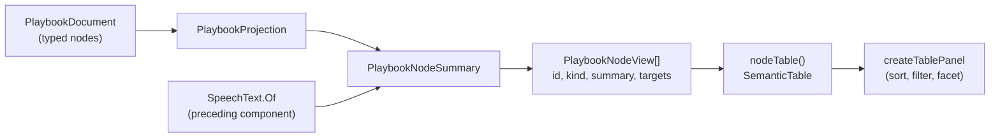

# Playbook Nodes Table

> [!IMPORTANT]
> Status: **implemented**. The Playbook tab shows the compiled playbook verbatim,
> and a node in that document was the one part of it a reader could not read: an
> integer id, a speaker index, and a list of target numbers. A fourth table beside
> the JSON now gives every node one row that reads as a sentence.
>
> It builds on a public flattening of speech to plain text, designed in the sibling
> note *Speech as Plain Text*. That flattening is a format-level contract shared
> with the runtime, so it is its own component and landed first.
>
> Like the rest of the visualization tooling, this surface is "vibe-coded" (see
> the visualization note's maturity caveat); the compiler stays the reviewed
> surface.

## Table of contents

- [Goal and scope](#goal-and-scope)
- [Ubiquitous language](#ubiquitous-language)
- [Functionality checklist](#functionality-checklist)
- [How it reads today](#how-it-reads-today)
- [Design](#design)
- [Interfaces and abstractions](#interfaces-and-abstractions)
- [Key design decisions](#key-design-decisions)
- [Error and boundary cases](#error-and-boundary-cases)
- [Integration](#integration)
- [Testability](#testability)
- [Open questions](#open-questions)

## Goal and scope

The Playbook tab already answers *what a host receives* — the document itself,
read-only, beside tables naming its header, its speakers, and its anchors. What it
does not answer is *what any single node is*. A node in the JSON is an id, a
`kind`, a speaker **index**, a list of speech **fragments**, and a list of `out`
edges naming **target numbers**. Every one of those is a pointer, and following a
pointer costs a scroll.

This component adds a **Nodes table**: one row per node, in which the node's
identity, its kind, what it holds, and where it leads are all readable without
resolving anything by hand.

**In scope:**

- A `PlaybookNodeView` projection: one view per node, carrying the node's id, its
  kind, its summary, and its targets.
- A **summary** — one line of plain text saying what the node holds — derived from
  the typed playbook model.
- A fourth table in the tab, built from the same component the other three use.

**Out of scope:**

- **Flattening speech to plain text.** That is the preceding component. A node's
  summary consumes it; this note does not specify it, because the flattening is a
  contract the conformance corpus already fixes for every runtime, not a report
  detail.
- **A hover preview over a reference in the JSON.** Planned as the next component,
  and the reason the summary is projected rather than computed at the table: a card
  shown over `"target": 8` needs exactly this string, so the two surfaces must
  share one source.
- Rendering the speech's structure — styling, nesting, inline images. The summary
  is a flat line by design; the document beside it carries the structure.
- Any change to the playbook format, the schema, or the serialized document.

## Ubiquitous language

One concept, one name — here, in the code, and in the tests.

| Term           | Meaning                                                                                                                                            |
| -------------- | -------------------------------------------------------------------------------------------------------------------------------------------------- |
| **Node**       | One step of a playthrough, as the playbook records it: a `line`, `choice`, `random-choice`, `branch`, `control`, or `end`.                         |
| **Summary**    | The single line of plain text that says what a node holds — a speaker and their words, the options on offer, a condition, a command. One per node. |
| **Kind**       | Which of the six sorts of node it is, as the document's own `kind` field names it.                                                                 |
| **Target**     | The node an edge leads to, as an index into the playbook's node list.                                                                              |
| **Way out**    | One edge leaving a node. A node has zero or more.                                                                                                  |
| **Plain text** | What the flattening of a fragment list yields: the words, without styling, nesting, or markup. The preceding component owns it.                    |

Every term here is the playbook's own word, or — for *summary* and *plain text* —
the word the rest of the repository already uses for the same idea. This note
invents none.

## Functionality checklist

- [x] Every node in the playbook has exactly one row.
- [x] A `line`'s summary names its speaker and says what is said.
- [x] A `control`'s summary lists the commands it performs, in order.
- [x] A `control` with no effects — which is a divert wearing a control's clothes —
      is given the words the writer put on the divert.
- [x] A `choice` lists the options it offers, marking the ones offered only on a
      condition.
- [x] A `random-choice` reports how many arms it draws from and their odds, because
      its arms carry no words.
- [x] A node that is itself conditional says so, ahead of everything else.
- [x] A `branch` pairs each condition with the node it reaches.
- [x] An `end` says only that the run stops.
- [x] A node's kind carries the same color the Dialogue Graph gives that kind.
- [x] Every node a row leads to is a link of its own, which reveals that node in
      the JSON beside the table.
- [x] Hovering a way out lights the row it leads to, so a reader sees where it
      goes without leaving the row they are reading.
- [x] A summary is drawn in the report's own syntax colors, so the words a writer
      wrote stand apart from the table's grammar.
- [x] The table can be faceted by kind.
- [x] Narrowing the panel wraps the summary and keeps every number on one line,
      scrolling the table sideways rather than dropping a column out of sight.

## How it reads today

```json
{
  "kind": "line",
  "id": 6,
  "speaker": 1,
  "speech": [
    { "kind": "text", "text": "North, past the burned mile. Take a torch — and take " },
    { "kind": "styled", "style": "italic", "children": [{ "kind": "text", "text": "care" }] },
    { "kind": "text", "text": "." }
  ],
  "out": [{ "kind": "succession", "target": 16 }]
}
```

To learn that this is *the Keeper saying "North, past the burned mile…", leading
to node 16*, a reader must resolve `speaker: 1` against a table above, flatten
three fragments in their head, and hold `16` until they find it. The row below
says the same thing:

| # | Kind | Summary                                                            | Leads to |
| - | ---- | ------------------------------------------------------------------ | -------- |
| 6 | line | Keeper: North, past the burned mile. Take a torch — and take care. | 16       |

## Design



The projection does the reading; the client does the drawing. That split is the
same one the speaker and anchor tables already follow, and it is what lets the
planned hover card show the identical words without a second implementation.

### Writing a summary

A summary is composed by matching on the node's type. Speech and option labels
reach it already flattened and are trimmed before use; everything else here is the
node's own shape.

```text
summaryOf(node, speakers):
    line          -> "{speaker}: {speech}"
    control       -> commands, if any -> "{Name}({args}); …"
                     otherwise        -> "⇒ {the words on its divert}"
                     neither          -> "CONTINUE"
    choice        -> "{option} || {option} || …"
    random-choice -> "DRAW 1 FROM {n}: {odds} || {odds} || …"
    branch        -> "IF {key} THEN {n} ELSE IF {key} THEN {n} ELSE {n}"
    end           -> "END"

    # A guard on one way out trails the thing it governs:
    #     Brave the west road IF Alice.HasMap
    #     50% IF Hero.HasMap
    #
    # A line or a control may itself be conditional, and then nothing it holds
    # happens unless the key is true. That governs the whole node rather than one
    # way out of it, so it leads instead of trailing:
    #     IF Hero.IsBrave THEN Keeper: …
```

The column reads as a little pseudocode, with four registers each carrying one
job. **Capitals** are what the table itself asserts. **A name in angle brackets**
stands where a value is missing or cannot be resolved: `<anonymous>`, `<unknown>`,
`<no speech>`, `<no label>`. **Round brackets** always mean a command:
`(fade in)` for an action the host already knows, `ShowBackground(tavern, firelit)`
for one the script names. Everything else came from the script.

Case is what keeps the table's own words apart from a writer's, so speech needs no
quotation marks around it: a capitalized keyword can never be mistaken for
something a player hears, and the speaker's colon already marks where speech
begins. The Dialogue Graph draws a line's label unquoted for a simpler reason — a
node box holds nothing else — and the two surfaces agree.

A branch pairs each condition with the node it reaches, which is the one thing the
Leads to column cannot express: it lists a branch's targets but not which guard
leads to which. A random choice reports its arms' odds rather than their words,
because a random arm carries no words at all — the engine picks, so nobody is
shown a menu, and the odds are the whole of what the arm holds.

## Interfaces and abstractions

| Type                                                                                        | Responsibility                                                                                                                                                      | Collaborators                                     |
| ------------------------------------------------------------------------------------------- | ------------------------------------------------------------------------------------------------------------------------------------------------------------------- | ------------------------------------------------- |
| `PlaybookNodeView(int Id, string Kind, string Category, Segment[] Segments, int[] Targets)` | One node as the table shows it. New record in `PlaybookReport.cs`.                                                                                                  | `PlaybookProjection`                              |
| `PlaybookProjection.NodesOf(PlaybookDocument)`                                              | Projects every node to a view, in document order.                                                                                                                   | `PlaybookNodeSummary`                             |
| `PlaybookNodeSummary`                                                                       | Writes one node's summary. New internal static class.                                                                                                               | the playbook's node and edge models, `SpeechText` |
| `nodeTable(nodes)` in `playbook-view.ts`                                                    | Shapes the views into a `SemanticTable`.                                                                                                                            | `createTablePanel`                                |
| `summaryCell(node)` in `playbook-view.ts`                                                   | Joins a node's segments for the cell's text and draws each piece in the class its role wears — see [Playbook Summary Segments](./Playbook%20Summary%20Segments.md). | `SUMMARY_SEGMENT_CLASS`                           |
| `createTablePanel`                                                                          | Draws it, with sorting, filtering, faceting, and collapse. Gains styled segments and a link per destination.                                                        | `summaryCell`                                     |
| `styles.css`                                                                                | The column widths, the sideways scroll, the hover tint, and the summary's colors.                                                                                   | —                                                 |

## Key design decisions

### DD1 — The summary is projected, not computed in the client

The client receives the playbook as text and as three projections; a fourth is
consistent with that, and it is what keeps the client a renderer.

The decisive reason is that the hardest part of a summary is no longer the report's
to own. A line's speech and an option's label arrive as fragment lists, and
flattening them is a contract the conformance corpus fixes normatively for every
runtime — so the flattening lives in the format library, in C#, and the report
consumes it. Composing the summary anywhere else would mean either reimplementing
that contract in TypeScript or shipping half of it over the wire and finishing the
job in the client.

It also settles the next component. A hover card over `"target": 8` must show the
same words as the row for node 8; projecting the summary once means it cannot
drift.

What this decision does **not** buy is a compiler-checked reminder when the format
grows. C# cannot prove a match over a class hierarchy is exhaustive: the match needs
a discard arm and compiles silently when a seventh node kind appears. The guarantee
comes from a test that reflects over the union's registered members and asserts the
summary handles each, the way `UnionAssert` already asserts that every member of a
tagged union is registered for serialization.

### DD2 — One flat line per node, not a structure

A table's job here is **survey**: see the whole script's shape, find the choices,
notice three routes converging on one node. Structure — nested styling, a
condition's full expression, an option's own styling — is what the document beside
it already renders, and what the planned hover card will show for one node at a
time.

So the summary is flat. A styled run contributes its words without its styling; a
query contributes the key it will read rather than a value the report cannot know.

### DD3 — A node's kind wears the color the Dialogue Graph gives that kind

`palette.ts` exists to keep one idea in one hue across stages — it says so
outright, noting that a Markdown code span and the game call it compiles to are
both `call` and both red. A playbook node is the same node the Dialogue Graph drew
one tab earlier, so it takes the color the graph gave it:

| Kind                                | Category    |
| ----------------------------------- | ----------- |
| `line`                              | `speech`    |
| `control`                           | `call`      |
| `choice`, `random-choice`, `branch` | `structure` |
| `end`                               | `terminal`  |

The mapping is copied from the graph's own classification rather than derived
afresh, so a reader who has learned the graph's colors reads this table without
being taught them twice. The color arrives through `SemanticCell.category`, which
already draws a thin accent in the category's hue — no new drawing code.

This does mean a choice, a random choice and a branch share one hue, which loses a
distinction a reader might want. Giving choices their own `choice` color would
read better, but only if the graph changed with it: two surfaces coloring the same
node differently is worse than one surface coloring two nodes alike. Recoloring a
shipped tab is a change of its own, not a rider on a new table.

### DD4 — An effect-less control node is summarized by its divert

A `control` node with no effects is what a bare scene-to-scene jump compiles to.
Three of them appear in `examples/rpg-quest.dialogue.md`, and a summary that listed
their effects would say nothing at all for each.

Its one way out is a divert, and a divert carries the words the writer wrote for
it, so the summary becomes `⇒ The Mountain Road`. Those rows then say more than
most: they are the script's scene changes, named as the writer named them.

The Dialogue Graph already reached this conclusion and labels a bare jump the same
way, down to the rendered `⇒` rather than the `=>` a writer types. The table
follows it rather than inventing a second treatment.

### DD5 — Three columns hold their line; the summary wraps; the panel scrolls

`#`, `Kind`, and `Leads to` are pinned to one line; the summary takes the remaining
width and wraps. Narrowing the panel — or the window — then grows a row's height
and leaves every number legible, which is the opposite of what an evenly divided
table does.

This follows the component rather than fighting it. A table cell in this report is
already `vertical-align: top` with `overflow-wrap: anywhere` and no fixed layout, so
cells wrap by default and there is no cell-ellipsis machinery to reach for. Pinning
a short column is the established exception: the jump-resolutions table already
pins its leading `Type` column, keyed off the table's own `data-table` attribute,
for exactly this reason. This table is `data-table="nodes"` and gains the same kind
of rule.

Wrapping alone is not enough at the narrow end. Once the summary has given up all
the width it can, three pinned columns still need more than the panel has, and a
table that simply overflows its panel carries `Leads to` out of sight with no way
to reach it. So the panel body scrolls sideways: the columns keep their
proportions and the reader pans to the numbers. A pinned column that cannot be
reached is worse than one that has to be scrolled to.

The projection still caps a summary at a couple of hundred characters, so one
enormous paragraph cannot bloat the payload or wrap a row into a wall of text. The
cap is generous enough that most rows never meet it.

### DD6 — Faceting by kind, because that is the question a reader asks

"Show me every choice" is the question this table makes answerable, and the
faceted filter the Speakers table already uses answers it for free — `kind` joins
`facetColumns` and nothing else is needed.

### DD7 — Every way out is a link of its own

A node's targets are listed in order, and each one is separately clickable: a
target carries `PlaybookTarget { kind: "node" }`, which the tab already knows how
to reveal in the JSON. That is the same mechanism the Anchors table's Node column
and the header's Entry node use, so a target behaves the way every other node
reference in the tab behaves, including from the keyboard.

One link for the whole cell could not do this. A link labeled `16, 22, 31` that
lands on `16` announces three destinations and delivers one, and a cell that
silently picks the first is worse than a cell that does not pretend to be
clickable. So the cell draws one control per target, which is what makes a
branching row as reachable as a straight one. That is a cell shape the component
now offers to all four tables rather than to this one alone.

Hovering a target also lights the row it leads to. The report already cross-links
entities by key and a node row carries its own, so pointing at `22` tints row 22
wherever it sits — and the row under the pointer is tinted differently from the
row it leads to, so the two never read alike. Nothing scrolls: a reader pointing
at a number has not asked to be moved.

The summary is what makes a branching row readable in the first place. It lists
each option in order, so the row says *what* the ways out are as well as where
they land. An option's label is text a player will read, and before this table it
appeared on **no** surface in the report: the graph draws it on an edge only when
there is room, and the JSON buries it in a fragment list.

### DD8 — The summary is colored in the report's own syntax colors

A summary packs a speaker, their words, the table's grammar, a command, and a value
only a running game can supply into one cell. Drawn in a single color, all of it
reads as equally important, and the words a writer wrote — the thing a reader came
for — sit in the middle of the scaffolding around them.

Three distinctions take a color: who speaks, what the host is asked to perform, and
a value the game supplies. They wear the colors the Source editor already uses for
those same three things, so a speaker is the same purple in the table as in the
script, a command the same olive, a query the same red. That is a palette the
report already had, tuned for both themes, rather than a second color language
invented for one table. The table's own grammar — the capitals, the separators, the
angle-bracket markers — is muted so it steps back, and a writer's own words keep the
cell's plain color, which leaves them the most legible thing in the row. Every role
was measured against the table's background in both themes; the tightest is muted
grammar on dark at 4.77:1.

Only three distinctions take a color because keywords and speaker names always sit
adjacent in a summary. Coloring the grammar as well puts neighboring hues side by
side, and the row then reads as a stripe rather than a sentence.

The pieces arrive already labeled. The projection writes each node's summary as
ordered segments, each carrying the role it plays, and the client maps a role to the
class it wears — see
[Playbook Summary Segments](./Playbook%20Summary%20Segments.md), the note that owns
the summary's shape. A piece holding a writer's own words is never scanned, and the
segments concatenate back to the cell's text, which is what lets a search match
still be found in the text and then laid back across the pieces.

The column still does not draw a choice as a list of options, which would otherwise
suit it. A list asserts how many options there are, and the boundaries that
assertion needs are the separator segments the projection placed; a rendering that
draws them as item breaks rather than glyphs is its own change.

## Error and boundary cases

| Case                                                     | Behavior                                                                                                                                                                                                                                       |
| -------------------------------------------------------- | ---------------------------------------------------------------------------------------------------------------------------------------------------------------------------------------------------------------------------------------------- |
| The compile produced no playbook                         | No Nodes table, as there are no Speakers or Anchors tables either.                                                                                                                                                                             |
| A node with no ways out (`end`)                          | The Leads to cell is empty, per the report's rule that an absent value is an empty cell. An empty cell is never a link, which the table already enforces.                                                                                      |
| A line whose speaker is the anonymous one                | Stands in as `<anonymous>`.                                                                                                                                                                                                                    |
| A line with no speech                                    | The summary is the speaker and `<no speech>`, so an empty cell never reads as a rendering fault.                                                                                                                                               |
| A speaker index outside the speaker list                 | Cannot occur in a playbook the writer produced; projected defensively as `<unknown>` rather than throwing, because a report that renders nothing is worse than one that says so.                                                               |
| A control node with neither effects nor a labeled divert | `CONTINUE`.                                                                                                                                                                                                                                    |
| An option with no label                                  | Rendered as `<no label>`. The compiler already reports a blank menu row as a diagnostic, so this names a script the writer has been told about rather than inventing text for it.                                                              |
| A line or control carrying its own condition             | The condition leads the summary: `IF Hero.IsBrave THEN Keeper: …`. Every condition in `rpg-quest` and `highrise-fire` sits on an edge, but `gallery` has one on a line, and a summary that dropped it would misdescribe what the runtime does. |
| A choice with many options                               | Options are listed in order until the cap is reached; the row then ends in an ellipsis. Every target is still listed in the Leads to cell, so the number of ways out stays readable.                                                           |
| A summary longer than the cap                            | Cut at the cap, on a word boundary, with an ellipsis.                                                                                                                                                                                          |
| A very large playbook                                    | One row per node, drawn by a component that already carries thousands of rows elsewhere in the report.                                                                                                                                         |

## Integration

- **`PlaybookReport.cs`** — gains `PlaybookNodeView` and a `Nodes` member on the
  report record.
- **`PlaybookProjection.cs`** — projects the node list; unchanged for the
  unavailable case, which already returns empty lists.
- **`PlaybookNodeSummary.cs`** — new, internal: the match that writes a summary.
- **`SpeechText`** — consumed, not changed. It is the preceding component's public
  flattening, and the only thing this component needs from outside the
  visualization assembly.
- **`model.ts`** — gains `PlaybookNodeView` and `nodes` on `PlaybookReport`, and
  the two shapes a cell needs to draw itself: a segment carrying a class, and a link
  per destination.
- **The summary's pieces** — the projection now writes them as labeled segments and
  the client draws each by role; the splitter this note introduced was deleted. See
  [Playbook Summary Segments](./Playbook%20Summary%20Segments.md).
- **`semantic-table.ts`** — a cell can now be drawn in styled segments, and can
  carry one link per destination instead of one for the whole cell. Both are general
  to the component rather than particular to this table.
- **`playbook-view.ts`** — gains `nodeTable`, added to `tablesOf` after the
  anchors, so the tab reads header, speakers, anchors, then the nodes themselves.
- **`styles.css`** — pins this table's `#`, `Kind`, and `Leads to` columns to a
  single line, scrolls the panel body sideways when they no longer fit, tints the
  row under the pointer, and gives each summary role its color.
- **No format change.** The playbook document, its schema, and the bytes
  `ddown compile --emit playbook` writes are untouched.

## Testability

| Level                           | Covers                                                                                                                                                                                                                                                                                 |
| ------------------------------- | -------------------------------------------------------------------------------------------------------------------------------------------------------------------------------------------------------------------------------------------------------------------------------------- |
| xUnit — `PlaybookNodeSummary`   | One test per node kind; the effect-less control node; a node-level condition; a conditional option; an unlabeled option; the missing-speaker guard; the word-boundary cap.                                                                                                             |
| xUnit — union coverage          | Reflecting over the node union's registered members, every kind produces a non-empty summary — so a seventh kind fails a test instead of silently falling through a discard arm.                                                                                                       |
| xUnit — `PlaybookProjection`    | Every node projects to exactly one view, in document order, with its kind, its category, and its targets; an unavailable compile projects none.                                                                                                                                        |
| xUnit — colors follow the graph | The kind-to-category mapping equals the Dialogue Graph's, so the two surfaces cannot drift apart silently.                                                                                                                                                                             |
| Vitest — the summary cell       | A cell joins its segments to its text and draws each role in its class, and a label holding a separator stays one plain piece; the splitter's cases moved to xUnit, against real nodes.                                                                                                |
| Vitest — `playbook-view`        | The table's columns, its kind categories, its facet, and that every target in a cell carries a link of its own.                                                                                                                                                                        |
| Vitest — `semantic-table`       | A cell drawn in segments shows each in its own class, and a search match is still marked inside a colored segment and across a segment boundary.                                                                                                                                       |
| Playwright                      | The Nodes table renders for a real playbook, facets to a single kind, and each target reveals that node in the JSON beside it. Hovering a target lights the row it leads to, tinted apart from the row under the pointer. A narrow viewport keeps the three short columns on one line. |

A summary is a pure function of a node and the speaker list, so its tests need no
document, no compile, and no DOM.

## Open questions

None outstanding.

The `Leads to` column earns its width. Seeing that three separate rows converge on
node 22 is the one thing the summary cannot say, and now that every target is a
link of its own, the column is also where a branching row is followed from.

A random choice shows its odds rather than only its arm count. An arm carries no
words at all, so the odds are the whole of what it holds, and a row naming only
the count would say less than the JSON beside it.
