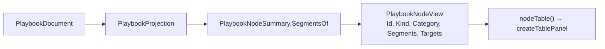

# Playbook Nodes Table

> [!NOTE]
> Status: **implemented**. The Playbook tab's **Nodes** table gives every playbook node one row
> that reads as a sentence: its id, its kind, a summary of what it holds, and a link to each node
> it leads to.

## Table of contents

- [Goal and scope](#goal-and-scope)
- [Ubiquitous language](#ubiquitous-language)
- [Example](#example)
- [Design](#design)
- [Key design decisions](#key-design-decisions)
- [Error and boundary cases](#error-and-boundary-cases)
- [Testability](#testability)

## Goal and scope

A node in the playbook JSON is an id, a `kind`, a speaker **index**, a list of speech
**fragments**, and `out` edges naming **target numbers**. Every one is a pointer, and following a
pointer costs a scroll. The Nodes table resolves them so each node reads without lookup.

**In scope:** the `PlaybookNodeView` projection and the fourth table in the tab. The summary's
shape — its segments, roles, colors, and grammar — belongs to
[Playbook Summary Segments](./Playbook%20Summary%20Segments.md); flattening speech to text belongs
to [Speech as Plain Text](../../runtime/Speech%20as%20Plain%20Text.md).

**Out of scope:** any change to the playbook format, its schema, or the bytes
`ddown compile --emit playbook` writes.

## Ubiquitous language

| Term | Meaning |
| --- | --- |
| **Node** | One step of a playthrough, as the playbook records it: `line`, `choice`, `random-choice`, `branch`, `control`, or `end`. |
| **Kind** | Which of those six a node is, as the document's `kind` field names it. |
| **Summary** | The text that says what a node holds, sent as labeled segments. |
| **Target** | The node an edge leads to, by id. |
| **Way out** | One edge leaving a node; a node has zero or more. |

## Example

```json
{
  "kind": "line",
  "id": 6,
  "speaker": 1,
  "speech": [
    { "kind": "text", "text": "North, past the burned mile. Take a torch — and take " },
    { "kind": "styled", "style": "italic", "children": [{ "kind": "text", "text": "care" }] },
    { "kind": "text", "text": "." }
  ],
  "out": [{ "kind": "succession", "target": 16 }]
}
```

becomes

| # | Kind | Summary | Leads to |
| - | ---- | ------- | -------- |
| 6 | line | Keeper: North, past the burned mile. Take a torch — and take care. | 16 |

## Design


```mermaid
flowchart LR
    P["PlaybookDocument"] --> J["PlaybookProjection"]
    J --> N["PlaybookNodeSummary.SegmentsOf"]
    N --> V["PlaybookNodeView<br/>Id, Kind, Category, Segments, Targets"]
    V --> T["nodeTable() → createTablePanel"]
```

| Type | Responsibility |
| --- | --- |
| `PlaybookNodeView(Id, Kind, Category, Segments, Targets)` | One row, in `PlaybookReport.cs`. |
| `PlaybookProjection` | Projects every node, in document order. |
| `PlaybookNodeSummary` | Writes a node's summary segments. |
| `nodeTable` (`playbook-view.ts`) | Shapes the views into a `SemanticTable`, added after the Anchors table. |
| `createTablePanel` (`semantic-table.ts`) | Draws it with sorting, filtering, faceting, collapse, styled segments, and one link per target. |

## Key design decisions

### D1 — The summary is projected, not computed in the client

Speech and option labels arrive as fragment lists, and flattening them is a contract the
conformance corpus fixes for every runtime. That flattening lives in the format library, in C#, so
the summary is composed there too; the client stays a renderer.

C# cannot prove a match over the node hierarchy exhaustive, so a test reflects over the node
union's registered members and asserts each produces a summary.

### D2 — One flat line per node

The table is for **survey**: see the script's shape, find the choices, notice routes converging on
one node. Structure — nested styling, a condition's full expression — is what the JSON beside it
shows. So a styled run contributes its words without its styling.

### D3 — A node's kind wears the Dialogue Graph's color for that kind

| Kind | Category |
| --- | --- |
| `line` | `speech` |
| `control` | `call` |
| `choice`, `random-choice`, `branch` | `structure` |
| `end` | `terminal` |

The mapping is the graph's own, so a reader who learned the graph's colors reads this table
without being taught twice; a test asserts the two stay equal. The color arrives through
`SemanticCell.category`. Choices, random choices, and branches therefore share a hue; giving them
separate ones would have to change the graph as well.

### D4 — An effect-less control node reads as its jump

A `control` node with no effects is what a bare scene-to-scene jump compiles to. Its summary is the
jump's own words, `⇒ The Mountain Road` — the label the Dialogue Graph gives the same node — and the
words link to the node they land on.

### D5 — Three columns hold their line; the summary wraps; the panel scrolls

`#`, `Kind`, and `Leads to` stay on one line (`data-table="nodes"`, the same kind of rule the
jump-resolutions table uses) and the summary takes the remaining width and wraps. When even that is
not enough, the panel body scrolls sideways, because a pinned column that cannot be reached is
worse than one that must be scrolled to.

### D6 — Faceting by kind

"Show me every choice" is the question the table makes answerable: `kind` is a facet column.

### D7 — Every way out is a link of its own

Each target in `Leads to` is its own control carrying `PlaybookTarget { kind: "node" }`, so it
reveals that node in the JSON the way every other node reference in the tab does, from the mouse or
the keyboard ([Navigating the Playbook](./Navigating%20the%20Playbook.md)). One link for a cell
reading `16, 22, 31` would promise three destinations and deliver one.

Hovering a target tints the row it leads to, differently from the row under the pointer; nothing
scrolls. `Leads to` also shows what the summary cannot: that three rows converge on node 22.

## Error and boundary cases

| Case | Behavior |
| --- | --- |
| The compile produced no playbook | No Nodes table, as there are no other tables. |
| A node with no ways out (`end`) | `Leads to` is empty, and an empty cell is never a link. |
| A choice with many options | Listed until the summary's cap, then an ellipsis; every target is still in `Leads to`. |
| A very large playbook | One row per node, in a component that already carries thousands of rows. |

Summary-level cases — stand-ins, conditions, the cap — are in
[Playbook Summary Segments](./Playbook%20Summary%20Segments.md#error-and-boundary-cases).

## Testability

| Level | Covers |
| --- | --- |
| xUnit — `PlaybookProjection` | One view per node in document order, with kind, category, and targets; none for an unavailable compile. |
| xUnit — union coverage | Every registered node kind yields a summary. |
| xUnit — colors | The kind-to-category mapping equals the Dialogue Graph's. |
| Vitest — `playbook-view` | Columns, kind categories, the facet, and a link per target. |
| Playwright | The table renders, facets to one kind, each target reveals its node, hovering a target tints its row, and a narrow viewport keeps the short columns on one line. |
