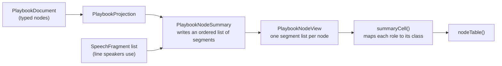

# Playbook Summary Segments

> [!NOTE]
> Status: **implemented**. A node's **summary** travels as labeled **segments** — each piece
> says what it is, what it means, and where it leads — so the Nodes table draws what the
> projection wrote instead of splitting one flattened line back apart on delimiters a writer
> can also type.

## Table of contents

- [Goal and scope](#goal-and-scope)
- [Ubiquitous language](#ubiquitous-language)
- [Functionality checklist](#functionality-checklist)
- [Why a role is needed](#why-a-role-is-needed)
- [Design](#design)
- [Interfaces and abstractions](#interfaces-and-abstractions)
- [Key design decisions](#key-design-decisions)
- [Error and boundary cases](#error-and-boundary-cases)
- [Integration](#integration)
- [Testability](#testability)
- [Open questions](#open-questions)

## Goal and scope

The [Nodes table](./Playbook%20Nodes%20Table.md) colors each node's **summary** in the report's own syntax colors: a
speaker purple, a command olive, a query red. To do that it takes the single string the
projection sent and splits it again, deciding where a writer's words stop and the table's
grammar begins.

That split can be wrong. Every delimiter it looks for — `" || "`, `"; "`, `", "`, `": "`,
`" IF "`, `{…}`, `<…>` — is a character a writer can type, so a label reading
`Go left || right` is read as two options where the script has one, and a writer's literal
`{hello}` is drawn as a query the game will answer.

This component removes the split. The projection composes a summary from parts it already
holds, so it sends those parts as **segments**: a short text and the **role** it plays. The
client maps a role to a class and draws the segment. Nothing is re-parsed, so no writer's words
can be mistaken for the table's grammar.

**In scope:**

- The summary's wire shape: an ordered list of segments on `PlaybookNodeView`.
- The projection that writes the segments, from the typed playbook model — including which
  speech characters are a real query and which the writer merely typed.
- The client that draws each segment by its role, draws a list as the list it is, explains a
  piece on hover, and offers a piece that names a node as a way to reach it.
- One small color change: a **truncated** row keeps the roles of the part it kept, where
  today it is drawn entirely plain (the client could not trust any part of a line it was
  re-parsing). Every other role draws exactly as it does today.

**Out of scope:**

- **The planned hover card** over a node reference, which will read the same segments.
- The playbook format, its schema, and `SpeechText`'s published flattening — the
  [Speech as Plain Text](../../runtime/Speech%20as%20Plain%20Text.md) contract this note
  consumes.

## Ubiquitous language

One concept, one name — here, in the code, and in both languages.

| Term | Meaning |
| --- | --- |
| **Segment** | A piece of a summary's text together with the role it plays. A summary is an ordered list of segments. |
| **Role** | What a segment is: a speaker, the writer's words, the table's grammar, a boundary, a command, a query, an absent marker, or a node the summary names. |
| **Summary** | The whole line a node reads as — the segments' text, joined end to end. |
| **Grammar** | The table's own words and punctuation: the keywords (`IF`, `THEN`, `ELSE`, `END`, `CONTINUE`, `DRAW 1 FROM`), the separators (colon, `⇒`), the boundaries a list divides on, and the cap's ellipsis. |
| **Boundary** | A segment that divides a summary's items, or opens its list. The client draws it as the break rather than as its punctuation. |
| **Introduction** | The pieces before a list's first boundary — the condition a list is subject to, the header a draw announces. They read on the cell's first line. |
| **Target** | The node a segment names, for a segment that can be followed: a branch arm's number, a divert's words, a menu option's label. |
| **Absent marker** | A name in angle brackets the report writes where a value-position is empty: `<no speech>`, `<no label>`. |
| **Drawn segment** | The client's own shape for a segment it has mapped — `SemanticSegment`, a text and a class. Distinct from the wire **segment**, which carries a role, not a class. |

"Segment" is chosen over "run" on purpose: the domain already spends "run" on a
playthrough (`DialogueDown.Runtime`, the runner), so a piece of text must not borrow it.
The word names a contiguous piece of a whole, and it collides with none of the compiler's
own words — `span` (source), `fragment` (speech), or `token` (highlighting).

## Functionality checklist

- [x] A node's summary is sent as an ordered list of segments.
- [x] Each segment carries a role the client can draw without reading its text.
- [x] The segments partition the summary: every character belongs to exactly one segment, and
      joining them rebuilds the line.
- [x] A writer's punctuation never changes a role: a label holding an option separator,
      a semicolon, a colon, a keyword, a brace, or a marker is one segment of the writer's
      words.
- [x] A real query is a `query` segment and a writer's literal braces are `plain`, because the
      projection reads the fragments rather than scanning the flattened text.
- [x] Every role draws with the class it draws today, except a truncated row, which now
      keeps the colors of the part it kept.
- [x] The cap still bounds a summary.
- [x] A list is drawn as the list it is: a menu's options and a control's commands become items,
      with the list's own marker in place of the boundary punctuation — bulleted when the items
      are alternatives, numbered when their order is meaning.
- [x] A list's introduction reads on the cell's first line, so a condition or a draw's header is
      not mistaken for the first item.
- [x] The cell's text is its lines joined, so search, sort, and copy still read every item.
- [x] A segment that names a node carries that node, and is drawn as a control that reveals it —
      including a menu's options and a random choice's arms, whose labels are the picks on offer.
- [x] A condition wears the query's role and the `?` the script marks it with, because a condition
      is the boolean member of the query family and only the running game can answer it.
- [x] A segment whose words do not carry its meaning explains itself on hover, in the shape the
      Dialogue Graph explains its routes in.
- [x] The client no longer splits a summary; `summary-runs.ts` and its tests are deleted.

## Why a role is needed

A choice whose second option is written `Go left || right` cannot be told from a choice with
three options by reading the line: the characters a writer typed are the same ones the table
uses to separate options.

```text
| # | Kind   | Summary                              | Leads to |
| - | ------ | ------------------------------------ | -------- |
| 4 | choice | Take the road \|\| Go left \|\| right | 30, 31   |
```

The same holds at every joint — a command argument holding a semicolon, a speaker name
holding a colon, a label holding a keyword, an option written `<no label>` — which is why the
projection labels each piece instead of the client reading the line back.

## Design



The projection already holds every part as it builds the line; today it throws the shape
away by joining them into a string. The change is to keep the shape.

### Roles

A segment's role is the class the client draws it with. The projection assigns each role where
it knows the part's job; nothing is inferred from characters.

| Role | Assigned to | Class today |
| --- | --- | --- |
| `speaker` | A line's speaker name, including the `<anonymous>` and `<unknown>` stand-ins, which stand where a name would | `.dd-sum-speaker` |
| `plain` | The writer's words: speech minus its queries, an option's label, a condition key | none (the cell's own color) |
| `keyword` | The table's words: `IF`, `THEN`, `ELSE`, `END`, `CONTINUE`, `DRAW 1 FROM n` | `.dd-sum-keyword` |
| `separator` | The table's punctuation that is not a break: the speaker's and the odds' colon, the divert arrow `⇒`, and the cap's ellipsis | `.dd-sum-separator` |
| `boundary` | The punctuation dividing a list's items, or the place a list opens, where it carries no text at all | none (drawn as the break) |
| `command` | A command in round brackets: `(fade in)`, `ShowBackground(tavern, firelit)` | `.dd-sum-command` |
| `query` | A `{Key}` written for a real `QueryFragment` in speech or odds | `.dd-sum-query` |
| `absent` | A value-position marker the report wrote: `<no speech>`, `<no label>` | `.dd-sum-absent` |
| `target` | A node the summary names: a branch arm's number, a divert's own words | none (drawn as the control that reveals it) |

The set is exactly today's `SummaryRole` union, so `SUMMARY_SEGMENT_CLASS` and `styles.css`
keep their selectors.

The roles stay coarse on purpose. Naming an option or a condition apart from the writer's
words would push structure into the summary, rebuilding the dialogue graph's shape inside a
payload whose job is to be read as one line. A client that wants the complete structure should
read the playbook itself; the summary stays a summary. The two roles beside the original five
are not structure: a `boundary` says where the summary's own lines break, and a `target`
carries the node a piece already names.

### Writing a summary as segments

Each node kind composes its segments the way it composes its string today, one part at a
time. A part that is the writer's words becomes the writer's whole text; the stand-ins are
segments of their own.

```text
segmentsOf(node, speakers):
    line          -> speaker(nameOf(line.speaker)) divider speechSegments(line.speech)
    control       -> items(commands, "; ") if there are any
                     otherwise  -> "⇒" divertWords | keyword("CONTINUE")
    choice        -> items(option per option, " || ")
    random-choice -> keyword("DRAW 1 FROM n") divider items(odds per arm, " || ")
    branch        -> keyword("IF") condition keyword("THEN") target, and so on
    end           -> keyword("END")

    # A node-level condition leads, exactly as the string leads today:
    keyword("IF") condition keyword("THEN") body

    # A list is its items, one to a boundary. The boundary opening the list carries no text,
    # so what comes before it introduces the list rather than being an item of it; a lone item
    # writes no boundary and reads as the line it is.
    items(items, between) -> [boundary("")] boundary(between) between items

    nameOf(index) -> the speaker's name; absent("<anonymous>") when unnamed;
                     absent("<unknown>") when the index is outside the list
    option        -> plain(label) | absent("<no label>"), plus keyword("IF") condition
                     when the option is guarded; every piece of the label carries the target

    # A condition is the boolean member of the query family, so it wears the query's role and the
    # `?` the script writes to mark a true-or-false read.
    condition(key)  -> query(key + "?")

    # A number that stands for a node is a way to reach it, so the piece carries the node too; the
    # odds of a random arm are the same kind of piece, because the arm they weigh leads somewhere.
    target(node)    -> target(node's number), carrying the node
    divertWords     -> target(the jump's own words), carrying the node it lands on

speechSegments(fragments):
    TextFragment        -> plain(text)
    QueryFragment       -> query(placeholder)
    StyledTextFragment  -> speechSegments(children)
    LinkFragment        -> speechSegments(label)
    ImageFragment       -> speechSegments(alt)
    LineBreakFragment   -> plain(" ")
    anything else       -> nothing          # the same fragments SpeechText drops

    # Adjacent plain segments merge, so a styled span's words read as one segment.
```

## Interfaces and abstractions

| Type | Responsibility | Collaborators |
| --- | --- | --- |
| `PlaybookSegmentView(string Text, string Role)` | One segment: a text and the role it plays, with a factory per role. Its own file. | `PlaybookNodeSummary`, `SummaryRoles` |
| `SummaryRoles` | The role names the wire carries, kept apart from the writing that uses them. | `PlaybookSegmentView` |
| `PlaybookNodeView(…, Segments)` | One node as the table shows it; gains the segments. | `PlaybookProjection` |
| `PlaybookNodeSummary.SegmentsOf(node, speakers)` | Writes a node's segments. Replaces the string-returning `Of`. | the playbook's node and edge models, `SpeechText.PlaceholderFor` |
| `PlaybookProjection.ToView` | Projects each node's segments. | `PlaybookNodeSummary` |
| `model.ts` — `PlaybookSegmentView`, `SummaryRole`, `SemanticCell.list` | The wire shape, the role union, and the list a cell draws when it is one. | `playbook-view.ts` |
| `summaryCell(node)` | Joins the segments for the cell's text, maps each role to its class, and groups a choice's options into lines. | `SUMMARY_SEGMENT_CLASS` |
| `drawList(td, cell, query)` | Draws a list cell, keeping the search highlight across its items. | `SemanticCell.list` |
| ~~`summary-runs.ts`~~ | **Deleted**: the grammar it re-parsed no longer exists on the wire. | — |

## Key design decisions

### DD1 — The projection assigns the roles, because it holds the parts

The split is not hard to *write*; it is impossible to write *correctly*, because the input
is text a writer controls. Moving it to the projection is not a performance change — it is
the only place the answer exists. The projection composes a summary from a `LineNode`, an
`OptionEdge`, and their fragments, so it knows which characters are the writer's and which
are its own; the client has only the finished line.

This is the same split the speaker and anchor tables already follow — the projection reads,
the client draws — and the same reason the planned hover card can show identical words
without a second implementation.

### DD2 — Speech becomes segments by reading the fragments, not by scanning its text

`SpeechText.Of` flattens a fragment list to one string, and by its own remarks that reading
is lossy and one-way: a `QueryFragment` becomes `{Key}`, but so do the characters `{`,
`Key`, and `}` when a writer types them. No scan of the flattened string can tell a real
query from typed braces — the issue lists literal braces as a trip — so the projection
walks the fragments instead and marks `query` only for a real `QueryFragment`.

Two ways to get that walk:

| Option | How | Tradeoff |
| --- | --- | --- |
| **Walk in the projection** (this note's choice) | `PlaybookNodeSummary` recurses over `SpeechFragment`: text and breaks to `plain`, a query to `query`, styled, link, and image by recursing, anything else dropped — the same ones `SpeechText` drops. | A second place knows which fragments contribute words, so a new fragment kind could be missed. A union-coverage test over the fragment kinds guards it, the pattern this repo already uses for node kinds. The published format library stays untouched. |
| **A seam on `SpeechText`** | The format library gains a public API that yields plain and query slices, and the string and the segments both come from it. | One source of truth for the flattening, at the cost of public API on a published library for one report's benefit. |

The walk is this note's choice: the guard is cheap, and it leaves the published library
untouched. The seam is worth revisiting only if a second consumer wants slices too.

### DD3 — The projection assigns a role; the client owns the class

The wire says `speaker`, not `dd-sum-speaker`. The role is a fact about the text; the class
is how this client happens to draw it. Keeping the class name in the payload would put a
CSS detail in the report's data and break the day a role is restyled. The mapping stays in
`SUMMARY_SEGMENT_CLASS`, where it is today.

### DD4 — The wire carries segments, and the client joins them for the cell's text

The row's cell needs one plain string: `SemanticCell.text`, which search matches and which
the search highlight is laid across the segments from. The tempting shape is to send that
string beside the segments, but the two can then disagree, and a disagreement is invisible —
the cell draws one text and highlights against another. Since the client is the only
consumer, it joins the segments itself:

```text
summaryCell(node):
    segments = node.segments.map(toDrawnSegment)
    text = segments.map(segment => segment.text).join("")
```

`segments` then concatenates to `text` by construction, which is exactly the invariant
`SemanticCell` already documents. No `summary` field, no second source of truth, and no
possible drift. (This differs from the issue's draft, which kept a joined `Summary`; the
reason to drop it is that the client can join, so the field can only add a way to be
wrong.)

### DD5 — The cap no longer degrades a truncated row to plain

Today the client draws a truncated summary as one plain segment: it cannot tell whether the cut
fell inside a command, a query, or the writer's words. With roles, it can — every segment before
the cut is known. So the projection keeps the roles of the kept part and marks the ellipsis
as a separator. The row is both bounded and still colored. This is the one intended color
change.

The algorithm, which is the fiddliest part of the change:

```text
capped(segments):
    budget = 200 characters, counted over the whole line — including the leading
             "IF key THEN " when the node carries a condition, as the line counts it today
    line = the segments' text joined
    if the line fits the budget, keep every segment whole
    cut = the last space in the line within the budget, or the budget when it holds none
    keep = the line's first `cut` characters, with trailing spaces trimmed
    re-slice the segments to `keep`, then append separator("…")
    every kept segment keeps its text and its role, so the partition still holds
```

The cut reads the joined line rather than walking the segments, because the boundary a reader sees
is a property of the words, not of where one role happens to end.

### DD6 — Delete the splitter rather than keep it as a fallback

A fallback splitter would be dead code the day it stopped being reachable, and terrifying
the day it became reachable again. The client's input is now always segments, so the correct
number of splitters is zero. (A missing `segments` would draw an empty cell — a visible
failure, not a silent re-parse; the payload and the client are built from the same source,
so a mismatch is a development-time accident, not a shipped one.)

### DD7 — A list is drawn as the list it is

The projection writes a list's items with a `boundary` between them: the punctuation a list
divides on, which is the table's own and never a writer's — a semicolon between commands, the
`||` between options. Because it is a role and not a character, the client is free to draw the
boundary as the break it is rather than as its punctuation. The cell therefore draws a menu's
options and a control's commands as list items, bulleted when the items are alternatives and
numbered when their order is meaning, and the cell's text joins its lines with a newline — so
search, sort, and copy still read every item, and the highlight still lands on the item that
holds the match.

A list can be subject to a condition, or announced by a draw's header, so the boundary that
opens the list carries no text at all: the pieces before it are the list's introduction and read
on the cell's first line. That is also why a lone item is written with no boundary — one item is
not a list, and a conditional line stays a line.

A branch's `IF`/`THEN`/`ELSE` pairing keeps its line: its arms are read together rather than one
at a time, and separating them would mean inventing a boundary the grammar does not have.

### DD8 — A piece that names a node carries that node

A branch arm's `12` and a divert's `⇒ Feel the hallway door` both stand for a node, and the
reader's next question is which one. Matching the number back against the table would be the
client reading the summary again — the thing this note exists to stop — so the projection puts
the node on the piece: a segment carries the node's id beside its text.

The client draws it the way it draws a way out anywhere else: a control that reveals the node in
the JSON, carrying the key that lights the node's row up on hover. The text stays whatever the
summary shows for the node — its number, or the words the writer gave the jump — so following a
piece never costs the reader the words they were reading.

**The role says what a piece is; the target says where it goes.** A branch's number and a
divert's words are `target` pieces, because naming a node is all they do. A menu's option and a
random arm are not: their words are the pick on offer or the odds it falls on, so the label keeps
its own role — `plain`, `query`, `absent` — and carries the target beside it. A piece that is
both keeps the meaning its role gave it and adds only that it can be followed, which is why a
label holding `{Gold}` explains the query before it offers the jump.

Making an arm's label followable is what keeps the rule honest: the Dialogue Graph draws an
option and a random arm as one kind of route, so a summary that let a reader follow a branch's
number but not the option they were about to pick would be teaching two rules for one idea.

### DD9 — What a piece means is the client's to say

`{Gold}` is a query only to a reader who has learned the script language, and `<no speech>` is a
stand-in only to a reader who has met one. The pieces that mean something explain themselves on
hover, in the shape the Dialogue Graph already explains its routes in: a name, a sentence, and —
for a piece that can be followed — what pressing it does. The client owns both halves, as it
owns the class a role draws in (DD3): the projection sends the role, and a reader who does not
need the explanation never sees it.

### DD10 — A condition is drawn as the query it is

A condition *is* a query. The guide calls it the third member of the family — one member inserts
a value, one weights a draw, and one reads true or false — so a condition key is a question only
the running game can answer, exactly like the `{Gold}` in a line of speech. The summary had been
drawing that key as the writer's plain words, which quietly claimed the report knew what the key
was worth.

So a condition wears the `query` role and carries the sigil the script marks it with:
`IF FoundKey? THEN 12`, `Brave the west road IF Alice.HasMap?`. The value members keep the braces
the reading convention gives them, so each member of the family reads in its own mark — and the
[Semantic Model tab](./Semantic%20Model%20Visualization%20Tab.md), which reconstructs the
source's own `"key"?` for a conditional jump, is no longer the only surface that says the key is
the game's.

The sigil is written after the key whatever the key holds, so a key that already ends in one
reads with two (`Rainy??`). That is the same awkwardness the value placeholder accepts for a key
carrying its own brace, and it is rare enough to accept here too.

## Error and boundary cases

| Case | Behavior |
| --- | --- |
| A label holding the option separator (`A \|\| B`) | One `plain` segment; the writer's separator is never a `separator` segment. |
| A command argument holding a semicolon or comma | One `command` segment for the whole `Name(args)`; the argument is not split. |
| A speaker name holding a colon | The whole name is the `speaker` segment; the divider is the one the projection placed. |
| A writer's literal braces in speech (`{hello}`, no query) | One `plain` segment: the projection marks `query` only for a real `QueryFragment`. |
| A real query in speech or odds (`{Gold}`) | A `query` segment, wherever it sits, including inside styled or linked words. |
| `<no speech>` or `<no label>` the projection wrote | An `absent` segment in the value position. |
| The same characters typed by a writer | Their words: a `plain` segment, never `absent`. |
| A line whose speaker index is outside the speaker list | The `<unknown>` stand-in as a `speaker` segment, as today. |
| A choice, random choice, or branch truncated by the cap | Segments before the cut keep their roles; a `separator` ellipsis ends the line. |
| A control with one command | No boundary is written, so it reads as the line it is. |
| A conditional command list | The condition's pieces come before the boundary that opens the list, so they introduce it rather than becoming its first item. |
| A random choice's header | `DRAW 1 FROM n` and its colon come before the opening boundary, for the same reason. |
| A `target` segment cut by the cap | It keeps the node it names, so the part that survived is still followable. |
| An option's guard condition | A `query` segment with no target: it is a question about the arm, not a way to it. |
| A condition key ending in the sigil (`Rainy?`) | The sigil is still appended: the key reads `Rainy??`, as the guide's escaping rule anticipates. |
| Two pieces with the same role but different nodes | Never merged into one, so a merged piece cannot answer for a node it does not name. |
| A node kind with no summary (an unknown kind) | An empty segment list; the cell draws an empty text. |

## Integration

- **`PlaybookReport.cs`** — `PlaybookNodeView` gains `Segments`. `PlaybookSegmentView` and
  `SummaryRoles` are files of their own, so a reader finds the shape and the vocabulary without
  scrolling the writer that uses them.
- **`SummaryRoles.cs`** / **`PlaybookSegmentView.cs`** — the vocabulary gains `boundary` and
  `target`, and a segment gains the `Target` node it may name: `Boundary`, `Opening`, and
  `LinkedTo` are the factories that write them.
- **`PlaybookNodeSummary.cs`** — `Of` is replaced by `SegmentsOf`, which returns the pieces; the
  speech walk and the cap live here. No string-returning form survives, because the cell's text is
  its pieces joined.
- **`PlaybookProjection.cs`** — passes `SegmentsOf(...)` into the view.
- **`model.ts`** — gains `PlaybookSegmentView` and the `SummaryRole` union, and `segments` on
  `PlaybookNodeView`.
- **`playbook-view.ts`** — `summaryCell` joins the segments for `text` and maps each role to its
  class; `summaryList` splits them at the boundaries and keeps the introduction before the list;
  `drawnSegment` carries a target as the jump it is and a role — or a target's node kind — as
  what the piece means. `SUMMARY_SEGMENT_CLASS` stays, keyed by the union now in `model.ts`.
- **`model.ts`** / **`semantic-table.ts`** — the drawn shape is renamed with the concept:
  `SemanticSegment` replaces `SemanticRun`, and a cell carries `segments`, so "run"
  leaves the feature's vocabulary.
- **`summary-runs.ts`**, **`summary-runs.test.ts`** — deleted.
- **`semantic-table.ts`** — `pieceElement` draws a piece that names a node as the control a
  whole-cell jump already is, and a piece with something to say as a `data-tip` span;
  `drawList` numbers or bullets the list, reading its introduction first.
- **`tooltips.ts`** — `initPieceTooltips` delegates over the pieces' `data-tip`, the same
  machinery the graph's nodes and routes use.
- **`styles.css`** — the roles keep their selectors, and the pieces that explain themselves wear
  the graph's ask-me pointer; a numbered list gets the room its wider markers need.
- **`web/dist/report.html`** — rebuilt and committed, as any `web/src` change requires.
- **No format change.** The playbook document and its schema are untouched; only the
  report's own payload changes shape.

## Testability

| Level | Covers |
| --- | --- |
| xUnit — `PlaybookNodeSummary` | One test per node kind, asserting the segments' text *and* roles; a writer's separator, semicolon, colon, keyword, and marker each stay one `plain` segment; the stand-ins; the cap. |
| xUnit — queries | A real `QueryFragment` is a `query` segment, including inside styled and linked words; a writer's literal `{hello}` is `plain`. |
| xUnit — the line | A node's pieces join to the exact pseudocode line the table shows, asserted per kind, so the joined text is pinned where the pieces are built. |
| xUnit — the cap | A cut inside the crossing segment, a cut at a segment boundary, a crossing segment with no space, and the leading condition counting against the budget. |
| xUnit — union coverage | Reflecting over the node union, every registered kind yields segments; and over the fragment union, the speech walk handles every kind. |
| xUnit — boundaries | A control with two commands and a menu with two options each write an opening boundary and one between; a lone command writes none; a conditional control keeps its condition before the opening boundary. |
| xUnit — targets | A branch's arms, a divert, a menu's options (labeled and unlabeled), and a random choice's odds each name their node; a guard does not; a piece cut by the cap still names its node. |
| xUnit — conditions | A condition is a `query` segment carrying the script's `?`, wherever it sits: a branch arm, a node-level prefix, or an option's guard; a key ending in the sigil reads with two. |
| Vitest — `playbook-view` | A cell joins its segments to its text and draws each role in its class; a label holding a separator stays one plain segment; a menu is bulleted and a command list numbered, with the introduction on the first line and a menu of one as a line; a tip carries what a role means; a target is a button carrying the jump, the reference key, and what it means — and a piece that is both keeps its role's meaning first; every role in `SummaryRole` is a key of `SUMMARY_SEGMENT_CLASS`. |
| Vitest — `semantic-table` | A list cell draws each item as an item with the break as the whitespace between them, numbers it when its order means, reads its introduction first, and marks a search match inside whichever line holds it; a target piece is a control carrying the jump. |
| Playwright | The Nodes table renders for a real playbook — a menu bulleted (each option a jump), a command list numbered, a query explained on hover, an arm's number followed to the node it names — and the tab keeps its accessibility checks green. |

Moving the cases off `summary-runs.test.ts` and onto `PlaybookNodeSummaryTests` is the
point: they are asserted against real nodes and fragments rather than against strings the
test itself composed.

## Open questions

None outstanding. The wire carries the pieces alone — the client joins them for the cell's
text — and the walk over the speech fragments lives in the projection, guarded by a
union-coverage test.
