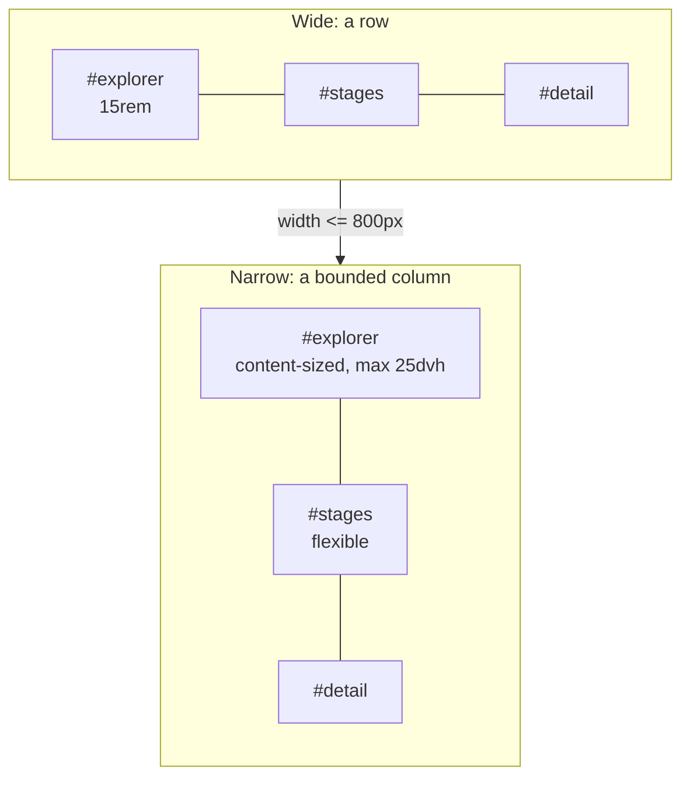
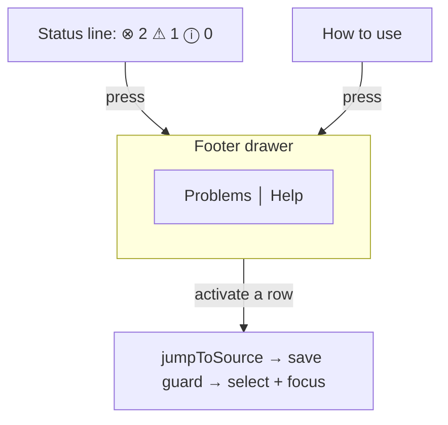

# Chrome and Layout

> [!NOTE]
> Status: **implemented**. The frame around every report tab: Zen mode, the narrow-screen layout,
> and the footer drawer with its Problems panel. It applies to served reports and static exports
> alike.

## Table of contents

- [Goal and scope](#goal-and-scope)
- [Ubiquitous language](#ubiquitous-language)
- [Layout](#layout)
- [Zen](#zen)
- [Narrow screens](#narrow-screens)
- [Problems panel](#problems-panel)
- [Error and boundary cases](#error-and-boundary-cases)
- [Testability](#testability)

## Goal and scope

The report's tabs are Config, Source, the five compiler stages (Markdown AST, Dialogue AST,
Desugared AST, Semantic Model, Dialogue Graph), and Playbook. This note owns what surrounds them:
how much chrome is visible, how the frame fits a small window, and how diagnostics are listed. It
does not change what any tab renders. The Explorer's own toggle is in [Explorer](./Explorer.md).

## Ubiquitous language

| Term | Meaning |
| --- | --- |
| **Chrome** | The header and tab row, the status footer, and the banner. |
| **Focus mode** | How much is hidden: `normal`, `maximized` (full screen), or `zen`. |
| **Secondary panel** | The pane beside a tab's primary content: preview, speakers, inspector, or tables. |
| **Footer drawer** | The bottom panel opened from the status line, with **Problems** and **Help** tabs. |

## Layout

The tab row is one `.tabbar`: a pinned Files slot, the scrolling stage nav between `<` and `>`
arrows, and a pinned `.tabbar-actions` cluster holding Zen and maximize.

## Zen

<kbd>z</kbd> enters Zen; <kbd>z</kbd>, <kbd>f</kbd>, or <kbd>Esc</kbd> leaves it. Zen hides the
chrome, the Explorer, and the active tab's secondary panel:

| Tab | Alone in Zen | Stepped aside |
| --- | --- | --- |
| Source | The editor | The rendered preview |
| Config | The TOML editor | The configured-speakers column |
| Stage graphs | The graph | The node inspector |
| Semantic Model | The scene tree | The tables |
| Playbook | The playbook JSON | The tables |

### D1 — Zen is a presentation class, never a state change

Zen is `body.zen`, and CSS hides the panels. It never calls the panels' collapse controllers,
because those persist to `localStorage`: driving them would write a transient posture into the
reader's saved layout, and restoring them would need a per-panel state machine. With a class,
leaving Zen needs no restore logic — the reader's own collapse choices reappear untouched. The cost
is Zen CSS that mirrors each panel's collapsed rule, which is declarative and cannot desync.

Hiding with `display: none` does not move focus, and the collapse toggles sit inside the hidden
dividers, so entering Zen blurs a focused element inside a hidden region. Otherwise Enter could
still collapse, and persist, an invisible panel.

### D2 — One focus-mode controller

Zen and full screen are one concern at two depths, so `initFullscreen` holds a single `FocusMode`
rather than two booleans that could disagree. Zen also sets the maximized class, reusing the
chrome-hiding rules and the corner exit chip. Either key leaves focus mode entirely: one press
always gets the reader back.

### D3 — Hide neighbors, keep the content's tools

The graph keeps its legend and zoom controls; the editor keeps its gutter and diagnostics. They
are instruments for reading the primary content, not competing panels.

### D4 — A tab-row button beside maximize

The Zen button uses the `target` codicon VS Code shows for its own Zen Mode, and reads engaged
(`aria-pressed`, mode accent) only in Zen. <kbd>z</kbd> is ignored while typing and with a
modifier, so undo and the letter itself are never taken.

## Narrow screens

At a phone viewport a naive column layout starves the stage: an unbounded help panel, a fixed
`15rem` Explorer height, and a wrapping tab row leave the stage about a quarter of the window.

### D5 — The tab row scrolls; it does not collapse into a menu

The tabs are the pipeline, and their order is information. A menu would hide it and cost two taps
per stage. The row is one horizontal scroll strip (`nowrap`, `overflow-x: auto`, scroll snapping,
an edge fade), and activating a tab scrolls it into view. Three pixels of vertical padding with a
matching negative margin keep the focus ring, which is drawn outside the tab's box, from being
clipped.

### D6 — Arrows, because not every mouse scrolls sideways

`<` and `>` flank the strip. They hide when the row fits, and the arrow at a spent end is disabled
rather than removed, so the other one never moves under the pointer. The arrows are settled before
the active tab is revealed; otherwise a newly shown arrow clips the tab.

### D7 — Pinned controls leave the nav

Zen and maximize sit in `.tabbar-actions`, a flex sibling of the nav, so the tabs scroll under
them and no hand-kept `right:` offsets are needed.

### D8 — Stacked panels are bounded by the viewport

`15rem` is a fine width and a poor height. Stacked, the Explorer is content-sized with
`max-height: 25dvh`, so a small project takes little room and a large one scrolls inside a quarter
of the window. The shell uses `100dvh`, so a mobile URL bar does not make it jump, and `body` is
`overflow: hidden`, because every pane owns its own scroll.

### D9 — The help floats when it cannot fit

The drawer is capped at `50dvh` with internal scroll, and the footer yields height before the stage
does (its own `min-height: 0`; the status line never shrinks). Below `height: 640px` the drawer
floats over the stage, anchored above the status line, with a close button that returns focus to
the control that opened it. A full modal would hide the editor the reader is cross-checking.

### D10 — Narrow defaults never touch stored preferences

The narrow layout only bounds how much room an open panel may take; it never toggles one. Resizing
a window therefore cannot overwrite a collapse choice the reader made on a wide screen.

## Problems panel

The status line always shows a severity summary (errors, warnings, infos, including `0 0 0`), and
pressing it opens the drawer's **Problems** tab: every diagnostic as a row with severity, message,
code, and `Ln, Col`.

### D11 — The status line is the entry point

It is the one piece of chrome on every tab, so the summary there is what makes diagnostics visible
from the graph tabs at all.

### D12 — One tabbed drawer, not two competing disclosures

Problems and Help share one drawer, so the height bound, internal scroll, floating rule, and focus
return exist once.

### D13 — A row jumps through the save-safe path

Activating a row calls the same `jumpToSource` the node inspector uses, so Auto saves and Manual
prompts before the tab changes. The range converts to offsets with the same `positionToOffset` the
editor overlay uses, so the list and the squiggle cannot disagree.

### D14 — A flat list in document order

A report compiles one script, so a file header would be a constant row. Rows are ordered by
position, and same-position rows follow the shared canonical order in
[Diagnostics Overlay](../editor/Diagnostics%20Overlay.md#d8--one-canonical-order-for-every-surface).
A fixable row leads with a lightbulb; see
[Diagnostic Quick Fixes](../editor/Diagnostic%20Quick%20Fixes.md).

### D15 — One fan-out point

Diagnostics arrive on first render and on every save or hot reload. Both go through one apply step
that updates the editor overlay, the list, and the counts together, so a fixed squiggle cannot leave
a stale count behind.

## Error and boundary cases

| Case | Behavior |
| --- | --- |
| <kbd>z</kbd> from full screen | Deepens into Zen. |
| <kbd>Esc</kbd> already handled by a widget | Yields; the editor's search closes first. |
| Reload while in Zen | Returns to normal: Zen is a posture, not a saved layout. |
| A tab with no secondary panel | Zen hides only the chrome. |
| Narrow window, row already fits | No arrows. |
| Short landscape window with help open | The drawer floats; the stage keeps its height; nothing scrolls the page. |
| Clean compile | The summary reads `0 0 0` and the list says so. |

## Testability

Layout faults only exist after a browser lays out the page, so each narrow-screen fault has a
Playwright assertion on measured geometry at a phone viewport, each confirmed to fail without its
fix: one tab row, pinned controls inside it, a stage budget with help open, visible focus rings,
arrow visibility and disabling, floating help, and no page scroll. The scroll-into-view check
reloads rather than clicks, because a Playwright click scrolls its target into view by itself.

- **Unit:** focus-mode transitions, key guards, button state, and focus release
  (`fullscreen.test.ts`); counts, rendering, ordering, activation, drawer tabs, and sync
  (`problems-panel.test.ts`, `footer-drawer.test.ts`).
- **Browser:** Zen on each tab hides the right panel, a reader's collapse choice survives a Zen
  round trip, and Zen hides the Explorer on a served report.
