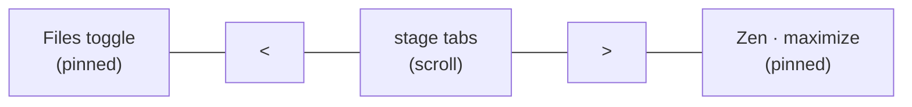
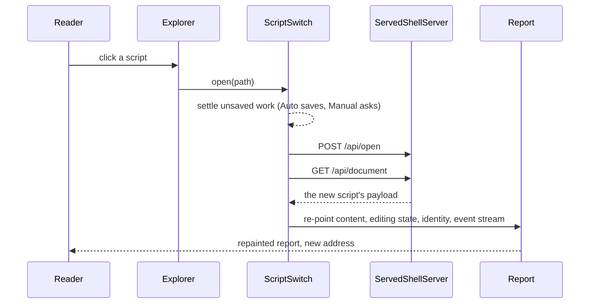

# Explorer

> [!NOTE]
> Status: **implemented**. A collapsible file tree beside every served report, summoned by a pinned
> Files toggle in the tab bar. Opening a script from it replaces the report's contents in place
> rather than reloading the page.

## Table of contents

- [Goal and scope](#goal-and-scope)
- [Ubiquitous language](#ubiquitous-language)
- [Writer-facing behavior](#writer-facing-behavior)
- [Architecture](#architecture)
- [Interfaces and responsibilities](#interfaces-and-responsibilities)
- [Key design decisions](#key-design-decisions)
- [Error and boundary cases](#error-and-boundary-cases)
- [Testability](#testability)
- [Out of scope](#out-of-scope)

## Goal and scope

A writer working on one script should see the rest of the project and move between scripts
without losing their place. The Explorer is that view: a VS Code-style tree over the browse root,
present in every served report and absent from the static export.

The server routes it calls — browse, open, create, create-folder, rename — are owned by the
[Served Shell](./Served%20Shell.md#http-surface). This note owns the client: the tree, its toggle,
and switching scripts.

## Ubiquitous language

The model and code use the compiler's vocabulary (`project`, `script`); the UI says "Explorer" and
"Files".

| Term | Meaning |
| --- | --- |
| **Project** | The browse root plus the active script's place in it (`Report.project`, with an optional `activePath`). Its presence is what turns the sidebar on. |
| **Active script** | The script the server serves and the report shows; highlighted in the tree. |
| **Switch** | Opening a different script into the report the reader already has. |
| **Reload** | The active script changed on disk underneath the reader. |
| **Adopt** | Take a script's on-disk text as the editor's clean baseline. |

**A switch is not a reload.** Both replace the document a report shows, but a reload happens
*to* the reader and, in Edit, becomes a conflict; a switch is something the reader asked for, after
their unsaved work was already settled.

## Writer-facing behavior

- The tree lists folders and `.dialogue.md` scripts under the root. A folder loads its children on
  first expand. The active script is highlighted and its folders opened to reveal it.
- Clicking a script opens it; clicking a folder toggles it. A cross-file link in the Source preview
  (`[Meet Bob](../chapter-02.dialogue.md#meet-bob)`) opens its target script the same way.
- The project's `dialogue.toml` is pinned above the tree and opens the Config tab.
- The header toolbar has **New file**, **New folder**, **Refresh**, and **Collapse folders**;
  right-click menus on rows offer New File, New Folder, and Rename. Creating and renaming are Edit
  actions: in View they stay visible, disabled, with a tip to switch to Edit.
- **New file** takes an inline name, appends `.dialogue.md` if missing, and opens the new script in
  Edit. A name that exists offers to open that file instead.
- **Rename** moves a script or folder; when the move carries the open script, the report follows
  it to the new path.
- The **Files** toggle at the leading edge of the tab bar shows and hides the tree.

## Architecture

A switch re-points four things; missing any one leaves the report half on the old script:

| What | Means | Done by |
| --- | --- | --- |
| **Content** | Source, stages, diagnostics, semantic tokens, reserved targets | The same repaint hot reload uses |
| **Editing state** | A clean baseline in both modes, and no undo history from the previous script | `adoptSwitch`, `openDocument` |
| **Identity** | The tree's mark, the status-bar path, `project.activePath`, the address bar | `setActiveScript`, `setPath`, `pushState` |
| **Event stream** | Which document hot reload reports on | `resubscribe` |

## Interfaces and responsibilities

| Type | Responsibility |
| --- | --- |
| `initExplorer` → `ExplorerHandle` | Build the lazy tree over `ExplorerPorts` (`browse`, `openScript`, `create`, `createFolder`, `rename`, `openConfig`, `confirm`); `setActiveScript` re-marks and reveals; `setEditable` gates writing actions. |
| `createExplorerToggle` | The Files button: a disclosure (`aria-expanded`, `aria-controls`), named by `EXPLORER_PANEL_NAME`. |
| `initCollapsiblePanel` | The shared panel helper, given a starting state and a caller-supplied control. |
| `createScriptSwitch` | The whole switch: settle work, open, fetch, re-point, move history. `open` adds a history entry; `restore` applies Back or Forward. |
| `ModeController.switchDocument` | Apply an opened script in either mode. Distinct from `onReload`, which raises a conflict in Edit. |
| `LiveEditController.adoptSwitch` | Take the new script as a clean baseline, clearing dirty and conflict and invalidating a save in flight. |
| `openDocument` / `setDocumentContent` | Show a different document with fresh undo history / replace the same document's text keeping it. |
| `ServerEventWatch.resubscribe` | Reconnect the event stream to the new script. |
| `initEmptyShell` | The no-document entry: the Explorer plus a "No script open" call to action whose **New dialogue file** button runs the tree's own New File. |

`ScriptSwitchPorts` injects `fetch`, `history`, `location`, and the report, so the switch is unit
tested without a server.

## Key design decisions

### D1 — Server-backed, reusing `BrowseRoot`

The tree calls the same root-confined endpoints the server uses everywhere; there is no second
filesystem path. The browser File System Access API was rejected: Chromium-only, a permission
gesture, and a second confinement story beside the compiler's.

### D2 — A lazy tree over one endpoint

Each folder fetches its own `BrowseListing` from `GET /api/browse?path=` on first expand. There is
no whole-project walk, and "load a folder's children" needs no new route.

### D3 — A sidebar, not a tab

The Explorer is context kept open *while* reading a stage, so it is a left panel built from the
same collapsible-panel and resizer helpers as the inspector on the right, not a mutually exclusive
tab.

### D4 — A pinned Files toggle, shut by default when a script is open

The tree costs `15rem` of width that is usually wanted once. It therefore starts **shut** when a
script is open, and **open** in the empty shell, where it is the only way forward. An explicit
choice is remembered, as a shown/hidden flag, in both shells.

- The toggle lives in its own slot beside the stage nav, never inside it, so the stage row's
  horizontal scroll can never carry it out of reach.
- It is a glyph (Feather `file-text`, the Config gear's family and size), because the row's width
  belongs to the stages; its tooltip and accessible name come from one constant.
- It is a disclosure, not a mode: `aria-expanded`, a tinted bed with an accent outline when open,
  and never the stage underline, which means "the stage you are on".
- Its box fills the row's height for a comfortable target, with the glyph seated on the same line
  as the Zen and maximize icons.
- An activity bar was rejected: a permanent column to reclaim `15rem`, holding one icon.
- The divider still resizes the panel; only the toggle hides it.

### D5 — Opening a script repaints in place

A page load discarded the report the reader was looking at even though only the served document
changed. The switch keeps the window: no white flash, and the **active tab survives**, so a reader
comparing two scripts' graphs is not sent back to Source on every click. Scroll position and graph
zoom belong to a document and reset with it.

| Warm, loopback, macOS | Median |
| --- | --- |
| Loading the whole page | 160 ms |
| In place | 77 ms (of which ~40 ms is in-page) |

### D6 — Undo belongs to one document

Replacing text has two meanings. Reverting the same file (a reload, a discard) stays undoable.
Opening a different file must not be: undoing into another script's text would leave it in this
buffer, and the next save would write it to the wrong path. `openDocument` clears the history by
removing and re-adding the history extension, because reconfiguring to a new `history()` keeps the
old entries.

### D7 — History follows the switch, and Back lands in View

The address bar moves with `pushState`, and `popstate` opens the script the entry names; the first
script is recorded with `replaceState` so Back reaches it. `/r/<path>` is a real server route, so a
reload at any point shows the script the address names. Back lands in **View**, even from Edit:
Back is navigation, not a request to edit.

### D8 — Switching respects the save mode

Auto saves pending work silently before switching; Manual asks to save or discard, because
choosing Manual is choosing when content is written. This is the same guard as every other
navigation — see [Live Edit and Autosave](./Live%20Edit%20and%20Autosave.md#d9--auto-navigation-saves-first-manual-navigation-asks).

## Error and boundary cases

| Case | Behavior |
| --- | --- |
| Manual, reader cancels the prompt | No switch; the address bar does not move. |
| The server cannot open the script | A banner; the reader stays on the current script. |
| A failure after the server has switched | The new script's page is loaded instead: slower, never wrong. |
| The target script has a different `dialogue.toml` | A full page load, because the page wired its editors and panes from its config. |
| Creating a script | A full page load, for the same reason. |
| Two switches in quick succession | The later wins; a slow earlier payload is dropped. |
| The payload names a different active script | Treated as a lost race and loaded as a whole page. |
| Back refused over unsaved work | The address bar is put back on the script still on screen. |
| Back to a deleted script | The same missing-document banner a page load would show. |
| Path escapes the root, or a vanished script | Not found; the tree refreshes its listing. |
| Empty root | An empty-tree hint, with New file still available. |
| Narrow window | The tree stacks above the stage, capped at a quarter of the height. |
| Zen | The tree, its divider, and the toggle all hide; leaving Zen restores them. |
| Static export | No `project`, so no Explorer and no toggle; the slot takes no room. |

## Testability

- **Unit (Vitest):** the tree against injected ports — lazy expand, active highlight and reveal,
  open, create rules, rename carrying the active script, empty root; the toggle's engaged state and
  the panel helper's starting state; the switch sequence (supersession, every fallback, history);
  `adoptSwitch` from clean, conflicted, and saving states; `openDocument` against real editor
  commands.
- **Browser, static:** the toggle keeps its place when the stage row scrolls, is gone in Zen, and
  the export carries none; an accessibility scan of the tab bar in both states.
- **Browser, live:** expand, open, create, and rename over a temp tree. The script-switch spec owns
  its own server, because a switch changes the server's active document. It sets a value on
  `window` to tell a switch from a page load, and checks that value is gone after a real reload so
  the check cannot pass vacuously.

## Out of scope

- A browsable project snapshot in the static export.
- Validating a cross-file link's anchor: the link opens the file; the anchor is the compiler's
  concern ([Cross-File Jump Resolution](../../language/Cross-File%20Jump%20Resolution.md)).
