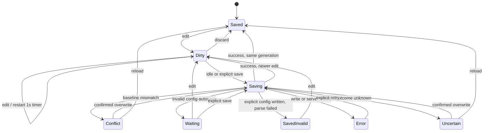

# Live Edit and Autosave

> [!NOTE]
> Status: **implemented**. In Edit, the Source tab is an editor whose buffer the session owns:
> the preview follows every keystroke, Save writes the file and recompiles the stages, and an
> Auto save mode saves after one second idle, without ever overwriting an external change silently.

## Table of contents

- [Goal and scope](#goal-and-scope)
- [Ubiquitous language](#ubiquitous-language)
- [Writer experience](#writer-experience)
- [State and flow](#state-and-flow)
- [Interfaces and responsibilities](#interfaces-and-responsibilities)
- [Key design decisions](#key-design-decisions)
- [Error and boundary cases](#error-and-boundary-cases)
- [Testability](#testability)
- [Out of scope](#out-of-scope)

## Goal and scope

Close the write loop inside the report: type, see the preview, save, see the compiled stages. The
same controller serves the dialogue source and the Config tab's `dialogue.toml`.

The server side (routes, watching, the View ⇄ Edit toggle) belongs to the
[Served Shell](./Served%20Shell.md). This note owns the buffer and the save state machine.

## Ubiquitous language

| Term | Meaning |
| --- | --- |
| **Buffer** | The editor's current text, which may differ from the file on disk. |
| **Saved baseline** | The exact text last confirmed on disk for this document. |
| **Dirty** | The buffer differs from the saved baseline. |
| **Save mode** | `Auto` or `Manual`: when a dirty buffer is scheduled to save. |
| **Explicit save** | The Save button or <kbd>⌘/Ctrl-S</kbd>; immediate in either mode. |
| **Idle save** | An Auto save after 1,000 ms without another edit. |
| **Edit generation** | A number that increases on every buffer change. |
| **Conflict** | The disk no longer matches the saved baseline; automatic saves pause. |
| **Uncertain** | A save may have written, but no response said so; automatic saves pause. |
| **Saved — invalid TOML** | Config text is on disk (not dirty) but does not parse; the last valid report stays marked stale. |

## Writer experience

In Edit the status bar reads:

```text
[ Auto | Manual ]   Unsaved / Saving… / Saved / Conflict …   Discard   Save
```

- **Preview as you type.** Each edit re-renders the Markdown preview in the browser with no
  server call. The stage tabs change only on save.
- **Save** (button, or <kbd>⌘/Ctrl-S</kbd> from any tab, which also blocks the browser's
  save-page dialog) writes the buffer and returns the recompiled report, applied in place without
  touching the editor text or cursor.
- **Dirty** shows as a dot on the tab; `beforeunload` warns while dirty or saving.
- **Auto** is the default for Source; **Manual** is the default for Config, because TOML is often
  invalid mid-edit. Each choice persists per document type.
- **Conflict** appears when the file changes on disk under Edit. The writer picks **Reload from
  disk** or a confirmed overwrite.
- The status line is `aria-live="polite"`, so automatic saves are announced.

Editing aids (in Edit unless noted):

| Aid | Keys |
| --- | --- |
| Search, heading folding, bracket match, multi-cursor (every mode) | <kbd>⌘/Ctrl-F</kbd>, gutter |
| Bold, italic, link | <kbd>⌘/Ctrl-B</kbd>, <kbd>⌘/Ctrl-I</kbd>, <kbd>⌘/Ctrl-K</kbd> |
| Quote / unquote the selected lines | <kbd>⌘/Ctrl-.</kbd>, <kbd>⌘/Ctrl-Shift-.</kbd> |
| Auto-close and wrap brackets, quotes, backticks, emphasis | type `*`, `_`, `` ` `` over a selection |
| Right-click surround menu | bold, italic, strikethrough, quote, unquote |
| Smart Tab | indent at line start or across lines, two spaces mid-line; <kbd>Esc</kbd> leaves the editor |

## State and flow



## Interfaces and responsibilities

| Type | Responsibility |
| --- | --- |
| `createLiveEdit` (`live-edit.ts`) | One controller per document: buffer, baseline, generation, idle timer, single-flight save, conflict and error state, discard, and flush before navigation. |
| `LiveEditPorts.save` | Submits a `SaveRequest` and returns a typed `SaveOutcome`: `saved`, `saved-invalid`, `invalid-auto`, `conflict`, `uncertain`, or `failure`. A transport exception becomes Uncertain. |
| `live-edit-ui.ts` | The capsule, status, Save and Discard; `IDLE_DELAY_MS = 1000`. |
| `save-mode.ts` | Per-type preferences in cookies `dd-save-mode-source` and `dd-save-mode-config`. |
| `view-edit.ts` | The mode controller; routes pushes and problems to the right document's controller. |
| `LiveSession` (.NET) | Validates Config autosaves, compares the expected baseline, writes through `AtomicFile`, recompiles, and returns the outcome. |
| `AtomicFile` (.NET) | Staged, atomic, compare-and-swap writes under a per-path lock. |

A save request carries the source, the target (document or config), the validation policy
(`require-valid` or `allow-invalid`), the expected baseline, and the conflict policy
(`check-baseline` or `overwrite`). Why it saves — idle, explicit, navigation — stays client-side.
Every negotiated outcome returns `200` with an `outcome` field; `400` means a real write error.

## Key design decisions

### D1 — The editor is one CodeMirror instance in every mode

The Source tab is a CodeMirror 6 editor in View and Edit alike; `editable` is a flag, set through
the compartment described in the [Served Shell](./Served%20Shell.md#d3--view-and-edit-are-a-client-toggle-over-one-server).
Read-only uses the `readOnly` facet rather than disabling the editor, so the pane stays
focusable, selectable, and copyable. Colors come from `--md-*` CSS variables, so the editor follows
the theme toggle live.

### D2 — The preview is local; the stages recompile on save

Re-rendering Markdown is cheap and local, so it runs on every edit. Compiling is the server's
work, so it runs on save, and the save response carries the fresh stages: there is no separate
compile request. Graph nodes are edited by jumping to their span in this editor, so there is one
buffer, one dirty state, and one Save.

### D3 — Editor and preview scroll together, anchored on Markdown blocks

Scrolling either pane scrolls the other. Each top-level Markdown block in the editor (paragraph,
list, quote, heading, rule, code block) pairs by position and type with the matching preview
child, and the position interpolates linearly between those anchors. Front matter is excluded from
the body anchors. When the block sequences disagree, sync falls back to headings matched by slug,
then to a proportional map. The pane being scrolled leads for a short window, and the follower's
scroll is `instant`, so the two cannot drive each other. `mapScroll` and `matchAnchorTops` are pure
functions.

### D4 — Auto saves on a trailing one-second debounce

Each edit restarts one 1,000 ms timer — the same default as VS Code Web. Throttling would write
while the writer is still typing. Explicit Save cancels the timer and saves at once in either mode,
and stays the recovery path after a failure.

### D5 — Save modes persist per document type, in a cookie

Source and Config have different safe defaults, so there are two preferences. They live in
host-scoped cookies (`SameSite=Strict`, long `Max-Age`) rather than `localStorage`: each run binds
a new port, and `localStorage` is keyed by host **and** port, while cookies are keyed by host.
Switching to Manual cancels a pending idle timer and queued automatic saves. Switching to Auto
schedules a save only from an ordinary Dirty state; a paused state stays paused.

### D6 — Saves are single-flight and generation-safe

Only one save runs at a time. A save captures the source and generation. When it returns:

- the saved baseline always advances to what reached disk;
- only a response for the latest generation may clear dirty, apply the report, or show Saved;
- Auto schedules one follow-up for newer text.

One queued slot follows fixed rules: a newer generation replaces an older one; for the same
generation an explicit or navigation save replaces Auto, and a stronger server policy
(`allow-invalid`, `overwrite`) replaces a weaker one. A replaced caller settles `superseded` and
re-reads the controller. An identical request shares the in-flight promise. Conflict, Error, and
Uncertain clear the queue.

### D7 — Config Auto validates before writing

An explicit Config save writes the text even when it does not parse, then reports **Saved —
invalid TOML** and marks the last valid report stale; a page reload restores that state from the
payload. Auto is unattended, so it validates first: invalid TOML writes nothing and enters
**Waiting** until the next edit.

### D8 — Saves are optimistic, not last-write-wins

Every non-forced save carries the baseline it expects. The server:

1. returns success without writing when the disk already equals the request (a lost response);
2. otherwise returns `conflict` and writes nothing when the disk differs from the baseline;
3. otherwise writes through `AtomicFile`.

`AtomicFile` stages the bytes in a temp file beside the target and replaces it atomically,
capturing the displaced content. If that content differs from the expected baseline — another
program wrote in the window — it rolls the external content back and reports a conflict. If the
target changed again during the rollback, it leaves both versions on disk and reports `uncertain`.
A per-path lock serializes this process's own saves, and a create uses a no-overwrite move. A
reader never sees a partial file.

A save suppresses its own watcher event with a one-shot token, so a later external change back to
the same text (A→B→A) still reloads. A disk-change epoch and a save epoch make any response that
returns after an external change, or a reload older than a newer save, settle as stale.

### D9 — Auto navigation saves first; Manual navigation asks

Tab changes, node selection, opening another script, and Edit → View go through one asynchronous
guard. Auto saves the latest generation, awaits it, and then continues. Manual keeps the
save-or-discard prompt. Only the latest navigation request survives; a paused state (Waiting,
Error, Conflict, Uncertain) keeps the reader in place, and recovery never replays an old move.

### D10 — No save on unload and no retry loop

Browsers cannot await a network write during unload, so `beforeunload` only warns. A failed save
stays dirty and waits for an edit or explicit Save, rather than retrying against a dead server or a
permission error.

## Error and boundary cases

| Case | Behavior |
| --- | --- |
| Source with compile errors | Saves normally; diagnostics and the stages it reached refresh. |
| Edit while a save is in flight | Stays dirty; the stale report is discarded; Auto queues one follow-up. |
| External change in Edit | Conflict; the buffer is never replaced. In View the report re-syncs and the controller adopts the disk text as its baseline. |
| External change before the idle timer | The timer is cancelled; Conflict; nothing is written. |
| Script or config deleted, or unreadable | The `problem` push names its target and enters that controller's conflict path; an autosave cannot recreate the file silently. |
| Reload after deletion | Stays Conflict; a confirmed overwrite may recreate the file. |
| Discard | Restores the saved baseline and its state; disabled while saving, unavailable in Conflict or Uncertain. |
| Config does not exist yet | No Config controller. Create writes the starter template as the baseline; a pre-existing file is adopted without overwriting, valid or invalid. |
| Lost save response | Uncertain; reconciling by reload or retrying the same snapshot succeeds idempotently. |
| Cookies blocked | Each document type uses its default mode. |

## Testability

- **Controller (Vitest, fake timers, controllable promises):** debounce reset, single flight,
  queue precedence, superseded callers, stale responses, baseline advancement, every paused state,
  mode switches, navigation intent, and discard.
- **Session and `AtomicFile` (.NET):** expected-baseline success and conflict, forced overwrite,
  idempotent recovery, Config validate-before-write, create-or-adopt, self-write suppression, and
  the compare-and-swap races through a threaded replace hook.
- **Scroll sync:** `mapScroll` and `matchAnchorTops` unit tests; a live spec scrolls both ways over
  front matter and uneven blocks.
- **Browser (Playwright, live):** Auto saves after idle, Config Manual does not, Save from a stage
  tab, an external edit raises Conflict, and `beforeunload` guards a dirty buffer.

## Out of scope

- A configurable delay, or focus- and window-based autosave.
- A compare/diff view for conflicts.
- Save As: **Create** in the Explorer or a copy on disk covers it.
- Multi-file or collaborative editing, and editing the graphs directly.
- A client-side TOML parser: Config validation stays on the server.
