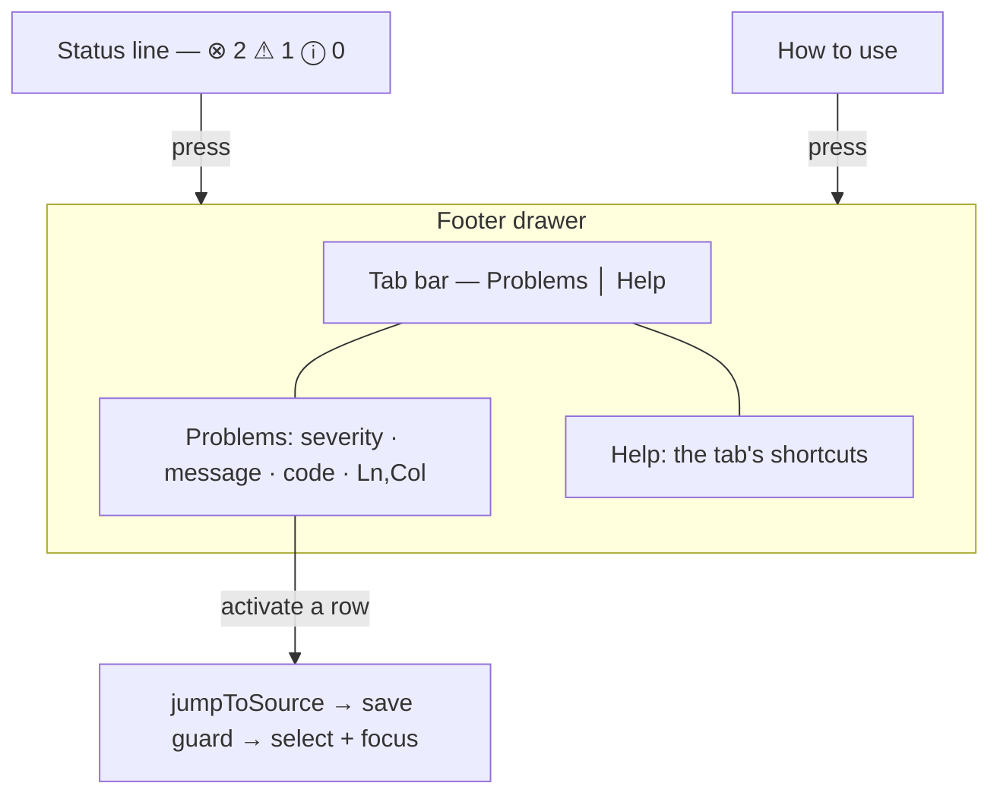

# Live Visualization — Problems Panel

> [!NOTE]
> Status: **implemented**.

## Goal and scope

The compiler already produces a full set of located diagnostics, and the report
already carries them: `Report.diagnostics` is a list of LSP-shaped values with a
range, a severity, a stable `DLG####` code, and a message. Until now the only
way to *see* one was a squiggle in the Source editor.

That has two costs. A reader hunting for problems has to **scroll the document
looking for underlines** — there is no count, no list, and no way to step through
them. And on the five graph tabs the diagnostics are **invisible entirely**,
because the editor is not visible.

This note adds a **Problems panel**: a list of every diagnostic in the document,
each row navigating to the text it describes.

## Key design decisions

### D1 — The status line is the entry point, because it is the only chrome on every tab

The status line carries a severity summary — errors, warnings, and infos with
counts — and pressing it opens the panel.

The reason is not aesthetic. The status line is the **one piece of chrome present
on every tab**, so putting the summary there is what makes diagnostics
discoverable from the graph tabs at all. It also gives a persistent at-a-glance
health signal for almost no space, and it is the convention a reader already
knows from VS Code.

The summary is always shown, including at zero, so its absence never has to be
interpreted: a clean compile reads `0 0 0` rather than disappearing.

### D2 — One footer drawer, tabbed, rather than two competing disclosures

The footer already hosted a disclosure: the help panel, which is bounded, scrolls
internally, and floats over the stage on a short window. Anchoring a second panel
to the same status line would have meant two drawers fighting for one edge.

So the footer becomes **one drawer that hosts named panels behind a tab bar** —
`Problems` and `Help` — exactly the shape of VS Code's bottom panel. Opening
either from the status line opens the drawer on that tab.

This keeps a single set of hard-won behaviors in one place instead of duplicating
them: the height bound, the internal scroll with `overscroll-behavior: contain`,
the float-over-the-stage rule below `height: 640px`, and the close button that
returns focus to the control that opened it.

### D3 — Go to problem reuses the save-safe jump, it does not re-implement it

Activating a row lands on the offending text through the **existing**
`jumpToSource` path, which the node inspector already uses. That matters because
the jump is not a naive tab switch: it passes through the navigation guard, so an
Auto-save flushes and a Manual-save prompt resolves *before* the tab changes. A
second, panel-specific implementation would have quietly skipped that.

The only new step is converting the diagnostic's LSP line/character range into
document offsets with the same `positionToOffset` the editor overlay uses, so the
panel and the squiggle can never disagree about where a problem is.

### D4 — A flat, position-ordered list, with no file grouping

VS Code groups problems under a file header because its panel spans a workspace.
A report compiles **one script**, so that header would be a constant, meaningless
row. The list is flat and ordered by position, which is also the order a writer
reads in, so stepping down the list walks forward through the document.

Severity is carried by a per-row icon rather than by grouping, so a single
error among forty infos is still easy to pick out without collapsing anything.

Position remains primary: stepping down the list walks forward through the
script. Diagnostics with the same start position use the shared
[co-located presentation](../editor/Co-located%20Diagnostics%20Presentation.md) order:
Error, Warning, Info, Hint, then range end, code, and message. The client owns
this deterministic tie-break because LSP does not define array order.

### D5 — One fan-out point, so the three surfaces cannot disagree

Diagnostics arrive twice: once when the report is first built, and again whenever
the document recompiles on a save or a hot reload. Both now flow through a single
internal apply step that updates the editor overlay, the list, and the status
counts together.

Updating them at separate call sites is how a stale count survives a fix — the
squiggle clears, but the badge still says `3`.

## Layout

## Testability

| Guard | Asserts |
| --- | --- |
| Counts | The summary totals each severity and survives a refresh |
| Rendering | One row per diagnostic, ordered by position, with code and location |
| Co-located ordering | Same-position rows are severity first; input permutations render identically |
| Empty state | A clean compile says so rather than showing an empty box |
| Activation | A row calls the jump with the offsets its range resolves to |
| Drawer | The tabs switch panels, and each entry point opens its own tab |
| Sync | Re-applying diagnostics updates the list and the counts together |

The jump is unit-tested against a stubbed handler, since the real one needs a
laid-out editor; an end-to-end guard covers the actual selection landing.
