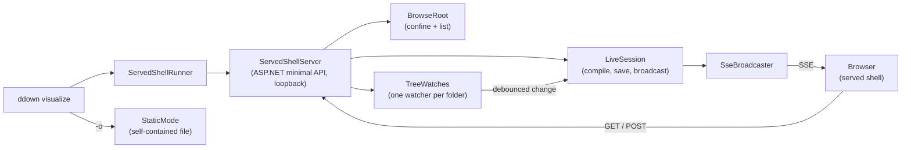
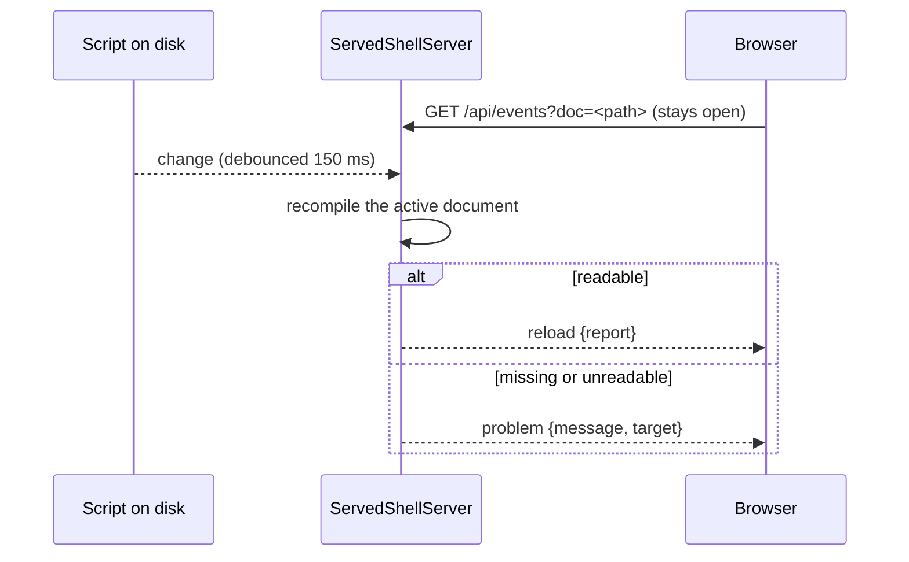

# Served Shell

> [!NOTE]
> Status: **implemented**. `ddown visualize` serves the report from one loopback server: a single
> page with the Explorer, a runtime View ⇄ Edit toggle, and hot reload. `-o` writes an offline
> static export instead.

## Table of contents

- [Goal and scope](#goal-and-scope)
- [Ubiquitous language](#ubiquitous-language)
- [Command-line surface](#command-line-surface)
- [Architecture](#architecture)
- [HTTP surface](#http-surface)
- [Key design decisions](#key-design-decisions)
- [Error and boundary cases](#error-and-boundary-cases)
- [Security](#security)
- [Testability](#testability)

## Goal and scope

A writer iterating on a script wants the report to keep up: save the file, see the new stages,
open the next script without restarting anything. The served shell is that loop. It owns the
command line, the one server behind every served report, the route table, hosting, and file
watching.

Related notes own the rest:

| Concern | Owner |
| --- | --- |
| The editor buffer, Save, autosave, conflicts | [Live Edit and Autosave](./Live%20Edit%20and%20Autosave.md) |
| The file tree, the Files toggle, opening a script in place | [Explorer](./Explorer.md) |
| Zen, the narrow layout, the Problems panel | [Chrome and Layout](./Chrome%20and%20Layout.md) |
| Linked, cached client assets and on-demand Mermaid | [Served Client Packaging](./Served%20Client%20Packaging.md) |

## Ubiquitous language

| Term | Meaning |
| --- | --- |
| **Served shell** | The one report page the server renders: tabs, views, and the Explorer sidebar. |
| **Empty shell** | The served shell with no active document: the Explorer and an "open or create a script" call to action. |
| **Active document** | The script the server is currently serving, held as one `LiveSession`. At most one at a time. |
| **Pinned document** | The script a `ddown visualize <script>` run starts on. `/` redirects to it. |
| **Browse root** | The folder the Explorer lists and every path is confined to (`BrowseRoot`). The security boundary. |
| **Serve root** | The folder hosted as static files so a report's relative images resolve (`ServeRoot`). For a served run it equals the browse root. |
| **View** | Read-only and auto-updating: the report hot-reloads on disk changes. |
| **Edit** | Editable: the session owns the buffer and saves it to disk. |
| **Static export** | A self-contained, offline, read-only report file with no server and no toggle. |
| **Hot reload** | Recompiling after a disk change and pushing the new report to every open tab. |

## Command-line surface

| Command | Result |
| --- | --- |
| `ddown visualize` | The empty shell over `--root`, or the current folder. |
| `ddown visualize <script>` | A served session on that script, in View. |
| `ddown visualize <script> --edit` | The same, starting in Edit. |
| `ddown visualize <script> -o <out.html>` | A static export; no server. Opens the file unless `--no-open`. |
| `--root <dir>` | Pins the browse root (and so the serve root). |
| `--config <path>` | The `dialogue.toml` to apply. Default: the nearest one above the script, within the root. |
| `--port <n>`, `--no-open` | A fixed loopback port (default: ephemeral), and no browser launch. |

The command prints the URL and serves until Ctrl+C. `--edit` only chooses the starting side of the
toggle; the reader can flip it at any time.

## Architecture

`ServedShellRunner` resolves the root, builds the server, and either starts the pinned document
(`StartInitialDocument`) or serves the empty shell. The server keeps one active `LiveSession`;
opening another script replaces it.

A disk change flows through one path:

## HTTP surface

Loopback only. Every path argument is root-relative and confined by `BrowseRoot`.

| Route | Purpose |
| --- | --- |
| `GET /` | The empty shell, or a `303` to the pinned document's report. |
| `GET /browse` | Always the empty shell: the way back to the files from a pinned run. |
| `GET /r/<path>/` | The active document's report page (`no-store`). |
| `GET /r/<file>` | A static file under the serve root, such as an image the script links. |
| `GET /assets/<name>` | A hashed client asset (`immutable`); see [Served Client Packaging](./Served%20Client%20Packaging.md). |
| `GET /api/browse?path=` | One folder's sub-folders and scripts (`BrowseListing`). |
| `POST /api/open` | `{ source, mode }`: make a script active; `303` to its report. |
| `POST /api/create` | `{ path }`: write an empty script and open it in Edit; `409` if the name exists. |
| `POST /api/create-folder` | `{ path }`: create a folder; `409` if the name exists. |
| `POST /api/rename` | `{ from, to }`: move a script or folder; reports the active document's new path when the move carries it. |
| `GET /api/document` | The active document's current payload. |
| `POST /api/save` | Save the source or config with a typed outcome; see [Live Edit and Autosave](./Live%20Edit%20and%20Autosave.md). |
| `POST /api/reload` | Re-read the source or config from disk after a conflict. |
| `POST /api/create-config` | Create or adopt `dialogue.toml` at the root; the path never comes from the request. |
| `GET /api/events?doc=` | The SSE stream: `reload`, `reload-config`, `problem`, `displaced`. |

## Key design decisions

### D1 — One server, reached two ways

`ServedShellServer` is the only live server. `ddown visualize <script>` starts it on a pinned
document; `ddown visualize` starts it on the empty shell. Both give every report the Explorer from
one code path. A pinned run redirects `/` to its report; a browse-only run keeps `/` on the empty
shell even after a script is opened, so `/` stays a place to browse from. `/browse` is always the
shell, whichever way the run started.

### D2 — ASP.NET minimal API and Server-Sent Events

A minimal API gives JSON, static files, and streaming idiomatically, and runs on an ephemeral
loopback port so the routes get real HTTP integration tests. The server only ever **pushes**
("recompiled — here is the report"); everything the client sends is an ordinary request. SSE is
exactly that one-way channel, over plain HTTP, and the browser's `EventSource` reconnects on its
own. A WebSocket's second direction would go unused. The stream ends on client disconnect or on
host shutdown, so an open tab never holds Ctrl+C open.

### D3 — View and Edit are a client toggle over one server

The server always watches, serves, and accepts saves; the client decides whether to edit and how
to react to a push. That makes the toggle instant and the backend one type.

- **View** re-renders on `reload`. **Edit** owns its buffer and turns an external change into a
  conflict instead.
- The toggle is a native segmented control (`[ View | Edit ]`, `role="group"`, `aria-pressed`) in
  the status bar. A static export shows a read-only badge instead.
- The toggle reconfigures one CodeMirror `Compartment` (read-only state, `aria-readonly`, and the
  authoring aids), so the buffer, cursor, scroll, and undo history survive the switch.
- Leaving Edit with unsaved work goes through the same save guard as navigation.
- The reader's last choice is remembered in `localStorage` (`dd-served-mode`) and offered for the
  next script.

The report payload's `mode` is `static`, `view`, or `edit`; the last two only choose the starting
side. `/api/save` is reachable while the client is in View, which is acceptable on a single-user
loopback tool.

### D4 — The offline report is an export, not a mode

A read-only report that does not keep up with the file adds nothing over View, so it is not an
interactive mode. The portable, serverless file is still worth having, so it is `-o`: rendered by
`StaticMode`, with every asset inlined.

### D5 — The server browses the filesystem, not a native file dialog

A browser `<input type="file">` yields a file's contents and name but never its path, and the
session needs the path to watch the file and resolve its images. The Explorer therefore lists the
server's folders through `GET /api/browse`, which also lets the server enforce the root and the
`.dialogue.md` filter.

### D6 — Create eagerly, confined, and never overwriting

`POST /api/create` writes an empty file at once and opens it, so the session, watcher, and report
always read a real file. The path must end in `.dialogue.md`, sit inside the root, and name an
existing folder. A name already in use is a `409` with the file untouched, so the client offers to
open it instead. The same create-and-open flow is why there is no Save As: a copy is a new file or
a copy on disk.

### D7 — Host the smallest folder that covers the script and its images

A script can link images above its own folder (``). For a pinned run,
`ServeRootResolver` picks the serve root:

| Situation | Serve root |
| --- | --- |
| `--root <dir>` given | That folder (it must contain the script). No prompt. |
| All linked images inside the script's folder | The script's folder. |
| Images above it, reader consents | The nearest common ancestor of the script and those images. |
| Images above it, reader declines or no terminal | The script's folder; those images do not load. |

The report is served at the script's sub-path under the root (`/r/proj/`), so relative `../` links
resolve. A launched symlink is resolved to its real file first (`SymlinkResolver`), so saves replace
the real file and the watcher sees its changes; the report still shows the launched path. A broken
or cyclic link exits with a message.

### D8 — One operating-system watcher per folder

Registering a `FileSystemWatcher` is what an open costs — on macOS about 110–180 ms, against 2–4 ms
to compile and serialize a small script. `TreeWatches` registers each folder once and routes events
to the watches on each path, so a later open in a known folder registers nothing.

| Open | Watcher per document | `TreeWatches` |
| --- | --- | --- |
| `POST /api/open`, folder already watched | 127–178 ms | 0.8–4 ms |
| `POST /api/open`, first script in a folder | 127–178 ms | ~100–125 ms, once |

- Folders are watched shallowly. A recursive watch would make every open free but report every
  change beneath the root; on Linux a busy subfolder overflows the kernel buffer.
- On overflow every watch is told: a spurious reload is cheaper than a report that never updates.
- `PathComparison` matches paths the way the platform does (case-insensitive on macOS and Windows).
- `PhysicalFileProvider` was measured and rejected: it hides dotfiles by default, and it delivers
  one save as several notifications up to 0.8 s apart, which breaks the session's one-shot
  suppression of its own writes. Static files keep their own provider, which never watches.
- Each watch is debounced (150 ms) and serialized: an editor's write burst yields one recompile,
  and a change during a slow recompile schedules exactly one follow-up.

The active document and its `dialogue.toml` each get a watch. A config created at runtime gets one
when it is created.

### D9 — A tab names the document it shows

`/api/events?doc=` binds a stream to one script. When another script becomes active, the server
sends `displaced` to the old stream and drops its watches; a reconnect that names a script no
longer active gets `displaced` at once. The client shows a banner rather than applying another
script's reloads.

## Error and boundary cases

| Case | Behavior |
| --- | --- |
| Missing file, wrong extension, invalid `--root` | The command exits with a message before serving. |
| Editor save burst (temp write + rename) | Debounced into one recompile of the final content. |
| Compile errors after a change | Still a `reload`; diagnostics ride the payload to the overlay and Problems panel. |
| Script deleted or unreadable | `problem { target }`, routed to that document's save controller; a later save recovers. |
| Several open tabs | All receive each push. |
| `--port` already in use | Binding fails and the process reports the error. |
| Rename that carries the active document | Its watch is dropped (no spurious "deleted"); the client reopens it at the new path, which watches it again. |
| Path escapes the root (`..`, absolute, symlink out) | Rejected with `400` or `404`; nothing outside is listed or served. |
| Not a `.dialogue.md` file | Not listed, not opened. |

## Security

This is a local development tool:

- The server binds `127.0.0.1` only. No authentication.
- A requested path is rejected when it is absolute or contains `..`; an accepted path is
  canonicalized (following a terminal symlink) and rejected unless it lies inside the root.
- Hosting above a script's folder needs consent or an explicit `--root` (D7).
- Save writes the session's own document path, never a path from the request body. Create and
  rename are confined like every other path; `create-config` composes its path server-side.
- Served HTML is `no-store`. Pages are compressed (gzip preferred); the event stream is not.

## Testability

- **Server (.NET, real loopback):** each test starts `ServedShellServer` on an ephemeral port and
  drives every route with `HttpClient`, including confinement, `409` conflicts, the pinned-run
  redirect, and SSE `reload`.
- **`BrowseRoot`:** rejects `..`, absolute paths, and symlink escapes.
- **`TreeWatches`:** against a real temporary folder — a watched path fires, an unwatched one does
  not, a burst fires once, several scripts in one folder share one watcher, and a dotfile script
  still reloads.
- **`Debouncer`:** timing tested apart from the filesystem, with an injectable window
  and an injectable clock. The coalescing test waits only for the operating system to
  deliver a write, then advances a fake clock itself, so a slow machine cannot turn one
  save into several reports.
- **CLI:** routing of script, `--root`, `--edit`, and `-o` to the right runner.
- **Browser (Playwright, live):** the CLI's built DLL serves a temp tree; the specs edit and delete
  files on disk, flip View ⇄ Edit with the buffer preserved, and open a script whose images sit
  above its folder under `--root`.
