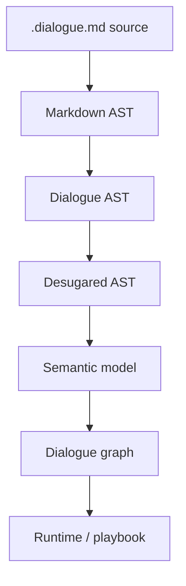

# Script language specification

This specification defines DialogueDown's script language: a Markdown-subset
domain-specific language (DSL) for writing dialogue scripts. The language is
designed to stay readable for writers while still compiling into a precise graph
model for developers.

New to DialogueDown? Start with [Your first script](first-script.md), then come
back here for the details.

> [!NOTE]
> DialogueDown is in early development. The compiler model and runtime behavior
> described here may still change as the library evolves.

## Table of contents

- [Script language specification](#script-language-specification)
  - [Table of contents](#table-of-contents)
  - [The specification in detail](#the-specification-in-detail)
  - [Why Markdown](#why-markdown)
  - [Goals](#goals)
  - [Processing model](#processing-model)
  - [Syntax summary](#syntax-summary)
  - [Literal punctuation](#literal-punctuation)
  - [Complete example](#complete-example)
  - [File format](#file-format)

## The specification in detail

The syntax is documented across three reference pages, one per area of the
language. The [syntax summary](#syntax-summary) below is the one-screen version.

| Page | What it covers |
| --- | --- |
| **[Speakers and lines](speakers-and-lines.md)** | Who is speaking, styling, tags, and images — everything that can appear on a line of speech. |
| **[Game state](game-state.md)** | Queries that read from your game and commands that tell it to act. |
| **[Structure and flow](structure-and-flow.md)** | Scenes, succession, choices, jumps, conditions, and ending a run. |

## Why Markdown

The script language intentionally uses a Markdown subset instead of a completely
custom text format.

- **Readable source:** Scripts remain easy to read before any compiler or editor
  integration exists.
- **Familiar syntax:** Writers and developers already know headings, lists,
  links, comments, and fenced blocks.
- **Editor support:** Markdown-aware editors provide highlighting, folding,
  outline navigation, snippets, and basic completion with little custom tooling.
- **Linting for free:** Existing Markdown tools can catch broken links, malformed
  headings, long lines, and formatting issues.
- **Git-friendly review:** Dialogue changes stay diffable and reviewable as
  plain text.

## Goals

The DSL is designed to be readable by writers while still compiling into a
precise runtime graph.

- Use plain text that works well in Git diffs and Markdown editors.
- Keep common dialogue terse: `Alice: Hello!`
- Support branching choices, jumps, tags, speaker declarations, game-state
  queries, and game-state commands.
- Preserve a clean boundary between dialogue content and engine-specific
  presentation.

## Processing model



Each stage is documented in the compiler's
[design notes](../contributing/index.md#the-compiler-pipeline).

## Syntax summary

| Feature | Example | Purpose |
| --- | --- | --- |
| Text line | `Alice: Hello, Bob!` | Speaker says a line. |
| Default speaker | `Hello from the narrator.` | Use the default speaker. |
| Inline speaker declaration | `Alice @A #main: Hello!` | Declare a speaker. |
| Speaker ID | `@A: Hello!` | Reference a stable speaker ID. |
| Partial declaration | `@A #excited: Hi!` | Reference a speaker and add tags. |
| Tag | `#main` | Attach custom metadata. |
| Reserved tag | `##default` | Mark built-in behavior. |
| Literal sigil | `\#word`, `\=>` | Write tag or jump punctuation as plain text. |
| Choice | `- Bob: Really?` | Offer a selectable response. |
| Random choice | ``- `50%` Bob: Really?`` | Let the engine pick one option by weight. |
| Jump | `=> [Play tennis](#play-tennis)` | Connect to another section. |
| Conditional jump | `` `Rainy?` => [Inn](#inn)`` | Jump only when a query reads as true. |
| Conditional line | `` `Angry?` Guard: Leave.`` | Play a line only when a query reads as true. |
| Conditional choice | ``- `HasKey?` Use the key.`` | Offer an option only when a query reads as true. |
| Conditional block | `` `if` `` `` `Rich?` `` in a `>` block | Guard a group with `if` / `elseif` / `else`. |
| End of run | `=> [The end](#END)` | Stop the dialogue at the reserved endpoint. |
| Query | `` `"Alice.FavoriteColor"` `` | Call `IGameSystem.Query`. |
| Default command | `` `("Alice joins Art")` `` | Call `IGameSystem.Execute`. |
| Custom command | `` `JoinClub("Alice", "Art")` `` | Execute with arguments. |

## Literal punctuation

A backslash `\` before an ASCII punctuation character writes that character
**literally**: the backslash disappears from the spoken text, and any sigil that
begins at the escaped character is read as text instead. This is standard
Markdown escaping, extended to cover the script's own sigils.

| To write    | Escape it as   | Otherwise it becomes   |
| ----------- | -------------- | ---------------------- |
| `#word`     | `\#word`       | a tag                  |
| `##default` | `\##default`   | a reserved tag         |
| `=>`        | `\=>`          | a jump                 |
| `\`         | `\\`           | the start of an escape |
| `*` `_` `~` | `\*` `\_` `\~` | Markdown styling       |

```markdown
Alice: The tag is \#main, and the rule is x \=> y.
```

That line reads as *The tag is #main, and the rule is x => y.* — no tag, no jump.

- Escape the **first character** of the sigil: the whole sigil is then read as
  text, so `\##default` writes `##default`. Escaping each character
  (`\#\#default`) works just as well.
- Only ASCII punctuation escapes; before anything else the backslash stays
  literal (`\A` stays `\A`).
- A backslash at the end of a line is a hard break, not an escape. Write `\\`
  for a literal backslash there.
- Code spans are not escaped: inside backticks a backslash is an ordinary
  character of a [game call](game-state.md).

An unescaped `=>` with no link still warns; escape it when the characters are
deliberate.

## Complete example

```markdown
---
title: Gallery Visit
speakers: speakers.json
---

<!-- A short gallery scene that exercises the whole language. -->

## Gallery

Narrator @narrator ##default: Alice visits Bob's photography gallery.

- Alice @A #main: Bob, this is *your* photo. I love it! 
    => [Discuss Bob's photo](#discuss-bobs-photo)
- Alice: Look, this is **Christina's** painting. 
    => [Discuss Christina's painting](#discuss-christinas-painting)

## Discuss Bob's photo

Bob @B #mood=happy: Thank you. I'm glad you like it. Composition is simple \=> the eye should know where to go. `IncreaseAffection("Bob", "Alice")`

Alice: My favorite color is `"Alice.FavoriteColor"`. May I join the Photography Club?

- Bob: Yes — welcome aboard!
    - Alice: Wonderful, thank you!
- Bob: Not ~~yet~~ quite.

`("Alice joins Photography")`

> `if` `Bob.Affection?`
>
> Bob: Come — let me show you Christina's painting.
>
> => [Discuss Christina's painting](#discuss-christinas-painting)
>
> `else`
>
> Bob: Perhaps we can talk again another day.
>
> => [The end](#END)

## Discuss Christina's painting

Bob: This is the night view of the Huangpu River.
It is *beautiful*, especially at dusk.

Alice: I love this painting too. The colors are **amazing**.

- `70%` Christina @C: I learned color theory in the Art Club.
- `30%` @C: Oh, that old thing? I nearly painted over it.

`IncreaseAffection("Christina", "Alice")`

Alice: I'd like to join the Art Club and give painting a try.

`JoinClub("Alice", "Art")`

Alice: What a lovely visit.

=> [The end](#END)
```

## File format

Save dialogue scripts with the `.dialogue.md` extension.

This keeps the file readable as Markdown while making it clear that the file is
dialogue source, not ordinary project documentation.

Example filenames:

- `chapter-01.dialogue.md`
- `intro.dialogue.md`
- `npc/shopkeeper.dialogue.md`

Use normal Markdown tooling for editing and review. The compiler will treat these
files as DialogueDown script files.
